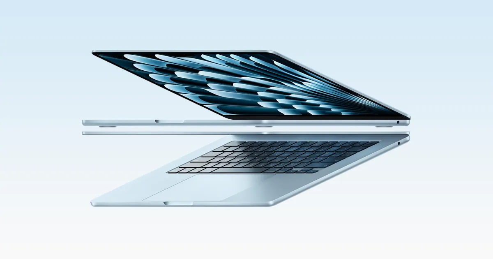
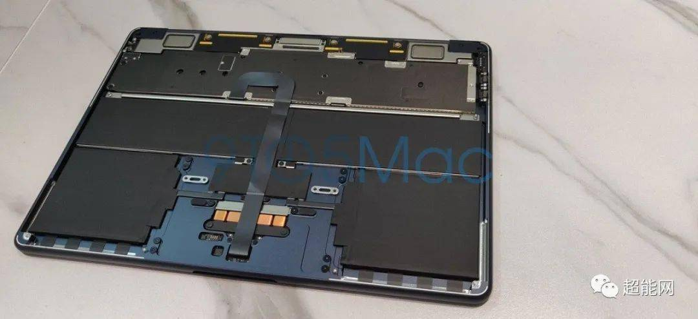
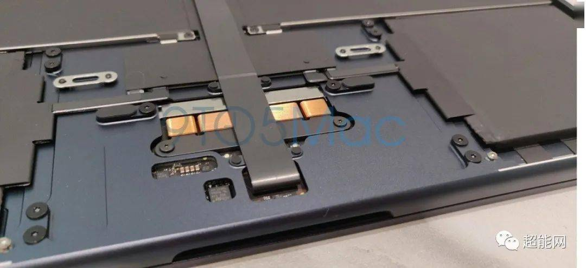
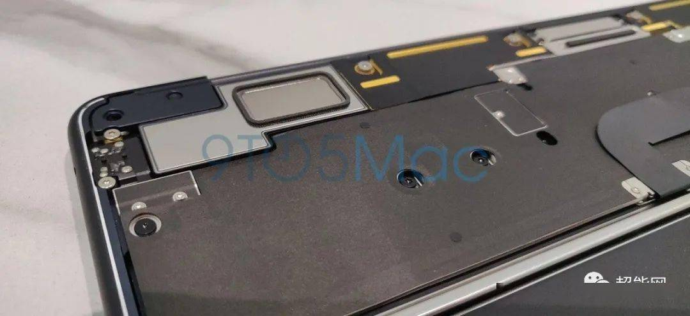

## MacBook Air 一个散热孔都没有，凭什么声音和散热都过得去？

先把两件事分开：**「没开孔」和「没散热、没好声音」之间，隔着一整套内部设计。** MacBook Air 不是没有散热，是用了没有风扇的散热（行话叫被动散热，就是靠一层石墨材料和整个铝合金机身把芯片的热量摊开、导走）；也不是没有音箱——扬声器是藏在机身两侧的独立喇叭模组（拆解里能看到），机内空间对声音有辅助作用，但具体声学结构苹果没公开过。下面拆开说。

*图源：苹果官网，MacBook Air 产品图*

---

**散热这块，Air 的答案是把「发热」这件事从源头上减小，再用机身当散热器。**

M 系列芯片的功耗压得很低——满载也就十几瓦到二十瓦出头，跟一台手机快充的功率差不多。热源小，散热系统的压力自然小。在这个前提下，苹果的做法是：拆开后盖你能看到，芯片上盖着大面积的石墨散热材料，把热量均匀摊到机身内部，再靠铝合金外壳把整个机身变成一块散热板。2022 年 M2 版 MacBook Air 的实机拆解里就能看到这个结构——没有风扇，但芯片和主要部件都被散热材料完整覆盖，还贴了石墨胶带辅助导热（[搜狐转引 9to5Mac 实机拆解](https://www.sohu.com/a/567489098_121124379)）。

*图源：9to5Mac 实机拆解，搜狐/超能网转引，M2 MacBook Air 内部全景——无风扇、大面积电池、芯片被散热材料覆盖*

*图源：9to5Mac 实机拆解，芯片上方的石墨散热材料特写*

代价是明确的：**持续高负载下 Air 会撞温度墙、性能降档，这不是缺陷，是无风扇设计的物理边界。**<!-- 判断句 --> 所以 Air 适合的是间歇性负载——写代码、办公、剪条短视频，热量还没攒起来任务就结束了；不适合长时间满负荷渲染。

**扬声器这块，先把能确认的说了：拆解能看到的是机身两侧各有一组独立的扬声器模组单元；苹果官方点名的技术叫 force-cancelling woofers（振动抵消低音单元）——两只低音单元成对反向安装，振动互相抵消，低频和音量可以做得更大，机身却不会被震得嗡嗡响。** 配置上，13 寸 Air 是四扬声器，15 寸 Air 和 MacBook Pro 是六扬声器系统（苹果官网规格页原文写着 "high-fidelity six-speaker sound system with force-cancelling woofers"，[Apple 官方支持页](https://support.apple.com/en-us/125405)；15 寸 Air 六扬声器见[苹果官方发布口径](https://tech.tom.com/202306/1009273666.html)）。

至于「把整个机身空腔当音箱箱体」这种说法，流传很广，但属于推测：苹果没公开过 MacBook 的声学腔体设计，从拆解能确认的是独立模组加机内空间辅助，具体哪部分空间参与共鸣、怎么参与，没有证据，当不得确证。声音从机身两侧的扬声器孔道、键盘缝隙和接缝处传出来，这一点实机就能感受到。

*图源：9to5Mac 实机拆解，机身侧边的扬声器模组特写*

我自己 Air、Mac mini、MacBook Pro 都用过，最满意的还是 Pro。**Pro 的扬声器确实是三台里最好的——不过说句实话，我听个响的时候居多，很少拿它看电影，给不出什么声学层面的深度评价，「最好」只是体感。**<!-- 判断句 -->

---

顺便说 Pro，因为它更能说明苹果这套「无开孔」思路的极致版。

MacBook Pro 是有风扇的，但你翻遍机身也找不到传统意义上的进风格栅。先说出风，这头的证据比较扎实：**出风口藏在屏幕转轴（转轴就是屏幕和机身连接的那个铰链）两侧**——iFixit 拆解 2019 年 16 寸 MacBook Pro 时确认，那代加大了排气孔、把风扇叶片做大，排风量提升了约 28%（[iFixit 拆解](https://www.ifixit.com/Teardown/MacBook+Pro+16-Inch+2019+Teardown/128106)、[The Verge 转引](https://www.theverge.com/2019/11/18/20971297/macbook-pro-16-inch-battery-apple-thickness-teardown-ifixit)）。

进风这一头要诚实一点：**苹果从未官方公布过 MacBook 的具体风道设计。**从中关村在线的实机观察看，16 寸 Pro 是机身两侧的孔道进风——那些孔道同时兼作低音扬声器的出声口，热风则从转轴排出（[中关村在线 2020 年对比实测](https://m.zol.com.cn/nbbbs/d21_57411.html)）。至于网上流传的「冷空气主要从键盘缝隙吸进来」，我没找到可靠信源佐证，最多算社区推测，当不得定论。2019 年 16 寸那代重新设计过这套散热系统，之后一直是这个思路。

从客户端开发的使用体感来说，我觉得它的散热没有多数人想象中那么好。**凭记忆说个数，没专门测过：正常工作状态下 CPU（处理器）温度 50 到 60 度是常态；50 多度的时候风扇大概 2500 到 3500 转，60 度以上就至少 4000 转了。**<!-- 判断句 --> 日常写代码这个状态完全没问题，但「苹果散热封神」这种话，听听就好。另外据 36 氪报道，下一代 MacBook Pro 可能要上均热板（一种把热量更快摊平的结构），侧面也说明苹果自己觉得现在的散热方案还有得改（[36 氪](https://m.36kr.com/p/3950880672225153)，此为爆料未经官方确认）。

---

所以回到问题本身：无开孔还能保证较好的扬声和散热，靠的不是某个黑科技，是三件事叠加——**芯片功耗低所以热源小、整个铝合金机身就是散热器（这条是被动散热里实打实的部分）、扬声器靠独立模组加苹果官方的振动抵消低音单元（机内空腔起辅助作用，细节未公开）。**<!-- 判断句 --> 开孔只是散热的手段之一，不是散热的必要条件。Air 用这套换来了零噪音和轻薄，代价是持续性能上限；Pro 加了风扇但坚持无格栅设计，换来了外观一体性和日常安静。

挑的时候不用纠结开孔，纠结负载就行：你的活是间歇性的选 Air，是持续重负载的选 Pro。<!-- 判断句 -->
