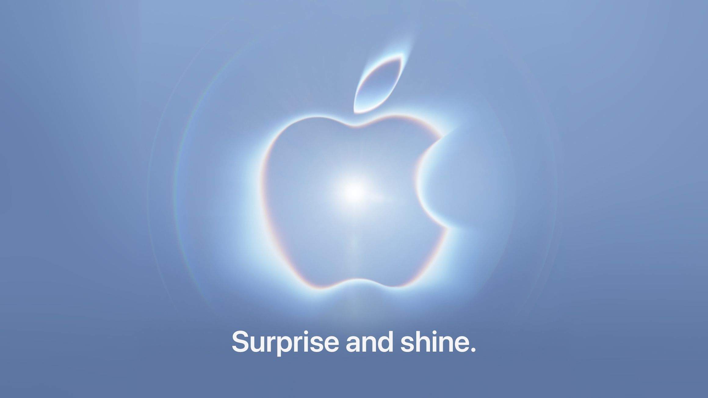
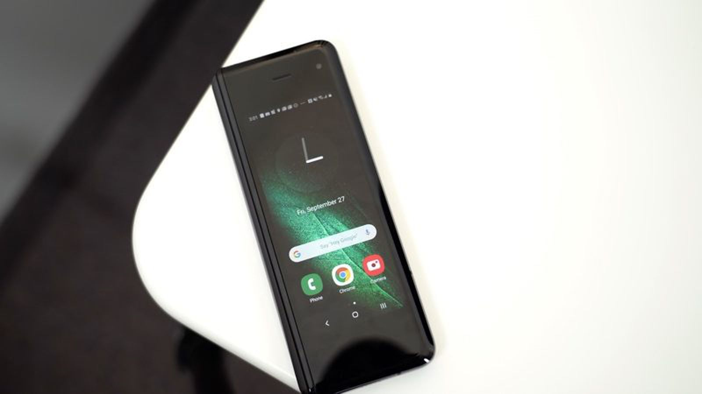
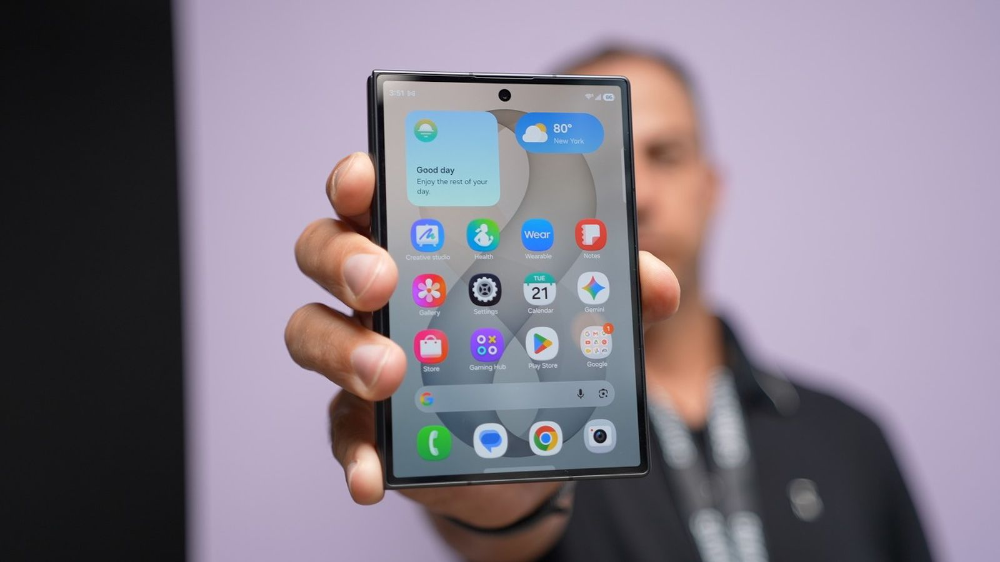

# 知乎回答草稿：苹果现在才做折叠屏，是来得太晚，还是正好等到了技术成熟？

- 问题 ID：2076754620832135160
- 状态：v1 待审（已配图 6 张）
- 人设：旁观者（未使用过折叠屏，数据党视角，诚实声明）
- 配图素材：`drafts/苹果折叠屏素材/`（图源与署名规范见同目录《图源清单.md》，发布时逐张按清单署名）
- 说明：规格/价格均为 2026-09-10 发布会前爆料口径，正文已标注；发布后需核对关键数字

---

## 问题分析

- 问题类型：观点讨论型（「是 A 还是 B」的选择式观点题）
- 推荐结构：模板 B「洞察论证」
- 要素配比：故事 15%（旁观者诚实声明替代个人经历）/ 干货 55% / 金句 30%
- 选用钩子：反常识（「这两个选项都不对」打破二选一预设）

---

## 回答正文

先给结论：这个问题本身是个坑——「太晚」和「等技术成熟」都不准确。苹果等的不是技术成熟，是折叠屏成熟到「可以按苹果的规矩做」的那条线。

它宁可被骂六年跟风，也没在 2021 年随便掏一台出来。这不是傲慢，是算账。

（图源：Apple / MacRumors）

先交代立场：我自己没买过折叠屏，短期内也不打算买。所以这篇回答没有上手体验，只有我翻了三天的数据——正好，这个问题用数据聊，比用信仰聊清楚。

很多人判断「晚不晚」用的是日历：三星 2019 年就发了初代 Fold，华为同年跟进，到 2026 年安卓阵营迭代了七八代，苹果才姗姗来迟，可不就是晚？

但手机这种品类，时间从来不由发布日期定义，由渗透率定义。IDC 的数据，2025 年中国折叠屏渗透率只有 3.5%；Counterpoint 的全球数字是 1.6%。翻译一下：**这个品类发展了六年，一百个买手机的人里，选折叠屏的还在个位数。** 市场根本还没被瓜分完，谈何迟到？真正的大盘压根没启动。

（数据来源：Counterpoint Research，2026 年 7 月公开博客文章）

那苹果在等什么？等几张入场券凑齐。

第一张是厚度。折叠屏的前六年，本质上是和物理较劲的历史。2019 年初代 Galaxy Fold，折叠态 17.1mm、263g，一台揣不进裤兜的铁盒子。

（图源：MacRumors）

到 2026 年，三星 Z Fold 8 做到了 4.5mm 展开、201g——重量已经和直板旗舰打平。爆料里 iPhone Fold 的厚度也是展开约 4.5mm、折叠 9mm 上下（郭明錤口径）。

（图源：MacRumors）

这个 4.5mm 不是数字游戏。苹果的逻辑里，「变薄」从来不是目的，「变薄之后不用砍掉别的东西」才是。四五年前，供应链做不出 4.5mm 还能塞进 5000mAh+ 电池的机身，也做不出这么薄还不松垮的铰链。

第二张是折痕。这是折叠屏的原罪，前六年所有厂商的营销噩梦。进步是真实的：UTG 超薄玻璃替代塑料膜，铰链从几十颗螺丝进化到一体化压铸。苹果这次据说把液态金属——一种此前只在取卡针上用过的材料——压铸成铰链（宜安科技独家供货），三星显示给它定制了把触控层直接做进面板的屏幕，只为把折痕摁下去。

（图源：MacRumors。注意：这是概念渲染图，非真机照片，一切以 9 月 10 日发布会真机为准）

注意，「几乎无折痕」是多位分析师交叉背书的判断，但真机效果如何，9 月 10 号凌晨见分晓。

第三张入场券最常被忽略：**市场的学费，得有人先交。** 过去六年，三星和华为替整个行业踩了几乎所有的坑——铰链进灰异响、东北低温脆裂、换一块内屏两三千起步、一年残值腰斩（折叠屏普遍 35%–60%，iPhone 是 70%+）。这些学费不交完，苹果现在进来就是替前人还债；交完了，苹果进来就是收割认知。

有意思的是，苹果并没有等到「完美」。从爆料看，iPhone Fold 的妥协清单相当刺眼：没有 Face ID，退回侧边 Touch ID；没有长焦，双摄完事；首批备货只有 700–800 万台，不到同期 iPhone 18 Pro 系列的三分之一。

这恰好说明，苹果等的从来不是「所有技术成熟」，而是「核心体验够格，短板伤不到基本盘」。Face ID 和 3 倍长焦，是可以为 4.5mm 让路的；折痕和铰链寿命，不行。

有人可能反驳：不管怎么说，苹果这次是彻头彻尾的追随者。三星发了七代，华为连三折叠都量产了，Mate XT 2 甚至定档 9 月 7 日，抢在苹果前三天开发布会，这不就是被骑脸输出？

（图源：华为官网，HUAWEI Mate XTs 非凡大师产品页）

是，也不是。iPhone 不是世界上第一台智能机，但它拿走了这个行业绝大部分利润。苹果从来不当第一个，它当的是「第一个把品类做完整的」。而对手抢跑三天这个动作，恰恰暴露了谁在给谁施压——真不心虚，何必卡着苹果的档期发新机？

所以回到问题本身：苹果来得晚吗？以日历论，晚了六年；以市场论，品类渗透率才 1.6%，连起跑线都没过。是等技术成熟吗？也不是，它连 Face ID 和长焦都舍得砍。它等的是一个更精确的东西——**技术成熟到可以按它的标准做产品，而不用为别人的不成熟交学费。**

对手用了六年证明折叠屏能卖出去，苹果大概只需要一年来证明折叠屏应该怎么卖。这大概就是晚到者和先到者的分工。

（文中 iPhone Fold 的规格与价格为发布会前爆料口径，分析师多方共识部分可信度较高，精确数字以 9 月 10 日发布会为准。）

---

**主要信源**

- 郭明錤（Ming-Chi Kuo）折叠 iPhone 出货量与上市节奏预测：https://finance.yahoo.com/technology/articles/foldable-iphone-may-not-hit-033104499.html
- MacRumors 折叠 iPhone 爆料汇总页（形态、配置、分析师观点交叉验证）：https://www.macrumors.com/roundup/iphone-fold/
- Mark Gurman（Bloomberg）iOS 27 与折叠 iPhone 早期测试体验：https://www.macrumors.com/2026/08/23/apple-foldable-iphone-early-tester-thoughts/
- Counterpoint Research：2026 全球折叠屏市场预测（苹果首年份额）：https://counterpointresearch.com/en/insights/samsung-to-retain-lead-as-global-foldable-market-set-for-21percent-yoy-growth
- IDC：2025 年中国折叠屏出货 1001 万台、渗透率 3.5%（经 36氪/虎嗅转引）
- DIGITIMES：三星显示 9 月起扩大折叠 iPhone 面板量产：https://www.digitimes.com/news/a20260902PD223/sdc-oled-panel-foldable-iphone-production-2026.html
- 折叠屏维修成本与保值率（澎湃、36氪公开报道）

---

## 写作说明

- 结构选择：选择式观点题不选边站会两头不讨好，所以打破「晚 vs 成熟」的二选一，立「等的是可以按自己规矩做的时点」的第三观点，比单纯选边更有信息增量
- 论据链四段递进：渗透率（市场论）→ 厚度（工程论）→ 折痕（技术论）→ 学费（商业论），最后用「妥协清单」反证「等的不是完美」，再回应「追随者」反驳
- 金句位置：① 开头破题句 ② 中段「学费不交完替人还债，交完收割认知」③ 结尾「晚到者和先到者的分工」
- 配图 6 张，位置逻辑：邀请函定事件语境 → Counterpoint 数据图支撑渗透率论点 → 初代 Fold 与 Z Fold 8 实拍形成「六年进化」视觉对照 → 渲染图放在折痕段（已注明非真机）→ 华为官方图放在抢跑反驳段
- 信源处理：正文内文标注机构名（IDC / Counterpoint / 郭明錤 / DIGITIMES），文末附「主要信源」链接清单；爆料口径在文首和文末各声明一次
- 去 AI 味处理：无规整小标题、无 bullet 列表、无「首先/其次」连接词；段落长短交替，疑问句做节奏刹车（「可不就是晚？」「这不就是被骑脸输出？」）；保留 5 处关键句加粗
- 人设处理：首段即诚实声明「没买过也不打算买」，旁观者视角反而是这篇的差异化——避免软文感，也符合「乐子人」定位
- 版权提醒：6 张图均无开放许可证（新闻评论语境引用），发布时必须保留图注署名，具体格式见《图源清单.md》；02 渲染图必须注明「非真机照片」
- 可调整方向：若想更锋利，可把「追随者反驳」段扩写（加三星 Z Fold 8 涨价 1000 元对位、小米 18 Fold 同月蹭台的围剿细节）；若想更克制，可删 Mate XT 2 一段
