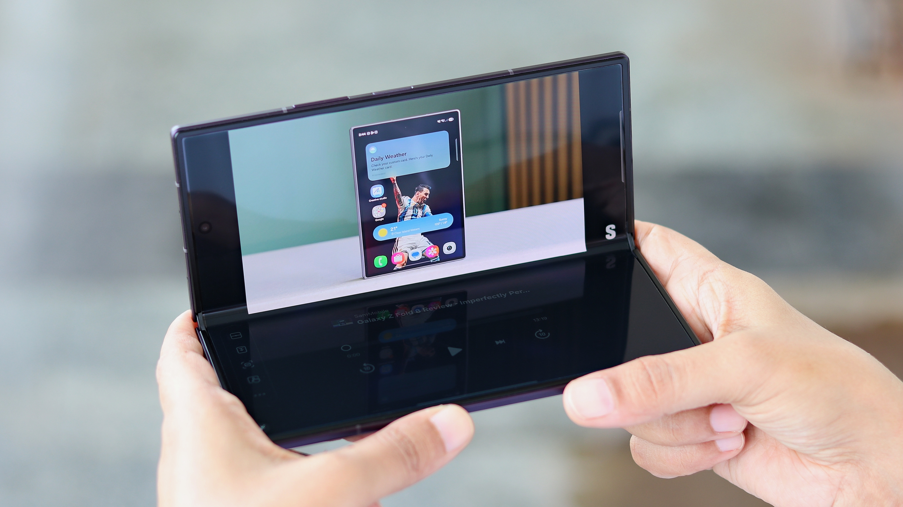
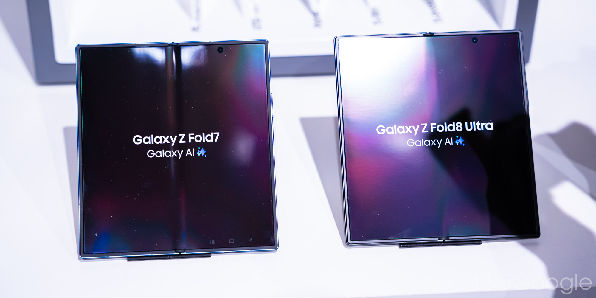
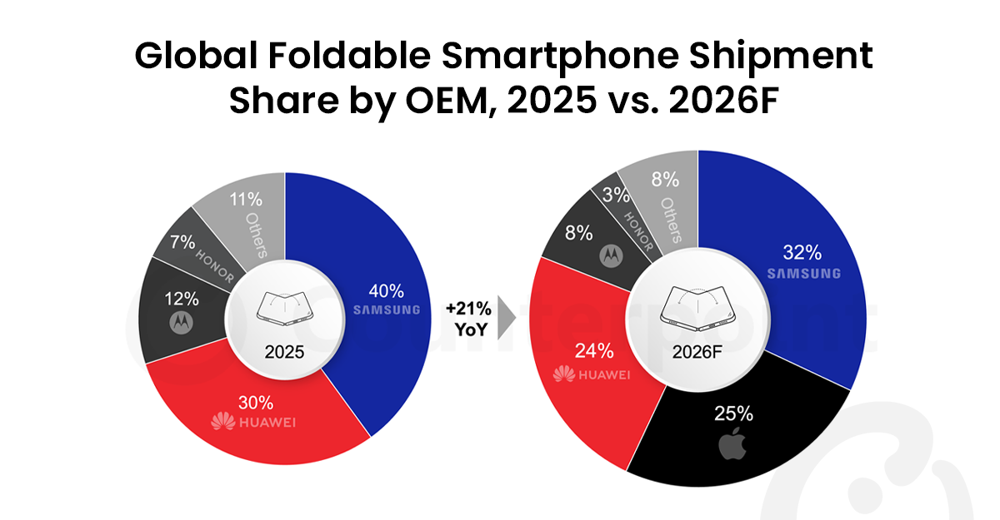

# 知乎回答草稿：折叠屏多年未成主流，苹果为何此时入局？首款折叠 iPhone 能让折叠屏走向大众吗？

- 问题 ID：2077854659956549237
- 状态：v2 待审（已配图 3 张：08 悬停模式实拍 / 09 折痕特写 / 06 Counterpoint 份额图复用；v1 六处批评已修）
- 配图素材：`drafts/苹果折叠屏素材/`（图源与署名规范见同目录《图源清单.md》，发布时逐张按清单署名，知乎编辑器需本地上传）
- 人设：旁观者（没需求、不买，乐子人视角但认真答题）
- 与 Q4（早晚题）的分工：Q4 已展开「为何入局」（等的入场券），本题「为何入局」一句带过，主答「能否走向大众」；论据避开 Q4 已用的厚度/折痕/残值，改用使用频次、投诉结构、适配率、价格带下沉
- 说明：规格/价格均为 2026-09-10 发布会前爆料口径；「能否走向大众」判断基于渗透率与机构预测

---

## 问题分析

- 问题类型：观点讨论型（双问句，「为何入局 + 能否大众」）
- 推荐结构：模板 B「洞察论证」
- 要素配比：故事 10% / 干货 60% / 金句 30%
- 选用钩子：重新定义问题（「走向大众」的大众是谁，先把词掰开）

---

## 回答正文

先说结论：能，但「大众」得打个引号。苹果大概率做不到让折叠屏变成人人一台——它要做的，是把折叠屏从「买之前得说服自己」的尝鲜品，变成「贵一点、但没人觉得奇怪」的普通选项。

照例声明：我自己没折叠屏需求，也不打算买，我是个乐子人。但这题值得认真答，因为它的答案决定了未来三年手机圈这台戏好不好看。

「苹果为何此时入局」这半句，两组数字就够：IDC 的数据，2025 年中国折叠屏渗透率只有 3.5%——一百个买手机的人里，不到四个买折叠屏；而价格战已经打完一轮了，万元以下机型占比从 2024 年的 15% 涨到 2026 年的 71%，最便宜的大折叠（vivo X Fold5）已经掉到 5500 元档。这两组数字放一起看才有意思：**价格降到和直板旗舰一个档，渗透率还是没动——说明挡住折叠屏的从来不是贵，是「没必要」。** 苹果按它几十年的惯例，在品类第二幕进场：从来不掀第一幕的幕布，专挑戏刚唱热的时候入座。

再看后半句：首款折叠 iPhone 能让折叠屏真正走向大众吗？要答这个，得先答一个前置问题——为什么安卓卖了六年，渗透率还是个位数？答案是有三个坑，六年没人填平。

第一个坑，场景没被验证。Counterpoint 的数据很扎心：折叠屏用户日均展开只有 3.1 次；76% 的人从没用过「悬停模式」——就是把手机弯成一个角度定住、屏幕上下分工的玩法，比如上半屏看视频、下半屏当支架和控制面板。

（图源：SamMobile，Galaxy Z Fold8 Ultra 评测实拍）

艾瑞的调研里，横折用户大小屏使用时长比是 45:55——**一半以上时间，这台大几千上万块的机器是当直板机用的。** 艾媒的口径更直白：68% 的折叠屏用户视其为「科技玩具」，只有 23% 认为它提升了效率。买的人不少，但相当一部分买的不是功能：Mate XT 首发黄牛炒到 4–8 万、预约超 500 万，这买的是社交场域里「显得有钱有资源」的符号。符号需求撑得起溢价，撑不起大众——人人都能买的时候，符号就不值钱了。

第二个坑，持有体验的隐形成本。黑猫投诉上折叠屏相关投诉的结构很说明问题：折痕/裂痕占 28.1%，显示故障 26.6%，售后质保纠纷 26.6%——前两项是产品本身的原罪，第三项是厂商自己都不敢给足信心的体现。

（图源：9to5Google，Z Fold7 与 Z Fold8 Ultra 折痕对比实拍）

再叠加东北零下二十度「像掰烧饼脆皮」的低温脆裂风险、散热和铰链进灰异响这类 2026 年的新痛点，折叠屏的差评从来不是「不好用」，是「用得提心吊胆」。腾讯新闻的用户实测里，有人买 OPPO Find N 一个月就吃灰；澎湃访谈里，一位数码博主 2.4 万买 Mate XT，四个月后 1.85 万挂闲鱼成交——他买的是当时全球独一份的三折叠形态和首发身份，卖掉是因为 300 克级的重量和新鲜感褪去后「当直板机用」的日常，撑不起那个价格。买和卖的理由都很具体，没有一句是「不好用」，句句都是「不值」。

第三个坑，软件适配。机构共识口径，折叠屏应用适配率至今不足 60%。澎湃访谈里那位用户说得实在：买来看视频漫画，结果 16:9 片源黑边巨大，多数时间不展开内屏，下一台不再考虑大折叠。**硬件进化到 4mm 级了，软件还停在「放大版的直板机」**——这才是折叠屏始终小众的深层原因：它没有给出「必须展开」的理由。

现在看苹果能填哪个坑。

软件适配这个坑，理论上只有苹果有条件填，但我对这个判断先打折扣。说「有条件」，是因为苹果手里有 App Store 的分配权：iOS 27 改造成 iPad 式布局和多任务，开发者适配做得差就拿不到推荐位——这是安卓厂商求了六年开发者都求不来的位置。但有两盆冷水要泼。第一，折叠屏的软件需求本来就小众：喊「大屏适配」喊了六年，买单的是商务分屏、炒股看 K 线这批人，普通用户从来没有喊过「我要大屏版 App」——这个需求更多是厂商和移动办公人群造出来的，不是大众长出来的。第二，苹果自己在大屏适配上的战绩并不好看，iPad 应用生态多年半死不活就是现成反例。所以苹果能解决的至多是「App 在大屏上不再糊」，解决不了「用户想不想展开」。后者它自己也没有答案，iOS 27 是一场赌。一个旁证：Counterpoint 判断苹果放弃了小折叠，理由是竖折「没有创造非用不可的新场景」。苹果把最容易走量的形态亲手砍了，说明它清楚——**大折叠要赢，必须赢在「为什么展开」上，而不是赢在「也能折」上。**

但有两个坑，苹果同样填不动。

一是价格。爆料口径 2000–2500 美元，国行按惯例推算万元起步（以发布会为准）。万元起的「大众」不是大众，是「高收入大众」。第一年它注定小众——年内备货据传只有 700–800 万台，不到同期 iPhone 18 Pro 系列的三分之一，黄牛加价几乎不可避免。第一代折叠 iPhone 是圈层商品，不是走量商品。

二是耐用性的学费。换屏贵、怕低温、怕进灰，这些物理约束不因 logo 而改变。苹果的解法大概率不是消灭这些成本，是用 AppleCare 把成本包装成服务——这也是它的老手艺。

所以「走向大众」要拆开看。对商务、金融、移动文档这批本来就有大屏刚需的人，折叠屏早就是刚需工具，苹果只是给了他们一个留在 iOS 的理由——这批人立刻会被收编。对更宽的中产，苹果能做的是把折叠屏从「电子茅台」变成「贵但正常的选项」：IDC 预测 2026 年中国渗透率首次超过 5%，Counterpoint 预测苹果首年即拿下全球 25% 份额、进场就坐到第二——听着吓人，但那是在 1.6% 的全球盘子里，**小池塘里的大鱼，不等于大海。** 真正的「人人一台」，这代产品做不到，可能三代以内都做不到。

（数据来源：Counterpoint Research，2026 年 7 月公开博客）

我的判断：苹果不是来让折叠屏走向大众的，它是来让折叠屏「正常化」的——从智商税争议品变成高端默认选项之一，渗透率从个位数拉到两位数。至于再往上，要看 iOS 27 能不能真的造出「每天必须展开十几次」的场景。造得出来，这是下一个 iPhone；造不出来，这就是下一台 Apple Watch——很大、很贵、很多人买，但没人觉得非它不可。

这两种结局对乐子人都友好。9 月 10 号凌晨见分晓。

（文中 iPhone Fold 规格、价格、备货量均为发布会前爆料口径，分析师多方共识部分可信度较高，以 9 月 10 日发布会为准。）

---

**主要信源**

- IDC：2025 年中国折叠屏出货 1001 万台、渗透率 3.5%；2026 渗透率首超 5% 预测（经 36氪/虎嗅转引）
- Counterpoint Research：全球折叠屏渗透率 1.6%（2025）、苹果首年 25% 份额预测（官方图表口径，2026-07 博客）、日均展开 3.1 次/76% 未用悬停、苹果放弃小折叠的判断：https://counterpointresearch.com/en/insights/samsung-to-retain-lead-as-global-foldable-market-set-for-21percent-yoy-growth
- 艾瑞数智：折叠屏用户画像与大小屏使用时长比（2023–2024 调研）
- 艾媒咨询：68% 折叠屏用户视其为科技玩具（媒体转引）
- 黑猫投诉：折叠屏投诉结构（折痕/裂痕 28.1%、显示故障 26.6%、售后 26.6%）
- 澎湃：大折叠用户访谈（片源黑边、闲鱼转手案例）；腾讯新闻：Find N 吃灰实测
- 郭明錤（Ming-Chi Kuo）：年内备货 700–800 万台、价格区间：https://finance.yahoo.com/technology/articles/foldable-iphone-may-not-hit-033104499.html

---

## 写作说明

- 与 Q4 的分工：Q4 答「晚不晚」（等的入场券），Q5 答「能不能大众」（三个坑 + 苹果能填哪个）；「为何入局」压缩为一段（渗透率 3.5% + 价格带下沉但渗透率不动 → 挡路的是「没必要」不是「贵」），不与 Q4 重复论证
- 避开的重复素材：Q4 已用厚度 17.1→4.5mm、折痕/液态金属、残值 35–60% vs 70%+、华为抢跑——Q5 一律不再展开；残值只用闲鱼案例侧写，不重列百分比
- 三坑结构：场景未验证（频次数据 + 悬停模式已就地解释）→ 持有隐形成本（投诉结构 + 低温 + 吃灰/转手案例，闲鱼案例已写明买与卖的具体理由）→ 软件适配（适配率 + 16:9 黑边）；随后「苹果能填哪个、填不动哪个」对位收束；软件坑一节按用户意见改为怀疑立场（推荐位是分配权但需求小众 + iPad 生态反例）
- 金句位置：① 开头「从买之前得说服自己，变成贵一点但没人觉得奇怪」② 入局段「挡路的不是贵，是没必要」③ 中段「符号需求撑得起溢价，撑不起大众」④ 结尾「下一个 iPhone vs 下一台 Apple Watch」双结局
- 未用素材提醒：「京东复购率 13%」未经官方佐证，弃用；「乐子人看什么」清单（黄牛、围剿战）本题只在备货段点到，留给 Q3 展开
- 配图（2026-09-06 完成，3 张，均真实图）：坑一段插 08 悬停模式实拍（SamMobile）；坑二段插 09 折痕特写（9to5Google）；「走向大众拆开看」段复用 06 Counterpoint 份额图。配图时发现正文「28%」与 Counterpoint 官方图（25%）矛盾，已统一为图的口径「25%、进场即第二」，图源清单已登记此修正
- 待用户决定：① 是否把「Apple Watch 结局」段删短（v2 改怀疑立场后该结尾与全文一致，建议保留）② 下一题是否起草 Q3
