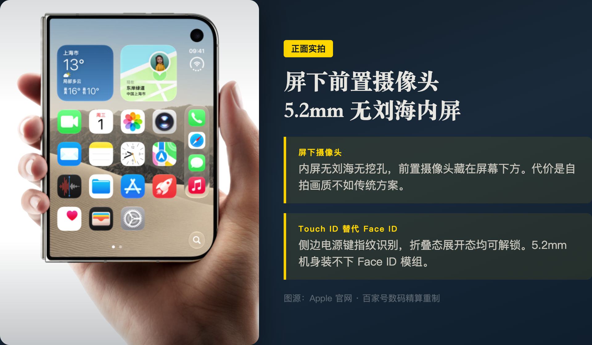
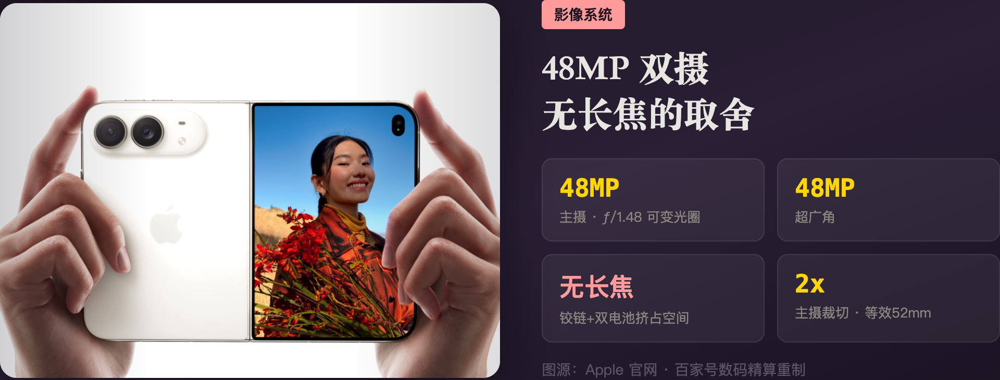
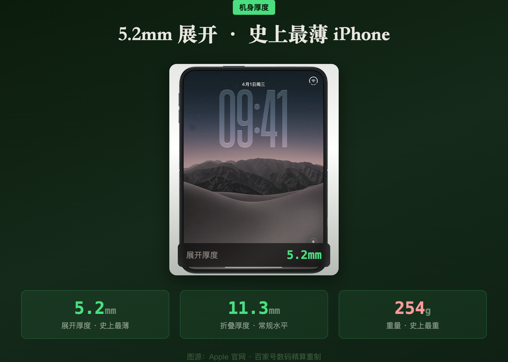
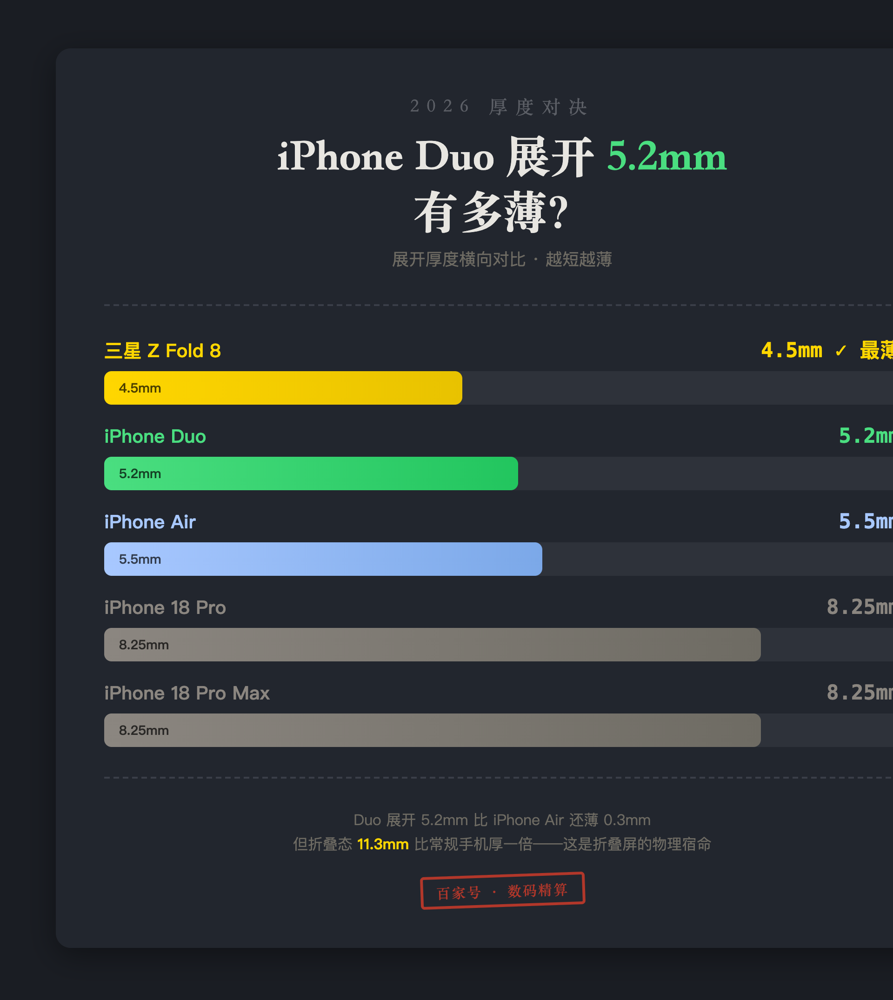
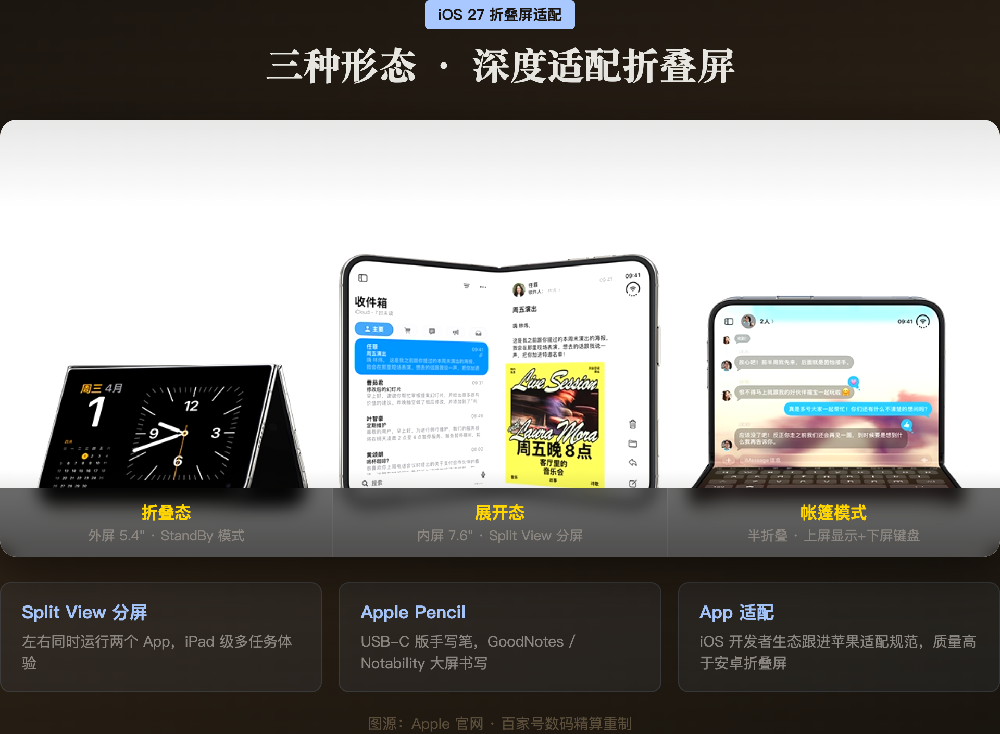
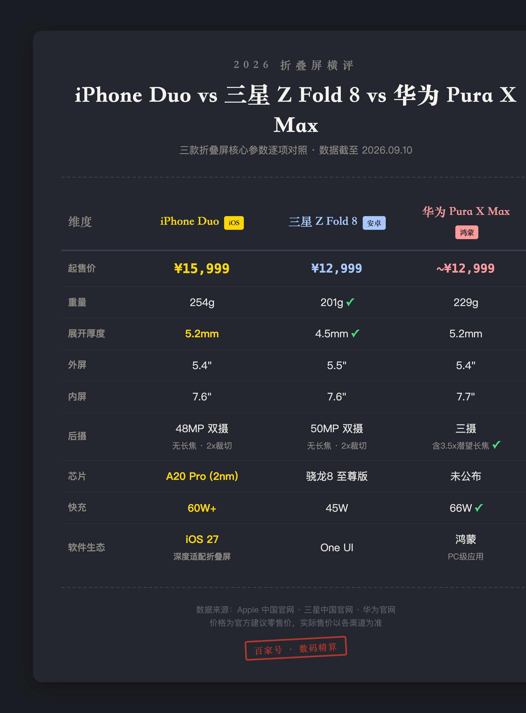
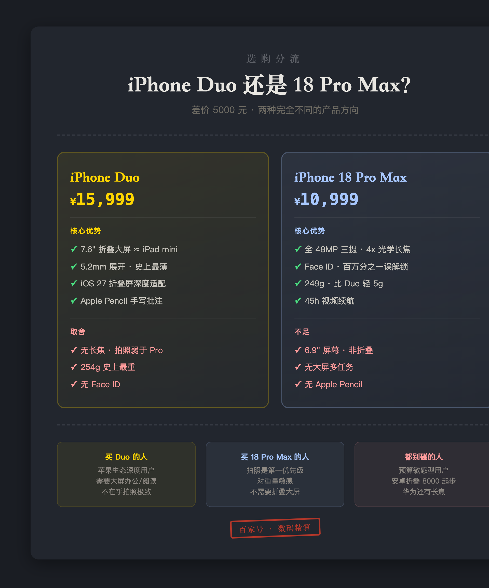
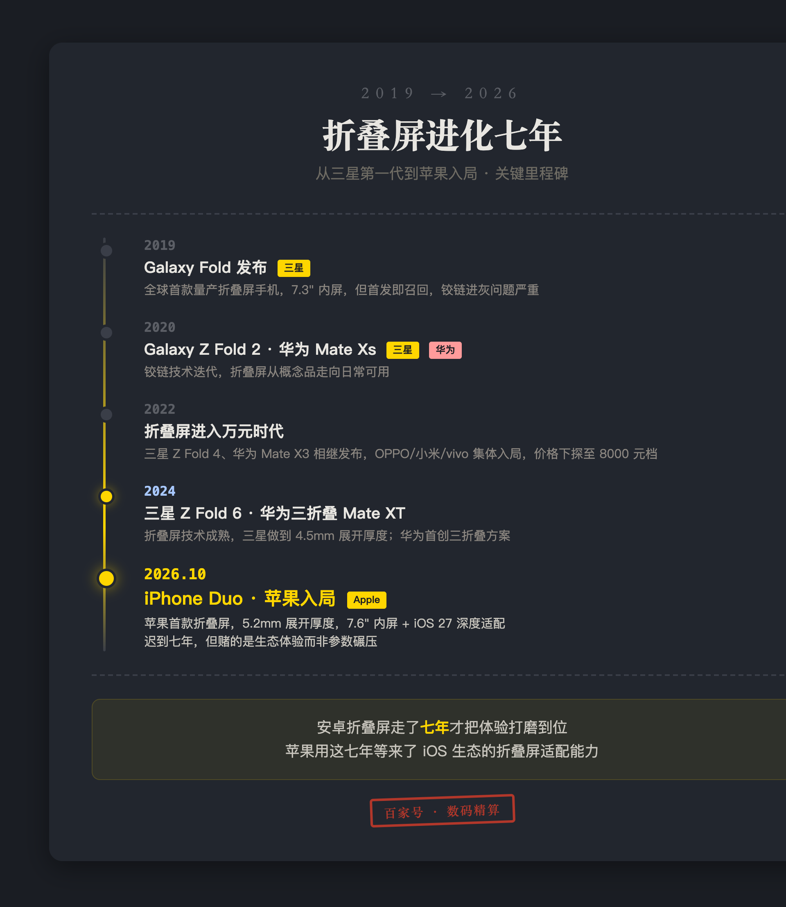
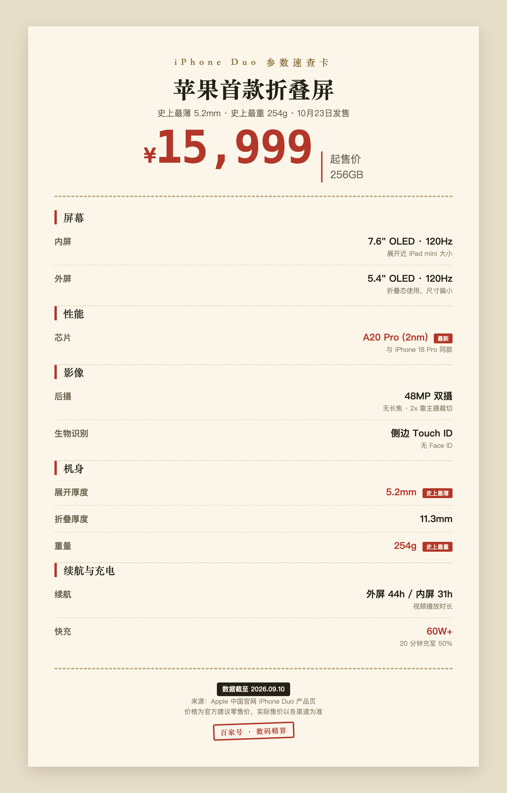

# 2026年iPhone Duo折叠屏值不值得买？15999起无Face ID无长焦，6大取舍逐项拆解（附安卓对比）

数据截至 2026 年 9 月 10 日，价格与参数来源为 Apple 中国官网、三星中国官网和华为官网。

iPhone Duo 是苹果第一款折叠屏，15999 起。史上最薄（展开 5.2mm），同时也是史上最重（254g）。没有 Face ID，没有长焦镜头。

先抛结论：**如果你是苹果生态的深度用户，iCloud、AirPods、Mac 全家桶绑着，同时有移动办公或大屏阅读需求，这 15999 花得值。** 5.2mm 薄度 + 7.6 英寸内屏 + iOS 27 折叠屏适配，这三样东西安卓折叠屏目前给不了。但如果你是摄影党或者对重量敏感，18 Pro Max 便宜 5000 块拍照还更强。

下面把 6 个关键取舍一项一项拆开。

---

## 一、为什么没有 Face ID？5.2mm 装不下

不是苹果想省成本，是物理空间不允许。

Face ID 的 TrueDepth 系统需要红外投射器、泛光照明器、红外摄像头一整套模组。这些元件需要一定的纵向空间。iPhone Duo 展开后只有 **5.2mm**，苹果把内屏做成了屏下摄像头来消除刘海，自然也没地方塞 Face ID 的元件。

替代方案是**侧边电源键集成的 Touch ID**。折叠态和展开态都能解锁，两面通用。

说实话，Touch ID 在折叠屏上反而比 Face ID 更实用。手机平放桌面看消息不用拿起来对着脸，手湿了或者戴口罩指纹照样秒开，解锁速度也不输 Face ID。

唯一损失在安全性。据 Apple 官网安全白皮书，Face ID 误解锁概率百万分之一，Touch ID 五万分之一。日常用感知不到区别，但对生物安全极度敏感的用户要注意这个小减分项。

_图源：Apple 官网 · 百家号数码精算重制_

---

## 二、没有长焦意味着什么？旅行远摄直接拉胯

折叠屏的内部空间被铰链机构和双电池大量侵占。长焦模组，特别是棱镜式潜望长焦，需要一段完整的光学路径。Duo 的机身结构腾不出这块空间。

而且 Duo 已经 **254g** 了，是 iPhone 史上最重。再加一颗长焦，重量直奔 270g+。

苹果给的方案是 **48MP 主摄 + 48MP 超广角**，2x 变焦靠主摄裁切实现。48MP 裁到 2x 相当于 12MP 全像素输出，等效 52mm 焦段，拍人像够发社交媒体。

但裁切终归是裁切。**旅行远摄、演唱会、体育赛事这些需要 3x 以上的场景，Duo 直接拉胯。** 10x 数码变焦的画质跟光学变焦差了一个量级。

这其实是整个折叠屏品类的工程瓶颈。三星 Z Fold 8 也没有独立长焦，同样走双摄裁切方案。华为 Pura X Max 倒是塞了一颗 50MP 潜望长焦支持 3.5x 光学变焦，但重量也到了 229g。

**产品区隔很明确：Pro 系列主打拍照极致，Duo 主打大屏体验。** 苹果不可能让一台折叠屏什么都有，否则 18 Pro 系列卖给谁。

_图源：Apple 官网 · 百家号数码精算重制_

---

## 三、15999 起，比 18 Pro Max 贵 5000，贵在哪

据 Apple 中国官网和三星中国官网定价，Duo 比 18 Pro Max 贵 5000 块，比三星 Z Fold 8 贵约 3000 块。单看硬件参数，Duo 比 Z Fold 8 重了 53g，外屏尺寸差不多，摄像头配置也差不多。

那这 3000 块溢价买的是什么。

三个字，**iOS 生态**。

A20 Pro 2nm 芯片跟 18 Pro 同款，性能不打折。iOS 27 为折叠屏做了深度适配，Split View 分屏、StandBy 模式、Apple Pencil 手写批注，这些功能在 iPad 上已经打磨了好几年。安卓折叠屏的应用适配至今仍是最大槽点，很多 App 打开就是一块放大版的手机界面。

苹果的优势在开发者生态。iOS 应用会跟着苹果的适配规范走，安卓那边只能靠厂商一家一家谈。

**你多花的 3000 块，买的不是硬件参数，是软件生态的统一性。**

Apple/苹果 iPhone Duo 折叠屏 2026年新款 A20 Pro芯片 (256GB)
¥15,999
京东
购买

---

## 四、Duo 做对了什么？三个真正能感知到的差异化

说了这么多取舍，也得说说苹果在这台产品上做对了什么。

**5.2mm 展开厚度。** 史上最薄 iPhone，比 iPhone Air 还薄。你从口袋掏出来展开的那一下，薄到不像一台折叠屏。这是真正能日常感知到的差异化。

_图源：Apple 官网 · 百家号数码精算重制_

_数据来源：Apple 中国官网 · 三星中国官网，截至 2026.09.10_

**7.6 英寸内屏 + Apple Pencil。** 展开后接近 iPad mini 的大小，配合 Apple Pencil USB-C 可以做手写笔记和标注。iOS 生态的笔记和绘图 App 质量远超安卓。GoodNotes、Notability 这些 App 在大屏上的体验是折叠屏安卓给不了的。

_图源：Apple 官网 · 百家号数码精算重制_

**60W+ 快充 + 44 小时外屏续航。** 充电速度跟 18 Pro 拉平，外屏续航 44 小时意味着日常使用完全不用担心。IP68 防水也给了。基础体验没有打折扣。

有一件事现在还无法验证。**iOS 27 的折叠屏适配到底做得怎么样，要等 10 月 23 日正式发售才能见真章。** 如果 App 适配质量拉胯，再好的硬件也是白搭。

---

## 五、iPhone Duo vs 三星 Z Fold 8 vs 华为 Pura X Max，三款折叠屏怎么选

_数据来源：Apple 中国官网 · 三星中国官网 · 华为官网，截至 2026.09.10_

据 Apple 官网、三星中国官网和华为官网数据，截至 2026 年 9 月 10 日：

| 维度 | iPhone Duo | 三星 Z Fold 8 | 华为 Pura X Max |
|:---|:---|:---|:---|
| 起售 | ¥15,999 | ¥12,999 | ~¥12,999 |
| 重量 | 254g | 201g | 229g |
| 展开厚度 | 5.2mm | 4.5mm | 5.2mm |
| 外屏 | 5.4" | 5.5" | 5.4" |
| 内屏 | 7.6" | 7.6" | 7.7" |
| 后摄 | 48MP 双摄，无长焦 | 50MP 双摄，无长焦 | 三摄含 3.5x 潜望长焦 |
| 芯片 | A20 Pro (2nm) | 骁龙 8 至尊版 | 未公布 |
| 快充 | 60W+ | 45W | 66W |
| 软件生态 | iOS 27 深度适配 | One UI | 鸿蒙 PC 级应用 |

三款的外屏尺寸其实差不多大。三星 Z Fold 8 便宜 3000 块，轻 53g，展开更薄。华为 Pura X Max 是唯一有长焦的折叠屏，3.5x 光学变焦，鸿蒙的 PC 级应用也是差异化卖点。

**如果你在意 App 适配质量、长期系统更新和苹果全家桶联动，Duo 是目前唯一选择。** 如果你更在意拍照和轻薄，三星和华为各有胜场。

---

## 六、谁该买 iPhone Duo，谁别碰

_数据来源：Apple 中国官网，截至 2026.09.10_

**该买的人。** 深度绑定苹果生态，iCloud、AirPods、Mac 一堆东西绑着，同时有移动办公或大屏阅读需求，不在乎拍照极致。iPad mini 用户如果嫌它不能揣口袋，Duo 就是你的替代品。

**别碰的人。** 摄影党直接买 18 Pro Max，便宜 5000 块拍照还更强。254g 的重量对轻薄敏感的用户是硬伤，建议去店里掂一掂再做决定。性价比用户没必要为 iOS 生态多花 8000 块，安卓折叠屏 8000 起步选择很多。

_数据来源：各品牌官网 · 公开报道_

苹果做折叠屏，不追求参数碾压，赌的是生态体验能撑起溢价。**这个赌注成不成，不看铰链看软件。** iOS 27 的适配质量，才是这 15999 的真正底气。

如果你已经在 iOS 生态里，这笔账算得过来。如果你不在，安卓折叠屏便宜 3000 块起步，华为 Pura X Max 还多一颗潜望长焦。

---

**iPhone Duo 核心参数速查（据 Apple 官网，截至 2026.9.10）**

_数据来源：Apple 中国官网 iPhone Duo 产品页，截至 2026.09.10_

- **内屏**：7.6" OLED, 120Hz（展开近 iPad mini）
- **外屏**：5.4" OLED, 120Hz（折叠态偏小）
- **芯片**：A20 Pro (2nm)，与 18 Pro 同款
- **后摄**：48MP 双摄，无长焦，2x 裁切
- **厚度**：展开 5.2mm / 折叠 11.3mm（史上最薄）
- **重量**：254g（史上最重）
- **续航**：外屏 44h / 内屏 31h（视频播放）
- **快充**：60W+，20min 至 50%
- **生物识别**：侧边 Touch ID（无 Face ID）
- **起售**：¥15,999 (256GB)，10 月 23 日发售

信源：Apple 中国官网 iPhone Duo 产品页与安全白皮书、三星中国官网 Z Fold 8 产品页、华为官网 Pura X Max 产品页。价格为官方建议零售价，实际售价以各渠道为准。

---

## 发布待办（百家号后台操作项，发布前删除本节）

**搜索关键词字段建议（4-20 字，选一个或组合）：**

- `iPhone Duo折叠屏值不值得买`（15 字，首选，与标题主关键词一致）
- `苹果折叠屏手机15999`（11 字，备选，价格搜索长尾）
- `iPhone Duo和三星折叠屏怎么选`（16 字，备选，对比决策长尾）

**原创声明：**

- 知乎原文[已发布/未发布]，链接：[URL]
- 选「[首发/非首发]」，来源链接填[知乎URL]

**封面：**

- 优先检索可信源实拍（钟文泽 / 科技美学 / 极客湾的 iPhone Duo 开箱实拍）
- 文字 ≤15 字，建议「iPhone Duo 值15999吗」
- 黄色叠字 #FFD600 + 深色描边、水平垂直居中
- 官网渲染图不做封面底图

**配图清单（已全部制作完成，位于 images-duo-bjh/）：**

1. ✅ 百家号版-iPhoneDuo折叠屏-封面.png（封面 900×500）
2. ✅ 百家号版-iPhoneDuo-三款折叠屏对比.png（暗色对比表）
3. ✅ 百家号版-iPhoneDuo-参数速查卡.png（小票风速查卡）
4. ✅ 百家号版-iPhoneDuo-正面屏下摄像头.png（重制：原 duo-front + 深蓝背景+标注）
5. ✅ 百家号版-iPhoneDuo-48MP双摄无长焦.png（重制：原 duo-camera + 紫色背景+参数网格）
6. ✅ 百家号版-iPhoneDuo-5.2mm厚度.png（重制：原 duo-thin + 绿色背景+尺寸标注）
7. ✅ 百家号版-iPhoneDuo-iOS27三种形态.png（重制：原 duo-ios + 暖棕背景+形态标签）
8. ✅ 百家号版-iPhoneDuo-厚度对决卡.png（新图：5款机型展开厚度柱状图）
9. ✅ 百家号版-iPhoneDuo-选购分流卡.png（新图：Duo vs 18 Pro Max 决策分流）
10. ✅ 百家号版-iPhoneDuo-折叠屏进化时间线.png（新图：2019→2026 折叠屏里程碑）

**商品卡片插入清单（百家号后台手动插入）：**

1. iPhone Duo 256GB → 插入位置：第三节「15999 贵在哪」段落之后
2. iPhone 18 Pro Max → 插入位置：第六节「谁别碰」段落之后（作为替代推荐）

**话题标签：**

- #苹果折叠屏# #iPhoneDuo# #折叠屏手机推荐#

**合规：**

- 百家号放多平台最后一站（知乎 → 公众号 D0 → 头条 D3 → 百家号 D4）
- [若走头条首发]需等 72 小时排他期满
- 发布时保留上一站链接与时间截图备申诉

**AI 辅助声明：**

- [需要/不需要]按《人工智能生成合成内容标识办法》声明
