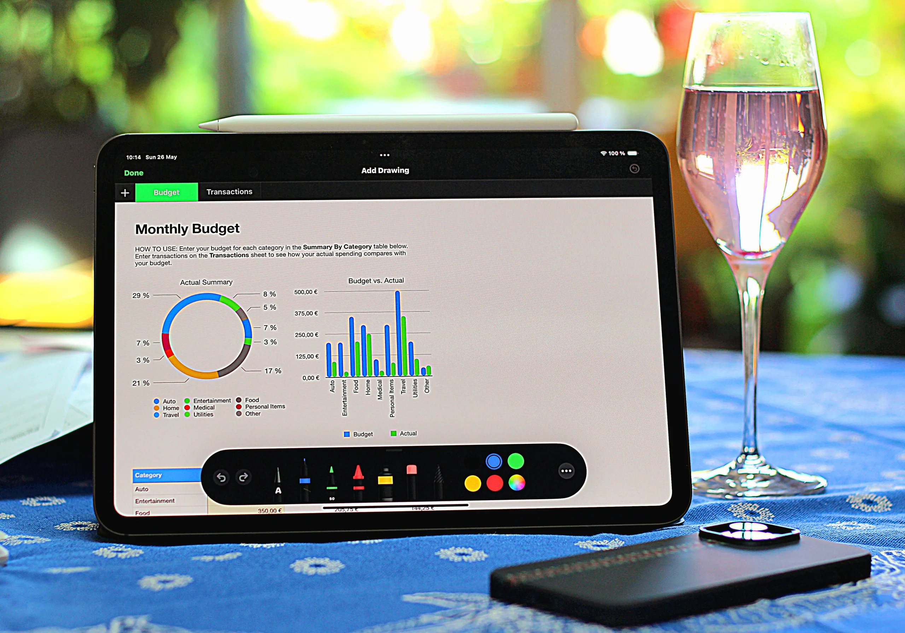
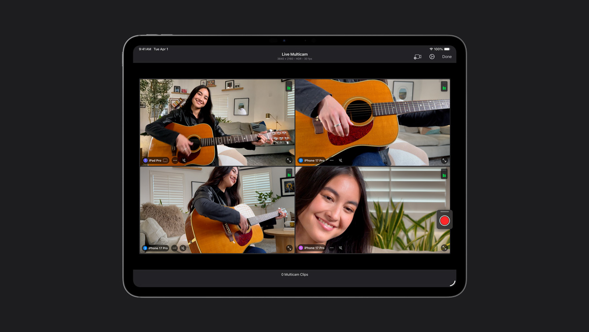
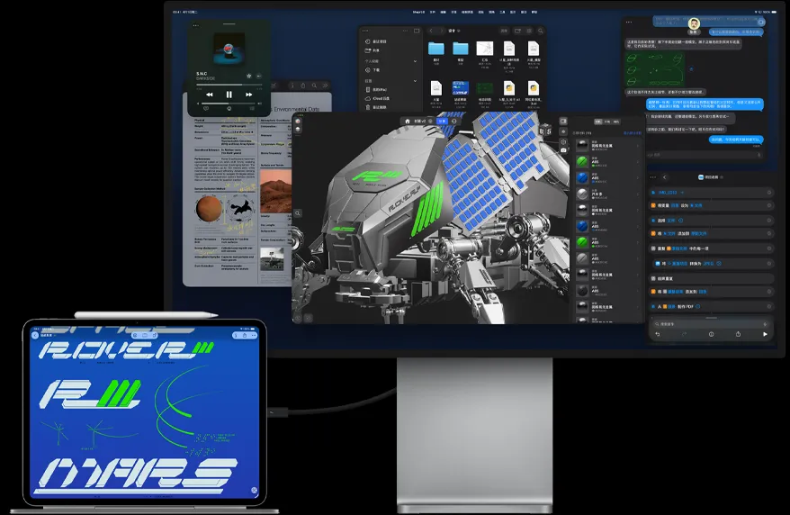
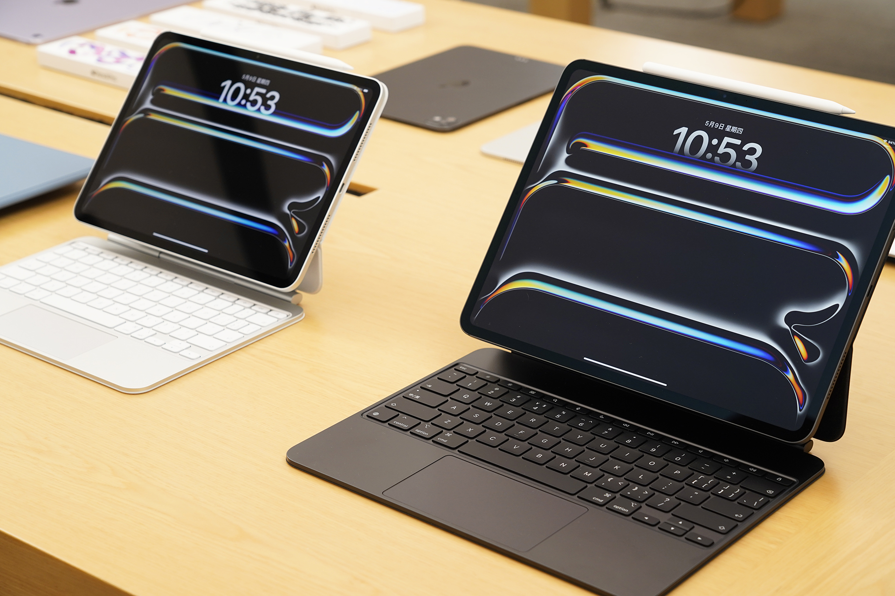

先说结论：把 iPad Pro 当主力生产力工具，现实，但只对一类人现实。判断标准跟 iPad Pro 本身关系不大，跟你工作流的「断点」在哪里关系很大。

先把那句「爱奇艺启动器」的担心拆了。iPad Pro 其实只有两种结局：要么它接住你一天的工作，要么它成为你买过最贵的泡面盖板，中间状态很少。但这道题还有个隐藏条件，你自己可能都不知道断点在哪——没用过它，当然不知道哪个环节会卡住。

所以别先讨论设备。先把题主描述的一天拆开看：大量文档处理、图片编辑、偶尔视频剪辑。逐个环节过一遍，哪里接得住、哪里会卡住，过完你自然有答案。

## 先把文档这关过了

写方案、改稿子、填表格，这一摊事 iPad Pro 现在是真的能打了。iPadOS 26 把老的分屏和侧拉全砍了，换成了一套正经的窗口系统加菜单栏，台前调度也下放给了所有能升级的机型。配上妙控键盘，11 英寸那台 444 克，地铁上改稿的体验是笔记本给不了的。

_图源：Notebookcheck_

小刺有两个。一个是微软的收费规则，按微软官方支持页的现行口径：屏幕大于 10.1 英寸的设备，Word、Excel、PowerPoint 想编辑得先买 Microsoft 365 订阅，白嫖是过去式了；不想掏这笔钱，WPS iPad 版基础编辑免费，代价是广告。另一个是国行的现实：苹果官方支持页写得很明白，国行设备目前无法使用 Apple 智能，写作工具那套系统级 AI 功能你用不上，别按发布会的演示脑补。

文档这一关，过。

## 修图要分人，分界线比你想的刻薄

修图这环要分人，而且分界线比大多数人想的刻薄。

如果你是社媒向的修图——调色、修瑕疵、做封面、出小红书图文——Apple Pencil Pro 加 Procreate、Affinity Photo、Pixelmator 这套组合，体验和效率都不输桌面，手写笔的低延迟在很多操作上反而更快。

但如果你的图片要进印刷流程，直接断。两个硬伤：Photoshop iPad 版按 Adobe 官方口径在国区不可用，你得折腾外区账号；更关键的是它至今不支持 CMYK 模式，也没有桌面的插件和滤镜库。印前那一关，你还是要回到某台电脑上。

**所以修图这一关的真相是：iPad Pro 吃下了 80% 的日常，但剩下 20% 的专业流程，它一厘米都进不去。**

## 剪视频，恰好是它最亮的地方

偶尔剪视频这件事，反而是 iPad Pro 最出彩的地方。

Final Cut Pro iPad 版 38 块一个月，M 系芯片 iPad 都能跑，外接硬盘建工程、四路机位实时切换这些功能都齐了；不想花钱，DaVinci Resolve iPad 版免费，M 系芯片上功能给得很全。M5 这颗芯片剪 4K 素材属于性能溢出，导出速度会刷新你对平板的认知。

_图源：Apple 官网_

雷区在三个方面。FCP iPad 版没有第三方插件生态，Mac 上你依赖的那些调色插件、字幕模板、转场包，一个都带不过来。它是纯订阅制，Mac 版 1998 块买断，iPad 版月月交钱。还有字幕转写这类功能，语言支持和国区可用性都要打问号，别把宝押在「以后会补上」上。

短视频、中视频、Vlog 级别的剪辑，iPad Pro 是甜点。半小时以上的长片、多轨复杂工程、需要团队协作的项目，它会教你什么叫「移动端 Final Cut」。

## 真正的断点，不在 App 里，在系统层

上面三个环节其实都过得去。真正让 iPad Pro 当不了主力的，是下面这些系统层的硬限制，买之前必须知道自己撞不撞得上：

_图源：Apple 官网_

**文件系统这道门槛，Windows 用户首当其冲。** iPad 的文件 App 能读 U 盘、移动硬盘和 SD 卡，但苹果官方支持的格式里**没有 NTFS**——你 Windows 时代攒下来的那些移动硬盘，插上 iPad 就是块砖头，要么重新格式化成 exFAT，要么每次中转。

**后台是真后台，也是真冻结。** iPadOS 的 App 切到后台很快就被挂起，你导出一条大视频、下一个大素材包，中途切去回个微信刷个网页，回来可能发现进度条根本没动。

**外接显示器，2026 年了还是单台逻辑。** M5 iPad Pro 雷雳口可以带一台最高 6K 的外接显示器，看着很美。但扩展桌面这条路从 iPadOS 16 到现在，一直搭在台前调度上，不是 Mac 那种独立桌面。想要双屏办公的人，会失望的。

这几条不解决，App 生态再繁荣也白搭。**限制 iPad Pro 的从来不是性能，是你的工作流里有多少环节长在 macOS 和 Windows 上。**

## 算一笔涨价之后的总账

账要按 2026 年 9 月的现价算，别按记忆算。iPad Pro M5 是 2025 年 10 月发布的，11 英寸发布时 8999 起；据北京日报网报道，今年 6 月 25 日苹果中国区因存储芯片成本全线调价，iPad Pro 涨了 1800，现在官网 **10799 起**。再加上生产力的两根拐杖：Apple Pencil Pro 999，妙控键盘 11 英寸款 2399。

10799 加 999 加 2399，14200 左右，256GB，国补一分钱吃不到（国补只补 6000 以内的机器）。这还没算 FCP 一年 380 的订阅。

【好物卡：Apple iPad Pro 11 英寸（M5）】

_图源：IT之家_

还有一笔心理账要还。题主想换掉 Windows 本的核心理由是通勤重。但 iPad Pro 加键盘夹上之后，整机也是一公斤往上，比 14 英寸轻薄本轻个半斤左右，「减重一半」的获得感没有参数表上那么夸张。它真正的轻，是你只带板子和笔出门的 444 克——可那状态下它是个阅读批注设备，不是生产力。

## 避坑清单和最终结论

如果你看完上面还是想买，这几条能帮你少花冤枉钱：存储直接 512GB 起步，256GB 装完系统和素材，FCP 工程一开就红；13 英寸别当通勤机买，579 克加大键盘，便携性名存实亡；蜂窝版想清楚，国行 iPad 的 eSIM 只能上网不能打电话，还挑运营商；妙控键盘可以缓一缓，笔是刚需，键盘看你是不是真有大量桌面打字场景。

最后是分人结论。

图文加短视频为主、工具链封闭在主流 App 里、没有团队协作工程、家里另有一台电脑兜底的人——换，iPad Pro 会给你的通勤生活开一个完全不同的档。

做长片、做印刷、经常拿移动硬盘从 Windows 电脑拷素材、或者依赖某些桌面专业软件的人——别换。你的断点每一周都会出现，每一次出现你都会怀念那台「笨重」的笔记本。

把 iPad Pro 当主力这件事，答案不在苹果官网，在你一天工作的最后一个环节里。先把你的一天写在纸上，圈出断点。圈不出来，就买；圈得出来，那些断点就是你买回去之后每天想骂人的地方。

---

*iPad Pro M5 价格与规格据 Apple 中国官网及苹果新闻稿，涨价信息据北京日报网、什么值得买 2026-06 报道，Office 收费规则据微软官方支持页，Apple 智能国行可用性据 Apple 官方支持页。价格与功能口径截至 2026-09-12。如果你想看 2026 年平板全景对比（iPad Air 还值不值、国产板怎么选），我写过《2026 年平板推荐：我把 7 个品牌 26 款在售平板翻完，发现带货文不会说的 5 件事》。关注我不迷路。*
