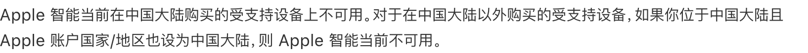
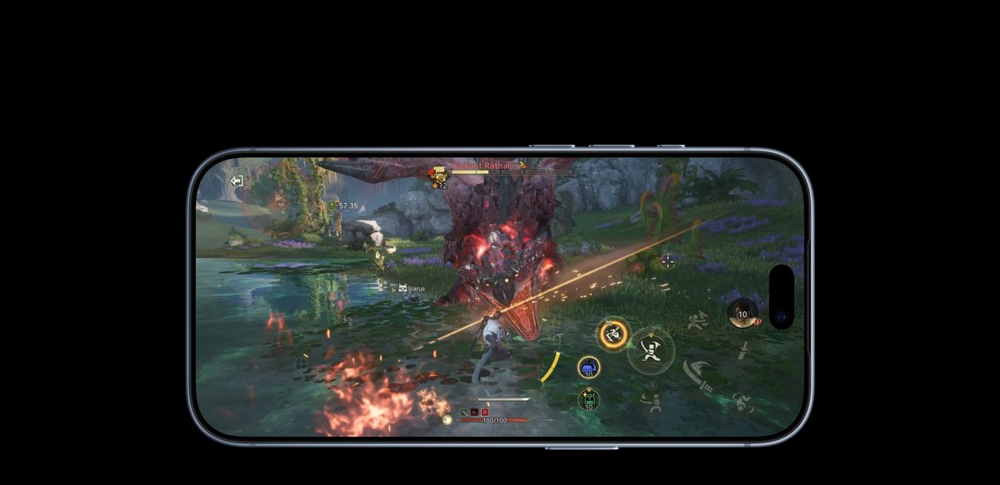
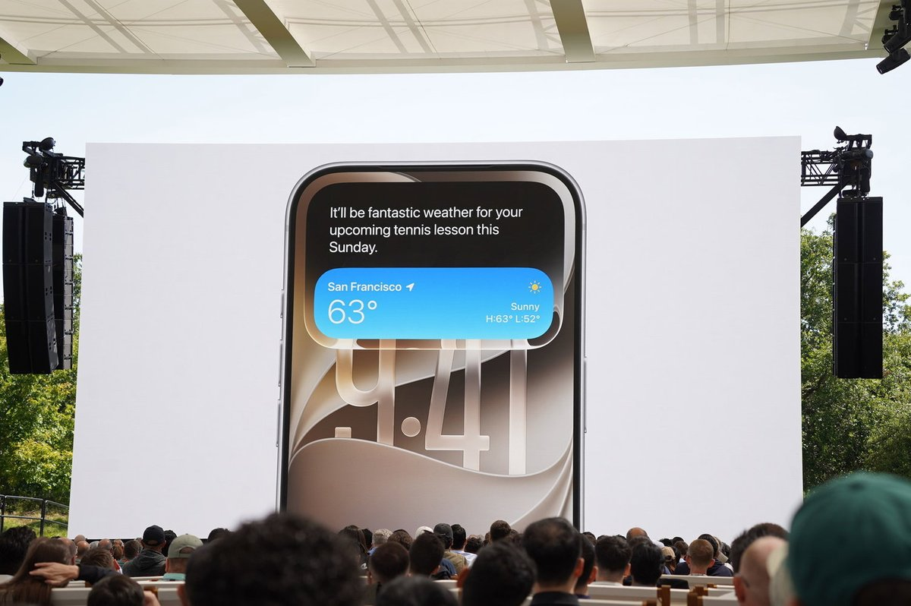
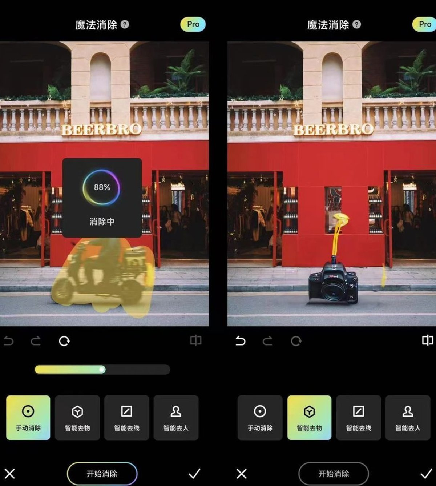
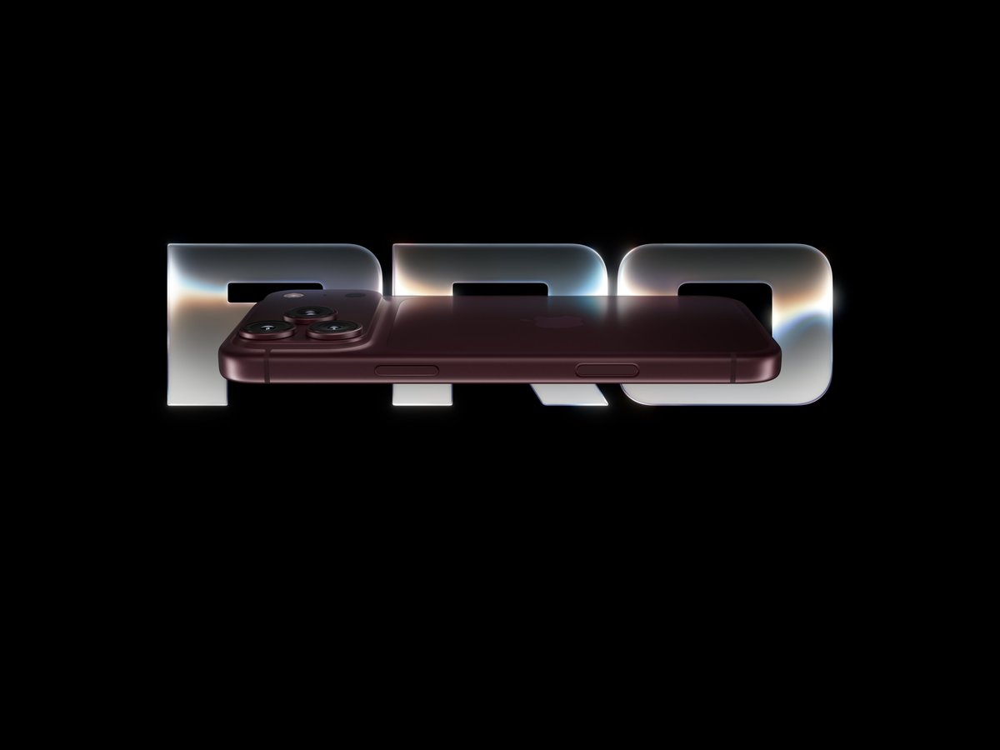

上一篇我算了 iPhone 18 Pro 的涨价账，结论是硬件值这个涨幅。这篇算另一笔账：**你花 9999 元买到的，是一台 AI 功能为零的旗舰机。这笔钱该怎么算？**

先给结论：**不影响「买不买苹果」，但影响「买不买国行、什么时候买」。** 对绝大多数已经活在苹果生态里的人来说，该买还是会买。但如果你买 Pro 就是冲着 AI 去的，或者你在 iPhone 和国产旗舰之间犹豫，这个功能缺口足以改变决定。

数据截至 2026 年 9 月 13 日。

## 先搞清楚「缺」到底有多严重

很多人以为国行缺的只是「新 Siri 没那么聪明」。不是。

是零。一个都没有。

Apple Intelligence，国行官方译名「Apple 智能」。新版 Siri（能看懂屏幕、能跨 App 操作的那个）、写作工具、通知摘要、通话录音转文字、图片消除、文生图、Genmoji、视觉智能——海外版的全部功能，国行一概没有。你的 Siri 还是五年前那个「抱歉，我不太明白」的 Siri。

苹果自己把话说得很死。官网新闻稿原话是：「**Apple 智能推出时间依监管部门审批情况而定，Siri AI 和其他新的 Apple 智能功能在中国大陆尚不可用。**」支持页的措辞更狠：「**Apple 智能当前在中国大陆购买的受支持设备上不可用。对于在中国大陆以外购买的受支持设备，如果你位于中国大陆且 Apple 账户国家/地区也为中国大陆，则 Apple 智能当前无法使用。**」

_截图：Apple 支持官网_

第二句话值得每个想买港版的人抄下来。

**它意味着买港版也解决不了问题**——只要你的 Apple 账户是中国大陆区，人在大陆，照样激活不了。想绕过去，得港版机器加境外账户加网络环境，一整套下来，普通用户折腾不起，也不该折腾。

更关键的是，这不是硬件不行。国行 iPhone 18 Pro 的 A20 Pro 芯片和海外版是同一块，双 16 核 Neural Engine，AI 处理性能是 A19 Pro 的两倍。硬件就在手机里躺着，是软件层面整台锁死。

_图源：Apple 官网_

这件事有实锤。2026 年 3 月 31 日，iOS 26.5 Beta 误向国行设备推送了 Apple 智能，大批用户连夜下载激活实测，苹果第二天紧急撤回，**连已经下载到本地的模型都被远程删除**。能删模型，就说明限制从来不在算力上。

## 那还要等多久？看看这笔时间账

从 2024 年 6 月 Apple 智能全球发布算起，国行用户已经等了两年多。这期间发生过什么，值得捋一遍。

2026 年 1 月，有博主曝光国行已开始灰度测试。3 月误推送又收回，激活过的人评价就三个字，「就这？」。7 月 8 日，苹果技术开发（上海）的「Apple 智能」通过网信办备案，7 月 15 日同批公示里，华为小艺、小米、OPPO 的端侧 AI 全在名单上——**它们当天就是能用的功能**。

然后是最魔幻的一幕。8 月 8 日，苹果中国官网悄悄上线了一份《在 Mac 上配合 Apple 智能使用千问》的支持文档，第一次官方确认国行 AI 接入阿里千问。上线不足一天，8 月 9 日紧急删除。有媒体去问苹果客服，得到的答复是「现阶段中国大陆地区还无法使用该套 AI 智能功能」。

备案过了，合作方官宣了又删了，文档都写好了又撤了。这套操作说明什么？说明苹果自己都没把握什么时候能开。连大厂内部都在反复，你凭什么按「快上线了」来做自己的购机决策？

顺带说一个容易被忽略的事实：海外版的新 Siri 也没好到哪去。它随 iOS 27 在 9 月 14 日以 Beta 形式上线，**首批只有英语**，10 月才加法语、日语、韩语、葡萄牙语、西班牙语——没有中文，连繁体中文的上线时间苹果都没给。所以就算你现在飞美国买一台回来，面对的也是一个只会说英语的 Beta。

_图源：IT之家（WWDC26 发布会演示）_

## 再算算替代账：缺的功能能不能补？

能补，而且大部分补得还不错。这是我说「不影响买不买苹果」的原因。

通知摘要这种东西，没有也就没有了。真需要的几个，国产 App 早就填上了：写东西有 Kimi、通义、文心；通话转文字有讯飞听见；图片消除，美图秀秀的 AI 消除比苹果自带的只强不弱，国产手机的相册消除 2026 年已经做到全流程提速约 40%。

_图源：雷科技_

真正补不了的是什么？**系统级集成。** 苹果的 AI 是长在系统里的，能读屏幕、懂上下文、跨 App 操作。第三方 App 再好用，你也得打开它、复制粘贴、来回倒腾。这个差距，靠装 App 抹不平。

所以替代账的结论是：单个功能都有平替，「无感程度」没有平替。你在不在意每天多倒腾十几下，只有你自己知道。

## 正面回答：9999 里，AI 这部分钱是白花了，但别的钱不是

我从来不觉得 iPhone 18 Pro 的卖点全是 AI。恰恰相反，这代最硬的升级跟 AI 一点关系都没有：可变光圈主摄、60W AVS 快充、国行 43 小时的 Pro Max 续航、2nm 的 A20 Pro。这部分的分析我写在另一篇涨价拆解里了，这里不重复。

_图源：Apple 官网_

真正的问题不在「iPhone 18 Pro 值不值」，而在**同价位的对手已经换赛道了**。

9999 到 10000 这个价位，华为 Mate 系列的盘古大模型是深度集成的，小米、OPPO、vivo 的 AI 通话翻译、AI 会议纪要、AI 消除全都是开箱即用的现货。你花同样的钱，一边是一台「硬件拉满但 AI 欠费」的手机，一边是一台 AI 功能全面落地的手机。

2026 年买一台万元旗舰，AI 体验可能真不如两年前的国产中端机。这话不好听，但这是现状。

## 所以，会影响购买决定吗？分三种人

**生态绑定的人，不受影响。** 你的照片在 iCloud，耳机是 AirPods，电脑是 Mac，手表是 Apple Watch。AI 缺失是痒点不是痛点，平替 App 也够用了。该买买，买国行没毛病。

**冲着 AI 买的人，受影响，而且是决定性的。** 如果你买 Pro 的核心动机就是新 Siri 和写作工具，那我劝你把预算交给国产旗舰，或者等。现在下单等于花全款预购一个无期限的期货，备案过了两个月都开不了闸，下一个节点没人知道是哪一天。

**犹豫要不要等的人，只有一个建议：别等，或者等一个明确的信号。** 明确的信号是什么？苹果中国官网重新上线千问文档、或者国行设置里真的出现 Apple 智能开关。两个都没发生之前，所有「快了」的说法都当谣言处理。还要提醒一句，苹果不是没干过这事——2026 年 3 月偷跑激活的用户，模型说删就删。

---

最后说句实话。国行 iPhone 的 AI 缺失，锅不全在苹果。监管审批、数据本地化、地缘博弈，每一环都不是手机厂商能左右的。但消费者不需要关心锅是谁的，消费者只关心手里的钱花得值不值。

你买的手机是现货，它的 AI 是期货。期货这东西，只有写进合同的才算数。

---

*iPhone 18 Pro 售价与硬件参数据 [Apple 中国官网新闻稿](https://www.apple.com.cn/newsroom/2026/09/apple-debuts-iphone-18-pro-and-iphone-18-pro-max/)（2026-09-09），国行 AI 不可用声明据 [Apple 官网新闻稿](https://www.apple.com.cn/newsroom/2026/06/apple-unveils-next-generation-of-apple-intelligence-siri-ai-and-more/)与 [Apple 支持页](https://support.apple.com/zh-cn/guide/iphone/iphc28624b81/ios)，Siri AI 上线节奏据 [9to5Mac](https://9to5mac.com/2026/09/09/apple-confirms-siri-ai-launches-in-english-this-month-will-add-five-languages-in-october/)（2026-09-09），备案信息据国家网信办公示及[财新报道](https://www.caixin.com/2026-07-15/102464614.html)（2026-07-15），千问文档上线及删除据[界面新闻](https://www.jiemian.com/article/14895695.html)、快科技（2026-08-09），安卓 AI 功能现状据 PConline 横评（2026-04）。涨价值不值、A20 Pro 和可变光圈的详细拆解见我的另一篇回答。后续我还会写 iPhone Duo 折叠屏的取舍分析。关注我不迷路。*

【好物卡：Apple iPhone 18 Pro】
