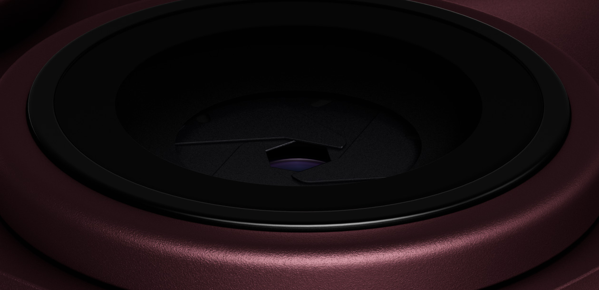
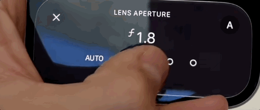
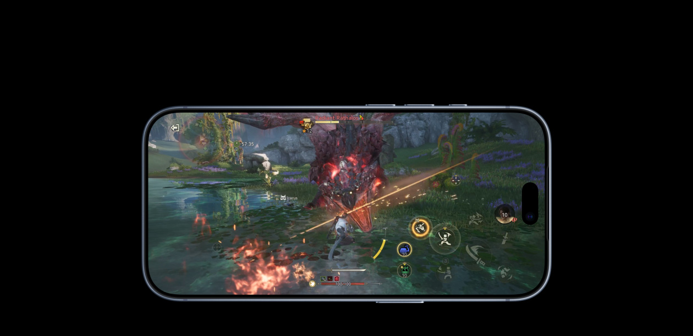
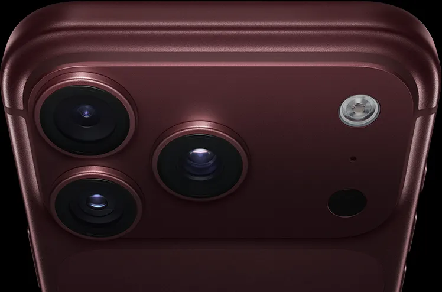

先说结论：**iPhone 18 Pro 涨价 1000 到 3500 元，但这代硬件升级幅度是近三年 Pro 系列最大的，涨价基本对得起涨幅。** 可变光圈、60W AVS 快充、约 6 小时续航提升是三个最硬的升级，钛金属换铝合金是唯一明显的降级。16 Pro 及更早的用户强烈建议升级，17 Pro 用户看情况。

数据截至 2026 年 9 月 10 日，来源为 Apple 中国官网和美国官网规格页。

下面展开说。先把价格摆上来。

| 存储  | iPhone 18 Pro | iPhone 18 Pro Max |
| :---- | :------------ | :---------------- |
| 256GB | **¥9,999**    | ¥10,999           |
| 512GB | ¥11,999       | ¥12,999           |
| 1TB   | ¥15,499       | ¥16,499           |
| 2TB   | ¥20,499       | ¥21,499           |

跟上一代比呢？iPhone 17 Pro 已经下架了，我查到美版全系涨了 $100，国行涨幅更大。

| 存储  | iPhone 17 Pro（国行） | iPhone 18 Pro（国行） | 差价        |
| :---- | :-------------------- | :-------------------- | :---------- |
| 256GB | ¥8,999                | ¥9,999                | **+¥1,000** |
| 1TB   | ~¥13,999              | ¥15,499               | +¥1,500     |
| 2TB   | 无此版本              | ¥20,499               | —           |

| 存储  | iPhone 17 Pro Max（国行） | iPhone 18 Pro Max（国行） | 差价        |
| :---- | :------------------------ | :------------------------ | :---------- |
| 256GB | ¥9,999                    | ¥10,999                   | **+¥1,000** |
| 2TB   | ¥17,999（已确认）         | ¥21,499                   | **+¥3,500** |

两个细节值得注意。**iPhone 17 Pro 没有 2TB 版本**，那是 Pro Max 独占的，18 Pro 这次新增了 2TB 选项。Pro Max 顶配从 17999 涨到 21499，**涨了 3500 块**。

入门涨一千，顶配涨三千五。越贵的版本涨得越狠。

看起来苹果铁了心要从你口袋里多掏钱。但这次有个反直觉的事实。**这一代的硬件升级幅度，可能是近三年 Pro 系列最大的。**

不是洗地。往下看。

## 第一个撑起涨价的：可变光圈

先说一个你可能没注意到的事。你用手机拍的「人像模式」照片，背景虚化全是假的。

不是贬义。所有手机都是这么干的。算法猜哪些像素是人、哪些是背景，然后把背景糊掉。大多数时候效果还行，但你仔细看头发丝边缘、杯子轮廓、尤其是透明玻璃杯，经常会看到一圈毛边。

那就是算法猜错了。

iPhone 18 Pro 做了一件之前从来没有 iPhone 做过的事。**装了一个真的光圈叶片。**

_图源：Apple 官网_

ƒ/1.48 到 ƒ/4.0，机械开合，光学层面的真实景深。不是算出来的，是物理光路决定的。

这玩意儿在实际拍照中意味着什么？三个场景你就懂了。

**拍人像。** 光圈全开 ƒ/1.48，背景虚化是真的光学虚化。头发丝不会再出现毛边，光斑圆润自然。你拍完放大看细节，会明显感觉到跟之前算法虚化的区别。就像戴了副度数准确的眼镜。

**拍夜景。** ƒ/1.48 的进光量比上代 ƒ/1.78 多了将近 40%。进光多意味着快门可以更快、ISO 可以更低，夜景照片噪点更少、高光不溢出。你不用开夜景模式等三秒，抬手就拍。

**拍风景、拍文档。** 光圈收到 ƒ/4.0，前后景都清晰锐利。以前拍集体照后排的人经常糊，拍会议白板近处清晰远处糊。现在收小光圈就能全画面清晰，不用再靠 HDR 合成碰运气。

一句话。**以前 iPhone 拍照是「软件补硬件」，这次是「硬件一步到位」。**

而且不只是主摄。**三颗镜头全部升级到 48MP。** 超广角 48MP、长焦 48MP（四重棱镜 4× 光学），前置也终于升级到了 18MP 自动对焦。上代前置还是定焦，自拍经常糊。

8 倍光学品质变焦，最高 40 倍数码变焦。三颗 48MP 镜头加机械可变光圈，这套配置在安卓阵营也只有极少数万元旗舰能做到。

光拍照这一项，就值回票价的一半。

## 第二个撑起涨价的：60W 快充 + 续航跳跃

iPhone 的充电速度被安卓旗舰按在地上摩擦了好几年。安卓那边 120W、200W 满天飞的时候，iPhone 最高才 27W。

这一次，苹果直接跳到了 **60W+，15 分钟充到 50%。**

不只是功率翻倍。充电协议也换了。这是很多人忽略的重点。

之前所有 iPhone 用的是 USB PD 的**固定电压档**。充电器只有 5V、9V、12V、15V、20V 这几个固定的输出电压。电池需要的电压大概率不是这些整数。比如电池要 11.3V，充电器只能给 12V，多余的 0.7V 变成热量白白浪费掉。

这就是为什么 iPhone 充电的时候手机会发热。

iPhone 18 Pro 换成了 **USB PD 3.1 的 AVS 协议**（Adjustable Voltage Supply，可调电压供电）。这个协议允许充电器在 9V 到 28V 之间以 **100mV 为步进精细调节**。手机要 11.3V，充电器就精确输出 11.3V。不多给，不少给。

结果就是，**充得更快，发热更少，能量浪费更少。** 同样的电池容量，AVS 协议充进去的实际电量比固定电压更多。

但有一个坑你得知道。**AVS 需要充电头支持。** 你手上老的 USB PD 充电头插上去也能充，但只能走固定电压档，达不到满血 60W。想用满血快充，得买一个支持 USB PD 3.1 AVS 的充电头。目前市面上支持 AVS 的充电头还不多，买的时候认准包装上写的「USB PD 3.1」和「AVS」字样。

续航方面也炸裂。根据 Apple 官网，Pro Max 视频播放**最长 45 小时**（美国官网数据，国行标注 43 小时）。对比上一代 17 Pro Max 的 39 小时，**多了大约 6 个小时**。

6 个小时什么概念？早上满电出门，正常用一天回到家还剩 30% 以上。出差党可以不带充电宝了。

## 第三个撑起涨价的：A20 Pro 和自研芯片全家桶

_图源：Apple 官网_

据 Apple 官网规格页，iPhone 18 Pro 搭载的 A20 Pro 是首款量产的 **2nm 手机芯片**，台积电 N2 工艺。6 核 CPU、7 核 GPU、双 16 核 Neural Engine。

但更值得关注的是 iPhone 18 Pro 上苹果自研芯片的全面铺开。**C2 自研蜂窝基带**已经出到第二代了，比上代 C1X 快 50%，省电 15%。苹果终于在高通之外有了自己的基带方案。**N1 自研 Wi-Fi 7 芯片**，无线连接也自研了。加上新一代**蒸汽腔体散热**，散热性能是上代的 3 倍。

这些「看不见的升级」不性感。但它们决定了你日常使用中的信号稳定性、Wi-Fi 速度和长时间游戏是否掉帧。

## 一个值得说的「降级」

说了这么多好的，也得说一个让人不太舒服的。

_图源：Apple 官网_

**iPhone 18 Pro 的机身从钛金属换成了铝合金。**

对，你没看错。iPhone 17 Pro 用钛金属，iPhone 18 Pro 换回了铝合金一体成型。

Apple 官方的说法是「更轻」。iPhone 18 Pro Max 249g 确实不算离谱。但从钛金属到铝合金，感官上的高级感是打了折的。铝合金更容易留划痕，光泽质感也不同。

这大概就是苹果消化成本的方式。内存涨了 400%，A20 Pro 2nm 晶圆贵，60W 快充模组也要钱。涨上去的成本，一部分加在售价上，一部分从材质上省回来。

**高情商说法是「轻量化设计」，低情商说法是「偷工减料」。** 你怎么看，取决于你有多在意手机外壳的材质手感。

## 同价位还有谁？

9999 起步的预算，除了 iPhone 18 Pro 你还能买到什么？

**三星 Galaxy S26 Ultra**，约 ¥9,500 起。214g 比 Pro Max 轻 35g，7.9mm 比 Pro Max 薄近 1mm，200MP 主摄像素碾压。但没有可变光圈，没有 iOS 生态，国行 AI 体验比苹果好，三星和百度的合作已经落地了。

**华为 Mate 系列**，AI 功能最全面的国行手机，盘古大模型深度集成。但芯片性能有代差。而且如果你已经在苹果生态里，iCloud、AirPods、Mac 一堆东西绑着，切换成本巨大。

同价位安卓在单项参数上各有胜场。但综合系统生态、做工质感和长期使用周期，iPhone 用四五年不卡的口碑还在，苹果的护城河还在。

涨价一千块之后，这个护城河变窄了。但还没被填平。

## 该不该升级？

**如果你现在用的是 iPhone 16 Pro 或更早的机型**，强烈建议升级。跨了两代以上，可变光圈、60W 快充、续航跳跃、全 48MP 三摄，每一项都是肉眼可见的差距。

**如果你现在用的是 iPhone 17 Pro**，看你在不在意两个东西。一是拍照，可变光圈是质的飞跃。二是充电速度，从 27W 到 60W 是体验分水岭。两个都无所谓的话，17 Pro 再战一年没问题。

**如果你打算等便宜版**，今年 9 月只发 Pro 和 Pro Max。标准版 iPhone 18 和 iPhone 18 Air 推迟到了 2027 年春天。想省钱的还得等半年。

苹果敢涨一千块，是因为这一代的硬件升级确实值两千块。可变光圈、60W AVS 快充、约 6 小时续航提升、2nm 芯片、全 48MP 三摄，随便拎出来两个，都够安卓厂商开一场发布会吹半天。

但钛金属换铝合金这件事也提醒我们，**苹果永远不会做亏本买卖。** 它给你堆了最猛的内功，然后在面子上悄悄省了一笔。

值不值？硬件层面，值。心理层面，看你能不能接受一台九千九的手机外壳是铝合金的。

---

**iPhone 18 Pro 升级要点速查（据 Apple 官网，截至 2026.9.10）：**

| 升级项 | iPhone 17 Pro | iPhone 18 Pro | 值不值 |
|:---|:---|:---|:---|
| 主摄光圈 | ƒ/1.78 固定 | **ƒ/1.48-ƒ/4.0 可变** | ⭐⭐⭐ 质的飞跃 |
| 三摄规格 | 48+48+12MP | **全 48MP** | ⭐⭐⭐ 无凑数镜头 |
| 快充 | 27W 固定电压 | **60W+ AVS** | ⭐⭐⭐ 翻倍 |
| 续航（Pro Max 视频） | 39h | **45h（+6h）** | ⭐⭐⭐ |
| 芯片 | A19 Pro (3nm) | **A20 Pro (2nm)** | ⭐⭐ |
| 机身材质 | **钛金属** | 铝合金 | ⚠️ 降级 |
| 起售价 | ¥8,999 | ¥9,999 | +¥1,000 |

**适合升级：** iPhone 16 Pro 及更早用户。
**可以等等：** iPhone 17 Pro 用户（除非在意可变光圈和 60W 快充）。
**别急：** 等明年春天的 iPhone 18 标准版，更便宜。

---

*后续我会继续写 iPhone Duo 折叠屏的取舍分析、国行 Siri AI 缺失的影响评估，以及 iOS 27「iPhone 接力」功能的国行可用性。关注我不迷路。*
