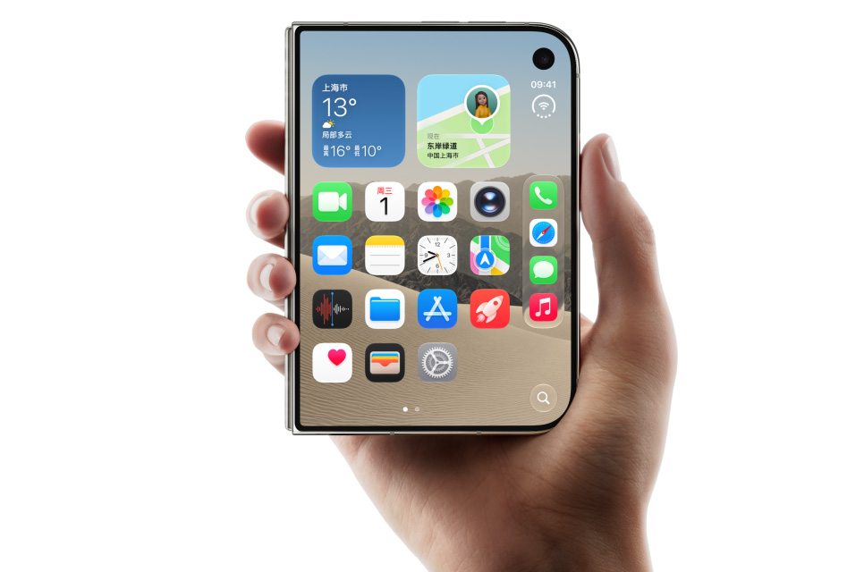
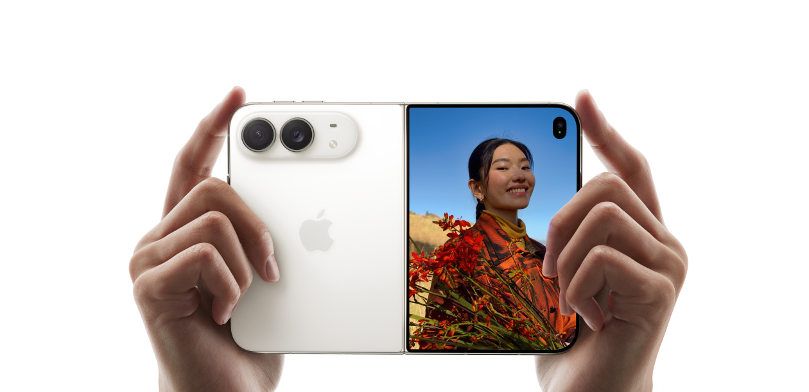

史上最薄的 iPhone，同时也是史上最重的 iPhone。

iPhone Duo 是苹果首款折叠屏，15999 起，没有 Face ID 也没有长焦镜头。这些取舍不是为了省钱，是 5.2mm 极致薄度的物理代价。值不值，取决于你是不是苹果生态的深度用户。

5.2mm 展开厚度，比 iPhone Air 还薄。254g，比 18 Pro Max 重 5g。最薄与最重在同一台产品上，一开头就知道这是一台充满矛盾的阅读。

苹果做折叠屏，交出的第一份答卷，长了一副「我砍了很多东西但你得理解我」的样子。

那这些取舍到底合不合理？我一个一个拆。

## 为什么没有 Face ID

不是苹果想省成本，是真装不下。

Face ID 的 TrueDepth 系统需要红外投射器、泛光照明器、红外摄像头一整套模组。这些元件需要一定的纵向空间。而 iPhone Duo 展开后只有 5.2mm，苹果把内屏做成了屏下摄像头来消除刘海，自然也没地方塞 Face ID 的元件。

替代方案是侧边电源键集成的 Touch ID。折叠态和展开态都能解锁，两面通用。

说实话，Touch ID 在折叠屏上反而比 Face ID 更合理。你想想这几个场景。手机平放桌面看消息，不用拿起来对着脸。手湿了或者戴口罩，指纹照样秒开。解锁速度也不输 Face ID。

唯一的损失是安全性。据 Apple 官网安全白皮书，Face ID 的误解锁概率是百万分之一，Touch ID 是五万分之一。日常用感知不到区别，但如果你对生物安全极度敏感，这是个小减分项。

_图源：Apple 官网_

## 为什么没有长焦

折叠屏的内部空间被铰链机构和双电池大量侵占。长焦模组，特别是棱镜式潜望长焦，需要一段完整的光学路径。Duo 的机身结构实在腾不出这块空间。

而且 Duo 已经 254g 了，是 iPhone 史上最重。再加一颗长焦，重量直奔 270g+，日常携带就是负担。

苹果给的方案是 48MP 主摄 + 48MP 超广角，2x 变焦靠主摄裁切实现。48MP 裁到 2x 相当于 12MP 全像素输出，等效 52mm 焦段，拍人像够发社交媒体。

但裁切终归是裁切。旅行远摄、演唱会、体育赛事这些需要 3x 以上的场景，Duo 直接拉胯。10x 数码变焦的画质跟光学变焦差了一个量级。

其实三星 Z Fold 8 也没有独立长焦，同样走双摄裁切方案。折叠屏目前普遍塞不下长焦模组，这是整个品类的工程瓶颈。华为 Pura X Max 倒是塞了一颗 50MP 潜望长焦支持 3.5x 光学变焦，但重量也到了 229g。

**这其实是产品区隔。** Pro 系列主打拍照极致，Duo 主打大屏体验。苹果不可能让一台折叠屏什么都有，否则 18 Pro 系列卖给谁。

_图源：Apple 官网_

## 15999 起，贵在哪

据 Apple 中国官网和三星中国官网定价，Duo 比 18 Pro Max 贵 5000 块，比三星 Z Fold 8 贵约 3000 块。单看硬件参数，Duo 比 Z Fold 8 重了 53g。外屏尺寸差不多，摄像头配置也差不多，两家都是双摄裁切方案。

那这 3000 块溢价买的是什么。

三个字，**iOS 生态**。

A20 Pro 2nm 芯片跟 18 Pro 同款，性能不打折。iOS 27 为折叠屏做了深度适配，Split View 分屏、StandBy 模式、Apple Pencil 手写批注，这些功能在 iPad 上已经打磨了好几年。安卓折叠屏的应用适配至今仍是最大的槽点，很多 App 打开就是一块放大版的手机界面。

苹果的优势在于开发者生态。iOS 应用会跟着苹果的适配规范走，安卓那边只能靠厂商一家一家谈。

**你多花的 3000 块，买的不是硬件参数，是软件生态的统一性。**

## Duo 做对了什么

说了这么多取舍，也得说说苹果在这台产品上做对了什么。

**5.2mm 展开厚度。** 史上最薄 iPhone，比 iPhone Air 还薄。这是真正能日常感知到的差异化。你从口袋掏出来展开的那一下，薄到不像一台折叠屏。

_图源：Apple 官网_

**7.6 英寸内屏 + Apple Pencil。** 展开后接近 iPad mini 的大小，配合 Apple Pencil USB-C 可以做手写笔记和标注。iOS 生态的笔记和绘图 App 质量远超安卓。GoodNotes、Notability 这些 App 在大屏上的体验是折叠屏安卓给不了的。

_图源：Apple 官网_

**60W+ 快充 + 44 小时外屏续航。** 充电速度跟 18 Pro 拉平，外屏续航 44 小时意味着日常使用完全不需要担心。IP68 防水也给了。基础体验没有打折扣。

有一件事现在还无法验证。iOS 27 的折叠屏适配到底做得怎么样，要等 10 月 23 日正式发售才能见真章。如果 App 适配质量拉胯，再好的硬件也是白搭。

## 跟安卓折叠比，差在哪

| 维度 | iPhone Duo | 三星 Z Fold 8 | 华为 Pura X Max |
|:---|:---|:---|:---|
| 起售 | ¥15,999 | ¥12,999 | ~¥12,999 |
| 重量 | 254g | 201g | 229g |
| 展开厚度 | 5.2mm | 4.5mm | 5.2mm |
| 外屏 | 5.4" | 5.5" | 5.4" |
| 内屏 | 7.6" | 7.6" | 7.7" |
| 后摄 | 48MP 双摄，无长焦 | 50MP 双摄，无长焦 | 三摄含 3.5x 潜望长焦 |
| 芯片 | A20 Pro (2nm) | 骁龙 8 至尊版 | 未公布 |
| 快充 | 60W+ | 45W | 66W |
| 软件生态 | iOS 27 深度适配 | One UI | 鸿蒙 PC 级应用 |

三星 Z Fold 8 便宜 3000 块，轻 53g，展开更薄。华为 Pura X Max 是唯一有长焦的折叠屏，3.5x 光学变焦，鸿蒙的 PC 级应用也是差异化卖点。但三款的外屏尺寸其实差不多大。

如果你在意 App 适配质量、长期系统更新和苹果全家桶的联动，Duo 是目前唯一的选择。

## 谁该买，谁别碰

**该买的人。** 深度绑定苹果生态，iCloud、AirPods、Mac 一堆东西绑着，同时有移动办公或大屏阅读需求，不在乎拍照极致。iPad mini 用户如果嫌它不能揣口袋，Duo 就是你的替代品。

**别碰的人。** 摄影党直接买 18 Pro Max，便宜 5000 块拍照还更强。254g 的重量对轻薄敏感的用户是硬伤，建议去店里掂一掂再做决定。性价比用户没必要为 iOS 生态多花 8000 块，安卓折叠屏 8000 起步选择很多。

苹果做折叠屏，不追求参数碾压，赌的是生态体验能撑起溢价。这个赌注成不成，不看铰链看软件。iOS 27 的适配质量，才是这 15999 的真正底气。

如果你已经在 iOS 生态里，这笔账算得过来。如果你不在，安卓折叠屏便宜 3000 块起步，华为 Pura X Max 还多一颗潜望长焦。

---

**iPhone Duo 核心参数速查（据 Apple 官网，截至 2026.9.10）**

| 参数 | 数值 | 备注 |
|:---|:---|:---|
| 内屏 | 7.6" OLED, 120Hz | 展开近 iPad mini |
| 外屏 | 5.4" OLED, 120Hz | 折叠态偏小 |
| 芯片 | A20 Pro (2nm) | 与 18 Pro 同款 |
| 后摄 | 48MP 双摄 | 无长焦，2x 裁切 |
| 厚度 | 展开 5.2mm / 折叠 11.3mm | 史上最薄 |
| 重量 | 254g | 史上最重 |
| 续航 | 外屏 44h / 内屏 31h | 视频播放 |
| 快充 | 60W+ | 20min 至 50% |
| 生物识别 | 侧边 Touch ID | 无 Face ID |
| 起售 | ¥15,999 (256GB) | 10 月 23 日发售 |

*后续我会写国行 Siri AI 缺失的影响评估和 iOS 27「iPhone 接力」的国行可用性分析。关注我不迷路。*
