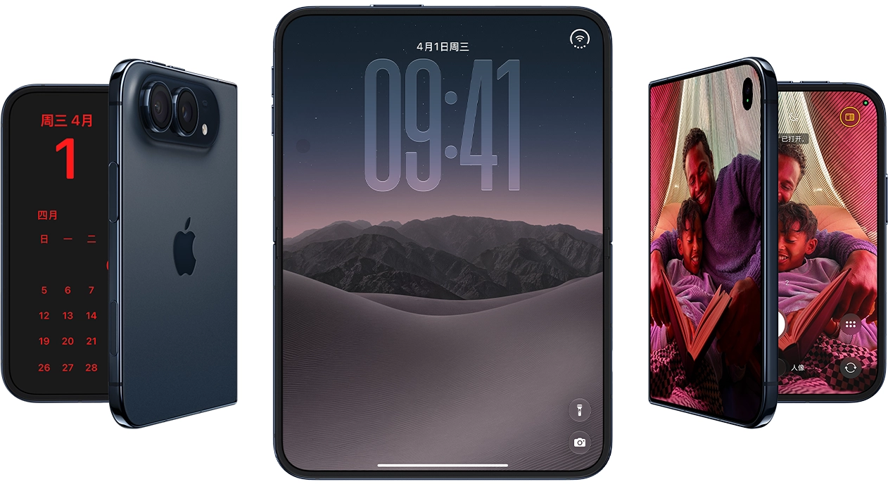
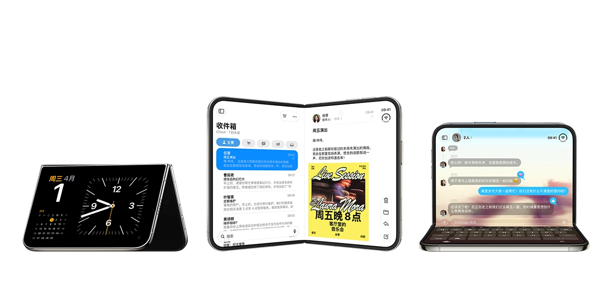
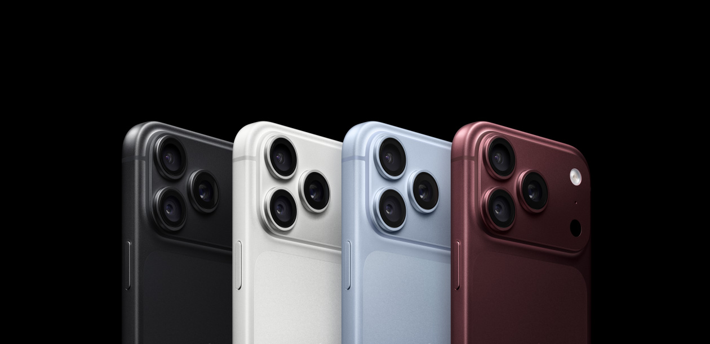

先把题主这笔账纠正一下。iPhone Duo，也就是苹果刚发布的这款折叠屏手机，顶配 2TB 版卖到 26499 元。这个钱不是「两台国产旗舰」，是两台国产折叠屏旗舰，或者四台国产直板旗舰。

但这道题真正问反了。

**对普通人来说，Duo 顶配根本不在选择题的选项里。这道题的正确问法是，另外三个选项里你选哪个，以及为什么「等」其实是发布会留给普通人最大的彩蛋。**

价格我全部核对过 Apple 官网，截至 2026 年 9 月 11 日。

## 先把整张价格牌摊开

| 机型 | 配置 | 价格 | 什么时候能拿到 |
|:---|:---|:---|:---|
| iPhone Duo | 256GB | ¥15,999 | 10 月 16 日预购，10 月 23 日发售 |
| iPhone Duo | 512GB | ¥17,999 | 同上 |
| iPhone Duo | 1TB | ¥21,499 | 同上 |
| iPhone Duo | 2TB | ¥26,499 | 同上 |
| iPhone 18 Pro | 256GB | ¥9,999 | 现在 |
| iPhone 18 Pro Max | 256GB | ¥10,999 | 现在 |
| iPhone 17 | 256GB | ¥6,799（原价 5,999） | 现在 |
| iPhone 17 | 512GB | ¥8,799（原价 7,999） | 现在 |

注意最后一行。9 月 10 日发布会当天，苹果官网做了一件史无前例的事，**旧机不降反涨**。iPhone 17 全系上调 800 元，iPhone Air 最高涨了 2300 元，iPhone 16 和 17e 也涨了 600 到 800 元。17 Pro 和 Pro Max 直接下架。据中关村在线和快科技的报道，这次反向调价的原因是存储芯片成本持续攀升。

也就是说，苹果现在在售的产品线，最便宜的是 6799 的 iPhone 17，往上是 9999 的 18 Pro，再往上是 15999 起步、10 月 23 日才开卖的 Duo。

中间 7000 到 15000 这个区间，是空的。苹果有意留出来的。

## 「等」为什么不是委屈自己

发布会第二天，我身边已经有人在问要不要抢 Duo 首发了。我的建议一律是，除非你满足后面会说到的几个条件，否则等，而且等得有底气。

底气来自三个很实在的事实。

**第一，首发的 Duo 你大概率抢不到，抢到了也是加价货。** 据日经新闻 8 月下旬的供应链报道，Duo 发售前的日产量只有数百部。这是什么概念。苹果一款主力 iPhone 发售前的日产量通常是数十万台级。数百部的产能对着 15999 到 26499 的价格带，第一批货注定是黄牛和评测机构的盛宴。10 月 23 日发售，正常渠道拿到现货大概率要 11 月以后，还得加钱。

**第二，iOS 27 的折叠屏适配，现在没有任何人验证过。** Duo 的硬件参数都在纸面上，5.2mm 展开厚度、7.6 英寸内屏、A20 Pro，这些是真的。但折叠屏的命门从来不是参数，是软件。分屏逻辑、App 大屏布局、内外屏切换的动画一致性，这些要等 10 月 23 日真机到了用户手里才知道成色。苹果自己的 Keynote 做得再漂亮，也不等于第三方 App 跟上了。安卓折叠屏前几代的教训摆在面前，硬件堆满、适配稀烂，最后沦为放大版手机界面。买首发的用户，本质是花一万六以上替苹果做大规模公测。

**第三，第一代产品的维修账没法算。** 折叠屏的铰链和内屏是耗材属性最强的部件，这是整个品类的公开现状。首代产品的良率、耐久数据、维修定价，全部没有样本。一台 26499 的设备，摔一次内屏的维修费可能抵半台 iPhone 17。这个风险在第一年不会有答案。

所以「等」的策略其实很清晰。**等到 10 月 23 日之后，看三件事。** 真实用户的折痕反馈和续航数据，iOS 27 折叠适配的口碑，以及最关键的，产能爬坡之后渠道价格松不松动。三件都过关，再掏钱不迟。苹果的产品生命周期长达四五年，晚三个月买，什么都不损失。

_图源：Apple 官网_

## 那什么人现在就该掏钱

说完了等，也得说谁不该等。Duo 不是智商税，它是苹果产品线里定位最清晰的一台设备，清晰到直接写在价格上。

如果你在苹果生态里已经扎得很深，iCloud、AirPods、Mac、Apple Watch 全套绑着，同时有真实的移动办公或者大屏阅读需求，比如经常出差看文档、通勤读长文、做手写批注，而且预算对你不构成决策因素，那 Duo 就是为你准备的。展开 7.6 英寸配合 Apple Pencil，它替代的是你包里那台 iPad mini，外加一台手机。这笔账在生态用户手里算得过来。

反过来，摄影党别碰。Duo 没有长焦，2 倍变焦靠 48MP 主摄裁切，旅行远摄和演唱会直接拉胯。同样的预算买 18 Pro Max，便宜一万块，拍照还更强。对重量敏感的也别碰，254g 是史上最重的 iPhone，折叠形态揣裤兜的坠感比数字更诚实。

_图源：Apple 官网_

一句话。**Duo 是苹果全家桶深度用户的专属答案，不是普通人的升级选项。** 它的价格本身就是过滤器。

_图源：Apple 官网_

## 普通人真正的三个选项

把 Duo 从选项里拿掉之后，这道题就清爽了。看你手里现在是什么。

**手里是 iPhone 16 Pro 或更早的机型**，现在是换 18 Pro 的最好窗口。可变光圈、60W 快充、45 小时续航、全 48MP 三摄，跨两代的差距每一项都是肉眼可见。9999 起步，比 Duo 便宜一半，明天就能拿到，不用抢，不用加价，iOS 27 的直板适配也是苹果的基本盘，没有公测风险。

**手里是 iPhone 17 或 17 Pro**，建议什么都别买。18 Pro 的升级对你不构成换代理由，17 Pro 再战一年毫无问题，等 2027 年春天的 iPhone 18 标准版，价格会友好得多。

**手里是安卓，想趁这波换苹果**，先想清楚一件事。国行 iPhone 18 Pro 系列目前仍无法使用 Siri AI，这是国行用户的真实处境。如果你能接受国行版在 AI 功能上的缺失，18 Pro 是同价位最省心的选择。如果 AI 是你的核心诉求，三星 S26 Ultra 的国行 AI 体验反而更完整，华为的自研芯片方案也在这波涨价潮里显得没那么贵了。

还有一个容易被忽略的细节。官网涨 800 的 iPhone 17，线下渠道反而在降价，有渠道报价显示比官网低 500 到 800 元。官网涨价是苹果消化存储成本的动作，渠道降价是经销商清库存的动作，**两个动作中间，藏着这波换机潮里为数不多的真便宜**。如果预算卡在六七千，去线下买 17，别在官网下单。

## 最后算一笔总账

| 你的情况 | 建议 | 预算 |
|:---|:---|:---|
| 全家桶深度用户 + 移动办公刚需 + 预算无感 | 等 Duo，但别抢首发 | 16,000 起 |
| 16 Pro 及更早用户 | 现在买 18 Pro | 9,999 起 |
| 17 / 17 Pro 用户 | 什么都不买，等明年春天标准版 | 0 |
| 预算六七千的务实派 | 线下渠道买 17 | ~6,300 |
| 摄影党 | 18 Pro Max，别碰 Duo | 10,999 起 |
| AI 刚需的安卓用户 | 三星 S26 Ultra 或继续观望 | 9,500 起 |

回到题主的问题。追新还是等等？

**顶配 26499 的 Duo 从来不属于普通人，而普通人最好的选择，恰恰是发布会新闻里最容易被忽略的那个字，等。** 等产能，等适配口碑，等渠道价格松动。三个月之后，这道题的所有未知数都会变成已知数，而你的预算一分都不会变少。

急着在 10 月 23 日抢购的人，买的不是手机，是参与感。

---

*iPhone Duo 和 18 Pro 的价格与发售信息据 Apple 中国官网及 IT之家、财联社 2026 09-10 报道，iPhone 17 调价信息据 Apple 官网及快科技、TechWeb 报道，Duo 产能信息据日经新闻。后续我会写国行 Siri AI 缺失的影响评估和 iOS 27「iPhone 接力」的国行可用性分析。关注我不迷路。*
