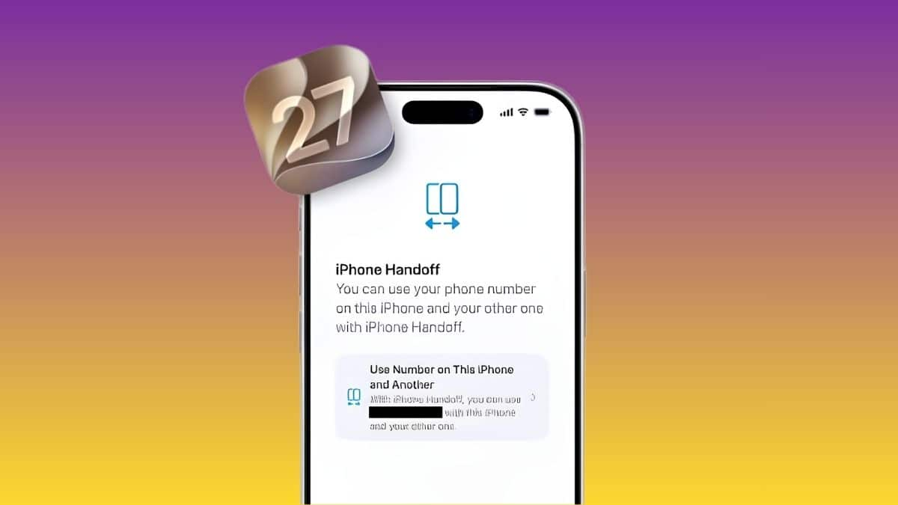
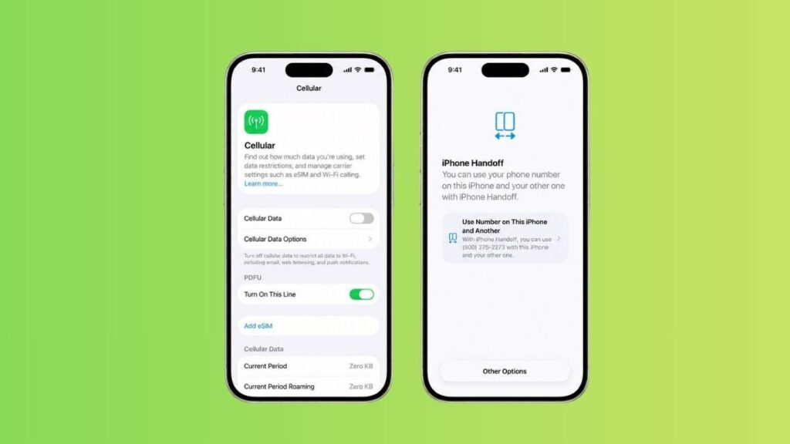
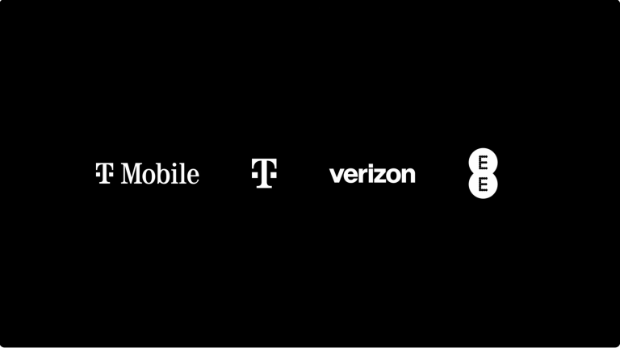

先纠正一个名字。问题里说的「iPhone 接力」，官方英文叫 iPhone Handoff，跟苹果从 iOS 8 就有的那个「接力」功能同名，但做的完全是另一件事。老接力是把邮件草稿从 iPhone 递到 Mac，新 Handoff 是把整个手机号在两台 iPhone 之间切来切去。

再说结论。**对海外多设备用户，这个功能确实解决了真实痛点。对国行用户，大概率是「看看就好」。**

## 这功能到底怎么工作，跟一号双终端和双卡有什么区别

问题描述里提到了两个常见方案，先比清楚。

**一号双终端**，Apple Watch 蜂窝版用的就是这套。手表和手机共享号码，但手表是配件，不能刷抖音、不能导航、不能看视频。iPhone Handoff 是两台完整的 iPhone 共享号码，每台都能独立跑所有 App。

**双卡双待**，一台手机插两张卡，两个号码。接电话时你得知道这通电话是打到卡 1 还是卡 2，回消息也得选哪张卡发。iPhone Handoff 是一台手机一个号码，两台手机同一个号码，不存在「这张卡还是那张卡」的纠结。

一句话区分。一号双终端是手机加配件，双卡是单机双号，iPhone Handoff 是双机同号。

技术实现上，iPhone Handoff 完全基于 eSIM。你的主 iPhone 保留主 eSIM，第二台 iPhone 接收一个 companion eSIM，两台设备共享同一个蜂窝身份。不是呼叫转移。呼叫转移是 A 号码打进来转到 B 号码，iPhone Handoff 是两台设备拥有同一个蜂窝身份，外面看就是一个号。

**但有一个关键点跟很多人想的不一样。** 这个号码并不是两台手机同时在线。你解锁哪台 iPhone，号码就自动激活到哪台上，屏幕会显示「Switched to this iPhone」。另一台立刻变成「离线」状态，不再接收来电和短信。所以不是「双机同振」，而是「拿起哪台，哪台才响」。

设置路径是设置加蜂窝网络，指定 main 和 companion。蜂窝配置只能在主设备上改，定位服务动态绑定到当前激活的那台。

*图源 Technerdiness*

## 哪些人真正需要

**场景一，旧 iPhone 当「随便造」的备用机。**

这是 MacRumors 评论区最高赞（62 赞）认可的用法。去海滩、去酒吧、去旅行，带旧 iPhone 出去，主 iPhone 留家里保险箱。旧手机丢了不心疼，里面没有银行 App 和密码。但别人捡到后打你号码，它照样响铃，你可以用主 iPhone 接听。

风险隔离，这是最实在的价值。

*图源 Technerdiness*

**场景二，形态互补。**

iPhone 18 Pro Max 当拍照主力，iPhone Duo 折叠屏当阅读娱乐机。两台设备一个号码，不用多办一张卡。出门带两台，Pro Max 拍完照直接通过 AirDrop 传给 Duo 在大屏上修图编辑。

**场景三，旅行场景。**

出国用旧手机导航、翻译、打电话，主手机放酒店保险箱。丢了不泄露敏感数据，但号码不失联。

## 实际用起来有哪些坑

调研了一圈 Apple 官方支持文档和几家媒体评测，发现几个容易踩的坑。

**Apple Watch 不跟着切。** 你的 Watch 固定配对一台 iPhone，Handoff 不会把配对关系也切过去。如果配对的 iPhone 不在身边，Watch 只能靠 Wi-Fi 或蜂窝连接，部分功能不可用。

**第三方 App 行为不一致。** 有些 App 会在一台登录时自动登出另一台。银行类 App 可能需要在旧设备上审批后才能在新设备认证。这不是 Handoff 的 bug，是各家 App 自己的安全策略。

**运营商管理只能在主机上操作。** 呼叫转移、来电显示这些设置，副机上改不了。

**关闭 Handoff 必须联系运营商。** 光删掉本地 eSIM 不一定能停止收费，这点 T-Mobile 的用户已经踩过坑了。

**费用问题。** T-Mobile 收 $5/月，Deutsche Telekom 的 MultiSIM 服务是 €6.95/月（部分套餐免费含一个）。Verizon 和 EE 说 2026 年底前支持，但定价还没公布。

## 国内落地面临哪些限制

这是最大的信息差。

iPhone Handoff 完全依赖 eSIM 技术。而中国大陆的 iPhone 不支持 eSIM，2018 年 iPhone XS 起国行就砍掉了 eSIM，只保留实体 SIM 卡槽。iPhone 18 Pro 和 iPhone Duo 国行版同样没有 eSIM 模块。

没有 eSIM，就没有 companion eSIM，iPhone Handoff 在国行设备上从硬件层面就跑不起来。

运营商层面，全球首批支持的是 T-Mobile（美国）、Deutsche Telekom（德国），Verizon 和 EE 要到 2026 年底才上线。中国三大运营商（移动、联通、电信）没有一个在支持列表里。即使未来国行 iPhone 重新支持 eSIM，运营商也需要单独适配这个功能，短期内看不到希望。

*图源 PCMag*

## 值不值得为了这个功能买两台 iPhone

不值得专门为此买。

iPhone Handoff 是一个锦上添花的功能，不是非它不可的功能。如果你本来就有一台旧 iPhone 留着吃灰，又刚入了 iPhone Duo 或 18 Pro，那这个功能让旧机重新有了价值。如果你只有一台 iPhone，或者你在国行，这个功能跟你没关系。

苹果给两台 iPhone 之间搭了一座桥，但这座桥目前只通了一半，国行这边还没修过来。

---

**iPhone Handoff 关键参数速查（据 Apple 官网支持文档及 MacRumors，截至 2026.9.12）**

| 参数 | 说明 |
|:---|:---|
| 技术基础 | eSIM（companion eSIM） |
| 核心能力 | 两台 iPhone 共享同一号码，解锁即切换 |
| 同时在线 | 否，同一时刻号码只在一台设备上活跃 |
| 设置路径 | 设置 > 蜂窝网络 > Use Number on This iPhone and Another |
| 设备要求 | 两台均需 iOS 27+，同一 Apple Account，均连 Wi-Fi |
| 首批运营商 | T-Mobile（美，$5/月）、Deutsche Telekom（德，€6.95/月） |
| 即将支持 | Verizon（美）、EE（英），预计 2026 年底前 |
| 国行可用性 | 不支持（无 eSIM 模块 + 运营商未适配） |
| Apple Watch | 不跟随切换，固定配对一台 iPhone |
| 关闭方式 | 必须联系运营商，仅删 eSIM 不能保证停费 |
