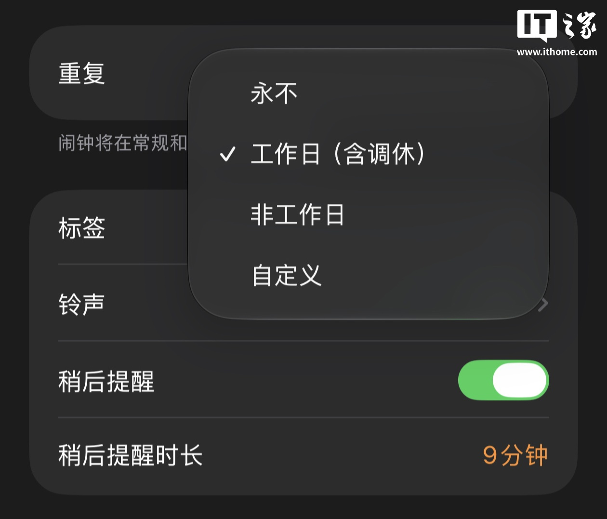
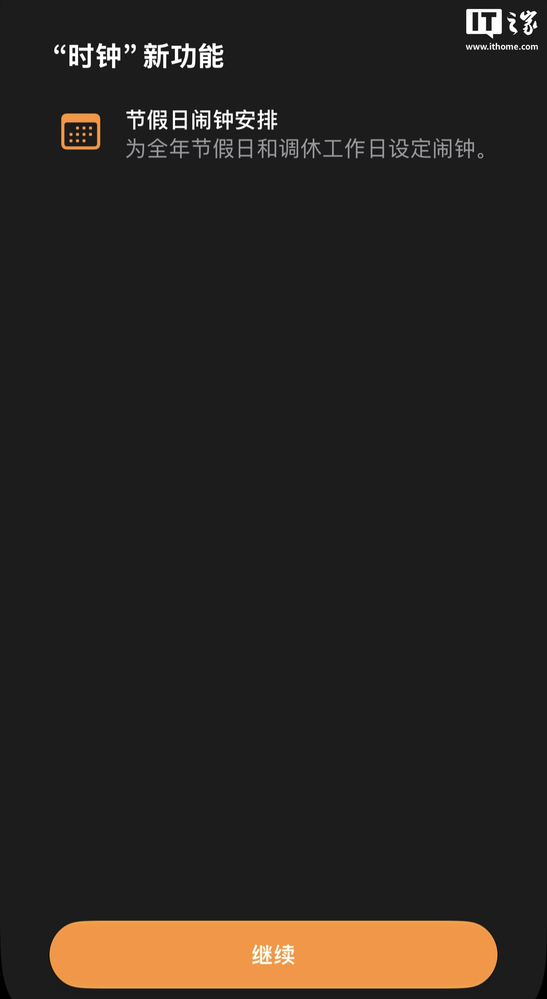
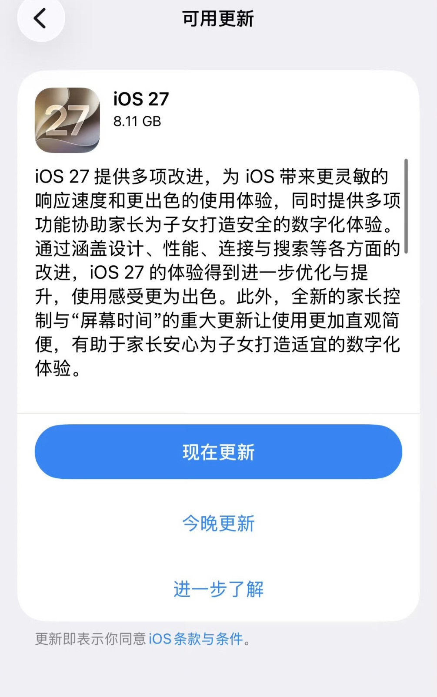

每年一到国庆、春节前的调休周，微博热搜上总有一个固定节目：苹果客服回应闹钟调休日不响。

当事人通常是同一个剧本——周六补班，iPhone 闹钟静音，一觉睡到十点半；或者周日放假，闹钟照响，人坐在工位上才反应过来这周根本不用上班。闹钟记得周一到周五，不记得国务院。

所以这次 iOS 27 正式版把这个功能做进去，算是把这桩陈年旧案结了。

**先说结论：iOS 27 的国行 iPhone 确实新增了「工作日（含调休）」闹钟模式，这个功能目前只有国行机型有，港版美版都没有。**在时钟 App 里，闹钟的重复选项多了一个「工作日（含调休）」。打开之后系统会自动接管：周末调休补班那天，闹钟响；法定节假日，闹钟闭嘴。它不是靠第三方 App，是系统时钟自己认得调休。

_图源：IT之家_

这个功能在国行系统里其实藏得挺深。它的底层逻辑是对接国务院每年发布的法定节假日和调休安排，国行 iPhone 把地区设置为中国大陆才会出现这个选项。也就是说，**这不是一个 App 层面的功能，是系统时钟直接内置了一份调休日历**。

_图源：IT之家_

我知道有人会说，安卓不是十几年前就有了吗。

还真是。MIUI 6 和 EMUI 3.0 在 2014 年就把传统节假日做进了系统日历，之后几年逐步把调休安排也同步了进去，闹钟智能跳过法定节假日随之跟上。国产用户被这个功能养了很多年，苹果这边迟到到现在，挨骂不冤。

但苹果为什么拖了这么久，这事比想象中复杂一点。

苹果官方对外的口径是，这个功能是**专门为中国用户的调休痛点做的本土化适配**。注意这个措辞——它不是「修复了一个 bug」，而是「为单一市场做了一次特供」。iPhone 是全球统一代码库的产品，一个只服务中国大陆的节假日规则，意味着要在全球通用的时钟逻辑里单独开一条分支，还要承诺每年国务院发文后及时更新这份日历。这套维护成本，苹果之前大概率觉得不值得。

有数码博主转述过苹果内部朋友的说法，说产品团队早年确实没有「调休」这个概念——这不算官方解释，只能当旁证听。但方向应该是对的：**苹果不是不知道，是此前没把这事排到优先级里**。直到这两年国行份额被国产旗舰反复敲打，本土化体验从锦上添花变成了雪中送炭。

有意思的是，这次 iOS 27 正式版推送里，国行的待遇是分裂的。

_图源：天极网_

调休闹钟这种小功能，国行有了，而且只有国行有——据雷科技报道，港版、美版机型目前都没有这个选项。但另一头，**问题描述里说的「各类 App 访问全新 Apple Intelligence、AI 版 Siri 同步上线」，对国行用户是不成立的**。iOS 27.0（内部版本号 24A437，北京时间 9 月 15 日凌晨推送）的正式版里，国行设备依然用不上 Siri AI。国行的 Apple 智能倒是已经过了生成式 AI 备案（通义千问系统级集成那套），被预期随 iOS 27 分批开放，但截至推送当天，权威媒体的口径仍然是「缺席」。

一边是迟了好多年的调休闹钟终于给了，一边是万众期待的 AI 还没给。这两个功能放在一起看，其实能看出苹果现在对中国市场的排序：**先补确定性高、合规成本低的基础体验，AI 这种要过监管长流程的，继续等**。

而 iOS 27 本身这波更新，除了调休闹钟之外，海外用户讨论最多的是液态玻璃设计的透明度调节、独立的 Siri App、应用启动速度最高提升 30%、照片载入最高提升 70%。这些是全球化功能，国行一样能用。说白了，**调休闹钟是国行这版更新里唯一一个真正「专属」的东西**，分量轻，但信号不轻。

_图源：IT之家_

最后回答题目那个「为什么到现在才更新」。

我的判断是，三个因素叠在一起：一是苹果全球代码库给单一市场做特供，决策链本来就长；二是之前国行销量撑得起「等等就等等」的傲慢；三是这两年竞争格局变了，本土化体验成了必答题而不是加分题。调休闹钟是这三件事交出来的第一份答卷。

分数不高，但总算开始答题了。

国行 AI 那道题什么时候交卷，值得另写一篇细说。只能说，调休闹钟是一次「确定能给」的更新，AI 是一次「不知道何时能给」的更新。消费者等的从来不是功能清单，是兑现日期。

---

*iOS 27 更新内容与推送时间据[天极网](https://mobile.yesky.com/302/372302.shtml)（2026-09-15）与[齐鲁晚报转引 21 世纪经济报道](https://www.qlwb.com.cn/detail/28096411.html)；「工作日（含调休）」功能细节与功能名称据[中新经纬](http://finance.sina.com.cn/wm/2026-09-15/doc-inirwmwh3934294.shtml)（2026-09-15）与[雷科技](https://www.leikeji.com/article/79522)；国行限定与国行 AI 缺席据[网易科技](https://c.m.163.com/news/a/L6S5J67105119GO7.html)（2026-09-15）；安卓节假日功能历史据[创业邦](https://m.cyzone.cn/article/799685)。国行 Apple 智能备案进展据国家网信办公示及财新报道（2026-07）。*
