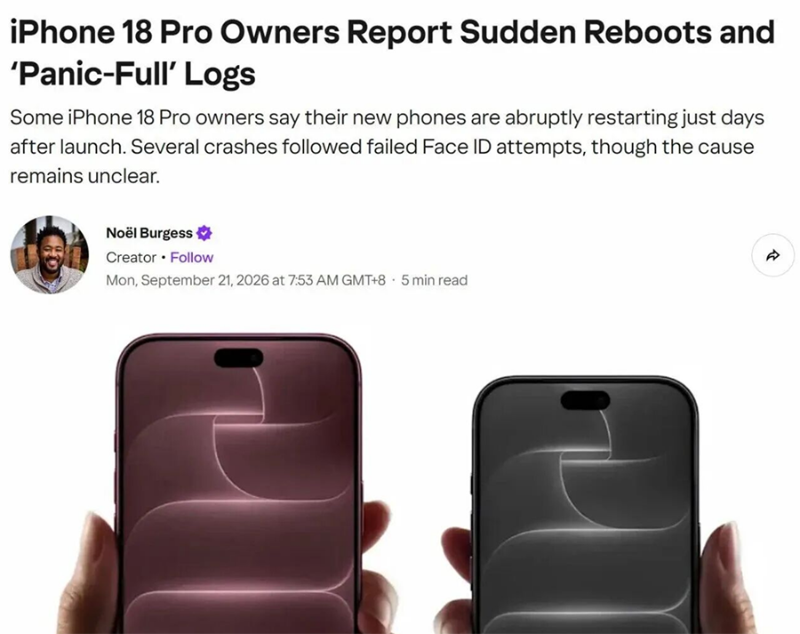
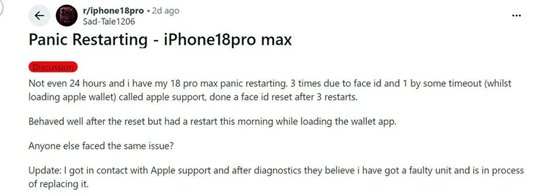
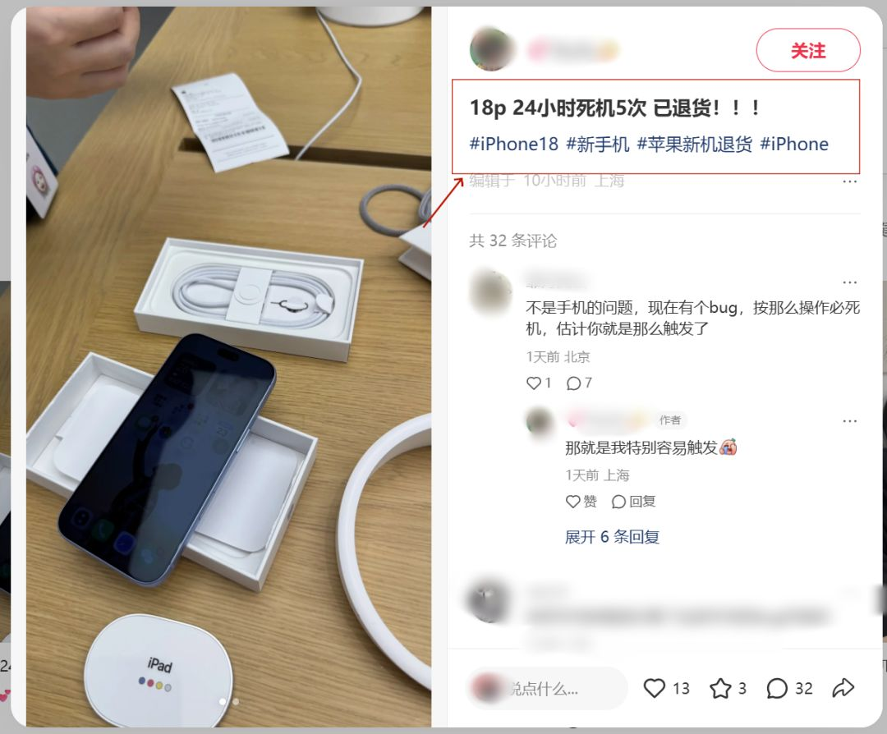

## 怎么看待 iPhone 18 Pro「24 小时死机 5 次」？先说我的三个追问

先给结论：**目前行业主流判断这不是硬件坏了，而是 iOS 27 系统层的软件 Bug，触发点大概率在 Face ID 反复认证失败上，等后续小版本更新修复的概率很大。**

这个问题之所以值得认真答，是因为问的是「可能是什么原因」。但要回答「可能」，得先把几件事问清楚。

---

**第一个追问：「死机 5 次」到底是一种什么级别的故障？**

很多人对手机重启没概念，觉得重启一下没什么大不了。但 iPhone 日志里的这个词值得较真：Panic Full。它指的是**内核 panic 触发的保护性强制重启**——系统内核遇到无法恢复的错误，主动强制重启保命，日志在 设置-隐私与安全性-分析与改进-分析数据 里，panic-full 开头（[新浪科技解释](https://www.sina.cn/gc/article/nispiqi1089543.html)）。



*图源：CNET 对 iPhone 18 Pro 重启故障的报道截图*

它和普通「卡顿后自动重启」的区别在于，这是**系统自己判定「我不重启就要出大事」**。银行 App 付款、Apple Wallet 刷卡、相册最近删除——这几个场景的共同点是都需要 Face ID 高强度认证。大量报告指向一个模式：认证失败一次、再试一次、又失败，循环几次后机器直接黑屏重启。

这其实解释了为什么看视频、听音乐、开手电筒这些和 Face ID 完全无关的场景也有零星个案。机制猜想是 Face ID 子系统反复返回异常状态，把内核拖进死循环；无关场景的个案可能是别的触发路径，也可能是同一问题的非典型表现。**这部分目前没有任何官方确认，只能算合理推测。**


*图源：爱思助手，Face ID 循环认证触发重启的机理示意*

---

**插一段：日志里到底能看到什么？**

先交代边界：**截至目前，还没有用户公开过完整的 panicString 全文**，但已经有多个独立来源贴出了日志的关键行，彼此能互相印证。我把能逐字核到的几行挑出来，逐行解读。

有 Reddit 用户在充电时死机后拉了日志，panicString 的核心行逐字是（[原帖](https://www.reddit.com/r/iphone18pro/comments/1wmcfw3/my_iphone_18_pro_shut_down_while_charging_sep/)）：

```
SEP Panic: [elfour panic] exception.c:+
Firmware type: UNKNOWN SEPOS
```

韩国 FMKorea 社区有用户把完整日志拿去分析，backtrace 里出现的驱动名是 `com.apple.driver.AppleSEPManager`（[原帖](https://www.fmkorea.com/index.php?mid=digital&document_srl=10359479014)）。另一位 Reddit 用户拉日志后发现的结构更有意思：**第一天两个 panic，第一个是打开 Face ID 锁定 App 时的 SEP panic，第二个是锁屏无线充电时的 SMC panic**（[apple-hacks 转引](https://www.apple-hacks.com/entry/iphone-18-pro-face-id-reboot-ios27)）。

这几行日志能读出三层信息。

**第一层，SEP 三个字就是重点。** SEP（Secure Enclave，安全隔区）是 iPhone 里独立于主处理器的安全芯片，Face ID 的面部匹配正是在 SEP 上完成的——你的面部数据主系统根本碰不到。所以 SEP panic 的含义很直白：**连负责最核心安全认证的「保险柜」自己都崩了**，而不是某个普通 App 闪退。

**第二层，`Firmware type: UNKNOWN SEPOS` 说明主系统读回来的 SEP 固件状态是「未知」。** 翻译一下，就是主处理器和安全芯片之间的状态查询出了问题，iOS 不知道 SEP 那边发生了什么。而 backtrace 指向 `AppleSEPManager`——这是 iOS 里负责主系统和 SEP 通信的内核驱动——说明崩溃是沿着这条通信链路上报的。

**第三层，是个结构性观察。** 2024 年 iPhone 16 那波 Panic Full，Apple 支持社区里有用户贴了完整日志（[原帖全文](https://discussions.apple.com/thread/255780047)），当时的 panicString 指向的是 AOP（常开处理器）固件侧的 `AOP PREFETCH ABORT`；这一次指向的是 SEP。**两次的共同点都是「主 CPU 之外的协处理器 panic」**，都是发售初期集中爆发，最后 iPhone 16 那次靠 iOS 18.1 修复。

把日志和触发场景拼在一起，目前的合理推测是：SEP 固件与 iOS 27 的驱动在「Face ID 认证失败→重试」这条路径上存在兼容性缺陷，反复失败的认证请求把 SEP 打进异常态。**这是推测不是结论**——但比起「硬件批量翻车」，「固件层的兼容性 Bug」能更好地解释为什么媒体可以稳定复现、为什么故障集中在同一条触发路径上，以及为什么和 iPhone 16 的剧本这么像。

---

**第二个追问：为什么看着像「系统 Bug 复发」，而不是「新硬件翻车」？**

因为这一幕**前年 iPhone 16 发售时上演过几乎完全相同的剧本**。2024 年 10 月，部分 iPhone 16 / 16 Pro 用户报告手机每天意外重启 10 到 20 次，触发场景同样是 Face ID 相关认证。然后苹果在 iOS 18.1 的更新说明里明确写了一行字：**「修复 iPhone 16 或 iPhone 16 Pro 机型可能意外重启的问题」**（[MacRumors](https://www.macrumors.com/2024/10/21/ios-18-1-fixes-random-restart-bug-iphone-16/) 、[AppleInsider](https://appleinsider.com/articles/24/10/22/iphone-16-pro-restart-bug-is-fixed-in-ios-181)）。

两年时间，同一类问题，同一个触发特征，同样是发售初期集中爆发。

这次的传播面也确实大：韩国会员约 241 万的 Asamo 社区、小红书、Reddit 上到处都是 Panic Restarting 的帖子，ZUYONI 频道做了独立复现，9to5Mac 还在欧版 iPhone 18 Pro 上复现了 Face ID 异常（[IT之家转引](https://www.ithome.com/1/005/491.htm)）。



*图源：Reddit 用户发帖，爱思助手转引*

跨地区、跨渠道、可被媒体复现，这就不像个别用户的机器坏了。

另外有个细节值得说：**发布前一直传闻 Face ID 屏下化、灵动岛缩小，于是故障刚爆出时很多人直接归因到「新硬件不成熟」。但目前这只是猜测**——9to5Mac 复现的是 Face ID 软件层异常，不等同于传感器或结构光模块本身有缺陷。把锅甩给「新形态硬件」证据不足，软件 Bug 的证据链反而更完整。


*图源：9to5Mac，Apple Pay 认证与灵动岛相关异常场景*

那到底要等多久？这是目前唯一没有答案的部分。**截至 9 月 23 日，苹果没有发布任何修复补丁**，韩国方面的回应是「正在了解情况」（[腾讯新闻](https://news.qq.com/rain/a/20260920A0784O00)）；国内客服口径是「极少数情况、工程师检测优化中」，官方渠道购机 14 天内可无条件退换（[新浪科技](https://k.sina.com.cn/article_7879996429_1d5af340d06801e96a.html)）。媒体普遍预测修复会落在下一个 iOS 27.x 小版本里（[快科技](https://news.mydrivers.com/1/1152/1152937.htm)），但没有给出时间承诺。着急用的人可以退换，愿意等的可以观望一两周。

顺带提一句铝合金外壳掉漆的吐槽。有杭州经销商说上一代 iPhone 17 Pro Max 就有类似问题，激活后非官方渠道不换机，建议激活前先验机（[澎湃新闻](https://www.thepaper.cn/newsDetail_forward_34121930)）。这个和死机是两码事，但同样属于「发售第一周最该检查的清单」。

---

**第三个追问：「你遇到过吗」？**

老实说，我没有亲历过 iPhone 18 Pro 的这次故障，手上这台也没有出现过 Panic Full 日志。

但我可以说两件事。第一，把公开报告里的中招案例摆在一起，共同点基本落在「发售第一时间入手、Face ID 高频使用」上——银行、支付、相册最近删除，全是认证强度最高的场景。第二，从 iPhone 16 那次的经验看，这类风波的生命周期就是一次系统更新——iOS 18.1 推送后，国内媒体直接用了「终结重启噩梦」的标题（[新浪财经](https://finance.sina.com.cn/roll/2024-10-24/doc-inctrcmi6130004.shtml)）。

所以**如果你正拿着一台频繁重启的 iPhone 18 Pro，我个人更倾向的建议是：14 天退换期内别犹豫，该退退、该换换；过了退换期就等 iOS 27 的修复版本，同时把 panic-full 日志备份好**。既不用恐慌到「苹果药丸」，也不用替它辩护「个别现象」——它就是一次典型的系统层 Bug，证据链、前科、复现记录都摆在那儿。



*图源：小红书用户发帖（已退货），观察者网转引*

**说到底，判断一次 iPhone 故障该怕什么、不该怕什么，最简单的办法是回看两年前的同款剧本——软件 Bug 会被修复，硬件缺陷不会自己变好，而目前所有证据都指向前者。**

---

后续我会写 iPhone 18 Pro 上市后的全系质量追踪报告，把涨价、破发、首发故障这些线串起来看，关注我不迷路。
