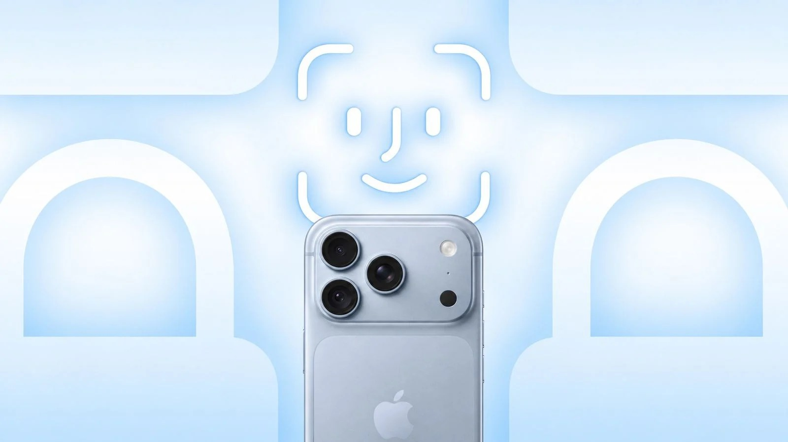
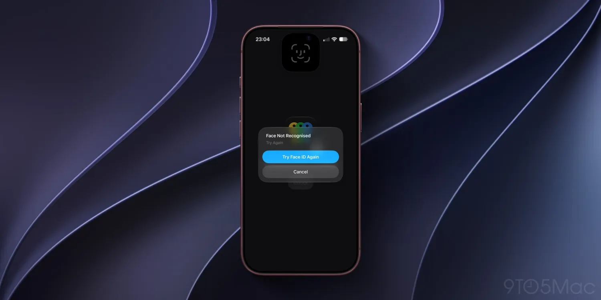
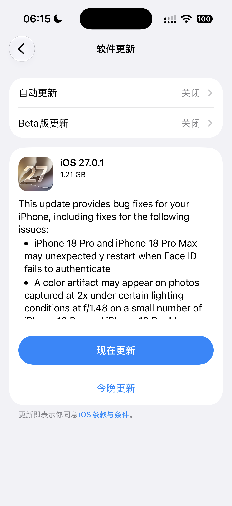
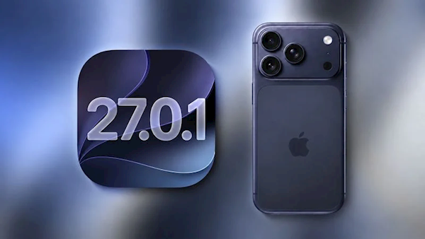

## iPhone 18 Pro 刷脸后卡死重启，最可能的答案不在硬件上：Face ID 漏洞归因与排查清单

（2026-10-07 整理，事件已完结：9 月 29 日苹果已推送修复）

先说结论：**这事的官方定性已经落地——苹果确认是 iOS 27 系统层的软件 Bug，不是 Face ID 面容组件的硬件缺陷，根因指向面容识别深度图谱处理算法的内存分配错误，9 月 29 日的 iOS 27.0.1 已经把它修掉了。**<!-- 判断句 --> 所以如果你的机器升级后还卡死，那才轮到怀疑硬件。

先给不看数码新闻的朋友补一句背景。Face ID 就是 iPhone 的刷脸解锁，靠屏幕刘海里那套红外摄像头和点阵投影器工作。这次出问题的是 iPhone 18 Pro 和 18 Pro Max，别家机型不涉及。

---

一个挺让人哭笑不得的细节：Bug 刚爆出那几天，**真有用户以为是机器坏了，跑去苹果门店换了新机**（[IT之家 9 月 24 日报道](https://www.ithome.com/1/006/796.htm)）——换了也没用，因为问题根本不在那台机器上。这就是软件 Bug 最坑人的地方，症状长得跟硬件故障一模一样。

把时间线捋一遍，归因就清楚了。

9 月 18 日首发，首批用户很快集中反馈一个诡异现象：**刷脸认证失败之后，手机直接卡死，几秒后黑屏、出苹果 logo、自动重启**，正在聊的微信、付到一半的款、拍了一半的照全部清零。高发场景高度一致——暗光环境、手机拿歪了的角度、认证失败后反复重试。9to5Mac 在内多家媒体做了独立复现（[IT之家 9 月 22 日报道](https://www.ithome.com/1/005/491.htm)）。

*图源：IT之家，iPhone 18 Pro 首批用户 Face ID 故障报道配图*

*图源：9to5Mac 复现截图，Face ID 认证失败后重试界面，IT之家转引*

9 月 26 日苹果正式确认漏洞存在（[凤凰网科技](https://tech.ifeng.com/c/8wj6N3jN77o)）；9 月 28 日客服给出明确口径：问题出在系统软件方面，与硬件无关，工程团队已复现，**根因是面容识别传感器深度图谱处理算法的内存分配错误**（[新浪财经](https://k.sina.com.cn/article_7879995964_1d5af323c068016w46.html?from=digit)）。用人话说，就是新系统处理你脸部三维数据的那段代码，分配内存时算错了账，把系统自己憋死了。

这里可以回答题主的核心问题了：**iOS 系统、Face ID 组件还是其他？按现有证据，答案是 iOS 系统层，而且是「系统与 Face ID 交互」的那一段，不是面容模组本身。**<!-- 判断句 --> 支撑这个判断的三条证据：官方工程团队已复现并定性软件问题；跨地区跨批次可复现，硬件缺陷不会这么整齐；软件补丁推送后问题终止。

还有一个很多人关心的点：刷脸数据安不安全？苹果的口径是，面容数据存在手机里的独立安全芯片上，这个 Bug 不涉及生物识别数据泄露，也不影响保修（[新浪科技](https://k.sina.com.cn/article_7879848900_1d5acf3c406803bkn0.html?from=tech)）。

---

9 月 29 日，iOS 27.0.1（版本号 24A446，更新包约 1.21GB）推送，苹果官方更新说明白纸黑字列了第一条修复项：**iPhone 18 Pro 和 Pro Max 可能在 Face ID 认证失败时意外重启**（[快科技](https://news.mydrivers.com/1/1154/1154516.htm)、[太平洋电脑网](https://news.pconline.com.cn/2182/21829525.html)）。顺带它还修了两个首发 Bug：相机在 f/1.48 光圈 2 倍变焦下的色彩伪影，和同时拉出通知中心与控制中心时的屏幕卡死。

*图源：快科技，iOS 27.0.1 官方更新说明截图，首条即 Face ID 认证失败意外重启修复*

*图源：快科技，iOS 27.0.1 与 iPhone 18 Pro 报道配图*

---

最后回应题主的第三问：**要排查的话，先收集哪些信息。** 这个分两种情况。

如果你还没升级 iOS 27.0.1，别折腾排查了，先去设置-通用-软件更新把系统更了，这事已经结束了。<!-- 判断句 --> 想留证据的话，更新前把卡死发生的场景记下来：当时是不是暗光、手机角度、认证失败后重试了几次、卡死前在用什么 App——这几项是这个 Bug 最典型的高频触发条件，记下来方便对照修复后是否复发。

如果升级之后还卡死，才轮到正经排查，按顺序收集四样：

第一，**系统版本号**（设置-通用-关于本机），确认真的升到了 27.0.1 或更高。

第二，**崩溃日志**。路径是 设置-隐私与安全性-分析与改进-分析数据，找 panic-full 开头的文件，看崩溃时间是否对应你卡死的时刻。有个心理准备：日志里的技术细节（SEP panic 之类）是系统深层报错代码，自己看不懂很正常，拍下来交给苹果支持或天才吧，他们看得懂。

第三，**能否稳定复现**。固定一个操作路径（比如暗光下连续三次刷脸失败），如果能稳定触发，保修沟通效率高得多。

第四，**备份**。排查期间先把重要数据备份到 iCloud 或电脑，这是任何时候排查重启类问题的第一原则。

我的建议是：修复已经推送、官方已定性，普通用户走到「升级系统」这一步就够了，后面三步是给升级后仍中招的极少数人准备的。<!-- 判断句 --> 真走到那一步，拿着日志和复现路径去官方渠道，14 天退换期内该退退该换换，不用替苹果省这个钱。

我在持续跟踪 iPhone 18 全系上市后的质量表现，Face ID 这关算是过去了，接下来还有别的线索，关注我不迷路。
