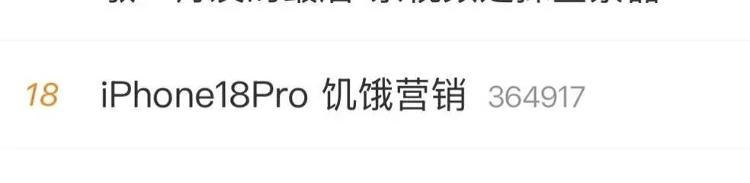
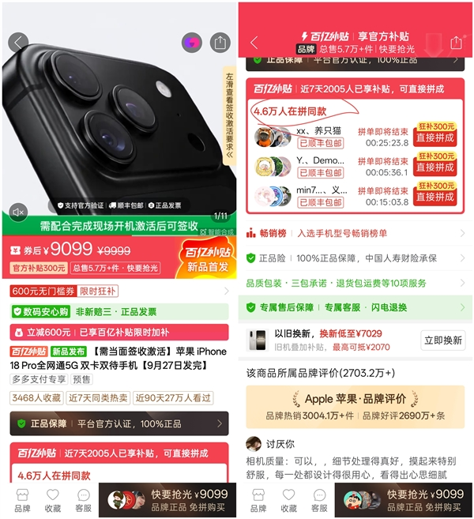
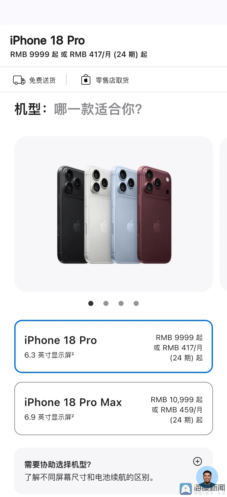
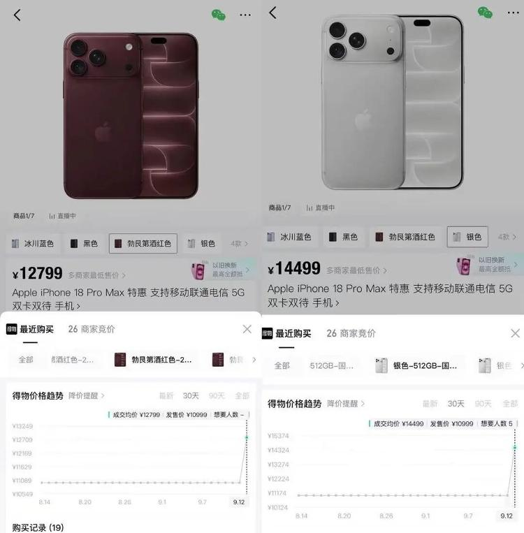
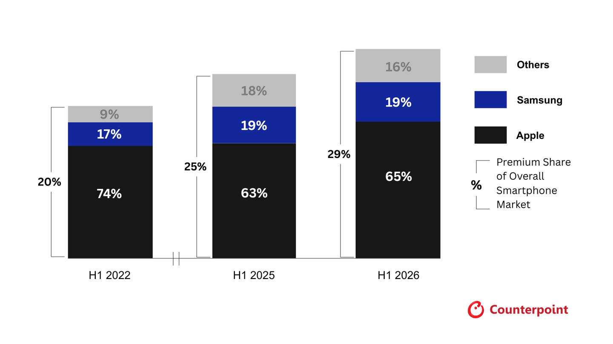
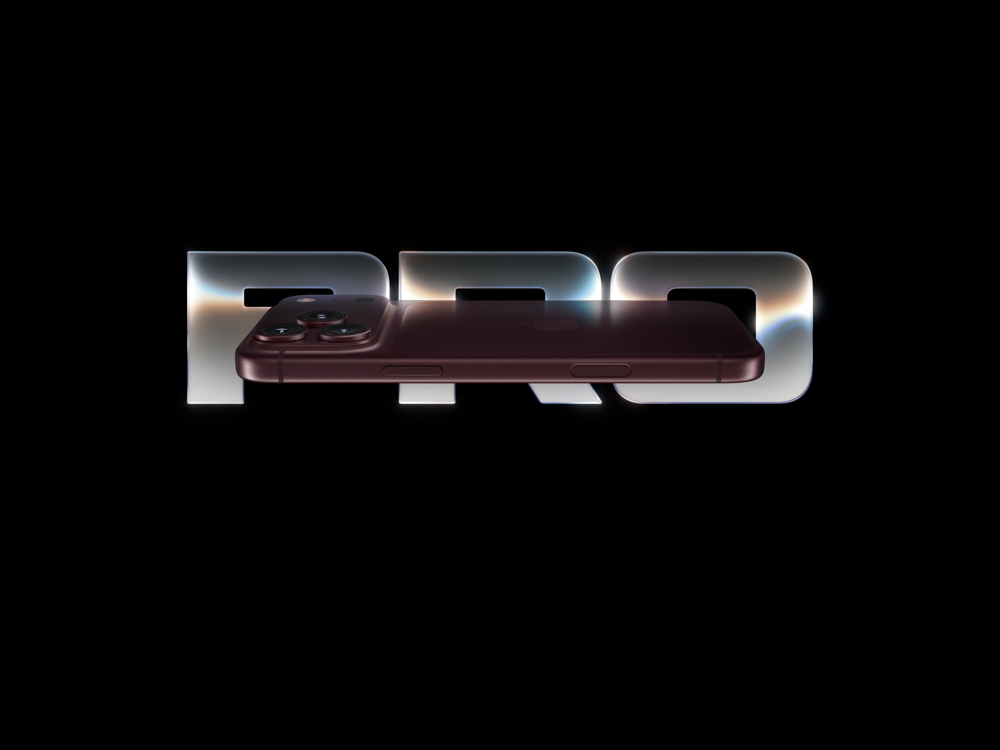

# iPhone 18 Pro 上市即「破发」，苹果回应称正常，这反映了高端手机市场哪些变化？

9 月 12 日预售当晚，两个热搜同时挂在榜上。一个说 iPhone 18 Pro 破发，拼多多比官网便宜 900 块；另一个说 iPhone 18 Pro 转手就能加价 3000 块。

同一台手机，一边在跌，一边在涨。这俩热搜其实都没撒谎，它们拼在一起，才是这次破发的完整真相。

先补一个标题里没写全的细节。**「苹果回应称正常」这句话，苹果自己的原话里并没有「正常」二字。** 9 月 14 日对中新经纬作出回应的是苹果官方客服，原话是「第三方渠道有自己的定价权，他们可能有平台补贴或者店铺优惠，苹果官方不会去干预」（中新经纬，[36氪 9/14 快讯](https://www.36kr.com/newsflashes/3983179794316040)）。这个回应出自客服，够不上官方声明的规格。「正常」两个字，是媒体替苹果总结的。

_图源：大众网·极目新闻（封面新闻供稿）_

## 破发的那 900 块，来自平台补贴

把 9099 元拆开看就清楚了。拼多多这个价由两部分构成：平台官方补贴 300 元，加 600 元店铺券。而且该平台要求现场签收、拆封激活后不支持 7 天无理由退货（[深圳商报，腾讯新闻转载](https://view.inews.qq.com/a/20260914A0D53Y00)）。

再看其他地方。**京东自营和淘宝 Apple 官方旗舰店全程保持原价**，官方渠道唯一的让步是限时 24 期免息（[搜狐新闻时间线](https://timeline.sohu.com/news/7jlITIzC4A)）。也就是说，苹果的价格体系纹丝没动，动的是电商平台拿自己的补贴往里头砸。拼多多用一台亏几百块的旗舰机换流量，这笔账平台自己会算。

_图源：快科技_

_图源：海报新闻（截苹果官网）_

而且破发集中在 Pro 标准版。拼多多上 512GB 版只比官网低 300 元，力度明显收敛（[同花顺财经](https://m.10jqka.com.cn/20260915/c679917372.shtml)）。

## 加价 3000，买的只是首批货源的时间差

「转手加价 3000」这个价，出自得物。9 月 12 日预售开启后，Pro Max 256GB 银色成交均价冲到 13999 元，较官网 10999 元正好涨 3000（[澎湃新闻当晚调查](https://finance.sina.cn/2026-09-12/detail-inirqwer1081407.d.html)，经新浪财经转载）。

注意两个限定。第一，涨 3000 的只有 Pro Max 256GB 银色这一个配置，其它规格差得远。第二，这个时间差维持了一周不到。到 9 月 18 日首销日，黄牛回收 Pro Max 的加价已经缩到 300-500 元，卖出加价 700-800 元，还伴随「黄牛吐槽没人收」「一天一个价」的话题（[大众网](https://hb.dzwww.com/p/pc1xu0d3if.html)、[每经](https://www.36kr.com/p/3988310431824647)）。得物酒红色成交均价从预售首日的 13888 元跌到首销日的 11829 元，七天回落 2059 元。

_图源：大众网·极目新闻_

黄牛自己的话说得很直白：敢炒，但不敢压货。他们赚的是首批货源的几天时间差，赌的是有人愿意为「第一个星期拿到手」付几千块。这拨人年年有，今年散得格外快。

## 真实热度：比去年弱，但离滞销很远

几个交叉信号可以拼出需求的轮廓。

官网发货周期是个硬指标。截至 9 月 17 日，iPhone 18 Pro 部分版本约 11 个工作日发货，Pro Max 约 15 个工作日。去年同期 iPhone 17 Pro 的同期数字是 3 到 4 周（[每经](https://www.36kr.com/p/3988310431824647)）。广发证券分析师 Jeff Pu 的判断也摆在这：从预售交付周期看，18 Pro 初期需求相对平淡，硬件升级有限叠加售价更高是原因。

但另一组数字也不能装作看不见。京东新品预约量破 700 万，首批 Pro 预售不到 1 分钟售罄（[财新](https://www.caixin.com/2026-09-15/102485175.html)）；淘宝闪购预售首小时销售额较 iPhone 17 Pro 同期翻倍（[东方财富](http://wap.eastmoney.com/a/202609133872835910.html)）。

我的解读是：**抢购的热情还在，但抢着「第一时间拥有」的执念在退潮。** 愿意原价等两三周的人变多了，愿意为几天时间差付几千块的人变少了。对一台手机来说，这是市场回归理性的信号，谈不上遇冷。

## 往大了看，这场破发反映了高端手机市场的三个变化

**第一，高端机还在扩容，但苹果的份额在被华为持续啃食。** Counterpoint 的数据显示，2026 年上半年全球高端机（600 美元以上）销量占比冲到 29%，创历史新高；苹果仍占高端的 65%，但这个数字在 2022 年上半年是 74%，下滑的主因就是中国市场华为的竞争加剧（[Counterpoint](https://counterpointresearch.com/cn/insights/premium-smartphone-share-in-overall-market-hits-h1-record-29-percent-apple-and-samsung-lead)）。回头看，2025Q4 苹果曾以 22% 份额领跑中国、出货量同比涨 28%，靠的是 iPhone 17 系列的诚意；到 2026Q1，华为以 20% 登顶，苹果虽然还在增长，但第一的位置已经让出来了（[21经济网](https://www.21jingji.com/article/20260123/herald/d2373ab4e29326c14f9d9b52419f62e0.html)、[虎嗅转 Counterpoint](https://www.huxiu.com/moment/1236992.html)）。

_图源：IT之家（转 Counterpoint）_

**第二，存储涨价周期把「官方涨价 + 渠道松动」这套组合拳变成了行业常态。** TrendForce 的数据是，受存储器超级上行周期影响，Pro 256GB 机型 2026Q3 的存储成本同比增加近 400%（[每经](https://www.36kr.com/p/3988310431824647)）。所以苹果今年直接把 Pro 起售价定到 9999 元，较上代涨 1000 元起（[澎湃新闻](https://finance.sina.cn/2026-09-12/detail-inirqwer1081407.d.html)），顶配冲到 20499 元，最高涨幅 3500 元（[IT之家](https://www.ithome.com/1/003/872.htm)）。定价越激进，渠道价松动的空间就越大。苹果连续三年「上市即破发」（[新湖南](https://m.voc.com.cn/xhn/news/202609/33753190.html)），往后看，这会成为一年一度的固定节目，没什么新闻价值。

**第三，定价权正在从品牌向平台补贴部分转移。** 官网和京东自营死守 9999 元维持价格锚点，拼多多用补贴击穿底价抢流量，两边都不亏，亏的是「首发必溢价」的旧剧本。以后买旗舰机，答案会越来越像：官网买图省心，平台买等补贴，首发抢的只有黄牛的时间差。

一句话总结：**这轮破发，电商平台出了补贴，黄牛赚了时间差，苹果的价格体系纹丝没动；真正的变化在于，高端手机的定价权，正从发布会的 PPT 滑向电商平台的补贴会场。**

*后续我会跟进 iPhone 18 Pro 的渠道价格走势和双 11 行情预测，关注我不迷路。*

_图源：Apple 官网_
