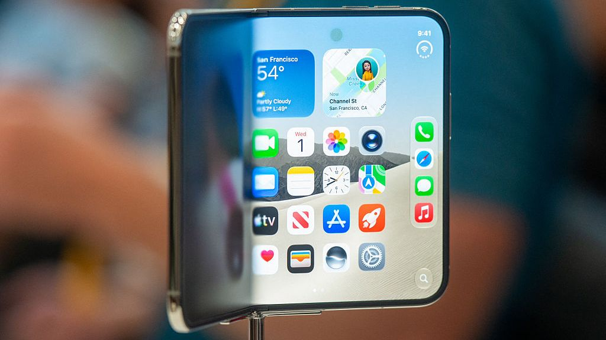
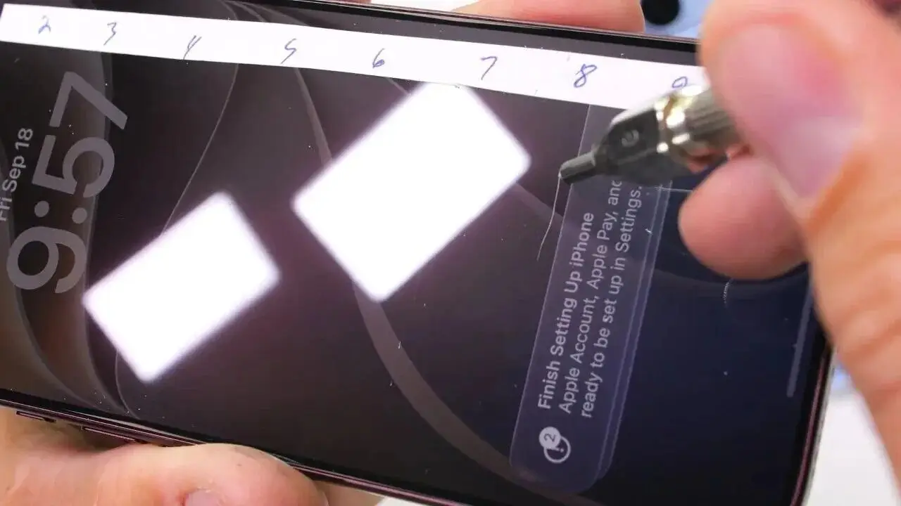
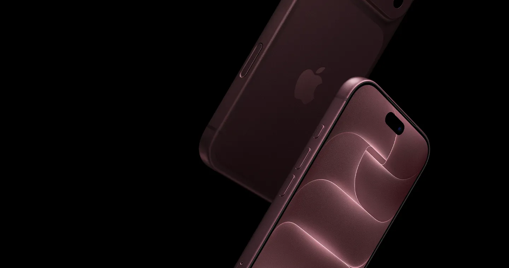
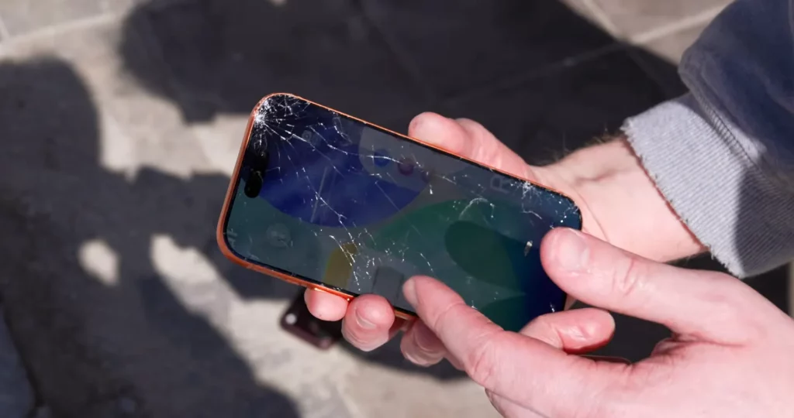
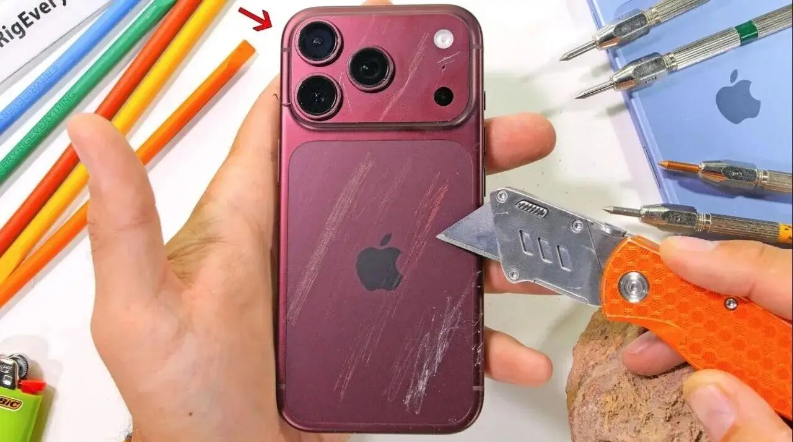

# 苹果高管称 iPhone 无需贴膜、实验室抗刮是上代 3 倍，为什么放到日常使用就不一样？

三倍抗刮这四个字，每个字都是真的，但连在一起用，就不一定是用户想的意思了。

先把话说透：iPhone 18 Pro 这代玻璃在实验室里确实更抗刮了，可实验室没法替你过日子——裤兜里有钥匙，沙滩上有沙子，包里塞着杂物，这些场景它都模拟不了。**官方说的 3 倍是抗刮，不是耐摔，更不是防划——这三个词在材料学上是三笔账。**

*图源：TechRadar*

## 「3 倍」之前，先说一个被换掉的词

先回看一条时间线，答案其实藏在里面。

2020 年第一代超瓷晶面板随 iPhone 12 登场，苹果当时的宣传口径是**抗跌落能力提升 4 倍**，翻来覆去讲的都是抗摔。五年过去，2025 年 9 月 9 日超瓷晶面板 2 随 iPhone 17 首发，官方口径变成了**抗刮能力提升 3 倍**——耐摔一个字都不提了（[Apple 官网 iPhone 17 页面](https://www.apple.com/iphone-17/)；[The Mac Observer 对超瓷晶面板 2 的解读](https://www.macobserver.com/tips/round-ups/iphone-18-pro-ceramic-shield-2-explained/)）。

同一个位置的宣传词，从「摔」换成「刮」，这不是随口的事。

材料学上抗刮和耐摔确实很难兼得：玻璃想抗刮就得做硬，想耐摔就得做韧，硬和韧是一对冤家，顾了一头就得松另一头。苹果硬件副总裁 Tom Marieb 在伦敦群访里说得很直白，团队做的是「在抗刮与耐磨之间的折中」，用加速老化测试在几周内模拟约五年的日常磨损（[NDTV 报道](https://www.ndtv.com/feature/apple-top-executive-doesnt-want-you-to-use-screen-protector-on-iphone-it-makes-my-skin-crawl-12069046)；[TechRadar 原文](https://www.techradar.com/phones/iphone/i-spoke-to-apples-new-vp-of-hardware-engineering-about-why-hes-especially-proud-of-the-iphone-duos-hinge-durability-and-the-reliability-of-ceramic-shield-2-when-i-see-someone-put-a-screen-protector-on-their-iphone-it-makes-my-skin-crawl)）。

所以「3 倍抗刮」落到日常语境里是什么意思？表面硬度确实比上代强了，但耐不耐摔，苹果一个字都没承诺。

## 实验室里，它确实赢麻了

有一说一，这一代玻璃的成绩单是实打实的。

JerryRigEverything 拿莫氏硬度笔去划 iPhone 17 的屏幕，划到 7 级才出现轻微划痕，而普通玻璃 5 到 6 级就花了，他的评价是 best we've ever seen，他测过最好的一块（[经 Daring Fireball 转引 Tom's Guide 报道](https://daringfireball.net/linked/2026/08/13/ceramic-shield-2-is-the-real-deal)）。钥匙、硬币的莫氏硬度只有 3.5 到 5.5，平时在口袋里跟屏幕蹭来蹭去，确实已经划不动了。

*图源：JerryRigEverything*

iPhone 18 Pro 的暴力测试也印证了这一点：美工刀和钥匙在正面上划不动，只有瓷砖能留下细微划痕，徒手也掰不弯（[mobidevices 转述 JerryRigEverything 测试](https://mobidevices.com/en/iphone-18-pro-durability-test)）。正面是超瓷晶面板 2，成绩漂亮。

**也就是说，在实验室能模拟的场景里，官方没有吹牛，第三方复现的结果甚至比宣传还好。**

*图源：Apple 官网*

## 问题出在：日常不是实验室

那用户的划痕是哪来的？来自三样实验室里很难摆上台面的东西。

**第一样是石英，莫氏硬度 7。** 玻璃硬度大约在 5.5 到 6.5，你遇到的沙子、粉尘、水泥碎屑，主要成分就是石英。一粒沙子混进裤兜，坐下时往屏幕上一压，就是一次货真价实的划痕测试。实验室的加速老化用的是可控磨料，日常口袋里混进来的是不可控矿物，这一下 3 倍抗刮就被拉回到同一水平线了——你不是在跟硬度 5 的钥匙较劲，是在跟硬度 7 的沙子较劲。

**第二样是疏油层，它不在「抗刮」的统计口径里。** 这层让手指顺滑不粘指纹的涂层，正常裸用半年到两年就会磨掉，之后屏幕发涩、爱沾指纹，手感一落千丈（[新浪财经专栏的梳理](https://cj.sina.com.cn/articles/view/7879848900/1d5acf3c4068030h4q)）。很多人以为自己的膜是替屏幕挡刀，其实是替疏油层当了耗材——膜磨花了撕了重贴，疏油层磨没了可没人给你重新镀。

**第三样最直白，跌落。** 正面超瓷晶面板 2 再硬，强力跌落该碎还是碎，iPhone 18 Pro 的跌落测试里正面玻璃照样碎成蛛网，铝金属中框也磕得满是痕迹（[mobidevices 测试转述](https://mobidevices.com/en/iphone-18-pro-durability-test)）。而背板用的是第一代超瓷晶面板——已经有 Reddit 用户晒出背板被细砂刮花的照片（[r/iphone18pro 用户反馈](https://www.reddit.com/r/iphone18pro/comments/1wkm186/already_scratched_it/)）。正面 3 倍，背面不在三倍之内。

*图源：AppleTrack*

*图源：JerryRigEverything*

## 所以贴不贴膜，其实是一笔很简单的账

把账摆平就清楚了。iPhone 18 Pro 在美国保外换屏约 379 美元（[ZEERA 整理的维修报价](https://zeerawireless.com/blogs/news/does-iphone-18-pro-need-screen-protector)），一张合格的膜几十块人民币。

玻璃硬度的进步是真的，值得肯定，它消灭了钥匙硬币这类划痕。但膜真正要挡的从来不是钥匙，是沙粒、疏油层磨损和那一次手滑的跌落——**这三样恰好都不在「3 倍抗刮」的承诺范围里。**

所以答案就一句话：实验室的 3 倍，是在抗刮这个单项上替你扛住了低硬度的对手；日常的不一样，是因为你真正的对手是石英、是涂层寿命、是地心引力，而这三项，苹果一个数字都没敢给。

贴不贴膜从来不是信不信苹果的问题，是愿不愿用几十块给几个没承诺的变量上保险的问题。

后续我会写 iPhone 18 Pro 背板为什么还在用一代超瓷晶、以及换屏成本与 AppleCare 怎么选的细算，关注我不迷路。

*（本文数据截至 2026-09-23；3 倍抗刮为官方与第三方实测口径，耐摔倍数官方未公布，文中涉及保外价格以美国地区报价为准。）*
