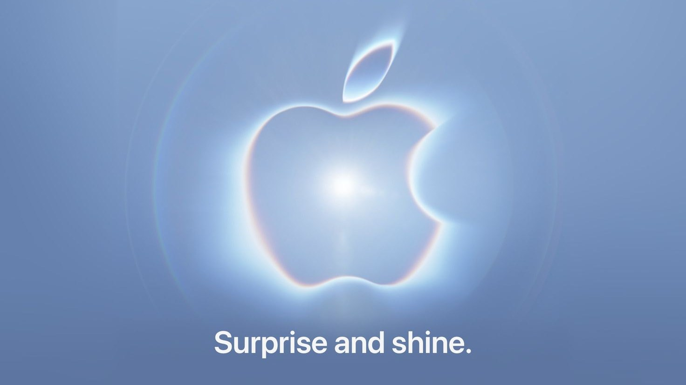
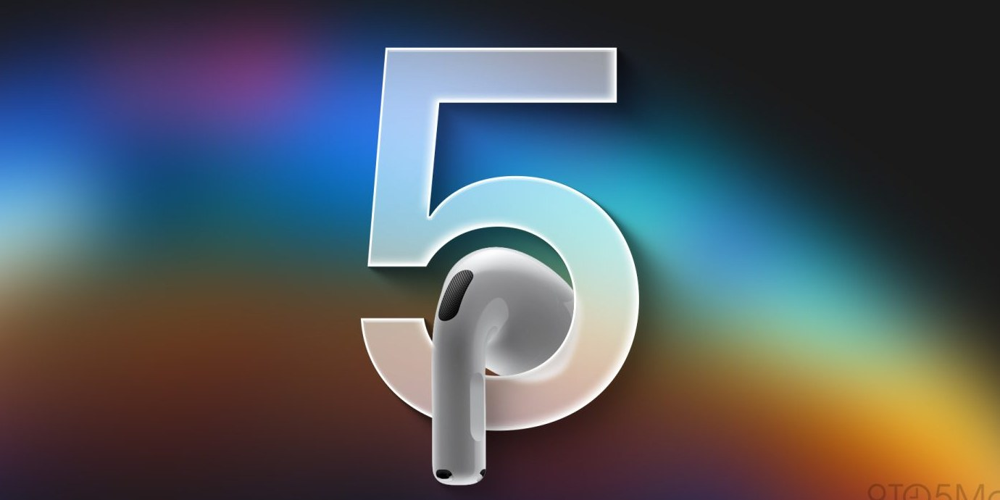
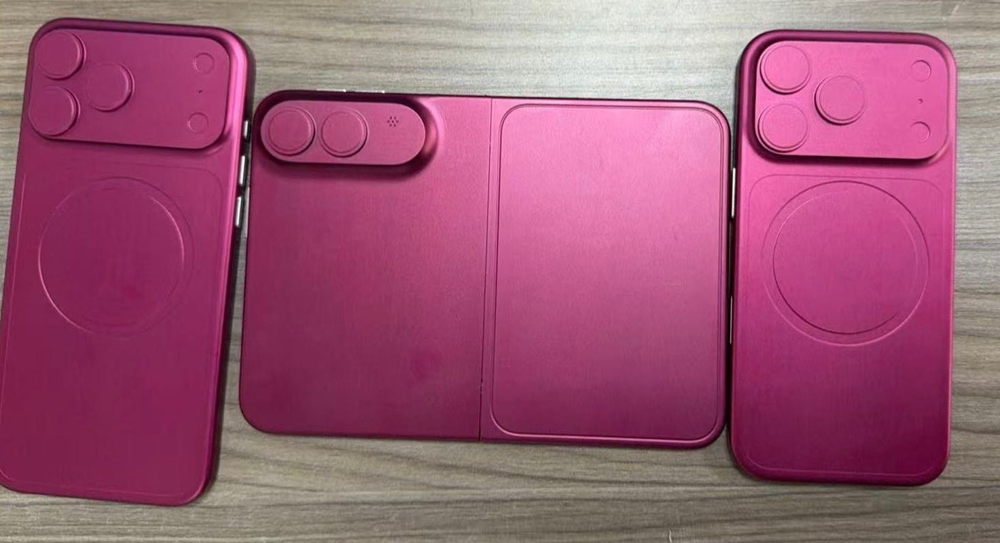
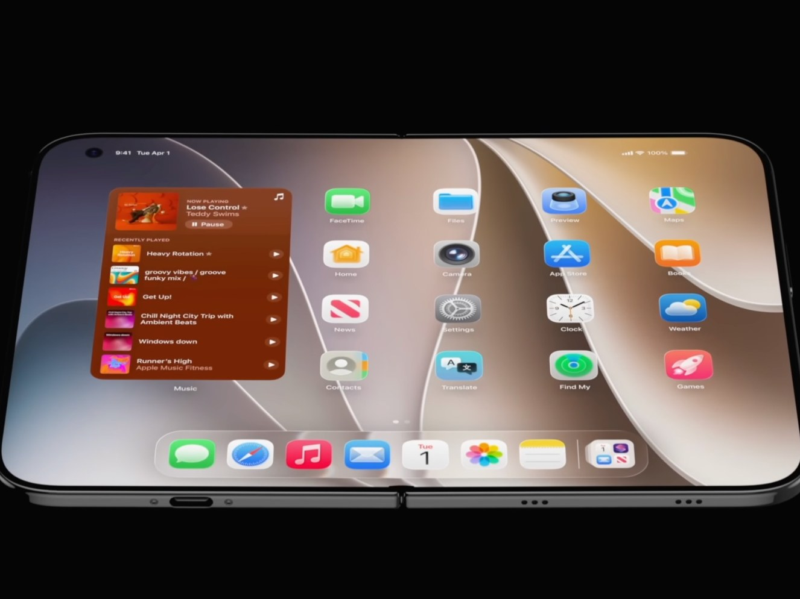
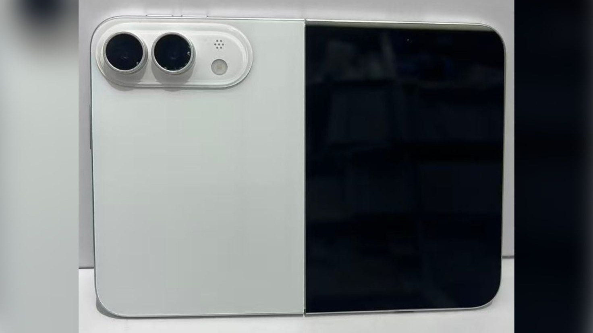
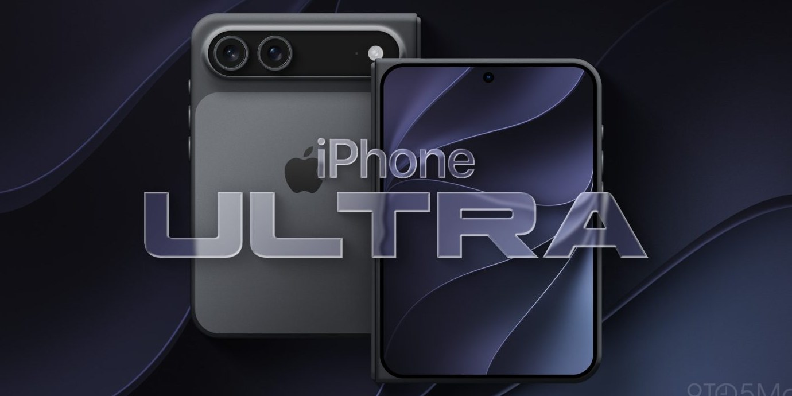
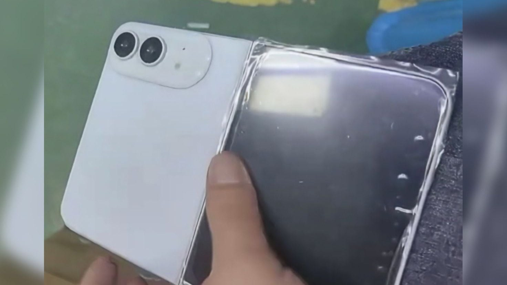
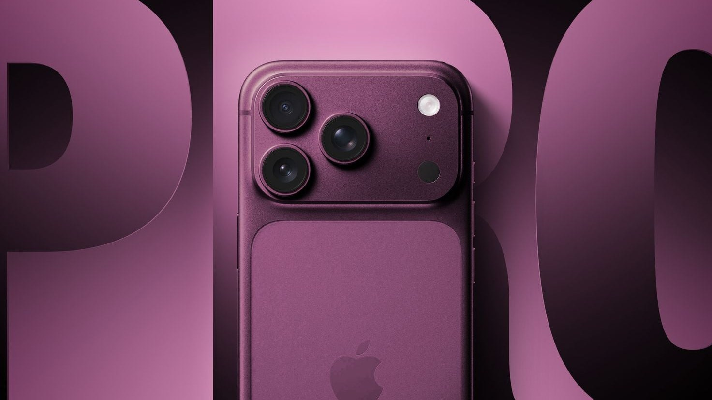
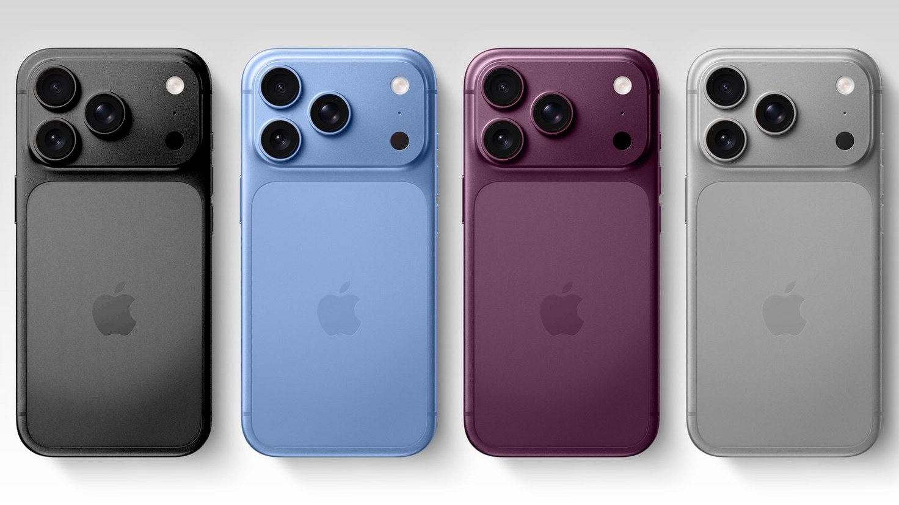
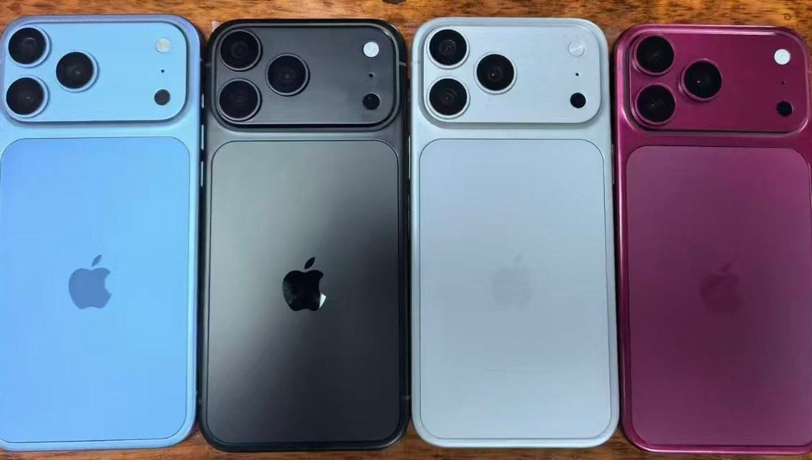

# 2026苹果秋季发布会看点预测：iPhone Duo折叠屏、iPhone 18 Pro涨价，27条清单一文看懂

北京时间9月10日凌晨1点，苹果将举行2026年秋季新品发布会。本文把目前所有靠谱爆料整理成一份27条预测清单：首款折叠屏iPhone大概率定名iPhone Duo，预计1.3万元起售、10月上市；iPhone 18 Pro系列涨价并新增暗樱桃红配色；标准版iPhone 18今晚不会发布。发布会结束后，可以拿这份清单逐条核对。

（图源：Apple，苹果2026秋季发布会官方邀请函视觉）

## 2026苹果秋季发布会几点开始？在哪里看直播？

苹果2026年秋季发布会于太平洋时间9月9日上午10点举行，对应**北京时间9月10日凌晨1点**，可以在苹果官网、Apple官方视频账号观看直播。

值得注意的是，这是苹果新任CEO约翰·特努斯（John Ternus）接任库克之后，首次以CEO身份主持发布会。库克执掌苹果15年后退居执行董事长，今晚是一个时代的交接。

## 今晚苹果发布会发布什么新品？

根据彭博社记者马克·古尔曼（Mark Gurman）等多方爆料，今晚的新品阵容预测如下：

- **折叠屏iPhone（iPhone Duo）**：今晚的绝对主角，苹果史上第一款折叠屏手机
- **iPhone 18 Pro / iPhone 18 Pro Max**：常规迭代，但涨价、换新配色
- **Apple Watch Series 12 / Apple Watch Ultra 4**：外观变化不大，主要升级芯片
- **AirPods 5**：可能登场，分降噪版和非降噪版，搭载H3芯片

（图源：9to5Mac，AirPods 5渲染图，或于2026苹果秋季发布会亮相）

**一个反常识的变化：标准版iPhone 18今晚不发布。**苹果把iPhone 18系列拆成了两场发布会，标准版、iPhone 18e和iPhone Air 2要等到2027年春天。今年秋天，苹果只卖贵的。

（图源：Sonny Dickson，折叠iPhone展开后与iPhone 18 Pro系列机模尺寸对比）

## iPhone Duo是什么？苹果折叠屏配置和价格预测

这是今晚最大的悬念，也是爆料最密集的部分。

**命名**：发布会前约12小时，手机壳厂商CASETiFY的配件页面提前泄露了名字——**iPhone Duo**，随后古尔曼确认。此前传了一年的"iPhone Ultra"大概率不会用。Duo意为"双"，对应内外双屏。

（图源：Front Page Tech，折叠iPhone展开后内屏运行iOS的渲染图）

**形态**：书本式折叠，外屏约5.3-5.5英寸，展开后内屏约7.8英寸，比例接近一台可以对折的iPad mini。展开厚度不到4.6毫米，是史上最薄的iPhone。

**价格**：预计256GB版本2000美元起（约合人民币1.3万元），2TB顶配约3000美元（约合人民币2万元）。比之前市场预期的2500美元起步要便宜——据说苹果自己消化了内存涨价的成本。

（图源：Sonny Dickson，折叠iPhone白色机模实拍，后置仅两颗摄像头）

**为了做薄，砍掉了两样东西**：一是Face ID面部解锁，改回侧边Touch ID指纹；二是长焦镜头，后置只有主摄加超广角双摄。一万三的手机没有长焦，这是今晚争议最大的配置取舍。

**配色只有两种**：白色和深蓝色。

（图源：9to5Mac，折叠iPhone深蓝色版本概念渲染）

（图源：MacRumors，折叠iPhone工厂产线实拍，铰链位置贴有保护膜）

**两个值得留意的细节**：一是iPhone Duo可能**支持Apple Pencil**——乔布斯当年公开嘲讽过触控笔，今晚如果成真，会是全场最有戏剧性的时刻；二是折叠屏**今晚发布但要10月才上市**，比Pro系列晚一个月，苹果要吊足胃口。

## iPhone 18 Pro有什么升级？价格会涨吗？

iPhone 18 Pro系列是今晚的第二主角，核心变化预测如下：

- **涨价**：受内存和存储成本上涨影响，Pro系列预计涨价100-300美元，国行对应涨500-2000元
- **新配色**：新增**暗樱桃红**和浅蓝，**取消黑色**——黑色Pro第一次缺席
- **芯片**：A20 Pro芯片，台积电2nm工艺，性能和能效都有明显提升
- **相机**：主摄首次用上**可变光圈**，类似单反相机，夜景进光量和背景虚化会更可控（也可能只有Pro Max独占）
- **续航**：Pro Max电池容量增大，号称史上续航最强的iPhone
- **外观**：整体设计和iPhone 17 Pro基本一致，老款手机壳大概率通用

（图源：MacRumors，iPhone 18 Pro传闻中的暗樱桃红配色）

（图源：MacRumors，按Macworld独家Pantone色号制作的iPhone 18 Pro四色渲染）

（图源：MacRumors，iPhone 18 Pro四色机模实拍，无黑色版本）

## 老iPhone会降价吗？普通消费者怎么买最划算？

每次苹果发布会之后，真正和大多数人钱包相关的其实是这一条：**老款iPhone 17系列会官方降价**。如果不追新，发布会后一周是买旧款的黄金时间。

另外两点购买相关的预测：一是iPhone 18 Pro系列预计9月18日开卖，折叠屏iPhone Duo要等到10月；二是折叠屏首发大概率一机难求，黄牛加价在所难免。

还有一条和国行用户强相关的悬念：**Apple Intelligence中国大陆版**。国行用户等了整整一年，今晚发布会哪怕只提一句"今年晚些时候"，也是一个明确信号。

## 27条预测清单：发布会后逐条核对

最后，把全文压缩成一份可以逐条打勾的预测清单。符号说明：✅表示基本确定，🤔表示存在悬念。

**今晚发布什么**

1. ✅ 折叠屏iPhone正式发布
2. ✅ iPhone 18 Pro / Pro Max正常更新
3. ✅ 标准版iPhone 18不发布，推迟到2027年春
4. ✅ 新款Apple Watch（Series 12 / Ultra 4）
5. 🤔 AirPods 5登场
6. ✅ 新CEO特努斯首次主持，库克不站台

**折叠屏iPhone Duo**

7. 🤔 定名iPhone Duo，不叫Ultra
8. ✅ 展开像小iPad mini，合上是正常手机
9. 🤔 1.3万元起售，2TB顶配约2万
10. ✅ 展开厚度不到4.6mm，史上最薄iPhone
11. 🤔 砍掉Face ID，改回侧边Touch ID
12. 🤔 后置双摄，无长焦
13. 🤔 只有白色和深蓝两种配色
14. 🤔 支持Apple Pencil
15. 🤔 10月才开卖，比Pro晚一个月

**iPhone 18 Pro**

16. ✅ 涨价500-2000元
17. 🤔 新增暗樱桃红，取消黑色
18. ✅ Pro Max成史上续航最强iPhone
19. ✅ 主摄支持可变光圈
20. ✅ 外观基本不变，17 Pro手机壳通用

**和你的钱包相关**

21. ✅ iPhone 17系列官方降价
22. 🤔 折叠屏首发被黄牛加价
23. 🤔 发布会提到国行Apple Intelligence进展

**神预测（爆冷预警）**

24. 🤔 可变光圈为Pro Max独占
25. 🤔 暗樱桃红成为本季"一眼新款"话题色
26. ✅ 全程大讲AI，但Siri继续画饼
27. 🤔 Apple Pencil写进折叠屏演示环节，全场玩乔布斯梗

发布会结束后，本文会更新每条预测的核对结果。你对哪条预测有不同看法？欢迎在评论区留下你的判断，看看谁比爆料大神更懂苹果。

---

## 发布待办（百家号后台）

- **搜索关键词**（4-20字）：`2026苹果发布会 iPhone Duo价格`（备选：`苹果折叠屏iPhone 18 Pro预测`）
- **原创声明**：知乎若先发，选「非首发」并填知乎原文链接；若百家号首发则选首发并勾选原创
- **时序**：本文为强时效内容，今晚发布会前发（不等 D4）；明早发布会结束后更新对答案版，吃"苹果发布会结果"搜索长尾
- **配图清单**（全部已重裁重导出改指纹，存于 `苹果发布会渲染图/百家号版/`）：
  - 封面：`cover-bjh.jpg`（工厂产线实拍图 + 黄色叠字「苹果发布会27条预测」）
  - 正文 10 张：与知乎版逐一对应，alt/图注已埋长尾词
- **数据回收**：30 天后看搜索流量占比；热点文预计前 72 小时占大头，若搜索长尾挂零，改标题关键词布局
