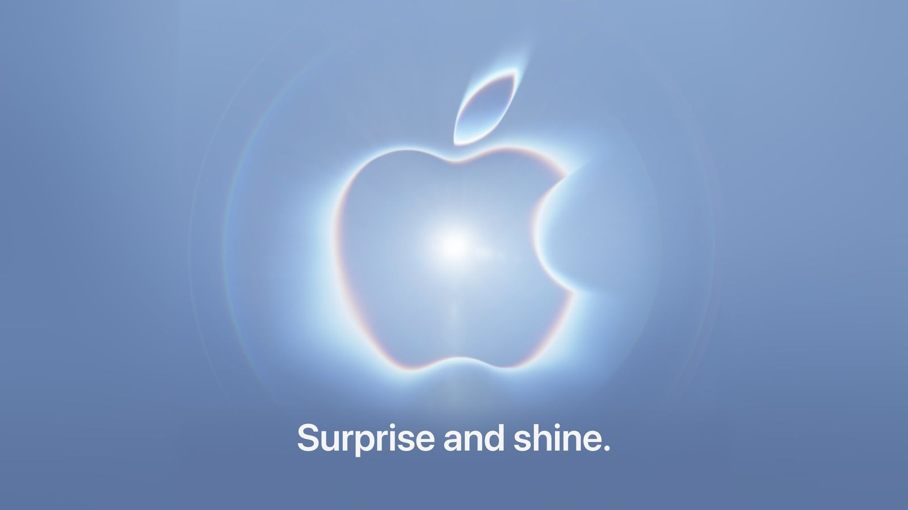
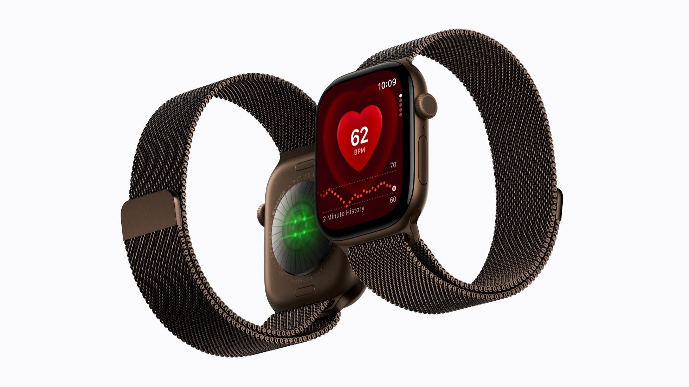
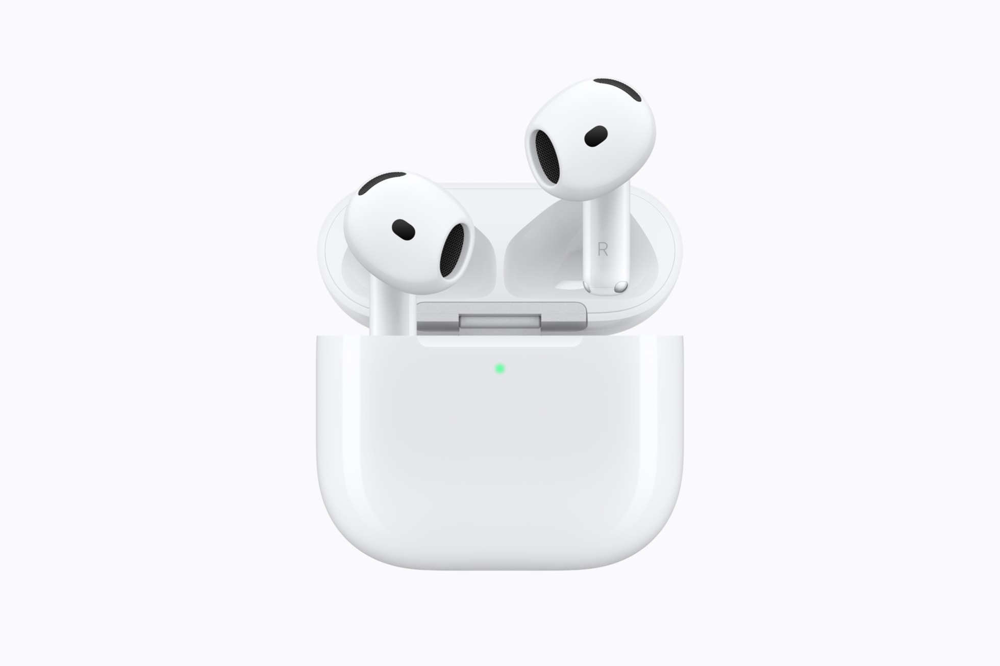
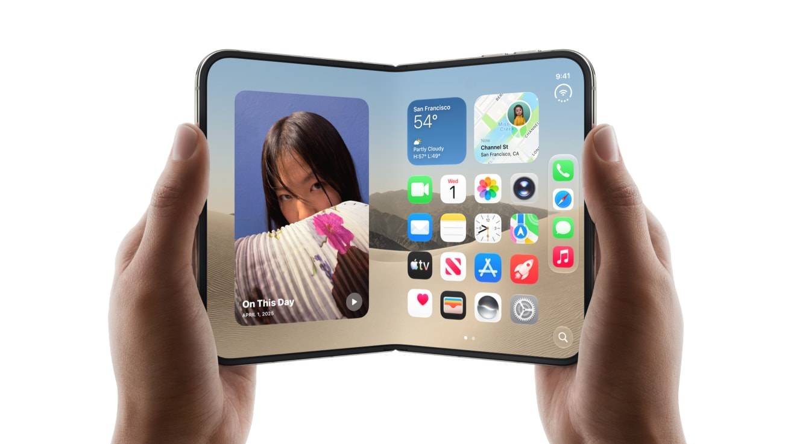
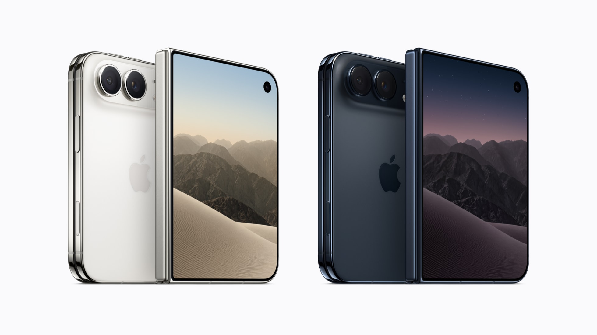
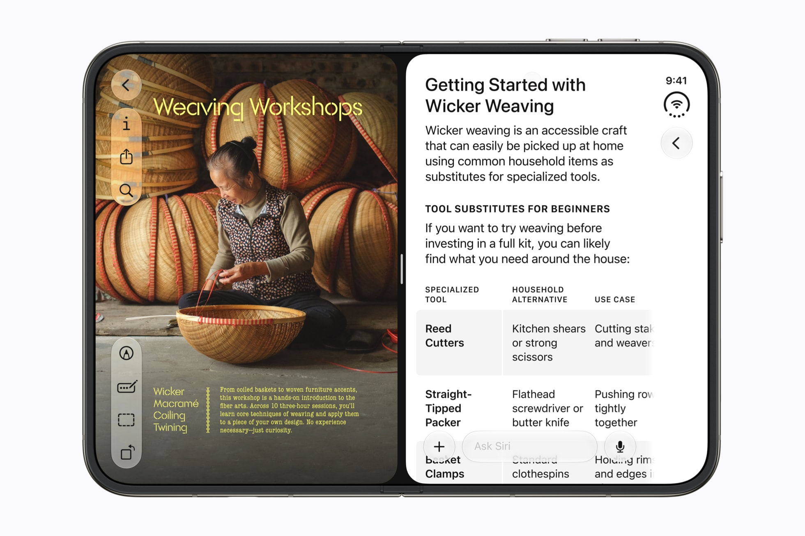
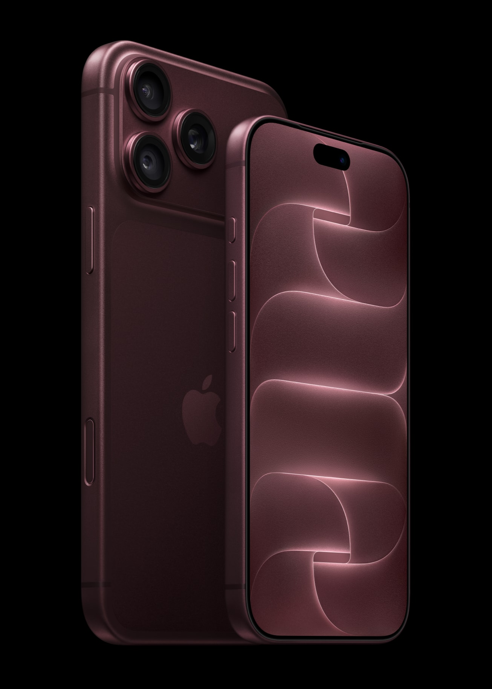
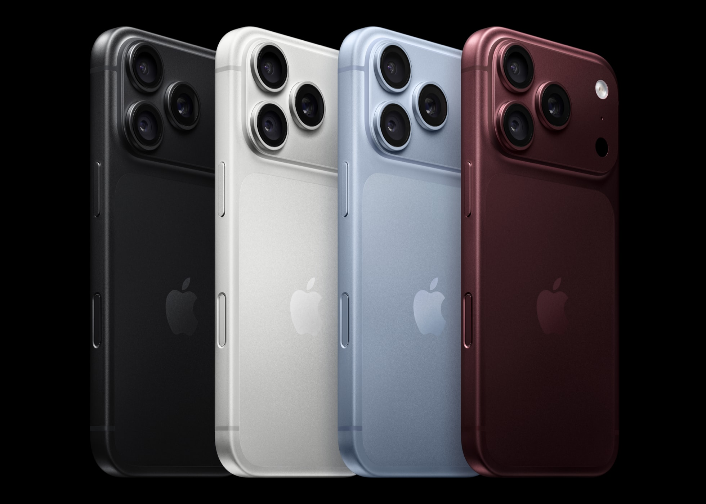
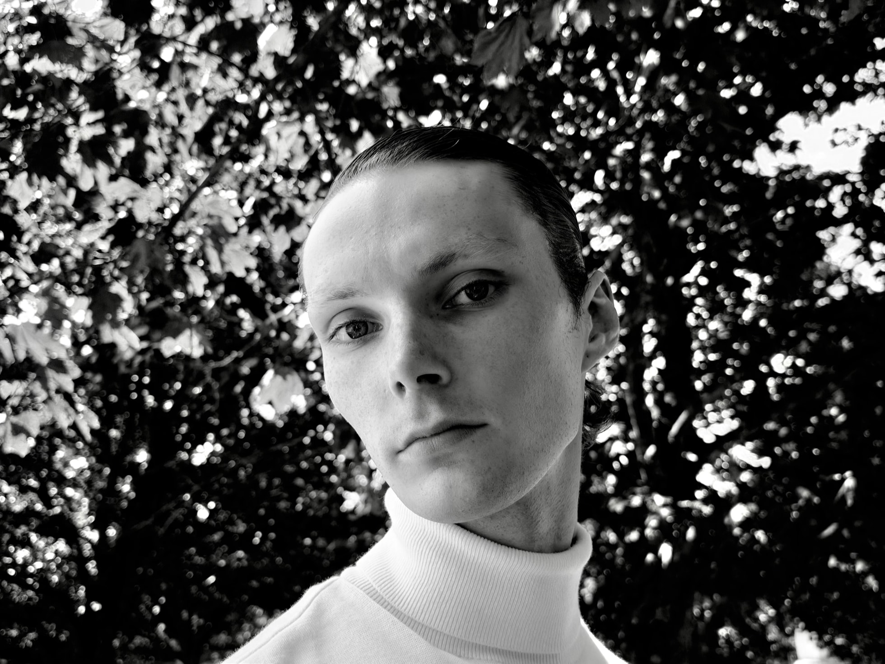

# 苹果发布会预测清单：对答案版（27 中 17，预言家验收现场）

> 发布会已于北京时间 9 月 10 日凌晨结束。原文预测**一条未改**，下面是逐条核对结果。
> 图例：✅/🤔 = 我当时的置信度；**中了** = 预测兑现；**翻车** = 打脸；**半中** = 对了一半；**待定** = 现在还没法验证。

（图源：Apple）

## 一、今晚到底发啥（6 中 6）

✅ 折叠屏 iPhone 真的来了 → **中了**，正式名 iPhone Duo

✅ iPhone 18 Pro / Pro Max 正常更新 → **中了**

✅ **没有**便宜的普通版 iPhone 18 → **中了**，标准版确认推迟到 2027 年春，今晚全是贵货

✅ 新 Apple Watch → **中了**，Series 12 + Ultra 4 双发，陶瓷表壳回归（¥7,499 起）

（图源：Apple）

🤔 新 AirPods → **中了**，AirPods 5 发布，¥999 起不涨价，无耳塞设计也上了主动降噪

（图源：Apple）

✅ 新 CEO John Ternus 首次站台，库克退居二线 → **中了**，库克只在开场影片里完成了交棒

## 二、折叠屏 iPhone Duo（9 中 7.5，本章最大赢家）

🤔 名字叫 **iPhone Duo** → **中了！** 发布会前 12 小时手机壳厂商 CASETiFY 偷跑 + 古尔曼确认，我临场改押 Duo 押对了，传了一年的 Ultra 彻底黄了

✅ 展开像个小 iPad mini → **中了**，内屏 7.6 英寸（比我预测的 7.8 略小），外屏 5.4 英寸，双 120Hz

（图源：Apple）

🤔 卖一万三起步，顶配奔两万 → **半中**：$1,999 起押对了，但国行 ¥15,999 起（不是 1.3 万），2TB 顶配 ¥26,499——比传闻贵，"苹果自己消化成本"的传闻没兑现

✅ 展开后薄得离谱（不到 4.6mm）→ **翻车**：展开 5.2mm / 折叠 11.3mm / 254g（官网规格页，待复核）。薄是真薄，但没薄到我赌的那个数

🤔 面部解锁没了，改回**侧面指纹** → **中了**，Touch ID 正式复活。但内屏藏了一个屏下 FaceTime 前摄，这个没人预测到

🤔 后面只有俩摄像头，无长焦 → **中了**，48MP 主摄 + 48MP 超广角，无长焦

（图源：Apple，注意背面只有双摄）

🤔 颜色只有两种：白色、深蓝 → **中了**，官方叫星光白和夜空

🤔 **支持 Apple Pencil** → **中了！** USB-C 版 Apple Pencil，今年晚些时候可用。乔布斯梗正式生效

🤔 今晚发布，但 **10 月才开卖** → **中了**，10 月 16 日预购、10 月 23 日发售

（图源：Apple，折叠版 iOS 27：分屏 + Siri AI）

## 三、iPhone 18 Pro（5 中 4.5）

✅ 涨价了 → **中了**，全系涨 $100 / 国行涨 ¥1,000，Pro ¥9,999 起，国行 Pro 首次破万

🤔 没有黑色了！新增"暗樱桃红" → **半中**：新色叫勃艮第酒红，确实是主角色；但**黑色没有取消**，四色是黑、银、冰川蓝、酒红

（图源：Apple）

（图源：Apple，黑、银、冰川蓝、勃艮第酒红——黑色还在）

✅ Pro Max 续航最强 → **中了**，视频播放最长 45 小时（eSIM 版），iPhone 史上最强

✅ 可变光圈 → **中了**，ƒ/1.48–ƒ/4.0 四档

（图源：Apple，可变光圈官方样张）

✅ 外观基本没变 → **中了**，设计语言延续 17 Pro（手机壳是否通用官方没说，待实测）

## 四、跟钱包直接相关的（3 中 0，本章惨败）

~~✅ 老款 iPhone 17 系列官方降价~~ → **翻车，而且翻得很贵**：17 不降反涨 ¥800，17 Air 涨 ¥800–2,300，17 Pro 系列官网直接下架。"发布会后买旧款"的黄金定律，今年失效了（IT之家报道，幅度待官网复核）

🤔 折叠屏一机难求、黄牛加价 → **待定**，10 月 23 日才发售，到时候看

🤔 国行 Apple Intelligence 会被提到 → **翻车**：发布会和新闻稿对国行只字未提。Siri AI 支持中文了，但首发地区不含中国大陆

## 五、我的神预测 Top 5（5 中 2，爆冷区现原形）

🤔 1. 折叠屏叫 Duo 不叫 Ultra → **中了！** 本场最有含金量的一条

🤔 2. 可变光圈只有 Pro Max 才有 → **翻车**，全系都有，不用加钱

🤔 3. 暗樱桃红刷屏成话题色 → **待定**，酒红确实是主推色，刷不刷屏看这周朋友圈

✅ 4. 全程吹 AI，Siri 继续画饼 → **翻车，输得心服口服**：Siri AI 随 iOS 27 实质落地（beta），首发英语，10 月加法日韩葡西语，支持中文但首发不含中国大陆。苹果这次没画饼，上菜了

🤔 5. Apple Pencil 写进演示环节 → **半中**：Pencil 支持成真，但官方演示的主推是 Kid Cue（外屏放动画哄孩子看镜头）这些相机玩法

## 清单外的意外（这些谁都没押中）

- **Apple Reference Image**：主摄给每张照片生成不可篡改的"数字底片"签名，防伪打假——全场最被低估的发布（国行因监管原因首发不可用）
- **iPhone 17 不降反涨**：存储芯片涨价，苹果罕见地对在售老机型涨价
- **Duo 的屏下前摄 + 侧边竖排灵动岛**
- **Apple Upgrade 租赁计划**（美国，Klarna 合作）
- iOS 27 正式版 9 月 14 日推送，支持 iPhone 11 起

---

## 对答案区（9 月 10 日已更新）

- 我的命中：**17 中 + 3 半中 / 27**，按文末段位表，踩线"建议去苹果应聘"
- 最大翻车：iPhone 17 不降反涨——"发布会后买旧款"的经验主义今年害死人
- 最意外之喜：Siri AI 真的来了；Apple Reference Image 数字底片
- 待验证（复核后会再更新）：Duo 厚度重量官方规格、iPhone 17 国行涨价具体幅度、AirPods 5 无线充电盒版国行价

**评论区预言家验收**：在评论区留过预测的朋友，回来报分了。猜中 Duo 命名的，请接受我的敬意。

---

> 原始预测存档：本文发布于发布会前（9 月 9 日晚），全部预测保留原文，翻车条目仅加删除线未删字。信源：Apple Newsroom 官方新闻稿、MacRumors、IT之家、快科技等，存疑条目已标注待复核。
