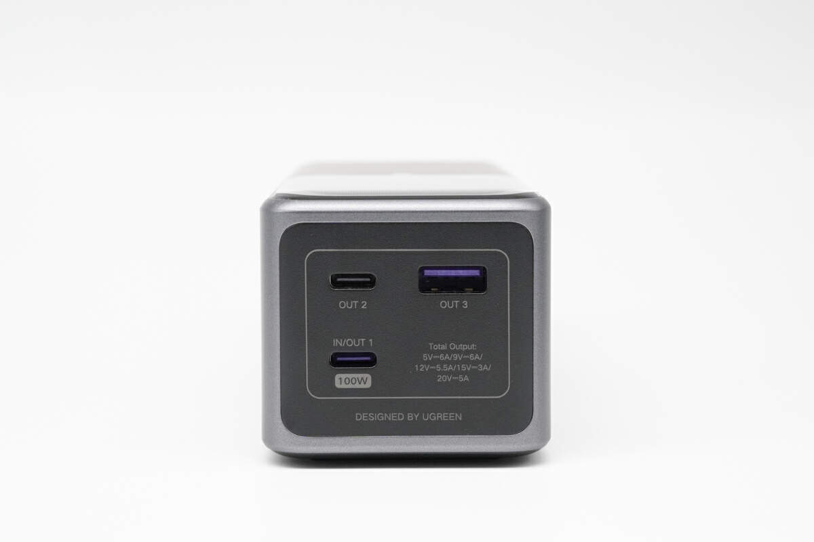
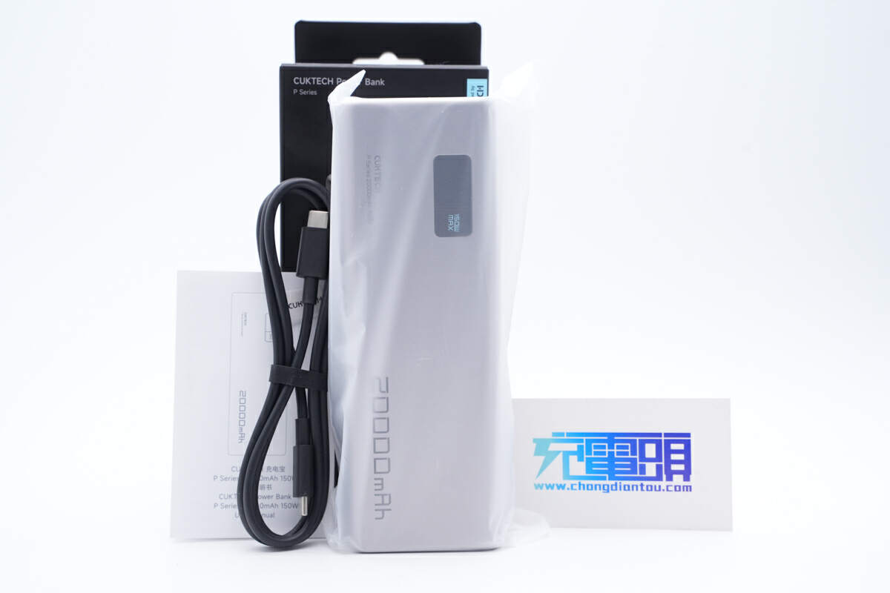
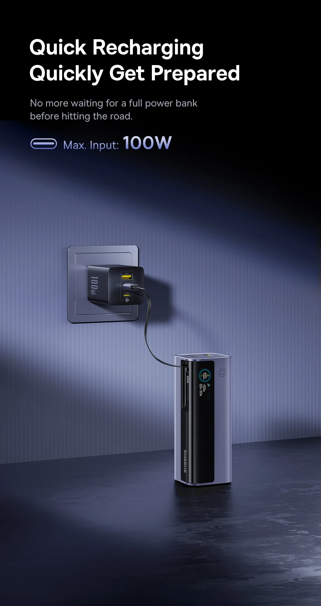
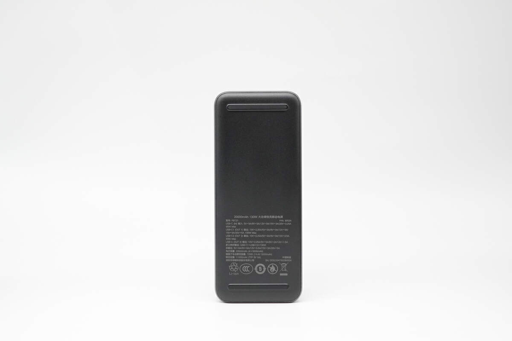

先说结论，这三款没有差生。

给笔记本充电，门槛是单口 65W 起步、100W 稳妥。酷态科 15 号单口 120W，绿联能量湃 130W 单口 100W，倍思极客充 GR11 单口 100W，**三款全都过线，功率根本不用纠结**。绿联这个 C1 口干脆把 100W 印在面板上，[充电头网评测](https://www.chongdiantou.com/archives/339445.html)实测它能跑满 PD 100W 输出，充 MacBook 全系没问题。

（图源：充电头网）

功率打平，真正的分水岭就两刀。第一刀，你用什么手机。

**小米手机用户，直接酷态科 15 号电能柱，不用往下看了。**它是小米生态链出身，支持小米 120W 私有快充，[充电头网评测](https://www.chongdiantou.com/archives/252486.html)里给小米手机充电能跑满 120W，小米笔记本也能 100W 喂饱。换另外两款给小米手机充电，只能走公有协议，速度直接掉一截。2C1A 三个口，总功率 150W，包装里还送一根 240W 6A 的线，不用再花钱买线。京东自营到手 244 元左右，还是三款里最便宜的。缺点也说清楚，它是 2023 年 8 月上市的老将，屏幕只有电量百分比，没有彩屏。

（图源：充电头网）

**适合小米全家桶和预算敏感的人，不适合想盯着功率看的人。**【好物卡：[酷态科 15 号电能柱 20000mAh 150W](https://item.jd.com/100063803015.html)】

第二刀，你想不想多带一根线。

**不想带线的，选倍思极客充 GR11。**它自带一根 100W 伸缩线，拉出来插上笔记本就充，用完缩回去，办公桌上永远不用翻包找线。这个体验是用过就回不去的那种。三个 C 口（含伸缩线）都支持 100W 双向快充，A 口 33W，总功率 145W，2025 年 3 月才上市的新品，[上市价 199 元](https://finance.sina.com.cn/tech/digi/2025-03-12/doc-inepkvpi4453347.shtml)，现在京东 230 到 270 元。短板也直说，电芯只写了车规级 21700，没说是谁家的。2025 年召回潮之后买充电宝，供应商不肯亮名字的，我心里总要打个折。

（图源：倍思官网）

**适合桌面办公、经常忘带线的人，不适合对电芯透明度较真的人。**【好物卡：[倍思 极客充 GR11 20000mAh 145W](https://item.jd.com/10167444541752.html)】

那绿联能量湃 130W 卖给谁。卖给想充个明白的人。

**它那块 1.54 寸彩屏能实时显示每个口的输出功率**，笔记本到底有没有在快充，瞄一眼就知道，不用靠猜。电芯用的是比克、长虹三杰的 21700 车规级电芯，[充电头网拆解](https://www.chongdiantou.com/archives/359486.html)证实过，供应商名字摆在明面上。C1 口 100W 输出、65W 自充，A 口还支持 UFCS 融合快充，华为荣耀手机也能激活快充。京东 229 到 259 元，比酷态科贵的那几十块，买的就是这块屏幕和这份明白。

**适合华为荣耀用户和参数党，不适合小米手机用户。**【好物卡：[绿联 能量湃Pro 130W 20000mAh](https://item.jd.com/10106501043484.html)】

最后补一嘴登机的事，毕竟买两万毫安的人多半要出差。

三款都是 20000mAh，额定能量 72 到 74Wh，都在民航 100Wh 红线以内，也都有 3C 认证，直接带上飞机不用申报。绿联这款铭牌上 72Wh 和 3C 标志印得清清楚楚，另外两款同理。倒是重量不用纠结，445 克对 450 克对 483 克，背在包里感觉不出差别。

（图源：充电头网）

所以一句话收尾。小米手机买酷态科，便宜还能跑满 120W；懒得带线买倍思，伸缩线一拉就充；想看着功率充电图个明白，买绿联。

---

大功率充电宝怎么选、3C 标识怎么查、被召回的品牌还能不能买，我都整理在这篇长文里了，买之前建议先自查一遍：[2026 充电宝选购指南：3C 标识怎么查、被召回的品牌还能不能买](https://zhuanlan.zhihu.com/p/2076067702750421986)
