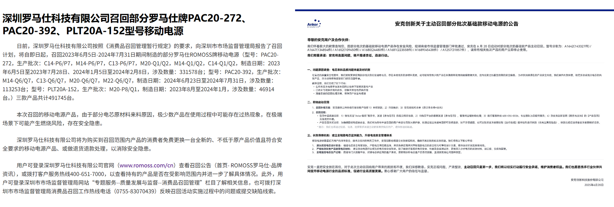

先给结论：2025 年 6 月 28 日之后，一个充电宝能不能带上境内航班，只看三件事——**机身有没有清晰的 3C 标识、在不在召回名单里、额定能量超没超 100Wh**。三条全过就能带，跟品牌、价格、在哪买的都没有关系。

这事儿以前是模糊地带，现在是硬规定。[民航局 2025 年 6 月 26 日发布紧急通知](https://www.163.com/dy/article/K3VTP2S50530QLUU.html)，6 月 28 日起，无 3C 标识、3C 标识不清晰、被召回型号或批次的充电宝，禁止带上境内航班。背景是当年上半年机上充电宝起火冒烟事件多发，罗马仕、安克相继大规模召回，市场监管总局撤销和暂停了一批厂家的 3C 证书。

所以别再问「XX 牌能不能带」，按下面三步自己查，两分钟出结果。

**第一步，翻机身，找 3C。**

注意看的是机身本体，不是包装盒。安检员只认充电宝身上模压或镭雕的标识，包装盒、说明书、购买记录一概不算。合规机身上应该有 CCC 标志、型号、额定容量、额定能量这几行字。贴纸糊上去的、磨到看不清的、干脆没有的，到安检口就是被扣的命。

**第二步，看额定能量，认准 Wh。**

民航的硬指标是额定能量，不是你熟悉的毫安时：100Wh 以内随身携带，不用跟任何人申报；100 到 160Wh 要航空公司批准，每人限带两个；超过 160Wh 直接禁带。

主流容量对照很好记：一万毫安约 37Wh，两万约 74Wh，两万五在 88 到 92Wh 之间，两万七贴着 100Wh 红线。机身上印着 Wh 就直接看数字；没印的，拿标称容量乘 3.7V 再除以 1000，自己估算。

**第三步，查召回名单。**

2025 年有两场大召回必须知道：[罗马仕召回约 49.17 万台](https://readhub.cn/topic/8kF3itVvgRK)，涉及 PAC20-272、PAC20-392、PLT20A-152 三个型号、2023 年 6 月至 2024 年 7 月生产批次；[安克召回中国区 71 万余件](https://baike.baidu.com/item/2025%E5%B9%B4%E5%85%85%E7%94%B5%E5%AE%9D%E5%8F%AC%E5%9B%9E%E4%BA%8B%E4%BB%B6/65818749)，涉及 A1642、A1647、A1652、A1680、A1681、A1689、A1257。型号在名单里的，别管机身上有没有 3C，直接停用，联系官方客服处理。

想再稳一手，可以上[全国认证认可信息公共服务平台](https://cx.cnca.cn/)查 3C 证书状态，输证书编号或型号，显示「暂停」或「撤销」的同样别带上飞机。

查完还有几条规矩顺手记住。充电宝只能随身携带，全程禁止托运；飞行途中禁止使用；被机场扣下的充电宝很多快递公司拒收，想寄回厂家先打客服确认渠道，别直接叫快递上门。

如果你查完发现手里的过不了关，或者干脆懒得查想换个新的，按容量给三个闭眼买的选项，3C 齐全、额定能量都远低于 100Wh：

**通勤档，**【好物卡：[小米自带线充电宝 10000mAh 33W](https://item.jd.com/100139968434.html)】，99 块，37Wh。**最适合每天通勤、只给手机续一次命、又不想额外带线的人**，自带 Type-C 线用完收进机身，200g 出头。明确不适合谁：要拿它喂平板和笔记本的、一出差三四天的，都不在它能力圈里，额定容量 5600mAh 上下，给手机续完命就见底了。和同价位的京造、倍思比，它赢在 33W 对 iPhone 和安卓的兼容性都稳，小米自家渠道售后也顺；京造更轻一点，倍思玩法更多，看你取舍。

**均衡档，**【好物卡：[酷态科 10 号超级电能棒 Plus 15000mAh 120W](https://item.jd.com/100133267851.html)】，204 块上下，52.92Wh。**最适合想兼顾容量和快充速度的人，尤其是小米、红米用户**，单口 120W 能触发小米私有快充，也能给轻薄本应急，带一块能看每口功率的 TFT 彩屏。明确不适合谁：要拿它长时间喂笔记本的别指望，一万五的容量撑不住；345g 的分量塞裤兜也不合适。和同价位的两万毫安大块头比，它用电芯容量换了功率和体积，长条形态插在包侧袋里不占地方，代价是总电量少四分之一。

**差旅档，**【好物卡：[绿联 PB521 20000mAh 30W 自带线](https://item.jd.com/100360671362.html)】，99 到 129 块，74Wh。**最适合三五天差旅、以手机平板为主、预算一百出头的人**，自带线、能同时充三台设备，绿联全线 3C 认证一直比较稳。明确不适合谁：想拿它充笔记本的，30W 真喂不动。和两百档的 65W 差旅款比，它用功率换了价格，手机平板党不亏，笔记本党加钱上 65W 档才是正解。

最后把答案收成一句话：**充电宝能不能上飞机，和牌子大小、价格高低无关，机身上有清晰 3C、不在召回名单、额定能量 100Wh 以内，三个条件都满足就能带，两分钟就能自查完。**

---

想系统了解 3C 标识怎么查、旧充电宝怎么处置、被召回的品牌还能不能买，可以看我整理的主文。

[2026 充电宝选购指南：3C 标识怎么查、被召回的品牌还能不能买](https://zhuanlan.zhihu.com/p/2076067702750421986)
