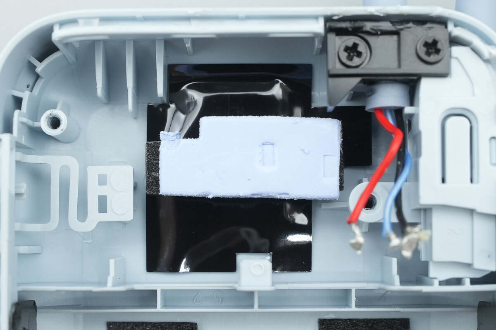
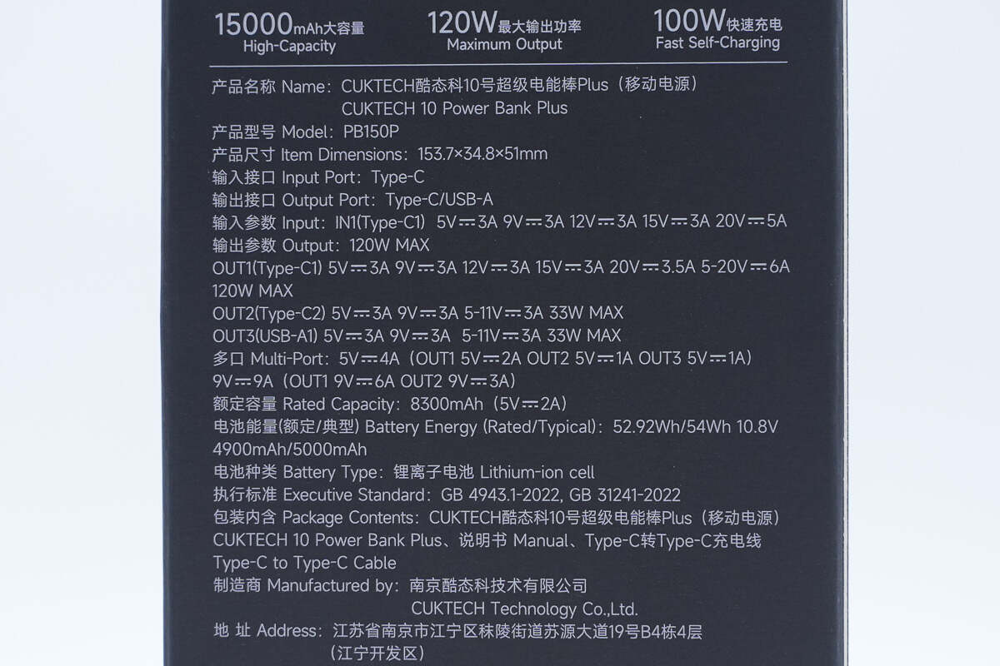
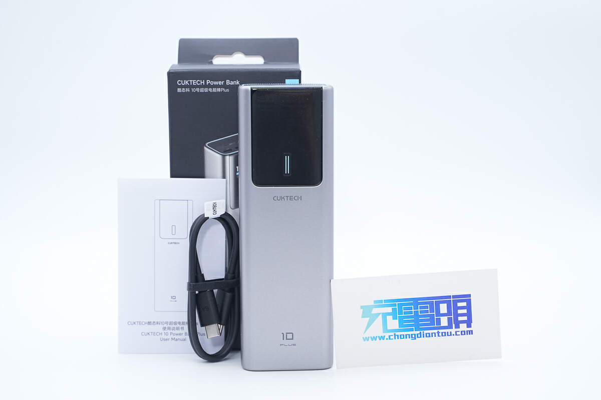

先说结论，充电宝要「容量大又小巧」，这两个要求放在一起本身就是矛盾的。锂电池的能量密度摆在那里，谁也违反不了物理。你真正该问的是，在我能接受的体积和重量里，哪款塞进了最多的电。

先把矛盾摊开讲。

现在主流充电宝的电芯就两种形态。一种是 18650、21700 这样的圆柱钢壳电芯，另一种是扁平的锂聚合物软包。聚合物可以做成薄薄一片，所以那些银行卡大小、能塞进小包夹层的充电宝，基本都是聚合物方案。21700 走的是另一条路，单颗容量做到 5000mAh 上下，靠密度取胜，大容量款里体积控制好的基本是它。

但不管哪种电芯，能量密度都有天花板。

我的经验值是这样。10000mAh 大概 200g，20000mAh 要 350g 往上，25000mAh 直奔 500g，比手机还沉。**所以如果你在商品页看到一个标称 20000mAh 却只有半个手机大、一百多克的充电宝，不用犹豫，它一定虚标。**物理不允许的事情，广告里是允许的。

挑的时候别只看标称容量，看两个数字。

一个是额定容量，印在机身或详情页小字里，那才是扣掉损耗后真正能充进你手机的电量。10000mAh 的充电宝，额定容量通常只有 5500 到 6600mAh。另一个是额定能量，单位 Wh，这是登机的硬指标，100Wh 以内随身带上飞机不用申报。10000mAh 约 37Wh，20000mAh 约 74Wh，25000mAh 大概 88 到 92Wh，贴着红线设计。

搞清楚这两件事，推荐就简单了。按你对「小巧」的定义分三档。

**口袋级小巧，选 10000mAh 聚合物自带线。** 比如【好物卡：小米自带线充电宝 10000mAh 33W】，200g 上下，自带 Type-C 线，出门少带一根线，额定能量 37Wh，登机无压力，99 块左右。代价是容量只够给手机续一次命多一点，平板和笔记本都别指望。**适合每天通勤只想轻装的人，不适合出差党和双设备党。**

**容量和体积的均衡点，看 15000mAh 的电能棒形态。** 比如【好物卡：酷态科 10 号超级电能棒 Plus 15000mAh 120W】，[充电头网拆解过](https://www.chongdiantou.com/archives/1739151431713.html)，里面是 3 颗长虹三杰 21700 电芯，容量比 10000mAh 多一半，体积就是一听可乐那样的长条，插在包的侧袋里不占地方，单口 120W 还能给轻薄本应急。日常 199 元上下，大促时见过 150 元以内。缺点也说清楚，345g 拿在手里有分量，塞裤兜不合适，而且 120W 满血主要对小米系开放，其他手机走 PD 公有协议跑不满。**适合想兼顾容量和便携、包里常备的人，不适合追求无感携带的人。**

**如果你的「大」排在「小巧」前面，上限是 25000mAh。** 像酷态科 25 号 SE 这种，额定能量 88.2Wh，贴着民航 100Wh 红线做的最大容量。但话说清楚，它并不小巧，接近一斤重，那是给出差带笔记本的人准备的，日常通勤背它纯属练负重。

最后两件事，比选哪一档更重要。

2024 年 8 月起，没有 3C 认证的充电宝已经禁止在国内销售；2025 年 6 月底开始，没有 3C 标识的连境内航班都上不去。而据人民网报道，市场监管总局 2025 年那轮抽查里，[149 批次移动电源 65 批次不合格，不合格率 43.6%](http://finance.people.com.cn/n1/2025/0718/c1004-40524841.html)，虚标容量正是杂牌的重灾区。所以认准京东自营或官方旗舰店，收货后核对机身上的 CCC 标志、额定容量、额定能量和详情页是否一致，不一致就七天无理由，别惯着。

利益声明说在前头，文中挂了好物卡，通过卡片下单我会有少量返佣，价格和你自己搜完全一样，介意的直接按型号搜。返佣不影响排序，每款不适合谁我都写明了。

**容量大又小巧的真相是，物理已经给你画好了线，你能做的只是在能接受的重量里，选电最多的那一款。**

---

想系统了解 3C 标识怎么查、被召回的型号怎么避坑、不同场景还有哪些选择，可以看我整理的主文。

[2026 充电宝选购指南：3C 标识怎么查、被召回的品牌还能不能买](https://zhuanlan.zhihu.com/p/2076067702750421986)
