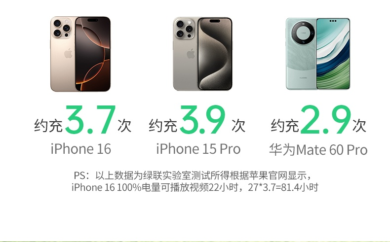
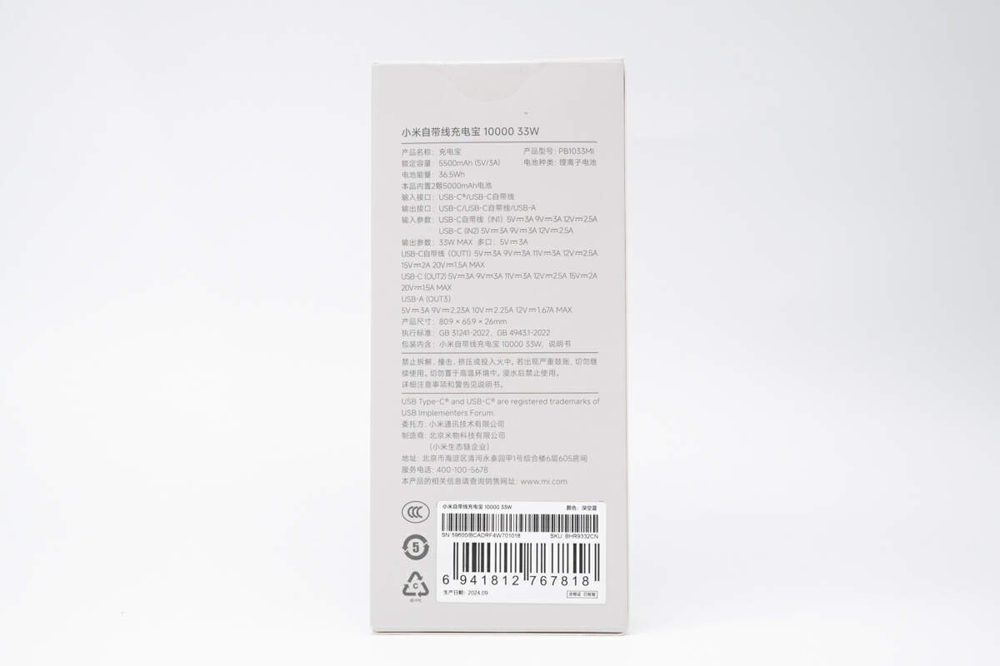
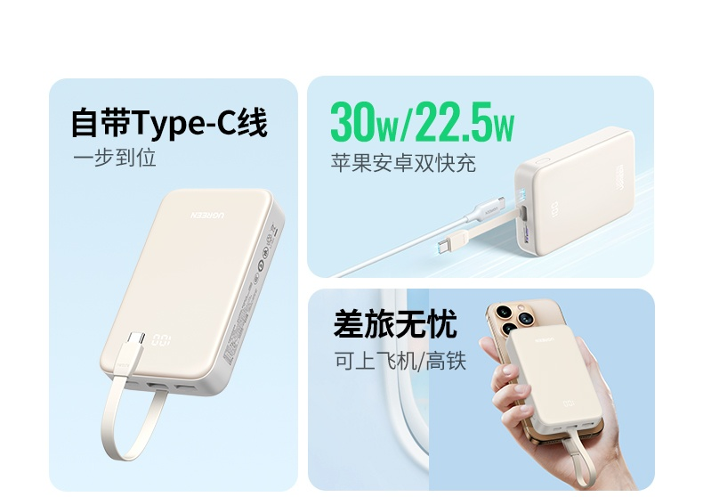
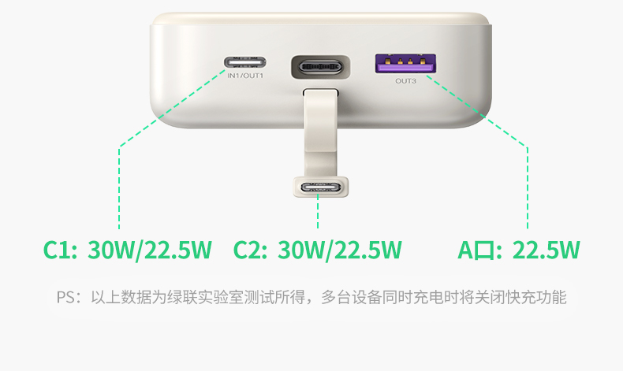

先给结论，你这个需求基本锁定了：**20000mAh、自带线、30W 上下、有 3C 认证**。一百块出头就能解决，不用纠结更大的。

先把你的场景拆开看。

手机加 iPad 两台设备，主要拍视频拍照。拍摄是最耗电的场景没有之一，屏幕常亮加摄像头全开，手机三四个小时见底太正常了，这不是你电池坏了，是这个用法本来就费电。所以 10000mAh 那种口袋款对你不够用，实际能充进手机的只有 5500-6600mAh 左右，给你手机续一次命就见底了，iPad 基本顾不上。

但你说容量越大越好，这句我得拦一下。

**容量和重量几乎是线性关系。** 10000mAh 大概 200g，20000mAh 就 350g 上下了，25000mAh 直奔 500g，比你的手机还重。你是挂着它出门拍一天视频的人，多出来的每一克都是负担。20000mAh 是便携和容量的甜点，也是我认的便携上限。

而且 20000mAh 的额定能量约 74Wh，低于民航 100Wh 的登机红线，以后坐飞机也不用单独申报。

再算一笔账你就踏实了。20000mAh 扣掉转化损耗，实际能用的电量大概 45Wh 上下，够 iPad 充一次多，再给你手机续一两次命。拍一整天，够了。

接下来是 2025 年之后买充电宝的底线，比容量重要得多。

**只买机身上有 3C 标识的。** 2024 年 8 月起没有 3C 认证的充电宝已经禁止销售了，2025 年 6 月底开始，没标识的连飞机都上不去。市场监管总局前一轮抽查，149 批次移动电源里 65 批次不合格，不合格率 43.6%，里面大头就是白牌贴牌货。所以别碰那种便宜到离谱的杂牌，认准京东自营或官方旗舰店。

具体推荐两款，按你的需求排了序。

**首选，绿联 PB521 20000mAh 30W 自带线，约 99-129 元。**【好物卡：绿联 PB521 20000mAh 30W 自带线】3C 认证齐全（[充电头网拆解](https://www.chongdiantou.com/archives/392054.html)实测铭牌，额定能量 74Wh、额定容量 13200mAh），自带 Type-C 线出门少带一根线，30W 输出喂 iPad 正好，还能同时充三台设备。**适合你这样手机加平板的双机党。不适合想拿它充笔记本的人，30W 喂不动。**

**备选，小米自带线充电宝 10000mAh 33W，约 99 元。**【好物卡：小米自带线充电宝 10000mAh 33W】如果你愿意牺牲容量换轻，200g 出头，33W 双向快充，额定能量 37Wh。但要接受现实，它只能保你手机，iPad 得省着用。**适合轻装进城的半天行程，不适合你说的这种拍一整天的场景。**

至于 25000mAh 以上的大块头，比如酷态科 25 号那种 120W 电能块，直接劝退。那是给要带笔记本出差的人准备的，天天背着拍视频纯属练负重。

收货之后两个动作别省。一是核对机身上的 3C 标识、型号、额定能量和详情页一致，贴纸糊弄的或者看不清的直接退。二是充满手机一次，摸摸充电宝表面温度，烫到拿不住就七天无理由，别犹豫。

利益声明说在前头，文中挂了好物卡，通过卡片下单我会有少量返佣，价格和你自己搜完全一样，介意的直接按型号搜。返佣不影响推荐，不适合谁我都写在上面了。

**充电宝这个东西，合规是门票，容量够用就好，你愿意每天带出门的那个，才是好充电宝。**

---

想系统了解 3C 标识怎么查、被召回的型号怎么避坑、不同场景还有哪些选择，可以看我整理的主文。

[2026 充电宝选购指南：3C 标识怎么查、被召回的品牌还能不能买](https://zhuanlan.zhihu.com/p/2076067702750421986)

---

待拍摄清单（有媒体图占位，有实拍更好，没有也能发）：

1. 如果你手头有正在用的充电宝，拍一张机身背面标识特写（要能看清 3C 标志、型号、额定能量 Wh 那几行字），可替换文中的合规标识说明图，说服力拉满。
2. 如果下单了绿联 PB521，到货后拍一张它和手机叠在一起的对比图，可替换绿联官网三联图，真人实拍比官方图可信。
