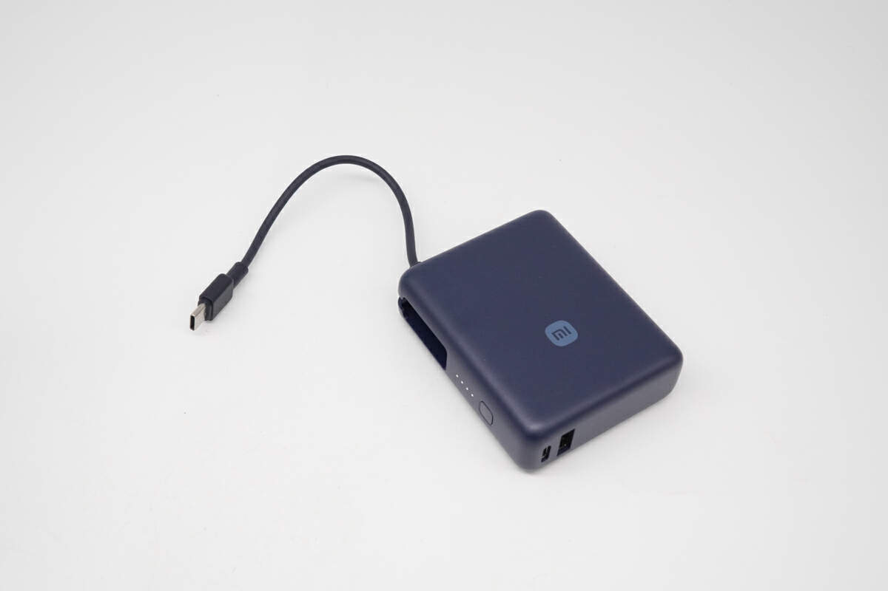
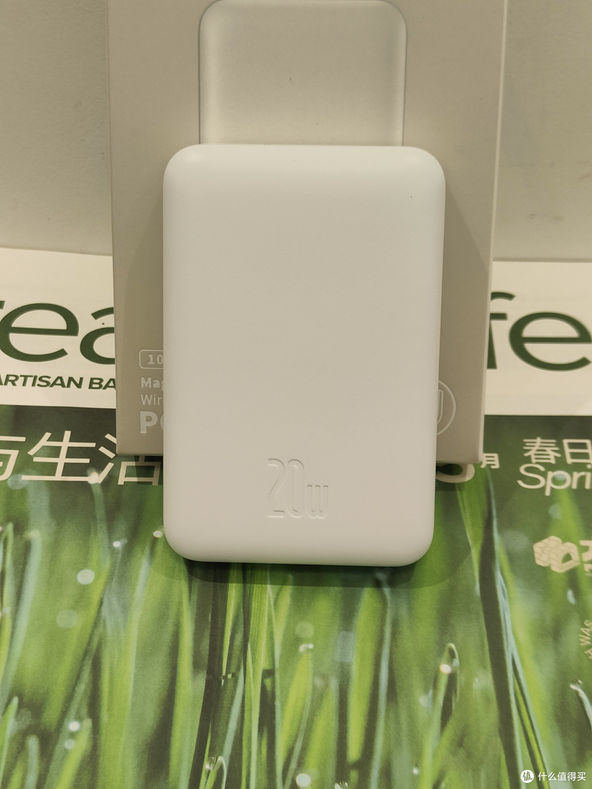
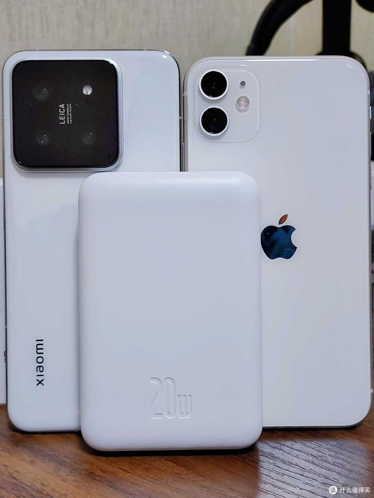
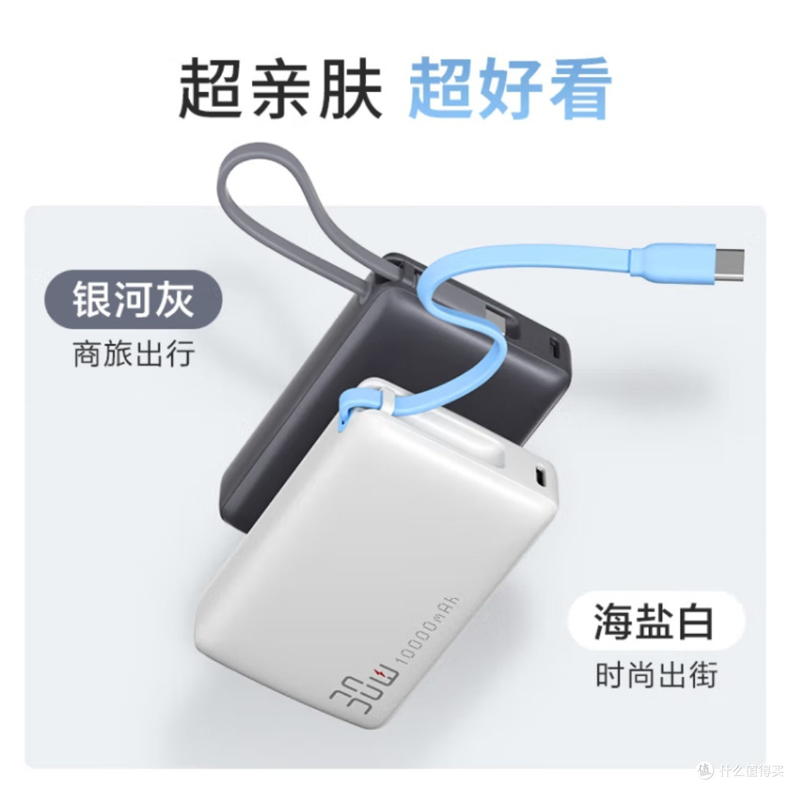
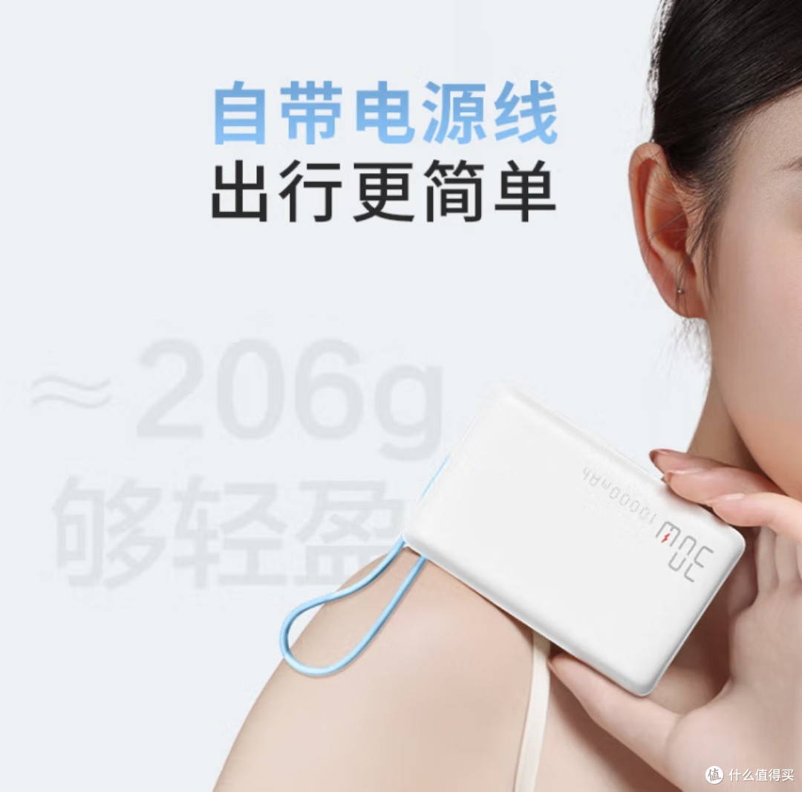

百元这个价位，充电宝反而是最难选的。

不是说没好货，是这个价位的参数表长得几乎一模一样：一万毫安、二十到三十三瓦、九十九块。你盯着参数看半天，看不出任何差别。**百元档真正的差别不在参数里，在你每天怎么带它出门。**

所以先别问哪款好，先回答一个问题：你打算怎么带它？

想明白这件事，选择就只剩三种。

**第一种带法：塞进包里，但不想额外带线。**

看【好物卡：[小米自带线充电宝 10000mAh 33W](https://item.jd.com/100139968434.html)】，99 块。自带 Type-C 线，用完直接收进机身，200g 出头，跟手机差不多重。33W 双向快充，iPhone 和安卓都能跑满各自的主流档位。额定容量 5600mAh 上下，说人话就是给手机完整续一次命，再加个零头。

代价也说清楚：一万毫安就只够手机用，平板充一半，笔记本别指望。**适合每天通勤、只想给手机兜底的人，不适合双设备党和出差党。**

**第二种带法：直接贴在手机背面。**

iPhone 12 之后的机型可以看【好物卡：[倍思磁吸充电宝 10000mAh](https://item.jd.com/100042985009.html)】，99 到 129 块。208g，啪嗒一下吸在手机背面，地铁上单手刷视频，不用一手攥着砖一手扯着线。

但两个代价必须说在前面。一是无线充电最高只有 15W，边玩边充经常入不敷出，真急用就老老实实插线，有线能到 20W。二是磁吸无线充天然发热，夏天贴久了手机会烫。**它只适合图省事的 iPhone 用户，安卓别买错，对速度敏感的人也别勉强。**

**第三种带法：预算卡死，售后优先。**

【好物卡：[京东京造 33W 自带线充电宝 10000mAh](https://item.jd.com/100132564940.html)】，也是 99 块。206g，跟小米咬得很死，自带 18cm Type-C 线，额定容量 5500mAh。它最大的卖点其实在充电宝之外：京东自营售后兜底，出问题不用跟店铺客服扯皮。短板是 25.6mm 的厚度，小方块身材，塞紧身裤兜会有存在感。

顺便把一类问题也答了：百元能不能买到两万毫安？

能，但不便携。两万毫安意味着 350g 往上、半块砖的体积，那是双肩包常驻选手，跟「便携」两个字基本没关系。百元预算确实有两万容量的产品，下单之前先想清楚，你是不是每天背大包的人。

最后说一件比选款更重要的事。

**百元档恰恰是白牌虚标的重灾区。** 直播间和拼团里那种标着两万毫安、卖五十九块的杂牌，直接划走，不用给眼神。2024 年 8 月起没有 3C 认证的充电宝就不允许卖了，2025 年 6 月底开始，没标识的连飞机都上不去。上面三款机身都有 3C 标识，额定能量 37Wh 上下，登机随便带。

收货之后做一个动作：翻到机身背面，核对 3C 标志、型号、额定容量跟详情页一致。贴纸模糊、参数对不上的，七天无理由，别惯着。

**充电宝这个东西，参数决定它能不能用，重量决定你用不用它。百元档的性价比，从来都是按出勤率算的。**

---

想系统了解 3C 标识怎么查、被召回的型号怎么避坑、两万毫安以上的差旅款怎么选，可以看我整理的主文。

[2026 充电宝选购指南：3C 标识怎么查、被召回的品牌还能不能买](https://zhuanlan.zhihu.com/p/2076067702750421986)
