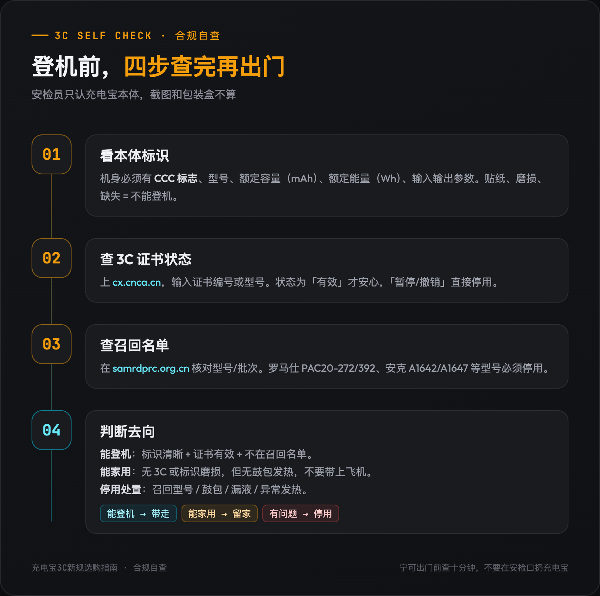
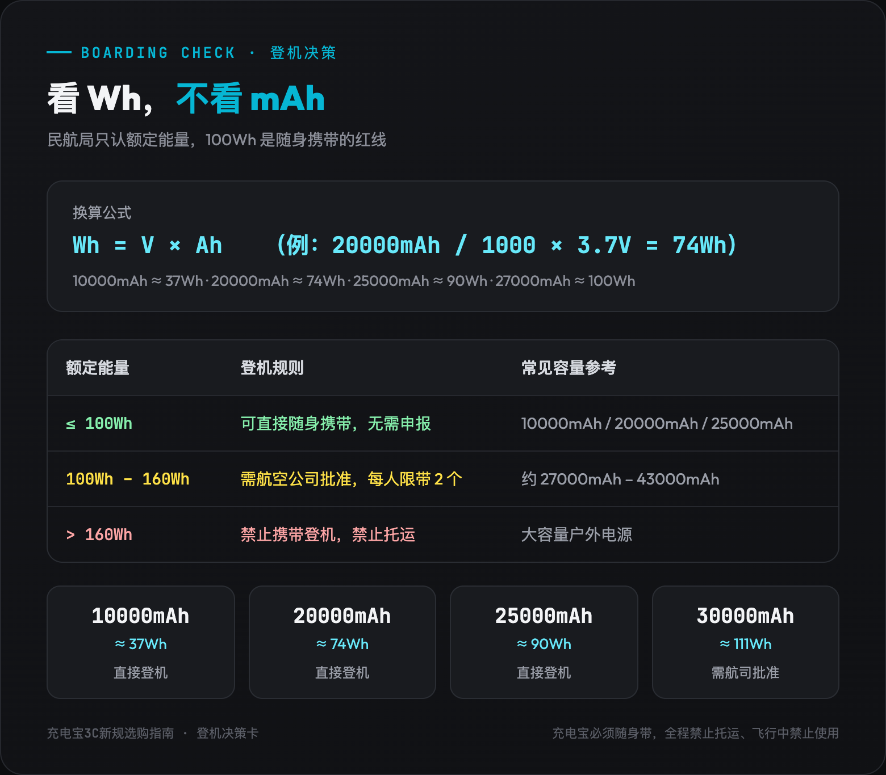

# 2026 充电宝选购指南：3C 标识怎么查、被召回的品牌还能不能买

2025 年 6 月 28 日那天，银川河东机场一天拦下了近千个充电宝。

这不是我编的。当天有公开报道：[银川河东国际机场新规执行首日，超千件无 3C 标识充电宝被拦截](https://www.163.com/dy/article/K3E0FJJP0516BIKO.html)。

不是容量超标，不是品牌不对，是很多人到了安检口才第一次发现：自己用了好几年的充电宝，本体上根本没有 3C 标识。

同一天，社交平台上成筐的充电宝被扣的照片开始刷屏。有人当场把旧的扔了买新的，有人因为快递拒收召回产品只能带回家吃灰。

这件事的导火索，是 2025 年民航局的一纸紧急通知：[自 6 月 28 日起，禁止旅客携带没有 3C 标识、3C 标识不清晰、被召回型号或批次的充电宝乘坐境内航班](https://china.cnr.cn/gdgg/20250627/t20250627_527231400.shtml)。

但民航局只是最后一环。

往前看，2024 年 8 月 1 日起，未获 CCC 认证、未标注认证标志的充电宝就已经不得出厂和销售。

再往前，罗马仕、安克等行业头部品牌接连召回超过 120 万台产品；市场监管总局的一轮抽查里，[149 批次移动电源中有 65 批次不合格，不合格率 43.6%](http://finance.people.com.cn/n1/2025/0718/c1004-40524841.html)。

充电宝这个品类，正在经历十年一遇的供给侧大洗牌。

这篇文章不谈情怀，只解决三个问题：你手里的充电宝还能不能用？如果必须买新的，怎么查 3C 才不会被骗？不同场景下，到底该买哪一款？

---

## 一、先自查：你的充电宝还能带上飞机吗？

民航局的禁令把充电宝分成三类：**无 3C 标识、标识不清晰、被召回型号/批次**。只要命中任意一条，境内航班就别想了。

### 1. 看本体，不要只看包装盒

很多人以为包装盒上有 CCC 标志就万事大吉。但安检员只认充电宝本体上的标识，截图、说明书、发票都不算。

合规的充电宝，机身通常会以模压或镭雕方式印有：
- CCC 标志（即 3C 认证）
- 品牌、型号
- 额定容量（mAh）
- 额定能量（Wh）
- 输入/输出电压电流

如果这些信息是贴纸、磨损到看不清、或者干脆没有，登机风险就很大。

### 2. 查 3C 证书是否有效

看到 CCC 标志还不够，因为证书可能被暂停或撤销。2025 年这一轮风波里，就有多个品牌的 3C 证书被市场监管部门暂停。

查询方法很简单：
1. 记下充电宝型号，或者向客服索要 3C 证书编号。
2. 打开 [全国认证认可信息公共服务平台](https://cx.cnca.cn/)。
3. 输入证书编号或型号，查看证书状态是否为「有效」。

如果显示「暂停」或「撤销」，建议停止使用，更不要带上飞机。

### 3. 查是否在召回名单里

2025 年有两场大规模召回必须避开：
- [罗马仕召回约 49.17 万台，型号 PAC20-272、PAC20-392、PLT20A-152](https://readhub.cn/topic/8kF3itVvgRK)，涉及 2023 年 6 月至 2024 年 7 月生产批次。
- [安克召回中国区 71 万余件，型号 A1642、A1647、A1652、A1680、A1681、A1689、A1257](https://baike.baidu.com/item/2025%E5%B9%B4%E5%85%85%E7%94%B5%E5%AE%9D%E5%8F%AC%E5%9B%9E%E4%BA%8B%E4%BB%B6/65818749)。

召回信息可以在 [国家市场监督管理总局缺陷产品召回技术中心](https://www.samrdprc.org.cn/) 查询。如果你手里的型号刚好在名单里，立即停用，联系品牌官方客服处理。

### 4. 旧充电宝的三种命运

查完之后，你手里的旧充电宝大概三种命运：

**能继续登机的**：本体 3C 标识清晰，证书有效，不在召回名单。这类正常使用即可，但建议出行前再复核一次。

**能在家用、不能登机的**：没有 3C 标识或标识磨损，但外观正常、没有鼓包发热。可以留作家中应急，但不要带上飞机，更不要托运。

**建议停用处置的**：在召回名单、鼓包、漏液、异常发热、充不进电。这类产品不要再充电，放置在通风处，按当地电子废弃物渠道处理。

有一个细节很多人会忽略：被机场扣下或召回的充电宝，**很多快递公司会拒收**。如果你打算寄回厂家，先打客服确认渠道，别直接叫快递上门。

---

## 二、买新机前，必须看懂的 5 个参数

3C 合规只是门槛。买到手好不好用，取决于下面这几个参数。

### 1. 额定能量 Wh，才是登机硬指标

民航局规定：额定能量 ≤100Wh 的充电宝可随身携带；100Wh–160Wh 需航空公司批准，每人限带 2 个；>160Wh 禁止携带。

换算公式：
> **额定能量 Wh = 标称电压 V × 标称容量 Ah**

常见对应关系：
- 10000mAh / 3.7V ≈ 37Wh
- 20000mAh / 3.7V ≈ 74Wh
- 25000mAh / 3.6V ≈ 90Wh
- 27000mAh / 3.7V ≈ 100Wh（贴近红线）

**所以别只看 mAh。**

很多人只盯着 20000、25000 这些数字，结果到了机场才发现额定能量超标。有些大容量款会把电压做低一点，把额定能量卡在 100Wh 以内，这就是为了让你能直接登机。

另外提醒一句：充电宝必须随身携带，全程禁止托运，飞行途中禁止使用。

### 2. 额定容量，决定实际能充几次

标称 10000mAh 的充电宝，实际能充进手机的电量通常只有 5500–6600mAh。这个数值叫「额定容量」，一般在机身或商品详情页用小字标注。

如果一个 20000mAh 的充电宝额定容量只有 7000mAh，转化率就偏低。同容量下优先选额定容量高的。

### 3. 快充协议，决定充电速度

这是最容易多花冤枉钱的地方。

手机宣传的 100W、120W 快充，大多是厂商私有协议，只认原装充电头。第三方充电宝能跟手机协商的，通常是 **PD、PPS、UFCS** 这类公有协议。而很多手机在公有协议下只开放 18W–33W。

所以买之前，先搞清楚你的手机在第三方 PD/PPS 下能跑多少瓦。别为 100W 充电宝多掏钱，结果手机只收 20W。

具体协议对应我之前在多口充电器系列里写过，感兴趣的可以跳过去看：
[充电协议篇：为什么 100W 充电器给 iPhone 只跑 5W？](https://zhuanlan.zhihu.com/p/2073203760332026596)

### 4. 电芯与温控，决定安不安全

目前主流电芯分两类：
- **21700/18650 圆柱电芯**：能量密度高、成本低，但需要更好的热管理。
- **锂聚合物电芯**：形状可定制，轻薄，发热相对可控，成本更高。

没有绝对优劣，关键看有没有 NTC 温度检测、过充过放保护、短路保护、阻燃外壳。3C 认证已经覆盖了这些基础测试，但厂家用料仍有差异。

### 5. 接口形态，决定使用体验

- **自带线**：出门不用带线，但线材老化后换不了。
- **磁吸无线**：对 iPhone 用户方便，但功率低、发热大、非 MagSafe 机型用不了。
- **传统多口**：兼容性最好，但出门得多带一根线。

三种形态没有标准答案，只有场景答案。

---

## 三、按场景选：从通勤到差旅的全价位推荐

下面这几款是我根据 2025–2026 年主流在售型号筛出来的，撰稿时都能在官方渠道查到 3C 认证。下单前仍建议你用 [cx.cnca.cn](https://cx.cnca.cn/) 复核一次。

---

### 场景一：日常通勤，要轻、要小、最好不用带线

我自己通勤最常用的，就是 10000mAh 自带线款。

这个场景的核心需求不是大容量，是你愿意天天把它带出门。重量 200g 左右、厚度 15mm 以内、自带 Type-C 线，是最优解。

#### 小米 自带线充电宝 10000mAh 33W（PB1033MI）

[小米 自带线充电宝 10000mAh 33W](https://item.jd.com/100139968434.html)

- 额定能量约 37Wh，登机无压力
- 自带 Type-C 线，出门少带一根线
- 33W 双向快充，iPhone 和安卓主流机型都能用
- 参考价：约 99 元

**适合谁**：每天背包通勤、只需要给手机续一次命的人。

**不适合谁**：经常出差、需要同时充笔记本/平板的人，容量和功率都不够。

#### 京东京造 33W 快充自带线钢壳电芯 10000mAh

[京东京造 33W 快充自带线钢壳电芯 10000mAh](https://item.jd.com/100132564940.html)

- 银行卡大小，重量约 200g
- 自带 Type-C 线 + 1C1A 双口
- 33W 双向快充，京东自营售后兜底
- 参考价：约 99 元

**适合谁**：预算有限、想要大厂售后保障的通勤族。

**不适合谁**：对充电速度要求很高的人，33W 给部分安卓旗舰只能算及格。

#### 倍思 MagSafe 磁吸充电宝 10000mAh 22.5W

[倍思 MagSafe 磁吸充电宝 10000mAh 22.5W](https://item.jd.com/100042985009.html)

- 磁吸无线 + 22.5W 有线双模
- 额定能量 37Wh，符合登机标准
- 适合 iPhone 12 及以上机型
- 参考价：约 99–129 元

**适合谁**：iPhone 用户，地铁上单手操作、不想掏线的人。

**不适合谁**：非 MagSafe 机型、对充电速度敏感的人。磁吸无线充电功率低，发热还明显。

---

### 场景二：差旅全能，20000mAh 是甜点

3–5 天出差，20000mAh 对应的额定能量约 74Wh，远低于 100Wh 限制，不用向航空公司申报，容量和便携性最平衡。

#### 绿联 PB521 20000mAh 30W 自带线

[绿联 PB521 20000mAh 30W 自带线](https://item.jd.com/100360671362.html)

- 额定能量 72Wh，直接登机
- 自带 Type-C 线，30W 输出
- 可同时充 3 台设备
- 参考价：约 99–129 元

**适合谁**：出差以手机、平板为主，偶尔充耳机/手表，预算控制在 100 元出头。

**不适合谁**：需要给笔记本应急供电的人，30W 喂不动笔记本。

#### 安克 A1383 20000mAh 65W 自带线

[安克 A1383 20000mAh 65W 自带线](https://item.jd.com/10110014797559.html)

- 额定能量 72Wh，可登机
- 单口 65W，能给轻薄笔记本应急
- 自带 C 线 + 2C1A 三口输出
- 参考价：约 229–259 元

**适合谁**：出差带 MacBook Air/轻薄本，同时给手机补电的商务人群。

**不适合谁**：只给手机用的人，65W 对你来说过剩，100 元档的完全够用。

#### 荣耀亲选 100W 自带线 20000mAh

[荣耀亲选 100W 自带线 20000mAh](https://item.jd.com/100215607511.html)

- 额定能量 74Wh，符合登机标准
- C 口/自带线支持 100W，对荣耀/华为手机激活 SCP 快充
- 参考价：约 249–289 元

**适合谁**：华为/荣耀生态用户，想用手机私有快充的差旅党。

**不适合谁**：苹果或小米用户，这款对非华为系设备的快充优势不大。

---

### 场景三：多设备/户外，25000mAh 才是安全感

如果你是摄影党、露营党，或者一次出门带手机+平板+笔记本+相机，25000mAh 是更稳的选择。主流产品会把额定能量控制在 88–92Wh，仍低于 100Wh 红线。

#### 酷态科 25 号超级电能块 SE 25000mAh 120W

[酷态科 25 号超级电能块 SE 25000mAh 120W](https://item.jd.com/100288112806.html)

- 额定能量 88.2Wh，可随身携带登机
- 120W 单口输出，支持小米澎湃秒充
- 自带 USB-C 线，25000mAh 大容量
- 参考价：约 179–199 元

**适合谁**：多设备党、长途差旅、对性价比敏感的大容量用户。

**不适合谁**：日常通勤。尺寸和重量都明显比 10000mAh 大，天天带会嫌重。

#### 安克 A1695 能量舱 25000mAh 165W

[安克 A1695 能量舱 25000mAh 165W](https://item.jd.com/10123773124982.html)

- 额定能量 92.5Wh，卡着登机上限设计
- 165W 总输出，四口同时快充
- 自带伸缩线 + 挂绳线，带 TFT 彩屏显示功率/温度/电池健康
- 参考价：约 419–479 元

**适合谁**：重度差旅、户外拍摄、需要同时给笔记本+相机+手机供电的人。

**不适合谁**：预算有限或只需要给手机充电的人。这款的价值在于多口高功率，单给手机用是浪费。

---

### 场景四：快充发烧/笔记本应急

如果你不是追求容量，而是追求「十分钟回血」，可以看看 15000mAh 级别的高功率电能棒。

#### 酷态科 10 号超级电能棒 Plus 15000mAh 120W

[酷态科 10 号超级电能棒 Plus 15000mAh 120W](https://item.jd.com/100204664664.html)

- 额定能量约 52.9Wh，登机无压力
- 单口 120W，支持小米 120W 快充
- 2C1A 三口，100W 自充
- 参考价：约 199–229 元

**适合谁**：手机支持高功率公有协议/小米私有协议，想兼顾便携和速度的人。

**不适合谁**：需要给笔记本长时间供电的人。15000mAh 容量撑不住笔记本重度使用。

---

## 四、收货后，三个动作别省

买到新充电宝，别只拆箱就点确认收货。

**核对机身标识。** 确认 CCC 标志、型号、额定能量、输入输出参数与商品详情页一致。如果标识是贴纸或模糊不清，直接退换。

**上 cx.cnca.cn 复核证书。** 用客服给的 3C 证书编号查一次，确认状态为「有效」。

**做一次发热测试。** 用你常用的快充头给手机充 30 分钟，摸一下充电宝表面。如果烫到拿不住，或者手机频繁提示过热，7 天无理由期内果断退。

---

## 五、被召回的品牌，还能不能买？

这是评论区问得最多的问题。

我的看法是：**能买，但要看具体型号和批次，不能只看品牌。**

罗马仕、安克这次召回的是特定型号、特定批次的问题产品，不是整个品牌全线扑街。

后续新批次如果通过了 3C 认证和召回后的抽检，安全冗余反而可能更高——因为监管和媒体都把放大镜怼到了这个行业。

但前提是三件事：认准官方渠道，别买库存老批次；下单前在召回中心和 3C 平台双重验证；收货后再核对一次机身批号。

**便宜到离谱的杂牌，才是现在最该避开的。**

抽查 43.6% 的不合格率里，相当一部分来自白牌和贴牌产品。大品牌的召回是「出了问题敢认」，小品牌是出了问题你可能根本找不到人。

---

> 充电宝不是越贵越好，也不是越大越好。新规之后，合规第一，电量第二。
>
> 你花十分钟做一次 3C 自查和场景匹配，可能比在直播间抢一个「爆款」更能解决问题。

---

**利益声明**：文中链接是知乎好物推荐链接，通过链接下单我会有少量返佣，价格和你自己搜完全一样，介意的话直接按型号搜索即可。返佣不影响排序——上面每款我都写了不适合谁，贵的几款反而明确劝退了一类人。
