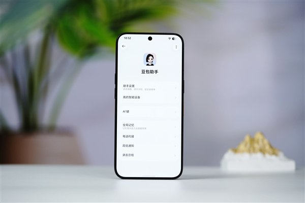
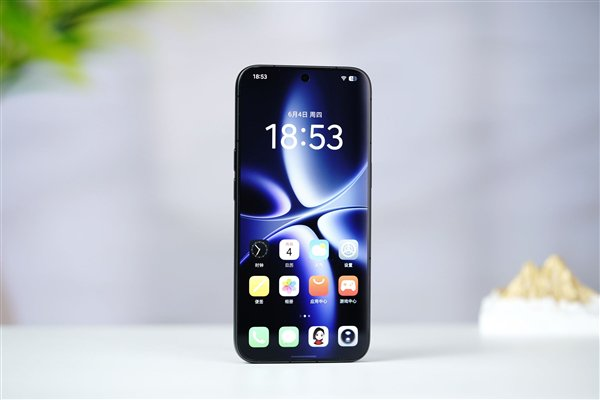
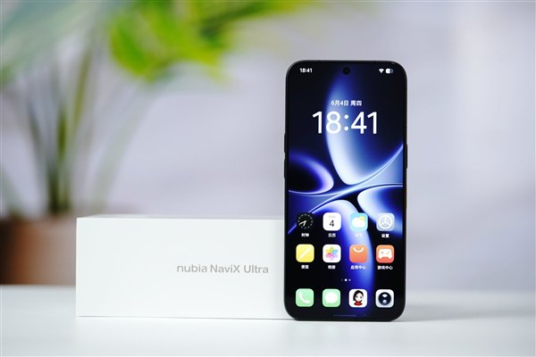
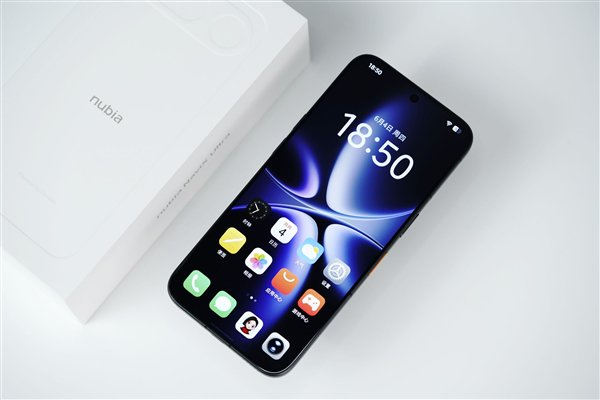

# 努比亚 NaviX Ultra 是 AI 新物种还是普通手机？谁对？

先给判分：**你同事对了一半，你也对了一半。**

对的部分在哪，错的部分在哪，得先把「AI 智能体手机」和「带 AI 助手的普通手机」的分界线画出来，不然这场争论只会各说各话。

## 传统 AI 助手的天花板：能开口，不能动手

先看你熟悉的那种手机。不管是 Siri、小艺还是蓝心小V，玩法都差不多——你问它天气，它答天气；你让它打开某个 App，它帮你点开。然后呢？打开之后干什么，就掉链子了。

知乎「如何评价努比亚 NaviX Ultra 发布」这个问题下，有个说法很形象：传统助手「或许能帮你打开 App，但一旦涉及到打开之后还要干什么，就开始掉链子」。它能帮你把美团点开，可点到哪个店、选哪道菜、用哪张券、下完单付完款，这条链路上每一环都得你自己来。AI 在这里更像一个更顺嘴的搜索框，离「能干活的员工」还差着一截。

*图源：快科技图赏*

## NaviX Ultra 想做的，是把「打开之后」接管过来

再看努比亚这台机器。9 月 16 日发布的 NaviX Ultra，官方口径是「全球首款 AI 智能体手机」，硬件由中兴努比亚主导，AI 体验由字节跳动豆包手机助手主导，售价 5999 元起、叠加国补到手 5499 元起（[财新网](https://m.caixin.com/2026-09-17/102485656.html)、[科创板日报](https://m.cls.cn/detail/2484912)）。

它和传统助手的差别，落在三个交互层面的系统级设计上：

**第一，任务逻辑从「一问一答」变成「交代一件事」。** 你不用说「打开携程」，直接说「帮我订后天去上海的高铁票，下午两点前到的」。它自己去跨 App 完成查票、选座、下单这条长链路，遇到没见过的 App 还能自主摸索、试错纠错，任务支持排队和插队，可以锁屏后下发指令让它后台静默执行（[快科技图赏](https://finance.sina.com.cn/tech/roll/2026-09-16/doc-inirzfsu6671042.shtml)）。这已经属于交互范式的切换，光比功能多少比不出来。

**第二，系统级入口。** 机身侧边有一颗带指纹鉴权的独立 AI 按键，一键唤醒；接入字节 Seed 全双工语音大模型，支持打断、连续对话和十余种方言；视频通话时能实时视觉理解，看到什么答什么（[中兴通讯官网新闻稿](https://www.zte.com.cn/china/about/news/20260916C1.html)）。传统助手装在一个 App 里，这套东西长在系统骨架里。

**第三，全局记忆。** 行程、购物、工作碎片自动留存，本地的短信、文档、录音都能被检索调用。传统助手的每次对话基本是失忆的，而它记得你，才会越用越顺手。

*图源：快科技图赏*

这三层叠起来，你同事的「两码事」论就有了立足点：**它和传统手机的差距，关键不在 AI 聪明多少，而在 AI 到底是一件外挂功能，还是底层架构。** 从这个角度说，把它叫「新物种」不算过分。

## 但你直觉「差别不大」，也不是没道理

因为你同事看到的发布口径，和实际到手的体验之间，还隔着一层现实的墙：**生态接口。**

财新的报道标题就点破了这一点——「多数超级应用尚不开放模型调用」。而这台机器的跨 App 执行，走的又是 MCP 协议路线——只有超级 App 主动提供 MCP 服务、开放数据和操控权限，豆包才能接入，门没开，协议再漂亮也进不去（[财新网](https://www.caixin.com/2026-09-17/102485656.html)、[搜狐科技](https://www.sohu.com/a/1076148011_122014422)）。换句话说，这台手机「能干什么」的上限，不取决于豆包有多聪明，取决于微信、支付宝、淘宝们愿不愿意把门打开。

这就解释了你为什么感觉差别不大。如果你日常用的那几个 App 没接进来，AI 智能体在你面前就退化成一个更活泼的语音助手——新物种的骨架，普通手机的体验。

此外还有几个值得泼冷水的信号：7 月 WAIC 展出期间该机不开放演示；官方宣传的「首销 1 秒破亿」属于厂商单方战报，没有第三方核验，而且媒体报道里还有开抢半小时后京东多数版本仍有货、黄牛从加价千元跳水到原价的另一面（[财新周刊](https://weekly.caixin.com/2026-07-25/102467939.html)）。同场展示的同类智能体手机，实测跨 App 执行耗时约为人工操作的两倍，演示过程还受 App 开屏广告干扰——努比亚这台的具体表现没公开演示，只能等用户实测。新物种的第一次量产，大概率是半成品状态。

*图源：快科技图赏*

## 所以到底谁对

回到你俩的争论，我的答案是：

**方向上是两码事，体验上还拉不开差距。**

你同事看到的是架构层面的质变——从「人操作 App」到「AI 操作 App」，这个范式转移是真的。按努比亚的口径，NaviX Ultra 是全球首款走完「大模型备案 + 终端入网」完整合规流程的 AI 智能体手机，9 月 1 日官宣拿到工信部入网许可——去年 12 月的一代 M153 还只是限量工程样机，这一台才算真正量产开卖。一旦超级 App 的接口开放度跟上，传统助手和它的差距会一夜之间拉开。

你看到的是体验层面的现实——在今天这个时间点，受接口开放度、执行稳定性、隐私顾虑（语音指令需上传云端）的制约，它日常用起来和一台装了聪明 AI 助手的手机，体感差距确实不大。

一句话送给你们俩：**它是真新物种的第一次量产，但离成熟的新物种还早。** 你同事买的是方向，你守的是当下。这台手机值不值得买，取决于你愿不愿为「方向」付 5999 元的抢先费。

---

*图源：快科技图赏*

*后续我会持续跟进 AI 智能体手机的实际体验评测和生态适配进展，关注我不迷路。*
