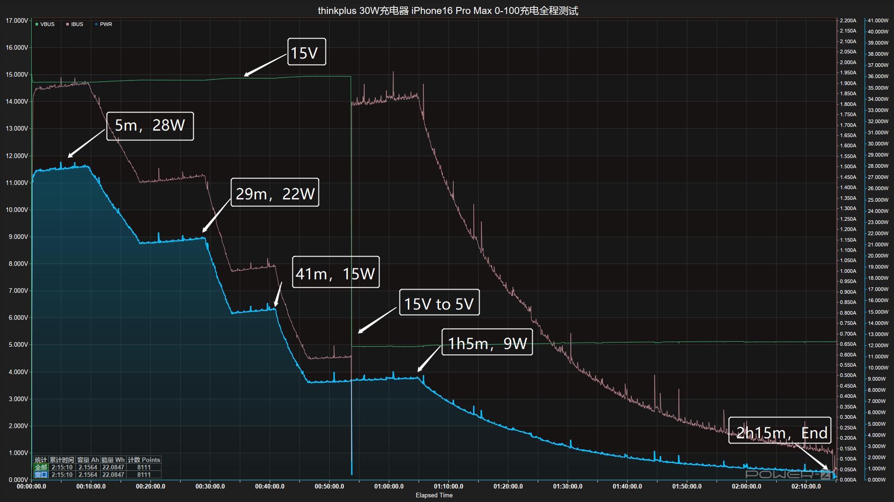
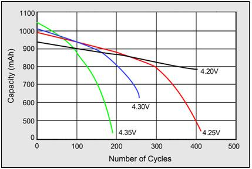
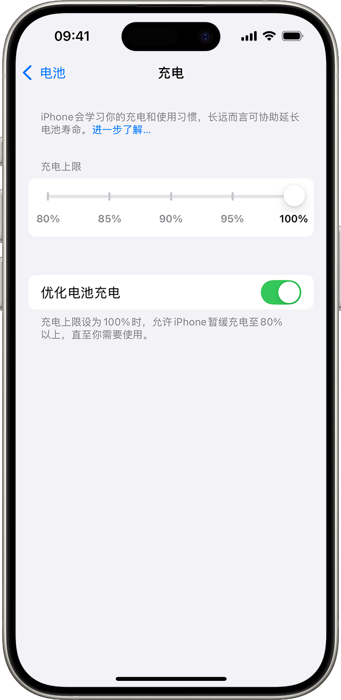

先说结论，**不能。电池寿命这件事，充电头的功率高低基本插不上手。**

这个误解来自一个很朴素的直觉，功率大等于充得猛，充得猛等于伤电池，所以小功率头更温柔、更养电池。

直觉错在一个地方，它以为充电头是主动灌电的那一方。

实际上正好反过来，充电的主动权一直在手机手里。充电头标的 65W、120W，意思是「我最多能给这么多」，不是「我一上来就给这么多」。插上之后，头默认只输出 5V 保底，然后等手机开口，手机说我支持 9V2A，它才升到 9V。你拿 120W 的头给只支持 18W 的手机充电，全程就是 18W，一瓦都不会多。电池管理芯片在手机里，吃多少，手机自己说了算。

所以大功率头不会把手机充爆，小功率头也不存在什么「温柔的电流」。**两者唯一的区别是充电快慢，不是对电池好不好。**

实测曲线最能说明问题。充电头网用 30W 的 thinkplus 头充 iPhone 16 Pro Max，峰值只摸到 28W，而且是全程一路往下走，28W、22W、15W，最后掉到 9W 收尾。标称 30W 是天花板，手机实际吃多少、什么时候吃多少，全是手机自己在调节。

> 图源，充电头网 POWER-Z 实测

那真正伤电池的是什么？两个，热，和满电泡着。

电池领域有个被引用烂了的经典测试，[Battery University 的 BU-808](https://batteryuniversity.com/article/bu-808-how-to-prolong-lithium-based-batteries)，同样的电池存放一年，室温 25 度、40% 电量存放的，容量还剩 96%，满电 100% 存放的只剩 80%。环境温度升到 40 度，满电那组只剩 65%。

| 存放一年后的剩余容量 | 40% 电量存放 | 100% 满电存放 |
|------|------|------|
| 室温 25°C | 96% | 80% |
| 40°C 环境 | 85% | 65% |

> 数据来源，Battery University BU-808 Table 3

看出规律了吗，电量顶满和温度升高，每一个都在加速衰减，两个叠在一起最狠。而「功率」这两个字，压根不在这个公式里。

电压和寿命的关系更直接。充电截止电压定在 4.20V 的电池，循环 500 次容量还剩近八成，截止电压抬到 4.35V 的，不到 200 次循环容量就跌破一半。满电，就是电池电压最高、压力最大的时刻。

> 图源，Battery University BU-808 Figure 5

不过我也得替「低功率护电池」的说法说句公道话，它不完全是空穴来风。快充功率拉满的时候，电池发热确实比慢充大，而热恰恰是真伤电池的。所以如果你边快充边打大型游戏，机身烫手，那是真在衰减，但伤它的不是 120W 这个数字，是四十多度的温度。况且现在的手机都有温控，热了自己会降速，轮不到你操心。

真想护电池，与其纠结充电头的功率，不如做三件实在事。别边充边玩大型游戏，打开系统里的优化充电或者 80% 上限，夏天别把手机扔在暴晒的车里。每一件都比「换个小功率头」管用得多。

> 图源，苹果官网支持页面。安卓各家也有类似的智能充电或电池保护开关，位置不同，道理一样

最后说句实在话，电池是消耗品，正常用两年衰减一两成都是常态，不用供着它。**功率决定的是充电速度，不是伤害力度。你花钱买快充，买的是时间，不是电池的命。**

---

充电头「设备要多少给多少」的握手细节，我在这篇里讲透了，[为什么 100W 充电器给 iPhone 充电只有 5W？充电协议一篇讲透](https://zhuanlan.zhihu.com/p/2073203760332026596)。想看更完整的充电器选购逻辑，主文在这里，[多口充电器选购指南：为什么看了总瓦数就下单的人，大多都后悔了](https://zhuanlan.zhihu.com/p/2070624966568064377)
