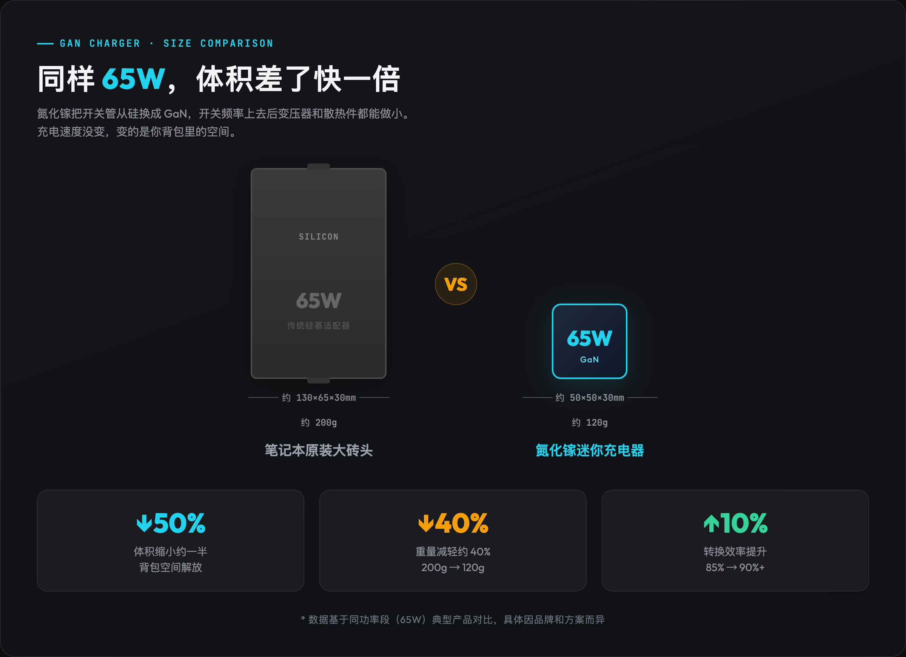
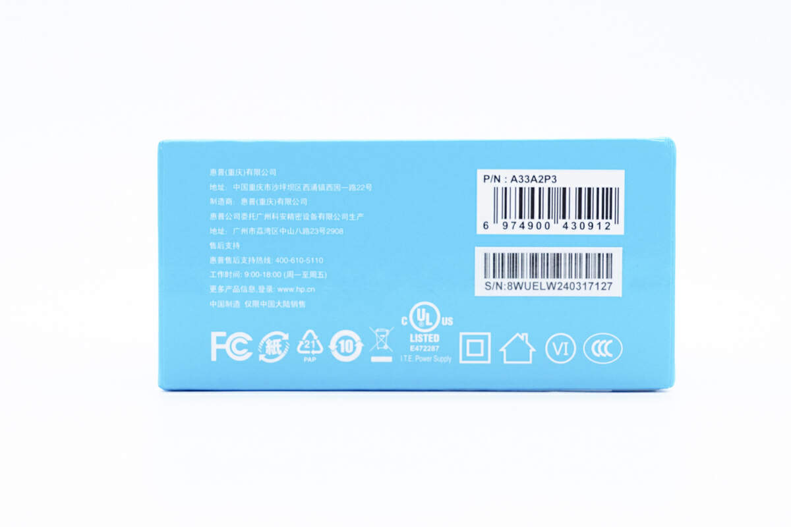
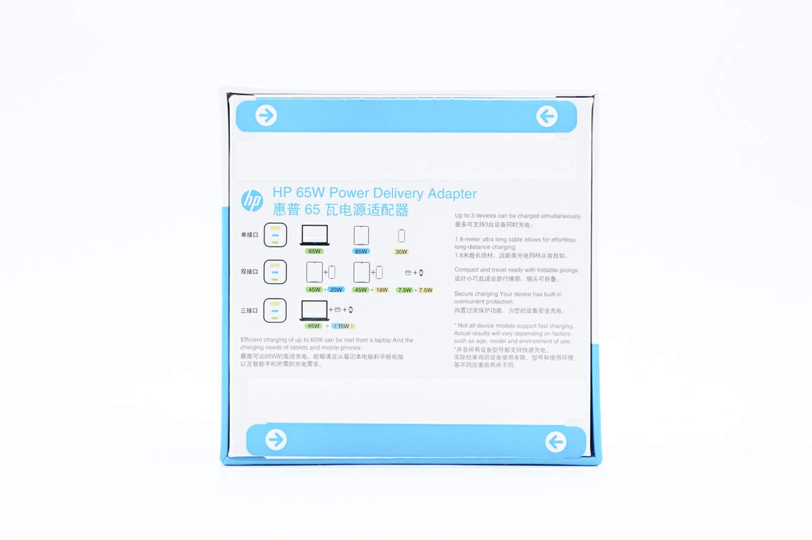

# 氮化镓充电器和普通充电器有什么主要区别？

> 对应知乎问题：氮化镓充电器和普通充电器有什么主要区别？

很多人以为氮化是一种更快的充电技术。

其实不是。

氮化和普通充电器的区别，其实就一件事，开关管的材料从硅换成了氮化镓。充电协议、输出功率、给手机充多快，这些跟材料没关系。

那换了材料之后发生了什么？

三件事。

## 一、体积砍半

这是氮化镓最直观的变化。

开关频率提上去之后，变压器和散热件都能做小。同样 65W 的输出，传统硅基方案是一块砖头，你笔记本原装那个大适配器就是。氮化方案能做到接近当年苹果 30W 头的大小。

我拆过一个惠普 65W 氮化，跟苹果老款 61W 硅基充电器放一起，体积差了快一倍。重量也从 200 克出头降到 120 克左右。

*同样 65W，体积差了快一倍*

这个区别对谁重要？

差旅党。

出差带一个 65W 氮化，能同时喂笔记本、手机、耳机，一个顶三个，背包轻 200 克，酒店插座也不打架。对固定桌面用的人来说，体积差异感知不强，反正插那儿就不动了。

---

## 二、发热更低、效率更高

氮化的导通电阻比硅低，开关损耗小，转换效率通常能做到 90% 以上，传统硅基方案在 80-85% 左右。

说人话就是，同样功率输出，氮化浪费的电少，变成热量的部分也少。桌面长期插着一个 100W 的氮化充电器，外壳温感比老式方案安心得多。

*图源：惠普 65W 氮化镓拆解*

但这不意味着氮化不发热。任何充电器满载都会热，只是氮化的热密度更低、温控更稳。白牌氮化如果散热设计偷工减料，一样烫手。

---

## 三、多口同时快充成了可能

传统硅基方案做三口，体积和发热都压不住。氮化因为效率高、体积小，多口设计在工程上可行了。

65W 2C1A、100W 3C1A 这些规格，基本是氮化方案的专利。一个插座位同时给笔记本、手机、耳机快充，这个体验是传统充电器给不了的。

但这里有个大坑。

多口同插功率断崖。标称 100W 三口，插满后很多产品固定降档成 45W+30W+15W，笔记本需要 65W 就会边充边掉电。充电头网实测三星原厂 65W 2C1A，三口插满是 35W+25W+5W，原厂都这样，白牌更离谱。

买多口氮化之前，一定要看详情页的功率分配表。没有这张表的，基本可以 pass。

*图源：惠普 65W 氮化镓拆解*

---

## 四、那什么没变？

充电速度没变。

这个坑踩的人最多。

氮化头标 100W，你的设备未必能吃 100W，充电速度由协议决定，不由瓦数决定。

iPhone 峰值就 27W 左右，认准 PD 即可，买 140W 纯属浪费。三星要 45W 满速必须充电器支持 PPS，否则只有 15W。华为、OPPO、vivo、小米的私有协议，66W、120W 这些，第三方氮化头通常只能跑 10W-18W 基础档。

你每天摸到的充电速度，协议说了算，跟你花多少钱买的氮化头没半毛钱关系。氮化提高的是功率天花板，但你的设备能不能吃到那个天花板，协议卡着呢。

---

## 五、所以区别到底在哪？

氮化不是让某个设备充得更快的魔法。它是让你在插座有限、背包空间有限的世界里，只带一个头就够用的从容。

落到选择上。

只给手机充电，普通 20-30W 小头就够了，20-45 元，没必要上氮化。

差旅，轻薄本加手机加耳机，65W 2C1A 氮化是性价比甜点，50-120 元。

固定桌面，一个插座扛所有，100W 起步的多口氮化，75-150 元。

游戏本用户，65W 喂不饱，边用边掉电，别买。

为少带买单，值。

为瓦数买单，亏。

---

完整的协议对照表、功率分配表怎么看、收货后怎么做满载和插拔测试，都在这篇长文里：[多口充电器选购指南：为什么看了总瓦数就下单的人，大多都后悔了](https://zhuanlan.zhihu.com/p/2070624966568064377)。里面附了一张决策图和四个实测翻车案例图，建议存图。
