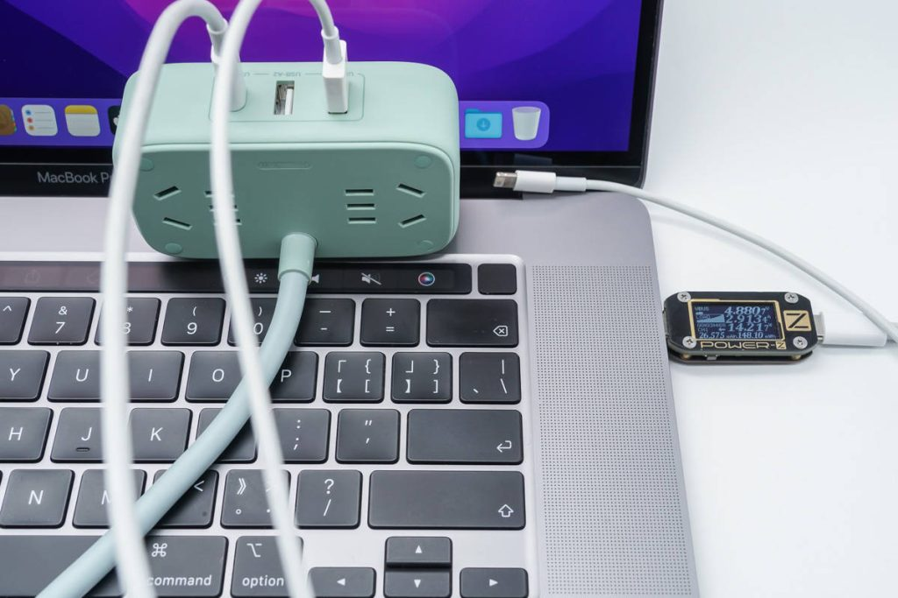
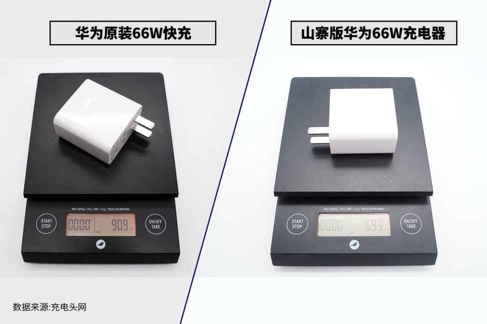
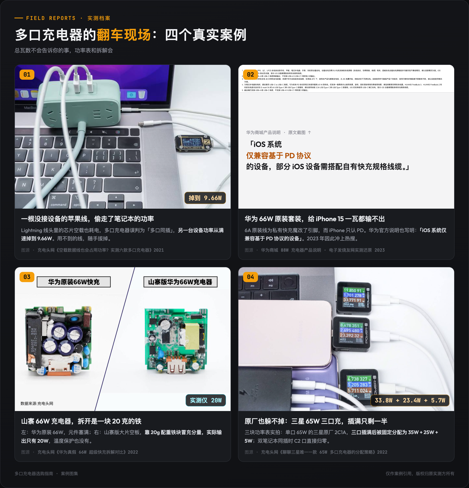
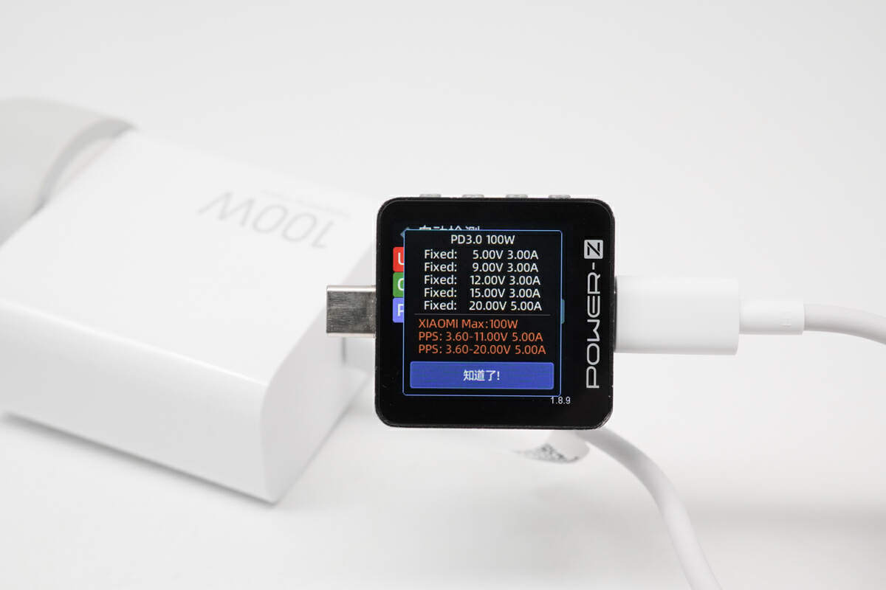
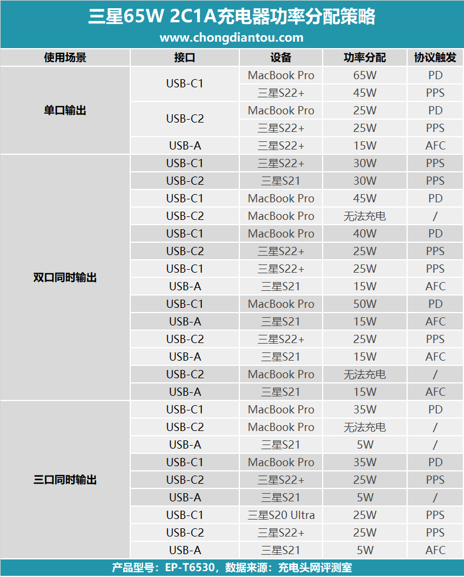
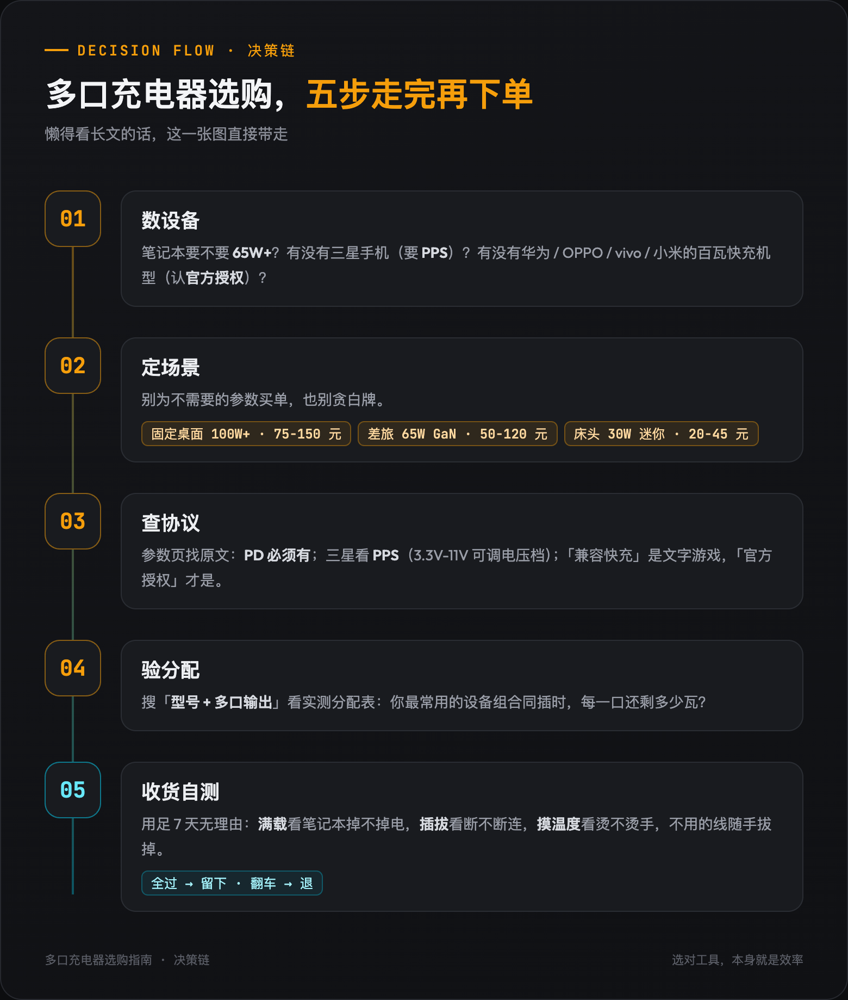

# 多口充电器怎么选？2026年氮化镓多口充电器推荐与选购指南：只看总瓦数下单的人大多后悔了，搞懂充电协议和功率分配，iPhone、笔记本、安卓手机桌面/差旅/床头全场景抄作业

写这篇之前，我把充电头网这几年的多口充电器实测、电商评论区和知乎的翻车帖翻了个遍。先说三个真事，你就知道这个品类的水有多深了。

第一件，一根没接任何设备的苹果 Lightning 线插在多口充电器上，线头里的芯片会让充电器误判成多口同时输出，另一台设备的充电功率直接从满速掉到 9.66W。这是充电头网实测出来的，**一根「空线」就能偷走笔记本大半功率**。

第二件更魔幻。2023 年 iPhone 15 刚换 USB-C 口的时候，「华为原装充电套装充不了 iPhone」这个话题刷屏过一轮。原因查出来以后大家都哭笑不得，那根 6A 原装线是为华为私有快充魔改过的，而 iPhone 只认 PD 协议，暗号对不上，66W 直接变 0W。

第三件，充电头网拆解过一款山寨华为 66W 充电器，里面塞了一块 20 克的配重铁块冒充用料，实际输出只有 20W。

三个案例，指向同一个反常识的结论。

**买多口充电器，看总瓦数是最不重要的第一步。**

很多人盯着「100W」「140W」的数字下单，结果发现给 iPhone 充电还是 20W，笔记本插上反而掉电，多个设备一起用时功率断崖式下跌。

问题出在你看错了参数。**充电协议和功率分配逻辑，远比总功率那个数字重要。**

下面把这个品类真正要搞懂的东西讲一遍。先是四个底层逻辑，每条只留结论，想看展开论证的，点对应链接去同系列的深度文章。

第一个逻辑，协议匹配决定实际速度，功率只是上限。

充电器标 100W，不代表你的设备能吃到 100W。真正决定速度的是充电器和设备之间能不能对上暗号，这个暗号就是充电协议。**你的设备只认它听得懂的协议，协议对不上，标称 100W 也可能只跑 5W。**

简版口诀记一下，苹果用户认 **PD**，三星用户认 **PD + PPS**，笔记本认 **PD 65W/100W/140W**，华米 OV 用户想要手机满速只能买**原装或官方授权**，多品牌安卓混用的家庭，「**UFCS 认证**」是加分项。

想深挖的看这篇，[充电协议篇：为什么 100W 充电器给 iPhone 只跑 5W](https://zhuanlan.zhihu.com/p/2073203760332026596)，主流协议表、私有协议、UFCS、四个坑、完整口诀都在里面。

第二个逻辑，多口同时用的时候，功率分配是一门玄学。

标称「100W 三口」，单口确实能到 100W，但三口插满，很多产品会**固定降档**成 45W + 30W + 15W，笔记本立马掉电。充电头网实测过三星原厂 65W，三口插满只剩 35W + 25W + 5W。连原厂都这样，白牌只会更离谱。所以优先选支持**动态功率分配**的产品。

记住这句话，**总功率是广告词，分配表才是合同条款。**

展开内容在 [功率分配与验货篇：多口同充为什么掉速](https://zhuanlan.zhihu.com/p/2073204024480895656)，空线偷功率、插拔断电、下单前查三张表、收货后三个测试，都讲透了。

第三个逻辑，MFi 认证的是线，不是充电器。

带 USB-A 口的充电器接 Lightning 线给旧款 iPhone、iPad 充电，那根线必须有 **MFi 认证**，宣传「MFi 认证充电器」的都是偷换概念。iPhone 15 之后换成 USB-C 口，C to C 线走标准 PD 协议，不再需要 MFi。**MFi 只保护 Lightning 配件，不保护 USB-C 配件。**

第四个逻辑，100W 以上要配 EPR 线。

普通 3A 线最高 60W，5A E-Marker 线最高 100W。140W 以上走的是 PD 3.1 **EPR**，普通 100W 线插上 140W 充电器会自动降级到 100W。只有 MacBook Pro 16 寸和追求 140W 以上输出的设备，才需要专门买 EPR 线。

线材这块两条放一起讲了，[充电线篇：MFi、3A/5A、EPR 一次讲清](https://zhuanlan.zhihu.com/p/2073203462146372242)。

原理讲完了，下面全是动作。按你的真实场景选，别为不需要的参数买单。

先说最常见的场景，固定桌面，一个排插要扛住所有设备。

显示器、主机、音箱已经占满排插，只剩一个位置给充电器，但又要同时供笔记本、手机、耳机甚至手表。这种时候核心诉求就三条，**不动如山的高功率，合理的接口配比，以及别发热到能煎蛋。**

怎么选？总功率建议 100W 起步，C 口至少两个，笔记本加手机双快充是刚需。确认**单 C 口至少支持 65W PD**，否则接轻薄本都会边充边掉电。接口布局优先 **2C1A 或 3C1A**，C 口是未来，A 口留给老旧设备和手表。发热控制看用料，**氮化镓（GaN）**方案体积更小、发热更低，桌面长期插着更安心。

有个实用细节，如果你用 MacBook，注意选支持 **PD 3.1 / 140W** 的型号，才能喂饱 16 寸 MacBook Pro 满血运行。对大多数 Windows 轻薄本，65W 到 100W 就够了。

价格上给你个锚点。100W 到 120W 的多口氮化镓已经很卷了，主流品牌日常价 75 到 150 元，大促时百元内就能拿下。需要 PD 3.1 / 140W 的型号大概 130 到 250 元。反过来，标价三五十块的「100W 多口快充」基本是虚标或老方案换皮，别碰。

具体型号参考，京东自营，2026 年 8 月查的价，大促会更低。

- **[酷态科 10 号 120W 氮化镓套装](https://item.jd.com/100097007833.html)**，到手约 137 元，已售 50 万+。2C1A 三口、183g、插拔不断连，支持小米 120W 澎湃秒充加 100W PD，还附送 6A 数据线。**适合小米/红米手机配 Windows 轻薄本的组合。不适合 16 寸 MacBook Pro 用户，它没有 PD 3.1，跑不满 140W，别指望。**
- **[Anker 140W 智显充](https://item.jd.com/100142956510.html)**，补贴价约 222 元（日常 259），京东多口充电器热卖榜第 2。3C1A 四口，两个 C 口盲插都能单口 140W PD 3.1，机身上有功率和温度显示屏。**适合 MacBook Pro 16 寸用户和桌面设备多的人。不适合只充手机平板的人，性能过剩，多花的钱用不上，295g 的重量出差也嫌沉。**

再说第二个场景，外出通勤和差旅，一个充电器喂饱所有。

这个场景的核心矛盾是，**体积要小、重量要轻，但绝不能牺牲同时快充的能力。**

不少人出差会带三个充电器，电脑 65W 砖头、手机 20W 头、手表无线座。换成一个支持 PPS 的 65W 2C1A 氮化镓，一个顶三个，背包轻 200 克，酒店插座也不打架了。

差旅选购的优先级，我自己的经验是这样排的。体积和重量是第一硬指标，氮化镓方案能把 65W 做到接近当年苹果 30W 头的大小，远小于传统笔记本 65W 砖头。**折叠插脚**是必选项，收纳友好，也不会刮花包里其他设备。如果你是三星用户，**PPS 协议必须有**，否则只能触发 25W 而不是 45W 满速。另外认准 **100-240V 宽电压**，出国不用带转换头。

价格上，这个档位是价格战最狠的地方。65W 2C1A 氮化镓，主流品牌 50 到 120 元就能买到，性价比选手常年蹲守 50 元档，绿联、倍思、Anker 这些在 80 到 120 元档。说真的，这个品类没必要追贵，但也别贪 20 多块钱的白牌，省下的钱不够赔一块电池。

具体型号，同样是 2026 年 8 月查的价。

- **[酷态科 65W 氮化镓多口充电头（京东自营）](https://item.jd.com/100068768086.html)**，到手约 86 元，三口同充、折叠插脚，评价 20 万+，酷态科的多口功率分配策略在百元档里口碑最稳。**适合绝大多数「轻薄本加手机加耳机」的差旅组合。不适合游戏本用户，65W 喂不饱，边用边掉电。**
- **[绿联 65W 2C1A 折叠款](https://item.jd.com/10125107872913.html)**，约 99 元，老牌配件厂的保守调优，温控口碑好。**和酷态科二选一就行，谁的券后价低买谁。同样不适合游戏本和 16 寸 MacBook Pro。**

第三个场景就简单多了，床头、客厅这种轻量场景。

如果只是给手机、耳机、手表过夜慢充，真不用盲目追高功率。一个 30W 到 45W 的 1A1C 小头反而更实用，**20 到 45 元就能买到主流品牌**，价格低、发热小、不占插座空间。

这个场景只有一句提醒，别因为它是小头就忽视协议。iPhone 用户依然要认准 PD，否则床头慢充会变成整夜充不满。

- **[品胜 30W 双口氮化镓](https://item.jd.com/100166134223.html)**，约 39.9 元，已售 6 万+，苹果安卓通用。**适合手机加耳机过夜充。不适合想用它喂笔记本的人，也不适合三星 45W 用户，30W 就是它的天花板。**
- **[绿联 30W 双口快充头](https://item.jd.com/100006064958.html)**，到手约 40.9 元，已售 10 万+。**和品胜互为平替，哪个便宜买哪个。同样的功率上限，别指望它干重活。**

型号选好了，还差一步，验货。

下单前查三张表，单口输出规格、多口功率分配、协议列表原文。收货后趁 7 天无理由做三个测试，满载、插拔、温度。这套 10 分钟验证清单，能避开这个品类九成的坑。

清单在 [功率分配与验货篇：多口同充为什么掉速](https://zhuanlan.zhihu.com/p/2073204024480895656) 这篇里，照着做就行。

要是你懒得看长文，下面这张决策链图直接带走。数设备、定场景、查协议、验分配、收货自测，五步搞定。

说完了，聊两句收尾。

所谓数码产品的选购，说到底都是先理解约束条件，再为真实需求付费。多口充电器这个品类尤其如此，它存在的意义不是让某个设备充得更快，而是**让你在插座有限、时间有限、背包空间有限的世界里，少一点纠结，多一点从容。**

照例交代一下利益关系。文中链接是京东商品链接，通过链接下单我会有少量返佣，价格和你自己搜完全一样，介意的话直接按型号去京东搜就行。返佣不影响推荐顺序，每一款我都写了不适合谁，佣金更高的款反而被我劝退了一类人。

什么时候会觉得这事儿值了？当你终于能从包里只掏出一个充电器，同时喂饱笔记本和手机的那一刻。

**选对工具，本身就是效率。**

---

整理不易，如果这篇对你有启发，欢迎**点赞、收藏**，买之前翻出来对照着查一遍。也欢迎在评论区聊聊你的看法，你踩过多口充电器的什么坑，或者有什么想了解的型号，我看到都会回。

