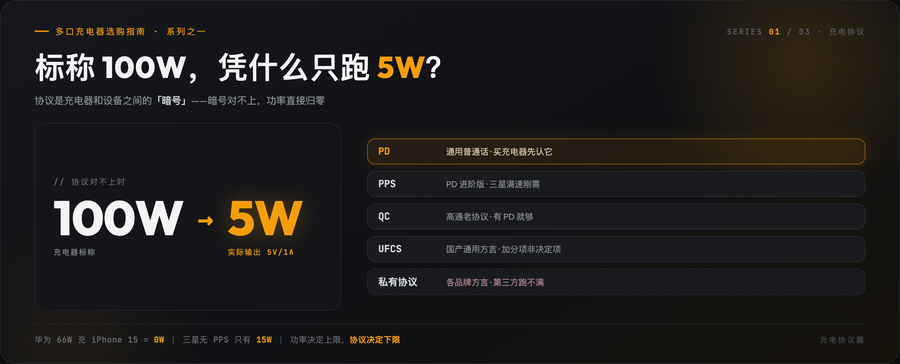
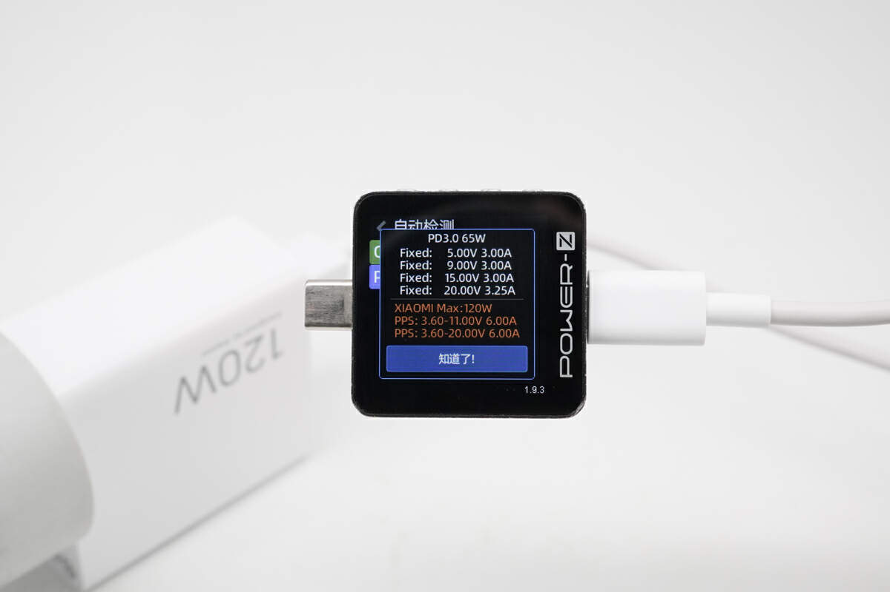
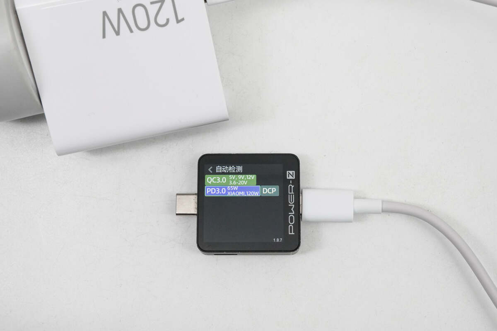
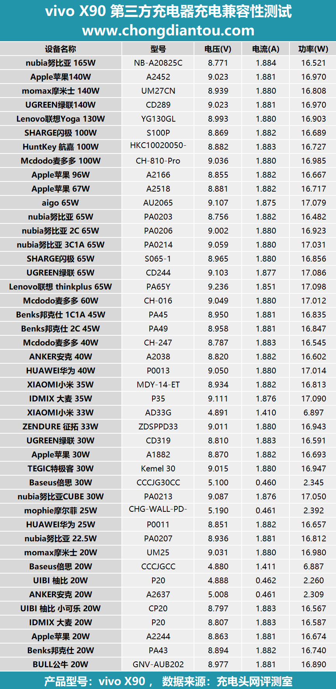

# 为什么 100W 充电器给 iPhone 充电只有 5W？充电协议一篇讲透

2023 年 iPhone 15 刚换 USB-C 口那阵，「华为原装充电套装充不了 iPhone」的话题刷屏过一轮。66W 的原装充电头配原装线，给 iPhone 充电一瓦都输不出来，直接归零。

一个 66W 的头，为什么连 5W 都给不了？

答案藏在一个大多数人下单时根本不看的参数里，**充电协议**。这篇把协议一次讲透，主流协议有什么区别、私有协议为什么第三方跑不满、UFCS 值不值得认，以及选购时最容易踩的四个坑。

这篇是《多口充电器选购指南》系列文章之一。主文讲按你的场景买什么，这篇讲为什么协议比瓦数重要。

真正决定充电速度的，是充电器和设备之间能不能对上暗号，这个暗号就是**充电协议**。

那协议到底是个啥？

你可以把充电器想象成一个送水工，手机是接水的人。送水工如果只会用消防水枪猛灌，接水的人手里却只有一个小杯子，那要么杯子接不住，要么直接被冲坏。所以双方得先商量好，用多大的水流、什么样的接口、什么时候该减速、什么时候该停。这套沟通规则，就是充电协议。

没有这套规则，充电器默认只会给一个很小的电流，通常是 5V/1A 或 5V/2A，约 5W-10W，保证安全，但速度极慢。

**核心认知一句话，你的设备只认它听得懂的协议。协议对不上，标称 100W 也可能只能跑 5W。**

主流协议其实就那几种，一张表能看懂。

| 协议 | 你可以把它理解为 | 典型功率 | 常见于 |
|------|---------------|---------|--------|
| **PD (Power Delivery)** | 国际通用语言，几乎所有新设备都懂 | 18W - 240W | iPhone、iPad、MacBook、Switch、大部分安卓旗舰、Windows 笔记本 |
| **PPS (Programmable Power Supply)** | PD 的进阶版，可以「微调电压」 | 25W - 45W | 三星 Galaxy、部分国产安卓旗舰 |
| **QC (Quick Charge)** | 高通家的快充语言 | 18W - 100W+ | 小米 / OPPO / vivo 等早年中高端机型 |
| **Apple 2.4A** | 苹果老设备的旧语言 | 12W | 旧 iPad、AirPods、iPhone 8 以前 |
| **私有协议** | 各品牌自己的「方言」 | 65W - 150W+ | 华为 SCP、OPPO VOOC/SuperVOOC、vivo FlashCharge、小米 120W |
| **UFCS 融合快充** | 国产安卓合制定的「通用方言」 | 跨品牌 40W 左右 | 华为 / OPPO / vivo / 荣耀新机型；详见下文专节 |

表看完了，挨个聊几句。

先说 PD，这是最该优先支持的协议。PD 是 USB-IF 组织制定的通用标准，可以理解为充电界的普通话。它最大的特点是**电压档位多**，从 5V 一路支持到 48V（PD 3.1），所以既能给手机快充，也能给笔记本供电。

现在市面上只要是 USB-C 口的新设备，几乎都会支持 PD。如果你只记一条选购原则，那就记这条，**买充电器，先看它支不支持 PD。**

再说 PPS，三星党和部分安卓党的刚需。PPS 是 PD 3.0 的一个可选扩展，你可以理解为 PD 加上了无级变速功能。普通 PD 的电压是固定档位，比如 5V、9V、12V，而 PPS 可以在 3.3V-21V 之间以 0.02V 的步进微调。

为什么需要这个？因为三星 Galaxy 系列（S20 及以后）的快充逻辑是，**只有检测到 PPS 协议时，才会触发 25W 或 45W 满速**。普通 PD 给三星充电，通常只能跑到 15W 左右。所以如果你是三星用户，选充电器时一定要看清详情页有没有写「PPS 支持」或「支持 3.3V-11V/3A 或 3.3V-16V/2.8A」。

至于 QC 和 Apple 2.4A，这两位是正在被淘汰的老协议。QC（Quick Charge）是高通的旧快充方案，早年在小米、OPPO、vivo 等机型上常见。Apple 2.4A 是苹果 Lightning 时代早期的 12W 协议。现在的新设备上它们已基本被 PD 取代，只有在老设备、车载充电器或移动电源上还能见到。选购多口充电器时，**不必把 QC 或 Apple 2.4A 作为重点关注**，有 PD 就够了。

真正麻烦的是私有协议。

除了 PD/PPS 这种通用语言，国产安卓品牌大多有自己的私有快充协议。你可以把它们理解为各品牌之间的方言，即便接口都是 USB-C，暗号对不上，速度就上不去。主流品牌的私有协议速查表放这。

| 品牌 | 私有协议 | 常见功率 | 特别说明 |
|------|---------|---------|---------|
| **华为 / 荣耀** | SCP / FCP | 22.5W / 40W / 66W / 88W / 100W | 荣耀早期与华为同源，后期 Magic Power 逐渐独立，但握手逻辑类似 |
| **OPPO / 一加 / realme** | VOOC / SuperVOOC | 65W / 80W / 100W / 150W / 240W | 对充电线和充电器芯片要求极高，第三方几乎无法满血 |
| **vivo / iQOO** | FlashCharge / 双引擎闪充 | 44W / 66W / 80W / 120W / 200W | 120W 以上基本只有原装能触发 |
| **小米 / 红米** | 澎湃快充 / 120W 神仙秒充 | 33W / 55W / 67W / 120W | 部分第三方充电器可握手 27W-33W 的 PD/QC，但 120W 只能原装/认证 |
| **三星** | 不算严格私有，但依赖 PPS | 25W / 45W | SFC（Super Fast Charging）2.0 45W 必须 PD 3.0 + PPS |

它们的共同点是，**只有原装或品牌认证的充电器+线才能触发最高功率**。第三方多口充电器通常只能触发 PD/QC 的 10W-18W 基础档位，离标称的 65W、120W 差很远。这倒不是充电器厂商故意限制，是这些私有协议需要特定的芯片、特定的线材、特定的握手逻辑，第三方没有授权就做不了。

那怎么找能匹配私有协议的充电器？我自己的经验是四条路。

最稳的一条，看品牌官方配件。华为、小米、OPPO、vivo、荣耀自家出的多口 GaN 充电器，通常兼容自家私有协议，这是最安全的选择。

然后看有没有品牌授权或认证标识。详情页如果写了「支持华为 SCP」「支持 OPPO SuperVOOC」「支持小米 120W」这类字样，价格也不低，才可能是真授权。只写「兼容」不写具体协议的，基本都是文字游戏。好消息是授权正在松动，据公开报道，小米已把澎湃秒充协议开放给第三方，安克、倍思 2025 年有拿到官方授权的新品，能触发小米 90W 秒充。认准「官方授权」四个字，而不是「兼容」。

再就是充电套装是不是成套卖。私有协议对线材也有要求，原装头和原装线必须配套，混用不同品牌的线，可能连 18W 都到不了。

还有一条，也是最实用的策略，双持。私有协议手机用原装头满速，多口充电器给笔记本、平板、耳机、手表这些通用 PD 设备用。

接着聊 UFCS。

私有协议互相打架的问题，厂商自己也知道。UFCS（融合快充）就是中国信通院牵头，华为、OPPO、vivo、荣耀等共同制定的国产统一快充标准，目标是让不同品牌的充电器和手机说同一种话。

这件事在 2025 年之后明显提速。2025 年 5 月 UFCS 2.0 发布，华为、OPPO、vivo、荣耀签署互授权，实现 **40W 无鉴权跨品牌互通**，你用 OPPO 的 UFCS 充电器给华为手机充，也能跑到 40W 左右。生态也在变大，据 UFCS 产业联盟公开的认证数据，截至 2026 年 3 月，UFCS 认证产品已有 284 款，手机 86 款、充电器 98 款，覆盖 47 家品牌。还有个细节我很喜欢，UFCS 1.2 起，认证证书上强制标注实测互通功率。一加 Ace 5 至尊版拿到行业首张 40W UFCS 认证，证书直接写明「40W 公有 + 100W 私有」双协议，不让你猜。

这个思路和本系列的主线完全一致，**不看广告词，看实测数据。**

但选购时别高估它，三条限制得知道。

一是功率天花板低。跨品牌互通目前封顶 40W-44W，和各家私有协议的 100W+ 差着一个量级，也追不上很多机型的 PD/PPS 档位。

二是小米不在牌桌上。小米 2025 年初[被曝出已退出 UFCS 联盟](https://news.qq.com/rain/a/20250214A02KGB00)，转向 PPS 路线，小米 17 系列已全系兼容 100W PPS，第三方 PPS 充电器也能给它满速，充电头网有兼容性实测。用小米的话，认准 PPS 比认 UFCS 实在。

三是笔记本和 iPhone 与它无关，它们只走 PD。UFCS 解决的是国产安卓手机之间的问题，不是多口充电器的全部问题。

**所以结论很直白，UFCS 认证是加分项，不是决定项。** 如果你和家人是华为 / OPPO / vivo / 荣耀混着用，买多口充电器时看到「UFCS 认证 + 标注互通功率」是实打实的加分。但 PD/PPS 仍然是你必须先确认的主力协议。

那怎么查自己的手机支不支持 UFCS？四招，按省事程度排。

最准的一招，查官方规格页。去品牌官网或电商旗舰店找到你那个型号的详细参数页，在充电规格或数据功能那一栏，看有没有标注 UFCS 或融合快充。

第二招，对照认证机型列表。据 [UFCS 联盟公布的认证信息](https://www.ufcs.com/)，目前通过认证的手机主要集中在这些牌子，我挑有代表性的列一下。

| 品牌 | 部分已认证机型 |
|------|--------------|
| **OPPO** | Find X9 系列、Reno15 系列、K13 Turbo Pro、A6 系列等 |
| **一加** | 13 / 13T / 15、Ace 5 Pro / 6 系列、Turbo 6 系列等 |
| **vivo / iQOO** | X100 Pro、Y300 Pro、Neo11 等 |
| **华为** | Mate 70 Air、Mate 80 Pro、Pura 90 Pro Max、Pura X Max 等 |
| **荣耀** | Magic 8 系列（含 RSR 保时捷设计版） |
| **realme** | GT6、Neo8 等 |

完整名单在 [UFCS 联盟官网](https://www.ufcs.com/) 的认证产品页能查到，买之前花一分钟对一下最稳。

第三招，实测。如果你已经有 UFCS 充电器，借或买一个 POWER-Z 测试仪插上，握手成功屏幕上会直接显示 UFCS 的电压电流档位，前面私有协议那段功率表读协议的图，就是这类测试仪干的事。

第四招反过来推。拿一个明确标注支持 UFCS 的第三方充电器插你的手机，功率能到 30W 以上，大概率支持。只有 10W 上下，基本就是不支持，或者没握手成功。

原理讲完了，下面全是实战里最容易踩的坑，四个。

第一个坑最常见，充电器上标 100W，你的设备可能只跑 5W。典型场景，你买了一个主打 QC 快充的充电器，给 iPhone 15 充电。iPhone 15 支持 PD，但不支持 QC。充电器发现对不上暗号，为了安全只能退回最基础的 USB 充电功率，通常是 5V/1A 或 5V/1.5A，约 5W-7.5W。于是出现一个 100W 的充电器充 iPhone 比祖传 5W 头还慢的魔幻场景。

开头那个「华为 66W 充不了 iPhone」的热搜也是同一个原理。后来多方实测搞清楚了，问题出在华为那个 USB-A 口充电头配的那根 6A A-to-C 原装线上，它的引脚是为私有快充魔改过的，而 iPhone 15 只听得懂 PD 一种协议，对上一个不认的协议，输出直接归零。换 C 口充电头加普通 C to C 线就没这个问题。

第二个坑是文字游戏，「兼容苹果快充」。很多充电器详情页写这五个字，但只兼容 Apple 2.4A（12W），并不支持 PD。iPhone 8 以后想要 20W 快充，必须选明确标注支持 **PD 3.0** 的充电器。

第三个坑专门坑三星用户，买了不带 PPS 的充电器。三星 Galaxy 对 PPS 非常敏感，普通 PD 充电器给它充，大概率只有 15W，带 PPS 的才能触发 25W 或 45W。还有个更隐蔽的地雷，不少人买了支持 PPS 的 45W 充电器，用的却是普通 3A 线，结果系统为了安全自动降到 25W。网上「买了 45W 头完全没效果」的吐槽帖里，一大半是线材拖了后腿，三星 45W 超快充需要 4.5A 级别的电流，3A 线物理上就扛不住。

第四个坑，用私有协议手机指望第三方充电器满血。知乎上有个很有代表性的实测，用华为 MateBook 14 原装的 65W PD 充电器给华为手机充电，只能走 18W 的 FCP 档位。连华为自家笔记本配的充电器都触发不了手机的 SCP 超级快充，因为高功率 SCP 至今没有开放授权。也有博主横向测过几款标称 66W 的第三方充电器，给华为旗舰充电全部封顶在 40W 左右，只有原装 66W 的一半多。

说真的，如果你用的是华为、OPPO、vivo、小米的百瓦快充手机，第三方多口充电器通常只能给你 10W-18W 的基础 PD/QC 功率，即便赶上协议授权松动的新品，也大多在 40W 以内。对快充有执念的话，建议双持，原装头给手机满速，多口头给笔记本、耳机、手表等其它设备。

如果你懒得记这么多，我帮你压缩成几句话，按你是谁对号入座就行。

苹果用户认准 **PD 协议**，但功率要按设备选，别盲目追高。iPhone 20W 足够，Pro Max 峰值约 23-27W。iPad mini 20W 左右，iPad Air 25-30W，iPad Pro 11 英寸约 30W，12.9/13 英寸约 35-38W。MacBook Air 日常 30-45W 足够，想快充建议 67W-70W。MacBook Pro 13 寸 60-67W，14 寸 96W，16 寸 140W 且需要 PD 3.1。

三星用户认准 **PD + PPS**，缺一个都白买。

笔记本用户认准 **PD 65W/100W/140W**，按自己电脑的需求选。

华米 OV 用户想要手机满速，只能买**原装或品牌认证充电器**，第三方多口头当辅助用就好。

家里多品牌安卓混用的，看到「**UFCS 认证**」且标注实测互通功率的产品，是实打实的加分项，跨品牌也能有 40W 左右的快充，但别指望它替代私有协议的满速。

多设备混合用户，优先选 **PD 协议覆盖全、接口多、功率分配灵活**的充电器。

对号入座完了，那具体买哪套？充电器和线是配套的，暗号要两头都对得上，我按协议帮你把头和线搭好。价格都是 2026 年 8 月在京东查的，大促只会更低。

苹果用户这套最省心，认 PD 就行。

- **[绿联 30W 双口快充头](https://item.jd.com/100006064958.html)**，到手约 41 元，京东自营，已售 10 万+，iPhone 和 iPad 都喂得饱。线的部分分两种情况，iPhone 14 及之前的 Lightning 机型，配 **[绿联 MFi 认证 C to L 线](https://item.jd.com/100005668392.html)**，约 54 元，苹果直采芯片不弹窗。iPhone 15 之后是 USB-C 口，随便一根正规品牌的 C to C 线就行，不用看 MFi。**适合纯苹果生态的人。不适合家里还有安卓百瓦快充机的，30W 的上限喂不动。**

三星用户这套必须头线一起看，PPS 的头加上扛得住 4.5A 的线，缺一个都跑不满 45W，前面第三个坑说的就是这事。

- **[绿联 45W 三星闪充套装（配 1.5 米双 C 线）](https://item.jd.com/10186143330800.html)**，到手约 66 元，绿联电脑办公旗舰店，已售 2000+。头和线出厂就配好了，不用自己算电流。**适合三星 S 系列和折叠屏用户，开箱即用。不适合想拿它喂笔记本的，45W 的上限在那摆着。**

笔记本和多设备用户，直接上看点高的。

- **[酷态科 10 号 120W 氮化镓套装](https://item.jd.com/100097007833.html)**，到手约 137 元，京东自营，已售 50 万+。2C1A 三口，100W PD 加上小米 120W 澎湃秒充，关键是**附送 6A 线**，头和线的电流规格是配好的，不存在头买对了线拖后腿的问题。**适合轻薄本加手机的组合，小米和红米用户尤其合适。不适合 16 寸 MacBook Pro 用户，它没有 PD 3.1，跑不满 140W。**

华米 OV 的百瓦快充用户，想满速这套我依然不放链接。高功率私有协议至今没开放授权，第三方跑不满，想要满速就去品牌官方渠道买原装套装，别在第三方店里赌「兼容」两个字。

但如果你家里是华为、OPPO、vivo、荣耀混着用，能接受 40W 左右的跨品牌快充，那 UFCS 认证的头就值得买。

- **[品胜 70W 三口氮化镓套装](https://item.jd.com/100082170369.html)**，到手约 109 元，京东自营，已售 7 万+。PD 65W 给笔记本，UFCS 融合快充给各家安卓手机跑 40W 左右，一个头把全家都照顾了。线的部分注意一点，UFCS 40W 需要 4A 以上的电流，拍的时候看清套装里含不含线，不含就加一根 **[小米 6A 磁吸编织 C to C 线](https://item.jd.com/100132495575.html)**，约 49 元，京东自营，已售 3 万+，6A 的余量跑 40W 绰绰有余。**适合多品牌安卓混用的家庭。不适合指望它给手机满速的，40W 就是 UFCS 目前的天花板。**

照例交代利益关系。上面是京东商品链接，通过链接下单我会有少量返佣，价格和你自己搜完全一样，介意的话记下型号自己去搜。返佣不影响我写的内容，百瓦满速那段我依然劝你去买原装，因为实话就是第三方跑不满。

**功率决定上限，协议决定下限。上限写在海报上，下限才是你每天摸到的速度。**

---

> 📚 **同系列文章**
>
> - [多口充电器选购指南（主文：按你的真实场景直接抄作业）](https://zhuanlan.zhihu.com/p/2070624966568064377)
> - [功率分配与验货篇：多口同充为什么掉速](https://zhuanlan.zhihu.com/p/2073204024480895656)，协议对了，多口同插还可能掉速
> - [充电线篇：MFi、3A/5A、EPR 一次讲清](https://zhuanlan.zhihu.com/p/2073203462146372242)，协议对了，线不对也白搭
