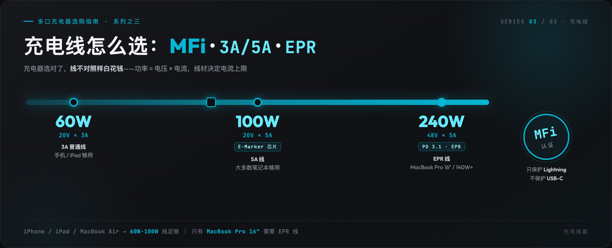
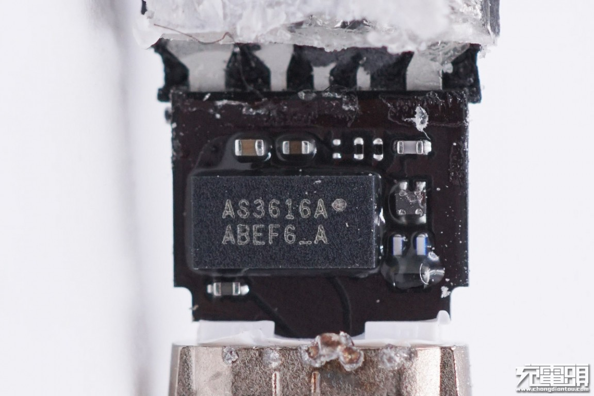
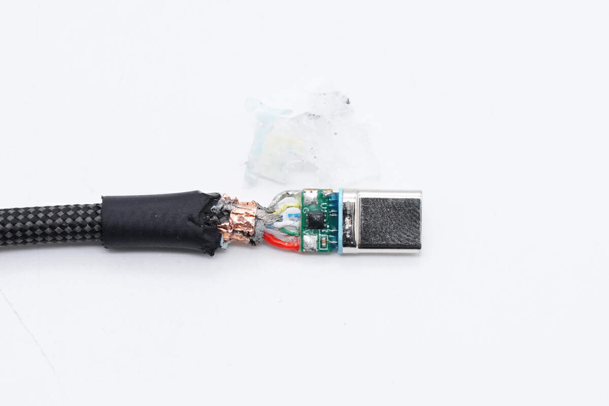
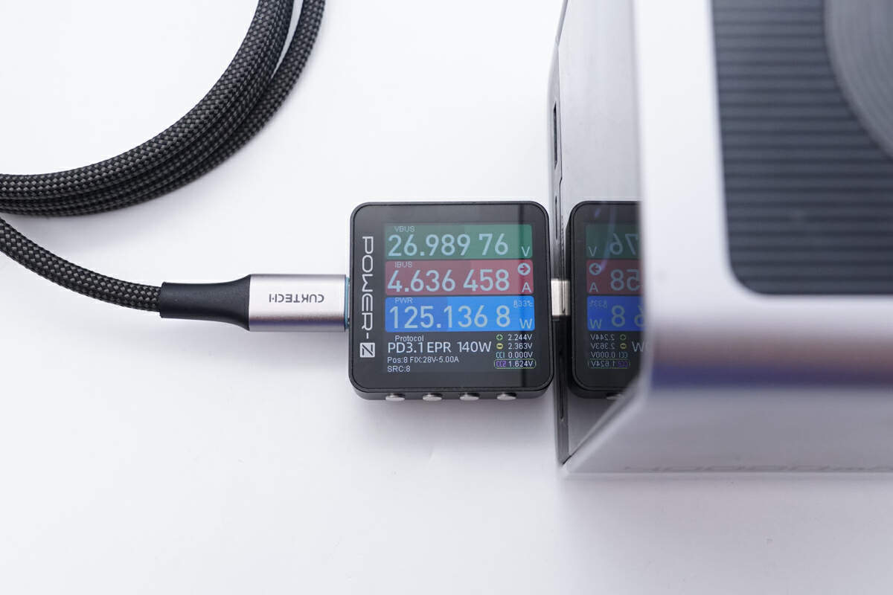
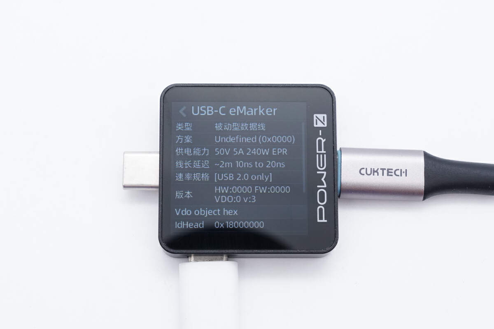

# 为什么 C to C 线给 iPhone 充电不需要 MFi？3A/5A、E-Marker、EPR 线一篇讲清

评论区里有两个问题出现率极高。一个是，为什么 Lightning 线必须有 MFi 认证，C to C 线给 iPhone 15 充电就不需要？另一个是，140W 的充电器插上普通 100W 的线，为什么怎么都跑不满？

这两个问题的答案都在线上。充电器选对了，线没选对，照样白花钱。这篇把充电线最关键的三个概念，**MFi、3A/5A、EPR**，一次讲清。

本文是《多口充电器选购指南》系列文章之一。主文讲「按你的场景买什么」，本篇讲「线怎么选」。

先说 MFi 这块。

市面上带 USB-A 口的充电器，如果接 Lightning 线给旧款 iPhone 或 iPad 充电，那根线必须有 **MFi 认证**，也就是 Made for iPhone / iPad。非认证线轻则弹窗「不支持此配件」，重则充电发热、损伤电池健康度。

这里有个坑要提醒一下。**MFi 认证的是线，不是充电器本身。**很多商家宣传「MFi 认证充电器」，属于偷换概念。真正合规的做法是，充电器支持标准 PD 协议，你自己再买一根苹果 MFi 认证线。

那为什么 C to C 给 iPhone 15 或 iPad Pro 充电，就不需要 MFi 了？

关键在于接口形态不同。

Lightning 是苹果自己的私有接口。第三方厂商要做 Lightning 线，必须向苹果申请 MFi 认证、植入苹果指定芯片，否则 iPhone 会直接识别成「不支持此配件」。所以旧款 iPhone 和 iPad 用 Lightning 线的时候，MFi 是一道绕不开的门槛。

USB-C 就不一样了，它是公开的行业标准，不是苹果私有的。USB-C 口的 iPhone 和 iPad，物理上已经没有 Lightning 口，自然也就不存在「Lightning 线要 MFi」这个限制。

所以一句话，**MFi 只保护 Lightning 配件，不保护 USB-C 配件。**

换成 C to C 线之后，iPhone 15 和 iPad Pro 走的是标准 USB-C PD 快充协议。只要线材本身质量合格，正规品牌、符合 USB-IF 规范，充电器支持 PD，就不用纠结有没有 MFi 标。选购时真正该关注的，是线材能不能承受对应功率。

说到功率，就轮到 3A 和 5A 了。

买线的时候经常能看到「3A 线」「5A 线」的说法，这个 A 是什么意思？

这里的 **A 是安培，电流单位**，跟 USB-A、USB-C 这些接口名字没有半点关系。

充电功率的公式很简单，**功率（W）= 电压（V）× 电流（A）**。同样的电压下，电流越大，功率越大，充电就越快。

拿 USB-C PD 快充最常见的 20V 电压档算一下。电流 3A，20V × 3A，就是 **60W**。电流 5A，20V × 5A，就是 **100W**。所以「3A 线」「5A 线」说的是这根线最大能通过多大电流，不是接口形状。

普通 USB-C 线就两种常见规格。3A 普通线最高 60W（20V/3A），给手机、iPad Air 够用。5A E-Marker 线最高 100W（20V/5A），给大多数笔记本够用。

那 5A 线为什么会带个「E-Marker」？

因为电流超过 3A 之后，充电器和设备必须确认这根线能安全扛住。E-Marker 就是线材里的一个小芯片，负责告诉充电器我这根线最大支持多少 V 多少 A。没有这个芯片，充电器为了安全只会按 3A 输出，5A 线就白买了。

原理讲完了，再说 100W 以上的事，这块是 EPR 的地盘。

100W 以上，比如 140W、180W、240W，走的是 **PD 3.1 EPR**，电压会升到 28V、36V、48V。普通 100W 线的 E-Marker 芯片只声明到 20V/5A，插上 140W 充电器会自动降级到 100W，跑不满。开头那个 140W 跑不满的问题，答案就在这儿。

那 EPR 线怎么认？

我自己的经验是看三个地方。先看包装或线身标识，写有「240W」「PD 3.1」「EPR」「支持 48V/5A」这类字样的才算数。再看 E-Marker 信息，用专业工具读一下，EPR 线的 E-Marker 会声明 50V/5A，安全余量略高于 48V，普通 100W 线只声明 20V/5A。还有个笨办法是看价格，真 EPR 线成本更高，十几块钱的线基本不可能是 EPR。

顺带一提，PD 3.1 本身就是 PD 协议的版本升级，协议和线是配套的。协议看不懂的话，可以先看同系列的[充电协议一篇讲透](https://zhuanlan.zhihu.com/p/2073203760332026596)。

**一句话总结**，iPhone、iPad、MacBook Air 和普通轻薄本，用 60W 到 100W 的普通 C to C 线就够了。只有 16 英寸的 MacBook Pro 和追求 140W 以上输出的设备，才需要专门买 EPR 线。

原理通了，那具体买哪根？按三个档位给你抄作业，价格都是 2026 年 8 月在京东查的，大促只会更低。

还在用 Lightning 口的旧款 iPhone 或 iPad，认准 MFi 就行，别碰杂牌。

- **[绿联 MFi 认证苹果快充线（C to L，1 米）](https://item.jd.com/100005668392.html)**，到手约 54 元，京东自营，已售 30 万+。苹果直采芯片，PD 快充不弹窗。**适合 iPhone 14 及之前的机型配 PD 充电器用。不适合 iPhone 15 之后的人，你的手机已经是 USB-C 口了，这根线用不上。**
- **[绿联 MFi 认证 USB-A to Lightning 线（1.5 米）](https://item.jd.com/100361646250.html)**，约 60 元，同样京东自营，已售 200 万+。**适合还在用 USB-A 口充电器的人，比如带 A 口的多口头。不适合想跑 PD 快充的人，A 口的物理上限就在那摆着。**

C to C 这边，给笔记本用的认准 5A E-Marker。

- **[绿联 100W 5A 双 C 线（1 米）](https://item.jd.com/10173217972924.html)**，到手约 24 元。100W 以内通吃，手机、平板、轻薄本一根就够。**适合绝大多数人的主力线。不适合 16 寸 MacBook Pro 用户，你的机器要 140W，这根线会把你按在 100W。**

真有 140W 以上的需求，EPR 线也就两杯奶茶钱，别省。

- **[酷态科 240W PD3.1 编织线](https://item.jd.com/100111001883.html)**，到手约 27 元，京东自营。6A 编织线身，标称 240W，向下兼容 100W 和 60W 的设备。**适合 16 寸 MacBook Pro 和 140W 充电器的用户，也适合想一步到位的人，反正只比普通 5A 线贵几块钱。**
- **[Anker 240W 快充数据线](https://item.jd.com/100116776751.html)**，约 65 元，京东自营，已售 10 万+。线身主打柔软不缠绕，用苹果设备的人很多认这个牌子。**适合对做工和手感有要求的人。不适合只想解决问题的，上面那根一半价钱干一样的活。**

照例交代利益关系。上面是京东商品链接，通过链接下单我会有少量返佣，价格和你自己搜完全一样，介意的话记下型号自己去搜。返佣不影响我写的内容，每根线我都写了不适合谁，更贵的款反而被我劝退了一类人。

---

> 📚 **同系列文章**
>
> - [多口充电器选购指南（主文：按你的真实场景直接抄作业）](https://zhuanlan.zhihu.com/p/2070624966568064377)
> - [充电协议篇：为什么 100W 充电器给 iPhone 只跑 5W](https://zhuanlan.zhihu.com/p/2073203760332026596)，线选对了，协议不对照样跑 5W
> - [功率分配与验货篇：多口同充为什么掉速](https://zhuanlan.zhihu.com/p/2073204024480895656)，多口同插掉速，问题在充电器不在线
