# 2026 年平板推荐：我把 7 个品牌 26 款在售平板翻完，发现带货文不会说的 5 件事

上周我做了件挺无聊的事：把苹果、华为、小米、OPPO、vivo、荣耀、联想七个品牌官网和京东在售的平板，一共 26 款，全部列进了一张表。

起因是三个真实场景。

我表弟，准大学生，开学前搜「平板推荐」，出来 50 篇清单文，每篇都长得像同一个人的作业。

小区群里一位宝妈搜「儿童平板」，搜出来全是学习机广告，四千块一台，配置还不如千元平板。

我爸让我给他买台平板看剧，我去搜「给爸妈买平板」，翻到底也没看到一篇提「家里没宽带怎么办」。

这就有意思了。平板这个品类，全网的内容供给和真实需求之间，隔着一条鸿沟。

翻完 26 款机器之后，我可以负责任地说一句反常识的话：**选平板的第一步不是看参数表，是先回答三个没人问你的问题——要不要插卡？配不配笔和键盘？现在是不是刚涨完价？**

> 平板选购里没有性价比，只有你愿意为哪个遗憾买单。

这篇文章有点长，但看完你大概率不用再去看第二篇。

（全文价格和参数为 2026 年 9 月上旬快照，电商价随国补和促销波动，看到时如果隔得久了，按文末「下单前最后一页」的方法重查。）

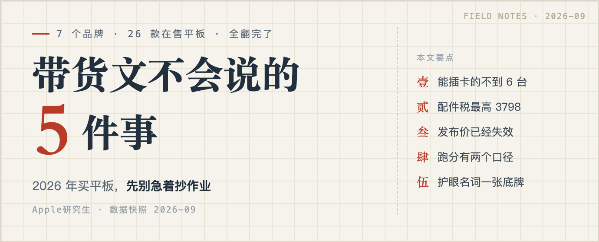

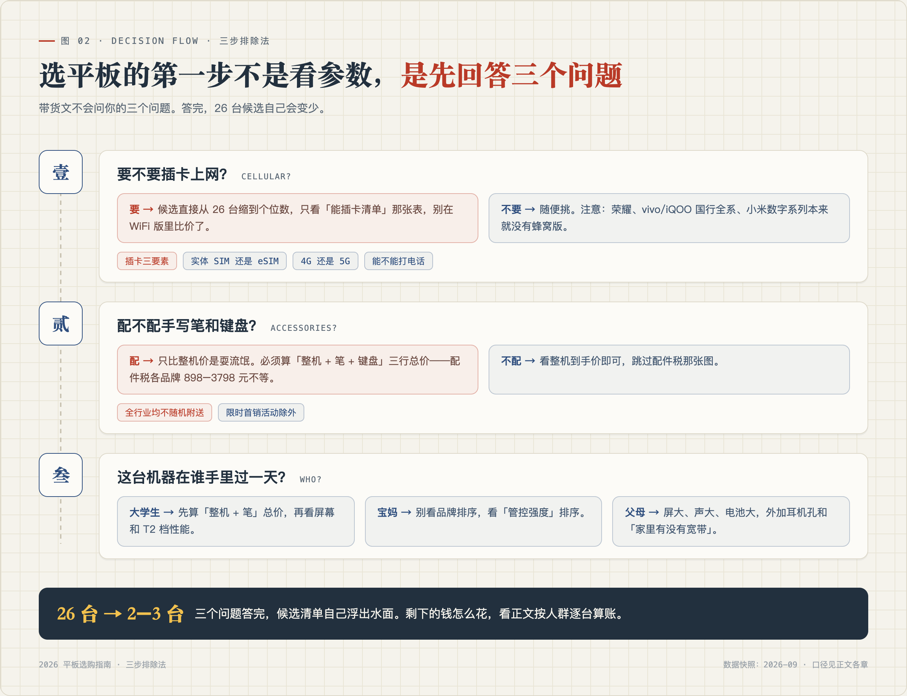

---

## 先说带货文不会说的 5 件事

这部分是全文最值钱的内容。不是参数，是横切面事实——那种你把七个品牌摆在一起才能看见的东西。

### 第一件：想插卡？你的选择比你以为的少得多

很多人买平板默认「加个几百块就能插卡上网」。这是十年前的认知。

事实是：26 款在售平板里，**能插实体 SIM 卡打电话的，不到 6 款**。荣耀和 vivo/iQOO 国行平板全系没有蜂窝版，两家官网都明示了；小米数字系列（平板 7、8 全系）也没有。iPad 蜂窝版更特殊——只有 eSIM，没有实体卡槽，而且**只能上网，不能打电话**，国内还只有部分运营商和城市支持开通。

所以「能不能插卡」要拆成三个问题，我叫它插卡三要素：

- 实体 SIM 还是 eSIM？（eSIM 有运营商门槛）
- 4G 还是 5G？
- 能不能打电话？（大部分只能上网）

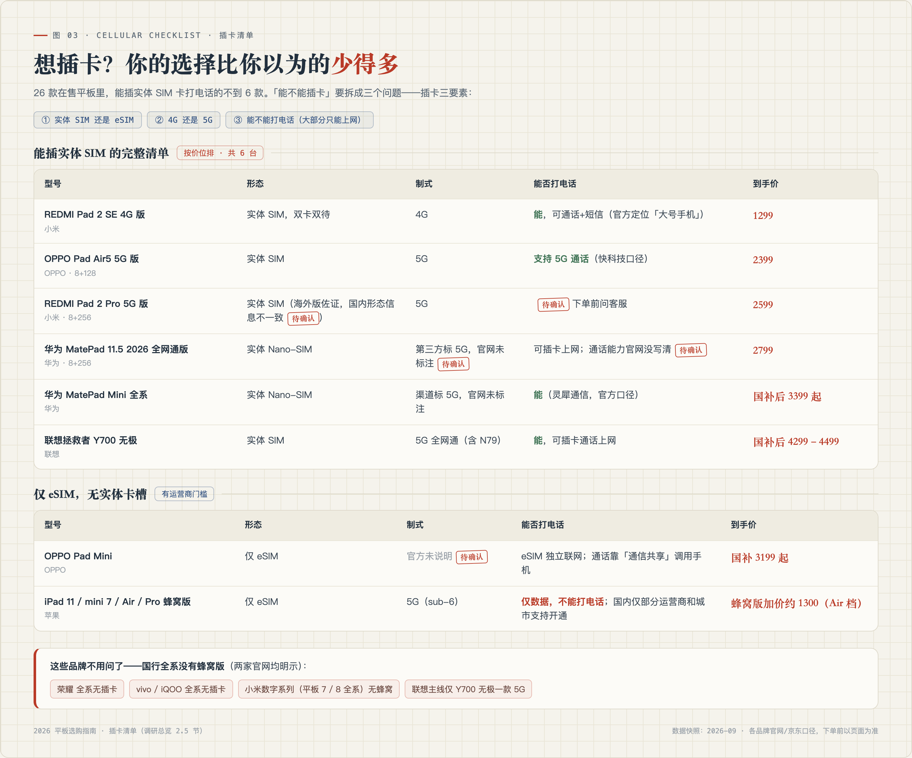

能插实体卡的完整清单我筛出来了，按价位排：

| 型号 | 形态 | 能否打电话 | 到手价 |
|---|---|---|---|
| REDMI Pad 2 SE 4G 版 | 实体 SIM，双卡双待 | 能（官方定位「大号手机」） | 1299 |
| OPPO Pad Air5 5G 版 | 实体 SIM | 支持 5G 通话 | 2399 |
| REDMI Pad 2 Pro 5G 版 | 实体 SIM（海外版佐证，国内形态目前查到的信息不一致，下单前问客服） | 待确认 | 2599 |
| 华为 MatePad 11.5 2026 全网通版 | 实体 SIM | 可插卡上网，通话能力官网没写清，下单前问客服 | 2799 |
| 华为 MatePad Mini 全系 | 实体 SIM | 能（灵犀通信，官方口径） | 国补后 3399 起 |
| 联想拯救者 Y700 无极 | 实体 SIM，5G 全网通 | 能 | 国补后 4299–4499 |

（以上价格为 2026-09 初快照，电商价随国补和促销波动，下单前以页面为准。）

**这对你的钱包意味着什么**：如果插卡是刚需——比如家里没宽带、要带娃出门、给老人当大屏手机——你的候选清单直接从 26 台缩到这张表，别在 WiFi 版机型里浪费时间比价了。

### 第二件：笔和键盘都不送，这笔「配件税」最高能再买一台安卓板

所有带货文都爱写「搭配手写笔，秒变生产力」。

但它们很少告诉你：全行业手写笔和键盘都不随机附送（限时首销活动除外）。而整机之外这笔钱，各品牌差距大到离谱：

| 品牌 | 手写笔 | 键盘 | 笔+键盘合计 |
|---|---|---|---|
| 苹果 | Pencil USB-C 649 / Pro 999 | 妙控键盘双面夹 1999–2799 | **2648–3798** |
| 华为 | M-Pencil 第三代 399–599 / Pro 699 | 399–1099 | 798–1798 |
| 小米 | 焦点触控笔 Pro 599 | 悬浮键盘 699 起 | 1298–1598 |
| 荣耀 | Magic-Pencil 399–499 | 499–699 | 898–1198 |
| OPPO | Pencil 3 399 / 3 Pro 599 | 699–1399 | 1098–1998 |
| vivo | Pencil3 499 | 599–699 | 998–1298 |
| 联想 | 手写笔 Pro 599 | 499–699 | 1098–1298 |

（各品牌官网定价，2026-09 初快照。）

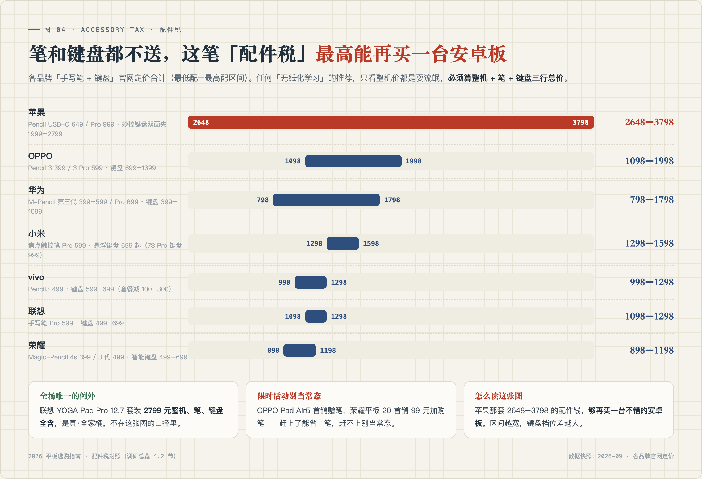

苹果那套 2648–3798 的配件钱，够再买一台不错的安卓板了。全场唯一的例外是联想 YOGA Pad Pro 12.7 的套装：2799 元整机、笔、键盘全含，是真·全家桶。另外 OPPO Pad Air5 首销赠笔、荣耀平板 20 首销 99 元加购笔，这类限时活动赶上了能省一笔，赶不上别当常态。

**这意味着**：任何「无纸化学习」的推荐，只看整机价都是耍流氓。必须算「整机+笔+键盘」三行总价。后面每个推荐我都会替你算好。

### 第三件：发布价已死，2026 年的平板价格是一年三变

据 IT 之家报道，2026 年 6 月 25 日苹果全球涨价，幅度 800–1800 元，iPad 11 官网价从 2999 涨到 3799。

但魔幻的是，同一时期京东券加国补后，iPad 11 到手约 2999（128G，2026-09 初行情）——官网涨了 800，电商渠道把价格又拉回了涨价前的水平。同一台机器，两个渠道差出 800 块。

小米也没闲着，2025 年 12 月全系涨了 100–200，官方说法是存储成本上涨。华为 MatePad 11.5 S 灵动款首发 2099，现在卖 2199。

价格波动有多大？iPad mini 7 涨价前京东卖过 2823，现在官网 4799。联想小新 Pro 13 两个月内从 2199 降到 1466。

还有一条和涨价同样重要的隐形规则：国补只补单价 6000 元以内的机器，15% 直减、单件封顶 500。于是厂商的定价开始贴着这条线跳舞——联想 YOGA Pad Pro 14.5 的套装定 5999，卡在线内；拯救者 Y700 无极的 16+512 版本定 6499，超线 499 元，国补一分钱都吃不到。定价差几百，到手差上千。这就是为什么你只看「官方定价」永远算不清真实账单。

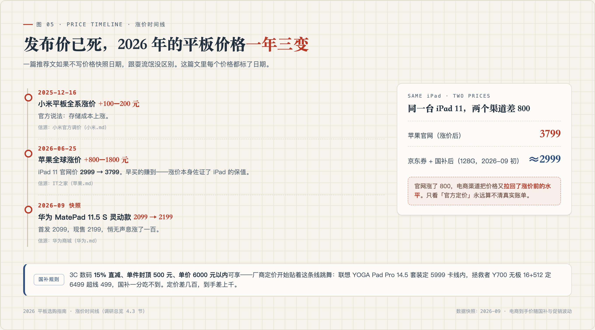

**这意味着**：「发布价」这个参考系已经失效。一篇推荐文如果不写价格快照日期，跟耍流氓没区别。这篇文里每个价格我都标了日期，过期了你按方法自己重查，别按旧数字下单。

### 第四件：跑分通胀了，450 万不一定比 300 万强

安兔兔 2026 年换了 V11 版本，分数体系和 V10 截然不同——安兔兔在 2026 年 8 月的月榜说明里明确写了，两个版本不可跨版本对比。

但带货文不管这个。你会看到「这台跑分 450 万，吊打那台 300 万」——实际上 450 万是 V11 口径，300 万是 V10 口径，根本不是一个刻度。就像拿摄氏度和华氏度比大小。

按口径分开排，真实梯队是这样的：

- **T0（安兔兔 V11，410 万+）**：骁龙 8E Gen5 机型——拯救者 Y700 五代、iQOO Pad6 Pro、荣耀 MagicPad 3 Pro 13.3、OPPO Pad 5 Pro 等，2026 年新旗舰
- **T1（安兔兔 V10，270–310 万）**：骁龙 8 至尊版（小米平板 8 Pro）、天玑 9400 系（vivo Pad5 Pro）、天玑 9500s（OPPO Pad 6），上代旗舰
- **T2（约 190–260 万，V10）**：骁龙 8s Gen4（小米平板 8、联想小新 Pro 13）、骁龙 8 Gen3（小新 Pro GT 11.1）、骁龙 8s Gen3（iQOO Pad5e，实测超 190 万），畅玩原神没问题
- **T3–T5**：中端和入门芯，看视频、网课、儿童学习够用，别碰大型游戏

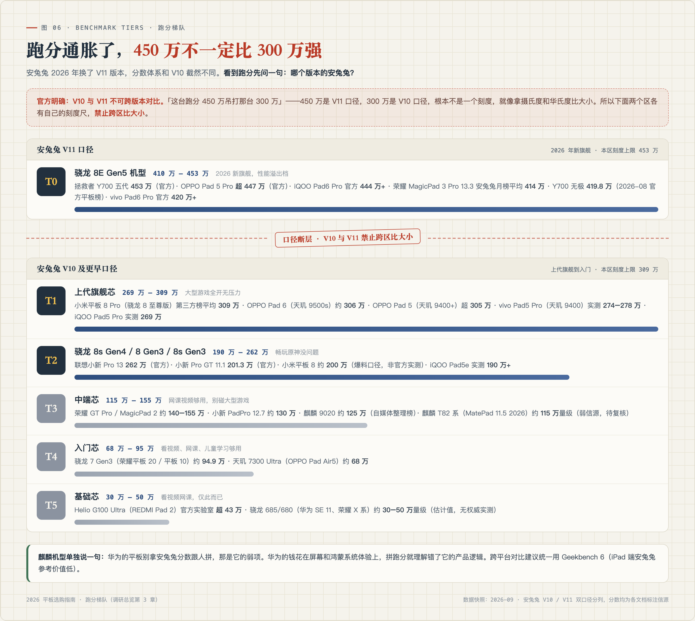

麒麟机型单独说一句：华为的平板别拿安兔兔分数跟人拼，那是它的弱项。华为的钱花在屏幕和鸿蒙系统体验上，拼跑分你就理解错了它的产品逻辑。

**这意味着**：看到跑分先问一句「哪个版本的安兔兔」。跨版本比大小的内容，直接划走。

### 第五件：护眼名词一家亲，97% 和 99% 的差别你感知不出来

云晰柔光屏、类纸屏、纳米柔光屏、明眸柔光屏、舒视柔光屏、纳米纹理玻璃……七家厂商七种叫法。

揭开名字看本质：**全都是 AG 蚀刻抗眩光**。在玻璃表面做纳米级蚀刻，把镜面反射打散成漫反射。技术同源，名字各异。不是纯营销词——各家基本都有莱茵认证和量化指标——但差异也就 97% 和 99% 干扰光消解率这个量级，日常观感非常接近。

| 叫法 | 品牌 | 消解率 | 认证 |
|---|---|---|---|
| 云晰柔光屏（第二代） | 华为 | 消 99% 干扰光，反射率 <2% | 有量化指标 |
| 纳米柔光屏 | 小米平板 8 系 | 消 99% | 莱茵低蓝光+青山护眼 |
| 类纸屏 | 荣耀平板 20/10 柔光版 | 消 98% | 莱茵类纸/低蓝光/无频闪三重 |
| 柔光屏 | vivo Pad5 Pro/Pad SE | 消 98% | 莱茵低蓝光 |
| 明眸柔光屏 | OPPO Pad 6/Air5 | 消 97% | 莱茵智能护眼 4.0 |
| 舒视柔光屏 | 联想小新 PadPro 12.7 | AG | 莱茵全局护眼 |

（各家官方口径，2026-09 快照。）

有一个例外要单独拎出来：荣耀 MagicPad 3 Pro 的「AI 离焦护眼」是芯片算法调节，和柔光屏的物理防眩光是两码事。一个改内容，一个改玻璃。商家巴不得你混着理解，你别混。

**这意味着**：柔光屏值不值得加钱？长期看网课、看电子书、给孩子用，值。但别为「某家独有的护眼黑科技」这种说法加钱，大家的技术底牌是同一张。

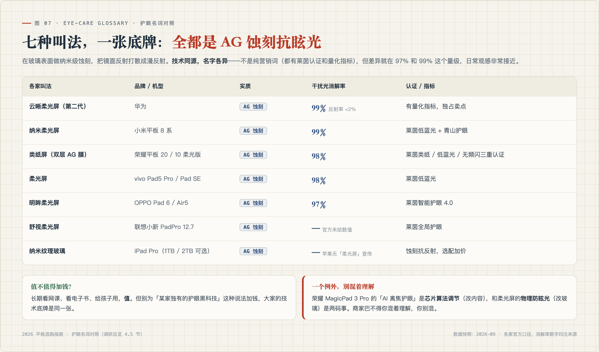

---

好，认知层面的坑填完了。下面进入正题：按「谁用」选。

注意我不用「预算分档」这个常见结构。预算应该是场景推演的结果，不是起点。先想清楚这台机器在谁手里、过什么样的一天，钱自然就知道该怎么花。

## 给大学生：先算「整机+笔」的总价，再谈性价比

先还原一个大学生平板的一天。

晚上十一点半宿舍熄灯，躺床上刷课看剧，屏幕刺眼不刺眼、重不重，直接决定手腕和眼睛的寿命。白天在教室后排记笔记，笔的延迟和笔记软件好不好用，决定它三个月后还在不在你包里。周末打两小时原神，帧率稳不稳，决定你会不会后悔没买游戏本。

所以大学生平板真正重要的就三件事：**整机+笔的总价、屏幕素质、性能够不够 T2 档**。

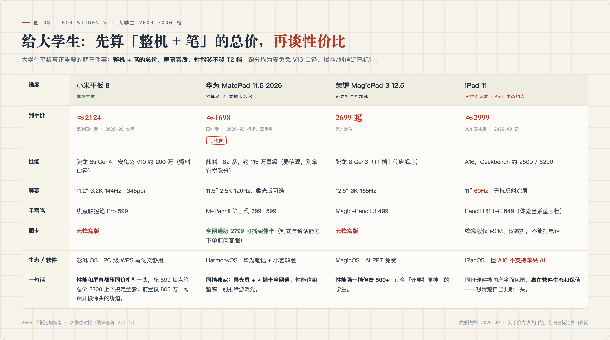

| 维度 | 小米平板 8 | 华为 MatePad 11.5 2026 | 荣耀 MagicPad 3 12.5 | iPad 11 |
|---|---|---|---|---|
| 到手价 | 渠道国补后约 2124（2026-09 快照） | 国补后约 1698（2026-03 行情，需重查） | 2699 起 | 京东国补后约 2999（2026-09 初） |
| 性能 | 骁龙 8s Gen4，安兔兔 V10 约 200 万（爆料口径） | 麒麟 T82 系，安兔兔约 115 万量级（弱信源，别拿它拼跑分） | 骁龙 8 Gen3 | A16，Geekbench 约 2500/6200 |
| 屏幕 | 11.2″ 3.2K 144Hz | 11.5″ 2.5K 120Hz，柔光版可选 | 12.5″ 3K 165Hz | 11″ 60Hz |
| 手写笔 | 焦点触控笔 Pro 599 | M-Pencil 第三代 399–599 | Magic-Pencil 3 499 | Pencil USB-C 649 |
| 插卡 | 无蜂窝版 | 全网通版 2799 可插实体卡 | 无蜂窝版 | 蜂窝版仅 eSIM 仅数据 |

先说主推：**小米平板 8**。表弟那台就是它——预算 2500 想一步到位、笔记游戏都要的，这台基本是闭眼答案，先把卡片放这，理由一条条说。

【好物卡：小米平板 8】

2000 出头，买到骁龙 8s Gen4 加 3.2K 144Hz 屏，性能和屏幕在同价里双第一，记笔记配 599 的焦点笔，总价 2700 上下搞定全套。澎湃 OS 的 PC 级 WPS 写论文够用了。有一个提示：前置摄像头只有 800 万，网课视频画质一般，网上「和 8 Pro 只差芯片」的说法已被小米香港官网证伪，相机差距很大——不过平板相机本来就不重要，说破就好。

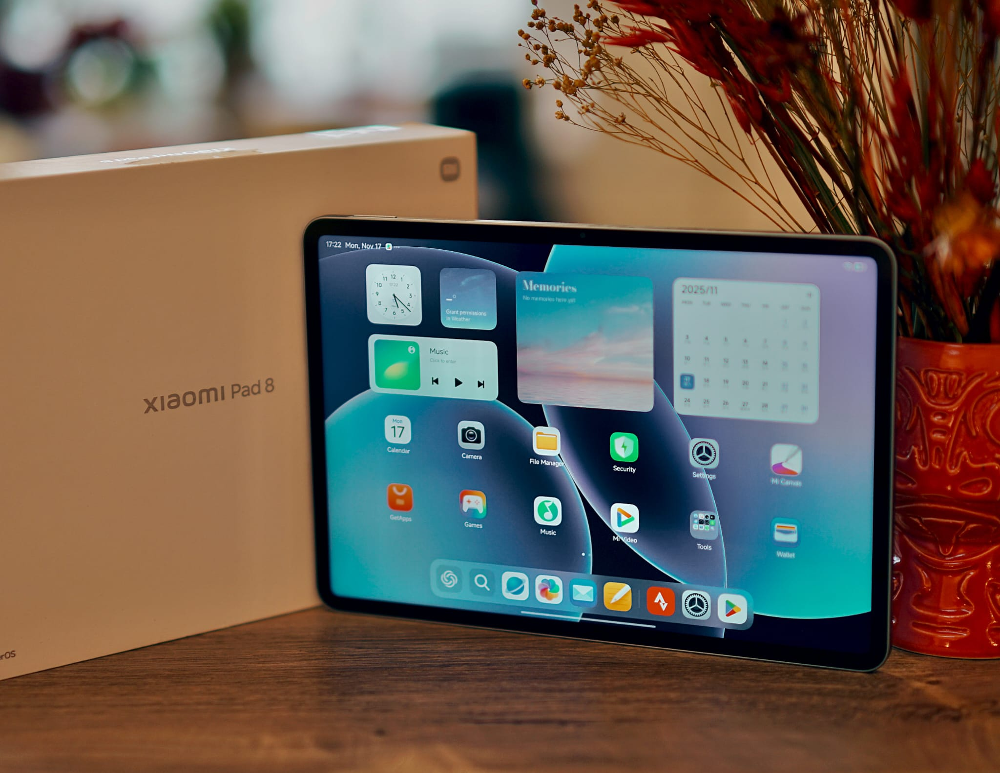

_图源：Notebookcheck_

**不适合谁**：每天网课开摄像头的（前置拖后腿）；必须插卡用流量的（它没有蜂窝版，一台都没有）。

预算紧或者必须插卡的，看华为 MatePad 11.5 2026。国补后 1698 的行情是 2026 年 3 月的，现在大概率变了，下单前重新查。它的独家卖点是全网通版 2799 能插实体卡——但要注意，制式和通话能力官网没写清，第三方标的 5G，下单前一定问客服。性能是这组里最弱的，别推给游戏党。

_图源：华为官网_

iPad 11 呢？只说给一类人听：认准 iPad 生态、要用那些只在 iPadOS 上好用的笔记和绘画应用的人。其他人必须知道三件事——60Hz 屏在 2026 年是真的卡眼睛；A16 芯片不支持苹果自家的 AI 功能；笔和键盘全场最贵。同价位硬件它被国产全面包围，它赢在软件生态和保值，你得想清楚自己要的是哪一头。

还要打原神的，加钱上荣耀 MagicPad 3 12.5（2699 起，骁龙 8 Gen3），或者反过来省钱上 iQOO Pad5e，实测 190 万+ 跑分，国补后 1799 起，京东实付一度 2070，是 2000 档的跑分王。

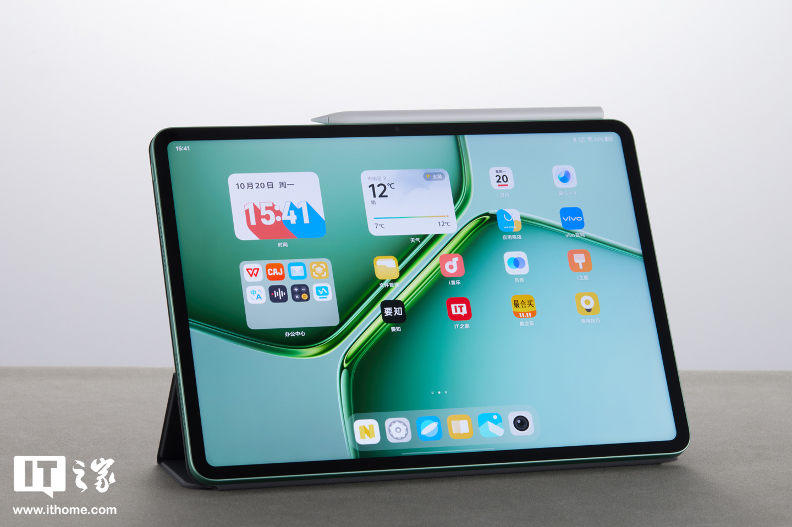

_图源：IT之家_

预算再往下压一档也有解：**联想小新 Pro GT 11.1**。这台是学生党里最容易被低估的一台：骁龙 8 Gen3 官方跑分 201.3 万，同价位性能没对手；11.1 寸却只有 458g，是这组里最轻的，每天背去图书馆的那半斤差距，到期末周你会感谢它。

【好物卡：联想小新 Pro GT 11.1】

价格更能打：到手 1500–1900，教育优惠史低 1599 还能叠国补。配置建议直接上 12+256，用满四年不卡。

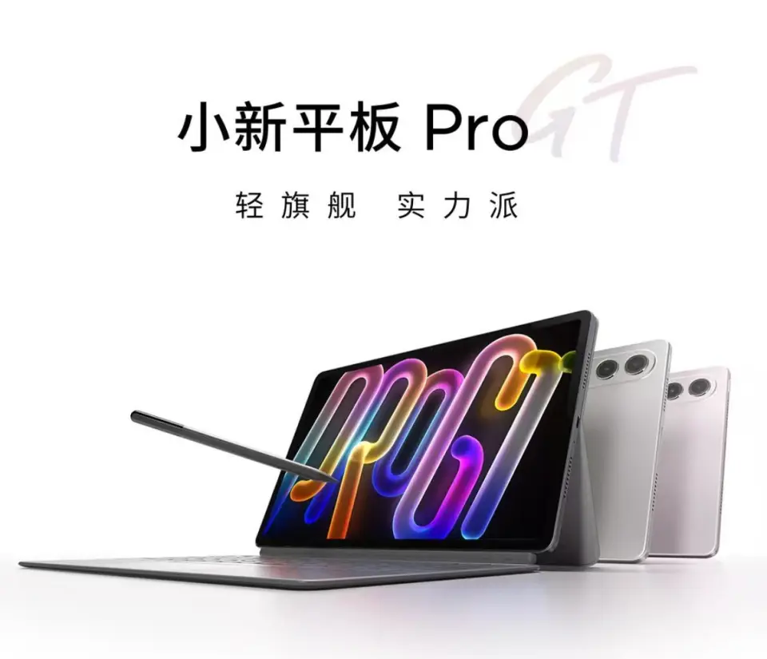

_图源：联想官方，via 腾讯新闻 Geek研究僧_

## 给宝妈：别看品牌排序，看「管控强度」排序

儿童平板这个搜索词已经被学习机广告污染了。四千块的学习机，硬件配置打不过一千块的正规平板，卖的其实是「家长管控」这四个字。

那问题来了：既然管控才是核心，直接按管控强度排个序不就行了？

我排了，结果如下。

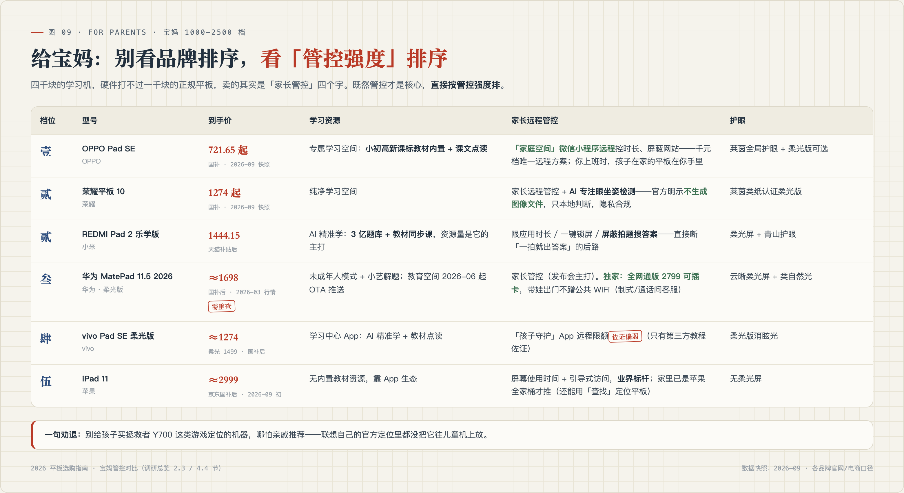

**第一档，OPPO Pad SE，国补后 721.65 起（2026-09 快照）。**七百块，把「教材内置+远程管控」一次性配齐，大多数家庭的第一台孩子平板就从它看起。

【好物卡：OPPO Pad SE】

千元内唯一把「教材内置+远程管控」做成系统级卖点的：小初高新课标教材内置加课文点读，家长用微信「家庭空间」小程序就能远程控制时长、屏蔽网站。你上班的时候，孩子在家的平板在你手里。四扬声器、9340mAh 电池，官方还承诺 4 年流畅更新。

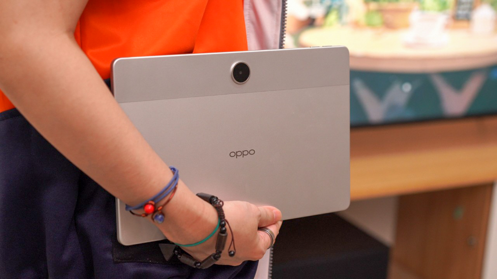

_图源：YugaTech_

**不适合谁**：需要带娃出门用流量的（国行没有蜂窝版）；对屏幕素质要求高的（11 寸 90Hz，就是千元档的水平）。

**第二档，1500 元上下，荣耀平板 10 或 REDMI Pad 2 乐学版。**

荣耀平板 10 国补后 1274 起。它的钩子是一个细节：AI 专注眼坐姿检测，孩子趴着歪着看会提醒——关键是官方明确说这个功能**不生成图像文件**，只本地判断，这对在意孩子隐私的家长是个很实的点。纯净学习空间加家长远程管控也都有。预算一千出头、孩子已经上小学的，这台比千元档多花的钱就花在这个坐姿检测上，值。

【好物卡：荣耀平板 10】

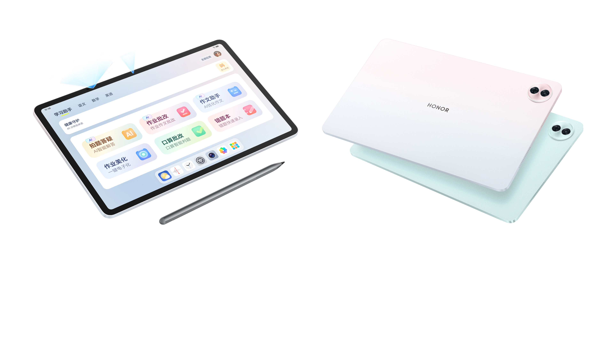

_图源：荣耀官网_

REDMI Pad 2 乐学版天猫补贴后 1444.15，主打资源量：3 亿题库加教材同步课，还有一个我觉得特别实用的功能——**屏蔽拍题搜答案**。管控功能再强，挡不住孩子一拍就出答案，这个功能直接断后路。家里孩子开始做作业、你怕平板变抄答案工具的，选这台。

【好物卡：REDMI Pad 2 乐学版】

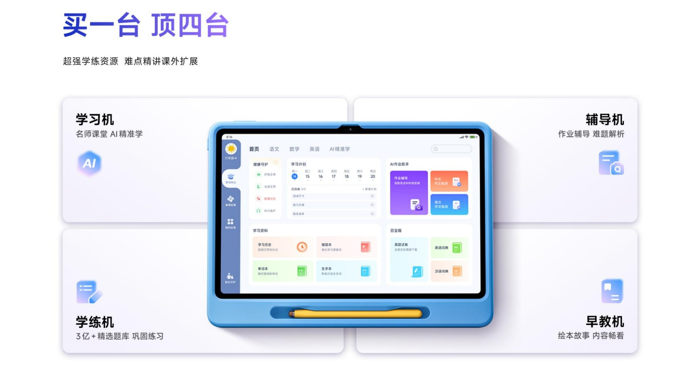

_图源：小米官方，via 快科技_

**第三档，2000 元档，华为 MatePad 11.5 2026 柔光版。**

华为官方自己就把它定位成学习平板：云晰柔光屏、未成年人模式、小艺解题，教育空间从 2026 年 6 月起 OTA 推送。它是全场唯一的「学习板+可插卡全网通」组合——带娃出门上兴趣班，不蹭公共 WiFi。还是那个提醒：全网通版制式和通话能力，下单前问客服。

iPad 11 单独说。它的「屏幕使用时间+引导式访问」是所有平板里做得最成熟的，但没有内置教材资源，2999 的价格对宝妈也偏贵。只有一种情况推它：家里本来就是苹果全家桶，孩子丢三落四你还能用「查找」定位平板。

最后一句劝退：别给孩子买拯救者 Y700 这类游戏定位的机器，哪怕亲戚推荐。联想自己的官方定位里都没把它往儿童机上放。

## 给父母买：屏大、声大、电池大，外加两个没人提的刚需

给父母买平板，大部分推荐文从第一步就错了——它们在比参数，而父母的需求从来不在参数表里。

我爸的真实需求拆开是这样的：屏幕要大到不戴老花镜也能看清字幕；声音要大到厨房做饭时客厅放着也能听见；电池要撑得住一天，因为他们永远想不起来充电。

就这三条吗？不，还有两条没人提的刚需。

**一是耳机孔。** 父母那代人很多人有用了多年的有线耳机，或者晚上看电视怕吵到家人要插耳机。REDMI Pad 2 Pro 保留了 3.5mm 耳机孔，而 OPPO 平板全系没有——这个差别没有一篇带货文写过。

**二是「家里没宽带」。** 很多老人家里根本没装宽带，WiFi 版平板买回去就是块砖。这种情况候选只剩两台：REDMI Pad 2 SE 4G 版（1299，插实体卡，双卡双待能打电话，官方定位就是「大号手机」），或者预算充足直接上华为 MatePad Mini（国补后 3399 起，能打电话，3200 万前置视频通话清晰，255g 拿着不累）——后者本质上就是一台老人大屏手机。

【好物卡：华为 MatePad Mini】

给愿意多花点钱换省心的家庭：能打电话这一点，意味着老人不用学微信视频以外的任何操作，你的号码直接打进去就是高清视频。

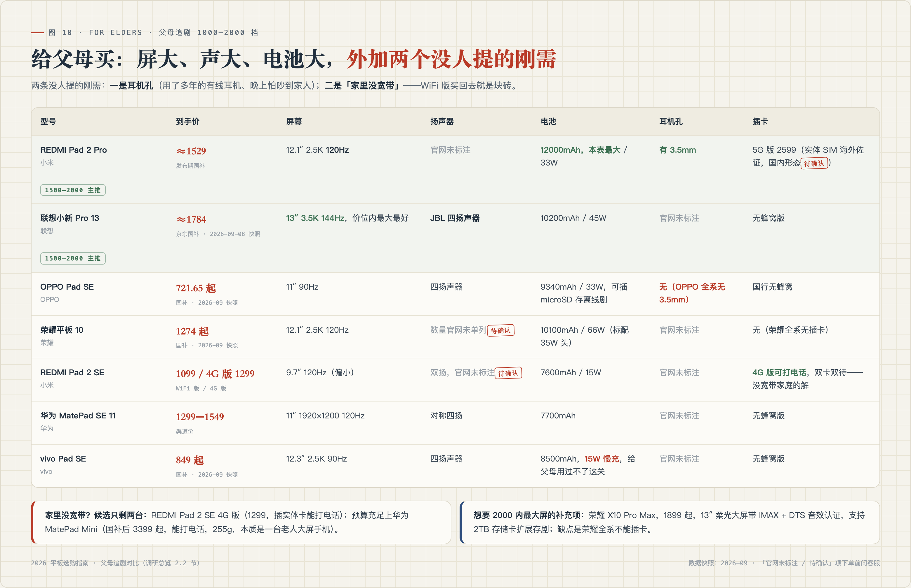

正常有宽带的家庭，1500–2000 档推两台：

**REDMI Pad 2 Pro，发布期国补约 1529。**给爸妈买平板，这台是我翻过所有候选后心里最踏实的一台，四个理由全中父母刚需。

【好物卡：REDMI Pad 2 Pro】

12.1 寸大屏、12000mAh 全场最大电池、120Hz 高刷、3.5mm 耳机孔，四条全中。

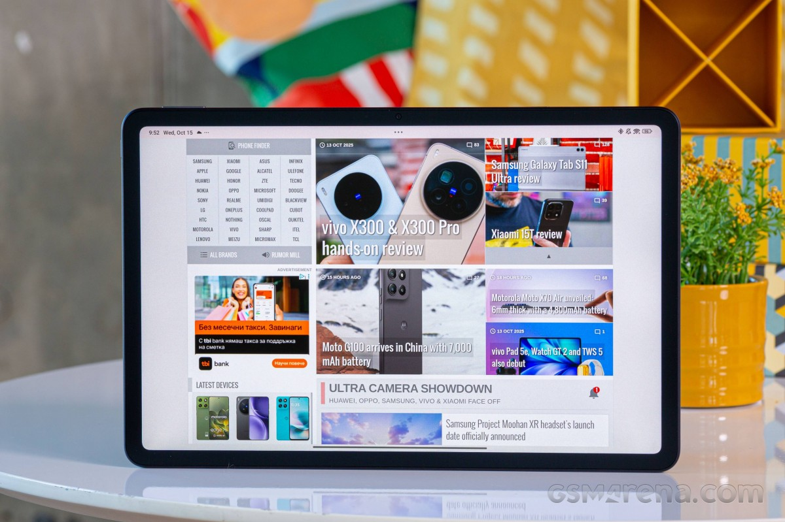

_图源：GSMArena_

**不适合谁**：手劲小、要单手久持的老人（610g 不算轻）；家里充电习惯差的也可以放心，33W 充电不算快但电池够大，一天一充够用。

**联想小新 Pro 13，京东国补后约 1784（2026-09-08 快照）。**家里宽带正常、爸妈主要拿平板追剧看戏的，这台的 13 寸 3.5K 屏是这个价位最大的，多花两百多换大一寸，值。

【好物卡：联想小新 Pro 13】

13 寸 3.5K 144Hz 屏、JBL 四扬声器，是这个价位屏幕最大最好的选择，骁龙 8s Gen4 性能还能顺带应付孙辈来家里要玩的游戏。

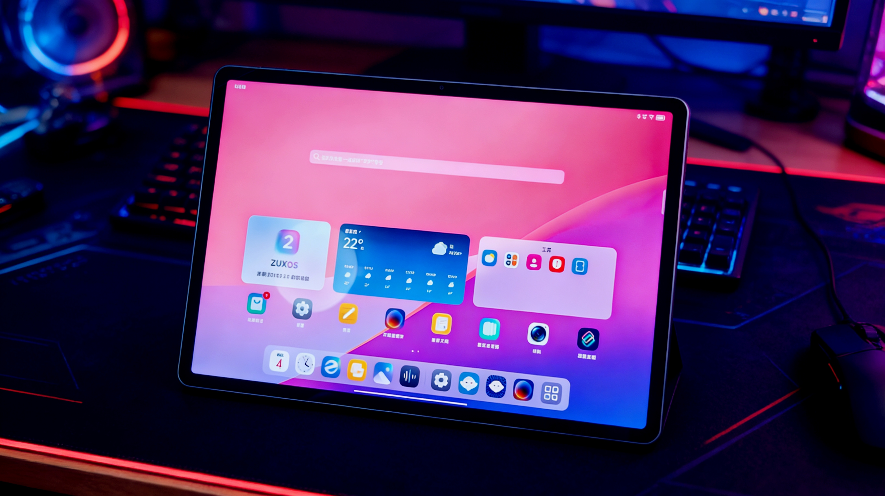

_图源：太平洋聚超值_

**不适合谁**：需要插卡的（无蜂窝版）；在意重量的（581g，比 REDMI 轻一些但仍是双手设备）。

预算卡死一千内，OPPO Pad SE（721.65 起）是大厂最低价，四扬声器加 9340mAh，还能插 microSD 卡存离线剧——注意，它没有耳机孔，这一点要想清楚。

预算到 2000 又想要最大屏的，还有一个补充选项：荣耀 X10 Pro Max，1899 起，13 寸柔光大屏，带 IMAX 和 DTS 音效认证，看剧看网课两可，还支持 2TB 存储卡扩展，存剧党狂喜。缺点是老生常谈：荣耀全系不能插卡。

两个诚实的提示：vivo Pad SE 价格很香（849 起）但充电只有 15W，8500mAh 的电池要充很久，给父母用我过不了自己这关；各品牌都有「远程协助」类功能，但没有任何一家有可信的横向实测对比，我没用过的不编，这条建议你下单前打客服电话问清楚怎么开通。

## 一张速查表，四种预算各一个答案

看到这里如果还是不想纠结，这一章是给你抄的。每档只给一两台，附上「不适合谁」。

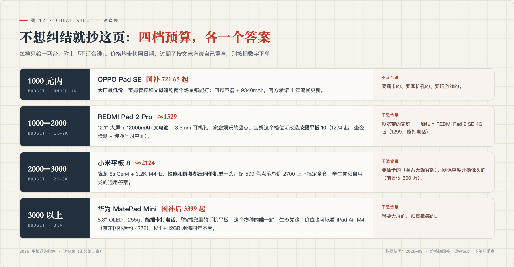

每档的卡片和完整理由都在前文对应章节，这里只放纯结论，照着预算抄完跳回去看细节就行。

**1000 元内：OPPO Pad SE（国补 721.65 起，2026-09 快照）。**

大厂最低价，宝妈管控和父母追剧两个场景都能打。不适合：要插卡、要耳机孔、要玩游戏的。

**1000–2000 元：REDMI Pad 2 Pro（约 1529）。**

大屏大电池加耳机孔，家庭娱乐的甜点。宝妈这个档位可以改选荣耀平板 10（1274 起），坐姿检测和纯净学习空间是孩子向的最优。不适合：没宽带的家庭（加钱上 4G 版 REDMI Pad 2 SE，1299）。

**2000–3000 元：小米平板 8（约 2124）。**

性能屏幕双第一，学生党和自用党的通用答案。不适合：要插卡的、网课重度开摄像头的。

**3000 元以上：华为 MatePad Mini（国补后 3399 起）。**

8.8 寸 OLED、255g、能插卡打电话，是「能揣兜里的手机平板」这个物种的唯一解。不适合：想要大屏的、预算敏感的。生态党这个价位也可以看 iPad Air M4（京东国补后约 4772），M4 芯片加 12GB 内存，用满四年不亏，教育优惠还能再叠。

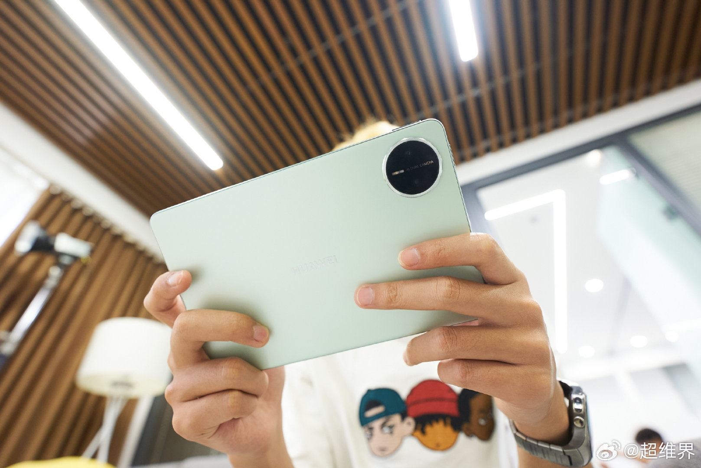

_图源：快科技/@超维界_

## 这几个热门选项，先把账算清楚再下单

避坑这一章我要先说清楚立场：我不是劝你不买，是帮你把钱花在对的机器上。每个坑的最后，都有「那应该买哪台」。

**坑一：vivo Pad5c——比 Pad5 贵 200，却是降配。**

它把芯片从旗舰换成了中端，扬声器从 6 个减到 4 个，只换来一个新系统。数码圈管这个叫「反向升级」，专坑只看「新发布」三个字的人。那应该买哪台？iQOO Pad5e，骁龙 8s Gen3 实测 190 万+ 跑分，国补后 1799.1 起，比 Pad5c 便宜还更强。

**坑二：iPad mini 7——涨价之后，性价比塌方了。**

涨价前京东卖过 2823，现在官网 4799，一块 60Hz 的屏。293g 的手感和 326ppi 的细腻确实还是标杆，但为这份手感多付的钱，2026 年已经说不通了。那应该买哪台？游戏党上拯救者 Y700 四代，8.8 寸 3K 165Hz 加骁龙 8 至尊版，学生认证叠国补后 3000 内，价格只有 mini 7 的六七成；便携阅读上 OPPO Pad Mini（279g，OLED 144Hz，国补 3199 起）或华为 MatePad Mini（255g，还能打电话）。

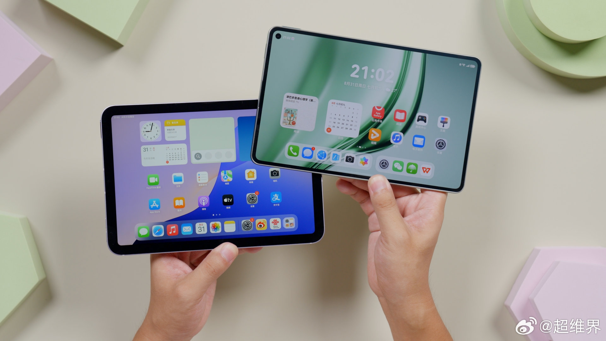

_图源：快科技/@超维界_

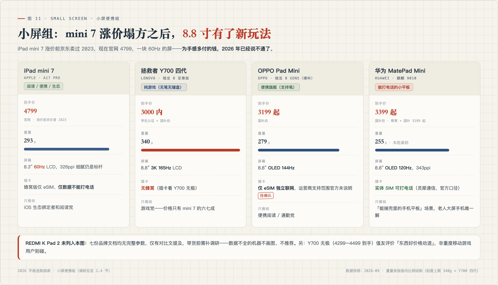

**坑三：拯救者 Y700 无极——东西是好东西，价格是坏价格。**

4299–4499 到手，5G 插卡、骁龙 8E Gen5 领先版，值友的评价原话是「东西好价格劝退」。那应该买哪台？除非你天天在地铁上打大型手游还必须插卡，否则拯救者 Y700 四代（3000 内）或拯救者 Y700 五代（国补后 3499 起）就是全部答案，省下的 1000 块够买两年的游戏。

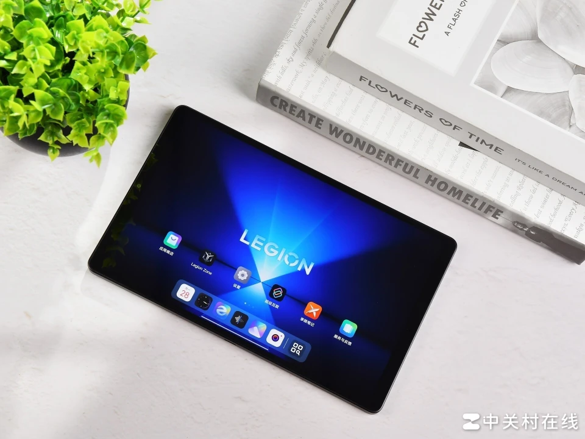

_图源：ZOL 中关村在线_

**坑四：千元内必须插卡——只有联想子品牌来酷、异能者能选。**

799–999 能买到 4G 可通话的平板，但要说实话：这两家是联想投资的子品牌，参数透明度、品控、售后都弱于主线，我不会把它们当平价替代强推。那应该买哪台？预算能加 300，就上 REDMI Pad 2 SE 4G 版，1299，大厂出品，双卡双待能打电话，这个品类里唯一不用提心吊胆的选择。

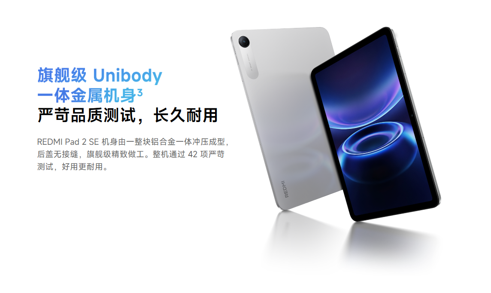

_图源：小米官网，via 快科技_

**坑五：荣耀 X9——包装盒里有取卡针，但国行不能插卡。**

这不是段子。它国行版的包装里真的配了取卡针，但只有海外版才有 LTE。被这根针误导下单的人不是一个两个。那应该买哪台？荣耀国行平板全系没有蜂窝版，要插卡请回头去看第一章那张清单，别信配件，信参数页。

> 便宜的错误选项，是最贵的省钱方式。

## 下单前最后一页

收藏这一章就够了。买完之前回来对照一遍。

**价格核验。** 这篇文里所有价格都带快照日期，你看到文章时如果离 2026 年 9 月已经远了，按这个顺序重查：先看京东国补后到手价（3C 数码国补是 15% 直减、单件封顶 500 元、单价 6000 以内可享——所以 iPad Pro 全系基本吃不到国补），再叠教育优惠。教育通道三家：苹果教育商店、华为商城教育认证领券减 150（这是华为唯一的官方教育通道）、联想教育优惠（小新 Pro GT 11.1 教育价史低 1599，还能再叠国补）。学生党九月正是教育优惠叠加国补的窗口期，别浪费身份。

**收货验货。** 7 天无理由期内，三件事必须做：纯白纯黑图片全屏显示，检查坏点和亮点；外放最大音量放一段人声，听有没有破音；连着 WiFi 打一局游戏或看一小时视频，确认没有断流。有问题别犹豫，直接退。

**型号核对。** 挂购物车之前，逐字核对型号后缀。联想「小新平板 Pro GT 11.1」和「Pro GT 13」是两台完全不同的机器，电商聚合页经常混在一起展示。选错 SKU 是平板品类退货的第一大原因，别当那个分母。

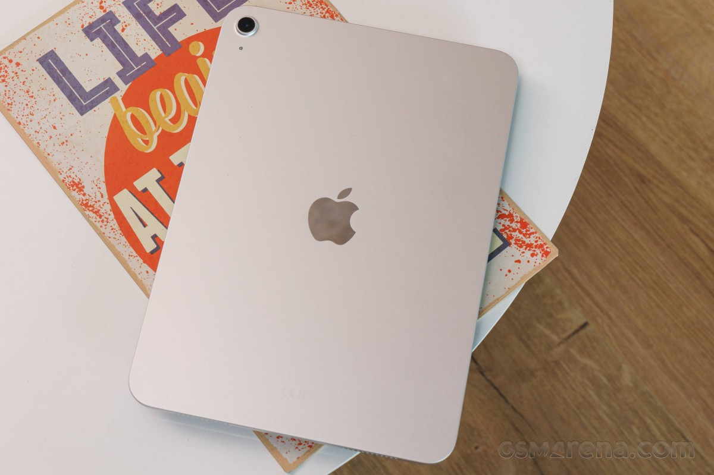

_图源：GSMArena_

---

回到开头那三个人。

我表弟最后买了小米平板 8 加笔，总价 2700 出头，比他在清单文里看中的「iPad 全家桶」方案省了两千多。小区那位宝妈买了 OPPO Pad SE，七百多块，上班时用手机就能锁娃的屏幕时间。我爸那台 REDMI Pad 2 Pro 正在客厅放着《亮剑》，12000mAh 的电池，他两天才想起来充一次电。

他们三个人没有一个人关心过安兔兔跑分。

把全文压成一句话：**先确定要不要插卡，再算「整机+笔+键盘」的总价，然后按预算对号入座——1000 元内 OPPO Pad SE，1500 档 REDMI Pad 2 Pro，2000 档小米平板 8，3000 元以上华为 MatePad Mini；价格是 2026 年 9 月快照，下单前以实时页面为准。**

**最好的平板不是参数最多的那台，是你买回来三个月后还在天天用的那台。**

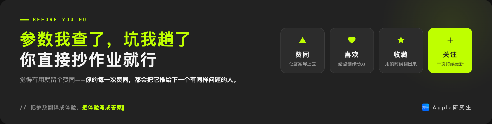

<!--
========== 文末说明（不发布） ==========

## 标题备选
- A（现用，2026-09-09 GEO 微调：核心词「平板推荐」前置于标题开头，保留「5 件事」悬念结构）：《2026 年平板推荐：我把 7 个品牌 26 款在售平板翻完，发现带货文不会说的 5 件事》
- B：《给爸妈买平板追剧，99% 的推荐文从第一步就错了》（人群切入，转发友好）
- C：《平板选购的隐藏账单：标 2999 的机器，配齐要花 5600》（配件税切入，反常识最强）

## 写作说明（取舍记录）
1. 大纲第一章 5 件事全部保留，但每小节末尾的「这对你的钱包意味着什么」压缩为一两句话，避免五个小节句式雷同的八股感。
2. 第二章三个人群统一用了「场景推演 → 重要参数 → 对比表 → 唯一解+劝退」，但宝妈章刻意不提任何跑分数字（大纲要求），改用「管控强度排序」做主线；父母章同样以耳机孔/宽带/电池为主线。
3. 华为 MatePad 11.5 2026 的 1698 是 2026-03 行情，与其他价格快照（2026-09）不在同一时点，正文里如实标注「需重查」，没有为了整齐而抹平时效差异。
4. 联想小新 Pro 13 的 1466–1996 原为 2026-05~08 促销快照，发布前复核（2026-09-08）已更新为京东国补后约 1784。
5. 「待核实」条目处理：华为 11.5 全网通制式/通话能力、REDMI Pad 2 Pro 5G 国内 SIM 形态，正文均写「下单前问客服」；REDMI K Pad 2（调研标注参数待核实、带货前需补调研）全文未提；各品牌远程协助无实测，父母章如实写「没用过的不编」。
6. 金句共 4 处：开头后 1 处（性价比/遗憾）、第四章 1 处（便宜的错误选项）、结尾 1 处（三个月后还在用）；另有一个隐性金句「发布价已死」在第一章第三件。
7. 好物卡占位共 8 个：大学生章 2 个（小米平板 8、联想小新 Pro GT 11.1），宝妈章 3 个（OPPO Pad SE、荣耀平板 10、REDMI Pad 2 乐学版），父母章 3 个（华为 MatePad Mini、REDMI Pad 2 Pro、联想小新 Pro 13），速查表章 0 个（2026-09-16 调整：原速查表 5 卡全部撤下，分散至各人群章并补卡前导购钩子，避免同章密集堆卡）。按延迟插卡策略，初发全部不带链接，跑 24–48h 数据后回填。
8. 小屏组（2.4）没有独立成人群章节，而是拆进了第四章 mini 7 的避坑里——大纲骨架里小屏组本就只出现在配图规划和避坑章，未单独设章节，遵循大纲。
9. 开头三场景用了「表弟/小区宝妈/我爸」的叙述者视角，这是基于大纲「三个并列的真实搜索场景」的人格化处理；若账号没有这些真实素材，发布前需确认可接受的第一人称叙事边界。
10. 实拍图共 14 张（含 2026-09-09 第二轮补嵌 7 张）：大学生章新增华为 MatePad 11.5 2026 官网正面图、小新 Pro GT 11.1 官方 KV；宝妈章新增荣耀平板 10 官网正面图、REDMI Pad 2 乐学版官方素材图；父母章新增小新 Pro 13 太平洋聚超值实拍；速查表章新增 MatePad Mini 手持实拍（同框3，快科技/@超维界）；避坑坑四新增 REDMI Pad 2 SE 官网展示图。图源标注口径：官网直抓写「图源：XX 官网」，媒体转载官方素材写「via XX」。跳过未配：iPad Air M4（速查表章一句带过的生态党备选）、荣耀 X10 Pro Max（补充选项级，清单无备选背面图，KV 带卡通营销元素）、vivo Pad SE / vivo Pad5c（劝退或一句带过）、Y700 五代/无极（坑三已有四代实拍）、小米平板 8 Pro / OPPO Pad 6 / MagicPad 3 Pro / iQOO Pad6 Pro（无点评段或图分辨率 <800px）。

## 关键数据快照日期清单
- 全品牌参数/价格基准快照：2026-09-07（调研总览表头口径）
- iPad 11 京东国补后约 2999：2026-09 初
- iPad Air M4 京东国补后约 4772：2026-09 初（苹果.md）
- 小米平板 8 渠道国补后约 2124：2026-09 快照
- 华为 MatePad 11.5 2026 国补后约 1698：2026-03 行情（旧快照，必重查）
- 联想小新 Pro 13 京东国补后约 1784：2026-09-08（什么值得买 2026-08-29 爆料：京东 2099 活动价 -15% 国补 = 1784.15，8+256）
- 联想小新 PadPro 12.7 京东活动 1649：2026-08（正文未用，备用）
- iQOO Pad5e 京东实付 2070 / 国补 1799.1 起：2026-09 快照
- REDMI Pad 2 Pro 发布期国补约 1529：发布期快照
- OPPO Pad SE 国补 721.65 起 / vivo Pad SE 849.15 起 / 荣耀平板 10 1274.15 起：2026-09 快照
- 苹果涨价 800–1800（iPad 11 2999→3799）：2026-06-25，IT之家信源
- 小米涨价 100–200：2025-12-16
- iPad mini 7 涨价前京东 2823 vs 官网现 4799：2026-09 快照
- 安兔兔 V10/V11 不可跨版本对比：安兔兔 2026-08 月榜说明

## 发布前必核项（抄自大纲第 6 节）
- 🔴 京东 2026-09 实时到手价全量复核（发文前一天做）
- 🔴 苹果涨价后 iPad 11 / mini 7 各 SKU 官网价
- 🔴 REDMI Pad 2 Pro 5G 国内版 SIM 形态、华为 11.5 全网通版制式与通话能力（问官方客服）
- 🟡 各品牌远程协助功能实测（父母场景要用，无现成资料，考虑自测或不写）——正文已按「不写结论、建议打客服」处理
-->
