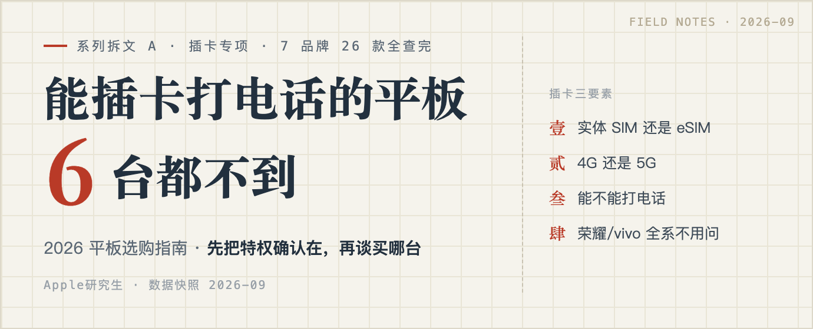
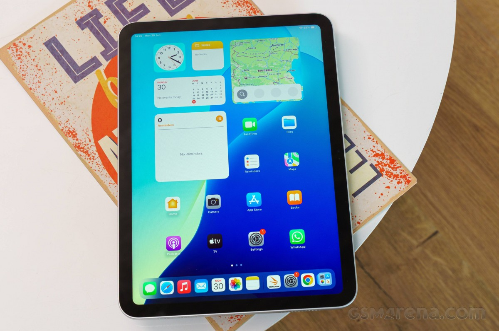
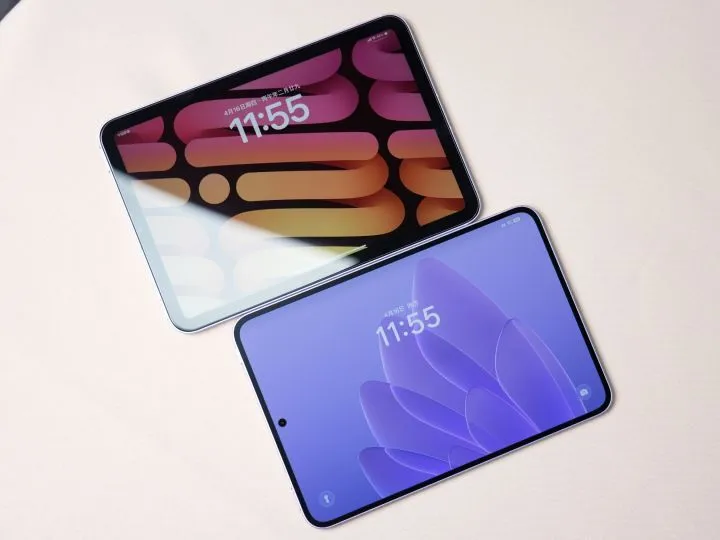
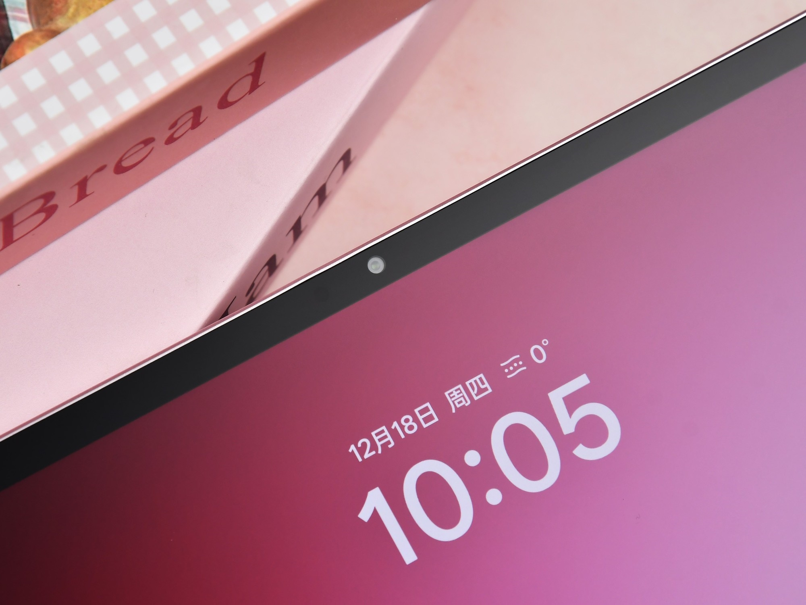
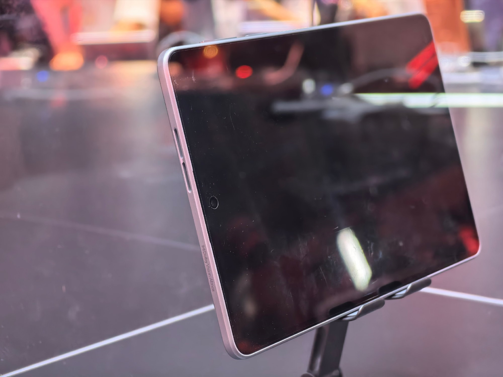

# 能插卡的平板有哪些？2026 全网仅 6 台，可插实体 SIM 的平板全清单（附 eSIM 门槛说明）

前阵子帮我爸挑平板，他提了个我觉得天经地义的需求：家里没装宽带，平板得能插手机卡上网。

我心想这还不简单，加个几百块上个蜂窝版呗。结果把苹果、华为、小米、OPPO、vivo、荣耀、联想七个品牌的官网在售页翻了个底朝天，26 款平板挨个查完，发现一个反常识的事实：

**2026 年，「平板加钱就能插卡」已经是老黄历了。能插实体 SIM 卡打电话的，不到 6 台。**

荣耀和 vivo/iQOO 的国行平板全系没有蜂窝版，两家官网都明示了；小米的数字系列（小米平板 7、8 全系）也全是 WiFi 版。iPad 倒是全系有蜂窝版，但只有 eSIM、没有实体卡槽，而且只能上网、不能打电话。

所以「能插卡的平板有哪些」这个问题，答案比绝大多数人以为的短得多。这篇把答案一次给全。

这篇是《2026 平板选购指南》系列文章之一。主文讲按你是谁买什么，这篇专门讲插卡这一件事。

## 先立个工具：插卡三要素

「能不能插卡」其实是个模糊问题，拆开是三个问题：

- **实体 SIM 还是 eSIM？** eSIM 没有卡槽，要运营商支持开通，国内目前只有部分城市部分运营商能办，门槛比想象中高。
- **4G 还是 5G？** 决定网速上限，也决定两三年后会不会落伍。
- **能不能打电话？** 大多数蜂窝平板只能上网。能打电话的，才谈得上「老人大屏手机」这种用法。

后面每台机器我都按这三要素标清楚。你看到任何一篇推荐文只说「支持插卡」却不拆这三条的，直接关掉，它要么不懂，要么不想让你懂。

## 能插实体 SIM 卡的，全网就这张清单

按价位排，共 6 台。价格是 2026-09 上旬快照，电商价随国补和促销波动，下单前以页面为准。

| 型号 | 形态 | 制式 | 能否打电话 | 到手价 |
|---|---|---|---|---|
| REDMI Pad 2 SE 4G 版 | 实体 SIM，双卡双待 | 4G | 能，通话+短信 | 标价 1299，国补后约 1039–1104 |
| OPPO Pad Air5 5G 版 | 实体 SIM | 5G | 支持 5G 通话 | 2399 |
| REDMI Pad 2 Pro 5G 版 | 实体 SIM，双卡双待 | 5G | 能，通话+短信 | 8+256 国补后约 2294 |
| 华为 MatePad 11.5 2026 全网通版 | 实体 Nano-SIM | 信源冲突：规格库标 5G 含完整频段，个别电商页标 4G；倾向 5G，官网未标注 | 仅蜂窝数据，不能打电话（电商参数页口径，官网未标注） | 2799 |
| 华为 MatePad Mini 全系 | 实体 Nano-SIM | 渠道标 5G，官网未标注 | 能，灵犀通信 | 国补后 3399 起 |
| 联想拯救者 Y700 无极 | 实体 SIM＋内置流量卡（双卡双通） | 5G 全网通（含 N79 频段） | 能 | 国补后 4299–4499 |

这两台我曾经标过「待确认」，这次替读者查实了，交代一下口径。REDMI Pad 2 Pro 5G 国内版已确证：双实体 SIM 卡槽、双卡双 5G，通话+短信+数据齐全，另有联通 eSIM（仅数据，开通后实体卡只能用一张），安兔兔、凤凰科技等多家 2026 年 3 月 26 日发售报道口径一致。华为 MatePad 11.5 全网通版有信源冲突：两家规格库标 5G 并列出完整 5G 频段（n1/n3/n5/n8/n28/n38/n40/n41/n77/n78），个别国内电商聚合页标 4G——我倾向前者，因为它搭载的麒麟 8020 集成 5G 基带（nova 16 SE 同款芯片实测 5G 全网通），但官网确实没标。通话能力官网同样没写：京东商品标题不带「可通话」（华为能打电话的平板标题都会标），电商参数页也写「不支持通话」，我按不能打电话处理。保守派下单前可以把这两台再丢给客服复核一遍。

## 只有 eSIM 的阵营：只剩 iPad

iPad 全系（iPad 11、mini、Air、Pro）的蜂窝版都是一个路子：**纯 eSIM，无实体卡槽，5G，仅数据、不能打电话**，蜂窝版比 WiFi 版贵 1300 元上下。

这里有个给父母买 iPad 时特别容易踩的坑：国内 iPad 的 eSIM 不是随便哪张卡都能开的，只有部分运营商、部分城市支持。下单前先打运营商电话，报你所在的城市，问「iPad 的 eSIM 能不能开通」，确认能开再买蜂窝版，不然多花 1300 买个 WiFi 版回家。

OPPO Pad Mini 容易被误传成 eSIM 平板——发布前的爆料确实这么说，但零售版并没有：IT之家上手稿和多家评测都确认它硬件上没有通信基带，eSIM 和实体卡都没有。它的联网全靠 ColorOS 的「通信共享」：直接调用你 OPPO 手机的网络和通话，平板本体不插卡也能上网。用同品牌手机的人，这个功能能顶替半个蜂窝版；不用 OPPO 手机，它就是一台纯 WiFi 平板。

## 这些品牌不用问了

- **荣耀**：国行平板全系 WiFi 版。特别提个醒，荣耀平板 X9 的国行包装盒里真的配了取卡针，但只有海外版才有 LTE——被这根针误导下单的人不是一个两个，别信配件，信参数页。
- **vivo / iQOO**：全系无蜂窝，官网 FAQ 明示。
- **小米数字系列**（小米平板 7、8 全系）：无蜂窝，能插卡的是 REDMI 产品线。
- **联想主线**：小新、YOGA 全系 WiFi，唯一的例外是上面清单里的拯救者 Y700 无极。

## 按人群给答案

**家里没宽带、给爸妈买来追剧视频通话：REDMI Pad 2 SE 4G 版。**

这是千元档唯一「大厂+能打电话」的答案：插实体卡、双卡双待、能通话能短信，官方自己的定位就叫「大号手机」。9.7 寸屏对这个用途偏小一号，但 1299 的标价（国补后约 1039–1104）没得挑。

**[REDMI Pad 2 SE（京东链接）](https://item.jd.com/100254130421.html)**——注意，挂的这个链接标题被平台截断了，**下单前必须确认你拍的是 4G 版（6+128）而不是 WiFi 版**，这篇文章推荐它的全部逻辑都建立在 4G 版上，拍错版本就白看了。

**适合**：家里没宽带的老人、需要一台能视频通话的大屏设备。**不适合**：想要大屏追剧的（加钱上 12 寸档）、玩游戏的（入门芯片，看视频网课够用）。

**预算 2000–3000、既要大屏又要插卡：OPPO Pad Air5 5G 版。**

12.1 寸 2.8K 屏，有柔光版可选，5G 实体卡支持通话，2399。这个价位里它是「大屏+插卡+大厂」三项全占的唯一解。处理器是天玑 7300 Ultra，看视频网课学习够用，别指望大型游戏。

【待替换：OPPO Pad Air5 5G 版京东自营链接】

**适合**：预算有限又要大屏插卡的学生和家庭。**不适合**：游戏党、对屏幕素质有更高要求的（加钱上华为全网通）。

同价位还有两个备选。华为 MatePad 11.5 2026 全网通版 2799，柔光屏+鸿蒙学习生态，是宝妈「带娃出门不蹭公共 WiFi」的唯一组合——前面核实过了，5G 蜂窝数据、不能打电话，想当「大号手机」用别选它。REDMI Pad 2 Pro 5G 版国补后约 2294，5G+12000mAh 大电池+3.5mm 耳机孔，双卡双待还能打电话，前面也确证过了。

【待替换：华为 MatePad 11.5 2026 全网通版京东自营链接】

**给老人当「大屏手机」用：华为 MatePad Mini。**

8.8 寸 OLED、255g、能插卡打电话、3200 万前置——视频通话画质是这个场景里最强的。它本质上就是一台老人大屏手机，国补后 3399 起。悦读版同样支持插卡打电话（京东商品标题就标着「SIM卡版可通话」），2026 年 3 月有过 2451 的低价，下手前比价。

【待替换：华为 MatePad Mini 京东自营 SIM 卡版链接】

**适合**：想给老人换「能视频的大手机」的、通勤要插卡便携平板的。**不适合**：想要大屏的、预算敏感的（REDMI Pad 2 SE 4G 是七分之一的价）。

**打游戏还要插卡：拯救者 Y700 无极，但先把价格看清楚。**

8.4 寸 OLED、骁龙 8E Gen5 领先版、5G 全网通含 N79 频段，参数是小平板里的天花板。但国补后 4299–4499 的价格，什么值得买上值友的原话是「东西好价格劝退」。我的建议：除非你天天在地铁上打大型手游、插卡是硬需求，否则 Y700 四代（学生+国补后 3000 内）就是全部答案，省下的 1000 块够买两年游戏。

**千元以内必须插卡**：只有联想子品牌来酷、异能者的 4G 版（799–999）能选。实话实说：这两家是联想投资的子品牌，参数透明度、品控、售后都弱于大厂主线，我不放链接也不强推——预算能加 300，REDMI Pad 2 SE 4G 是这个品类里唯一不用提心吊胆的选择。

## 下单前，问客服三句话

任何一台标称「可插卡」的平板，付款前把这三句话发给客服：

1. 是实体 SIM 卡槽还是 eSIM？（eSIM 接着问：支持哪些运营商、我所在的城市能不能开通）
2. 支持 4G 还是 5G？具体哪些频段？
3. 能不能打电话、发短信，还是只能上网？

客服的回答截图存好。参数页写得含糊的型号，这三句就是验货标准，到手不符就是七天无理由的弹药。

照例交代利益关系：文中有京东商品链接，通过链接下单我会有少量返佣，价格和你自己搜完全一样，介意的话记下型号自己去搜。返佣不影响内容——来酷那种能返但我依然不放的，就是例子。

**2026 年，WiFi 版是平板的默认形态，插卡是一种特权配置。先确认特权在，再谈买哪台。**

---

> 📚 **同系列文章**
>
> - 【待替换：2026 平板选购指南主文知乎链接】（按你是谁直接抄作业：大学生/宝妈/父母追剧）
> - 【待替换：平板配件篇知乎链接】（笔和键盘都不送，配件税最高能再买一台安卓板）
> - 【待替换：宝妈管控横评知乎链接】（儿童空间按管控强度排序，不按品牌排序）
