# 2026 联想平板怎么选？小新 Pad / 拯救者 Y700 / YOGA 全系对比，这几款我劝你别买

联想平板大概是国产大厂里，产品线最「参差」的一家。

749 元能买到 10 英寸入门机，4599 元能买到 8.8 英寸游戏旗舰；YOGA 在拼创作，异能者却在卖 Windows 二合一。全挂着联想的牌子，体验差出好几档。

所以这篇我不按型号流水账。先把丑话和验货方法说在前面，再按预算给结论：哪些值得买、哪些只在特定场景值得买、哪些我建议你别碰。参数卡插在正文里，图上只有官方图和硬参数，优缺点、适合谁、真实评价都写在文字部分。

参数优先取自 **联想官方乐享知识库 / 联想官方商城配置信息页**；官网没标全的重量、尺寸等，用京东详情页或可靠媒体实测补上。价格是京东联盟「联想平板 超补品牌日」的活动到手价（2026-08-25—28），以你结算页实际金额为准。

---

## 一、先说三类人，我建议你别买联想平板

### 1. 想要省心系统更新和软件适配的

联想的 ZUI 在分屏、小窗、横屏应用适配、手写笔延迟上，跟小米澎湃、华为鸿蒙有肉眼可见的差距，更新节奏也不算稳。如果你现在用的是华为或小米平板，换过来大概率会觉得「系统细节糙」。

### 2. 想买平板当主力办公/创作的

联想平板里真正往办公方向做的只有 YOGA Pad Pro 14.5，5999 元。这个价已经可以买到 iPad Air/Pro，或者一台正经 Windows 轻薄本。小新/拯救者的键盘+笔生态，配件可选少、体验也不成熟。

### 3. 预算千元内又什么都想要的

这个价位的联想平板就是「能亮屏、能看视频」。别指望流畅多任务、好屏幕、好售后。抱着「749 元买 2000 元体验」的预期下单，结局基本是吃灰。

---

## 二、联想平板的真实短板

### 1. ZUI 系统是第一道坎

分屏逻辑、小窗手势、横屏适配、手写笔延迟，都不算第一梯队。从华为/小米平板换过来的朋友，头两周大概率不适应。

### 2. 子品牌混乱

异能者、来酷是联想投资的品牌，不是嫡系。官方配置页不完整、有的型号连单产品官方图都没有、真实用户评价样本少，售后和系统更新也别拿小新/拯救者/YOGA 主线的标准去期待。

### 3. 官方参数不透明

来酷 Mini、来酷 Pro12.7、YOGA Pad Pro 14.5、异能者 J140/S120A 这几款，处理器、重量、尺寸、分辨率在官网经常缺项。普通用户买之前想把参数看全都难，这本身就是风险点。

### 4. 配件生态弱

除了 YOGA 14.5 和个别小新型号，键盘、笔、保护套这些周边可选的不多，体验跟 iPad/华为/小米比有差距。

---

## 三、买前必查的 6 件事

**1. 官方参数页写没写全**

联想官方乐享知识库/官方商城里，小新、拯救者、YOGA 主线的参数通常比较全；来酷、异能者经常缺处理器、重量、尺寸、分辨率。遇到缺项，先找客服要官方截图，再下单。

**2. 到手价是不是真「到手」**

联盟页写的是活动价，结算页可能因为国补、地区、账号身份不同而变。下单前把商品加购物车，看实际应付金额和预计收货时间，别只看宣传页。

**3. 接口和扩展性**

需要键盘、手写笔、TF 卡、4G 的人，先确认这台机器支持什么。联想很多入门型号没有官方笔/键盘，第三方配件质量参差。

**4. 售后主体是谁**

联想主线（小新/拯救者/YOGA）和子品牌（来酷/异能者）的售后渠道、保修政策可能不一样。下单前问清楚是否全国联保、怎么送修、系统更新承诺多久。

**5. 激活后能不能退**

平板跟手机一样，很多平台激活后不支持无理由退货。不确定适不适合的话，先别急着激活，测试没问题再登录账号。

**6. 学生认证/教育优惠怎么用**

联想平板在京东很多型号标了「学生教育优惠」，叠上国补往往还能再减 200 元。但前提是你先完成认证。

- **谁能认证**：15–28 岁全日制在校生（专科/本科/硕博）、当年应届高考生/中考生、12–18 岁初高中生（需监护人授权）、部分高校教职工。非全日制、已毕业、企业账号不行。
- **需要什么**：在校大学生优先用学信网学籍验证码，秒过；没学籍的准大学生用高考准考证/录取通知书；初高中生走人脸核验。
- **在哪认证**：京东主 APP 搜「学生1234」或「教育1234」进校园专区；联想官方商城搜「教育优惠」。
- **能不能叠**：可以。学生价 + 国补 15% + PLUS 95 折 + 店铺券/平台券都能叠。但不是所有商品都有教育优惠，看商品页有没有「教育优惠适用」标签。拯救者 Y700 四代、Y900 13 部分 SKU 学生认证后再减 200 元，以结算页为准。
- **有效期**：在校大学生随学籍长期有效，平台每年自动复核；高考生临时身份当年 10 月 31 日截止，入学后记得更新学籍。

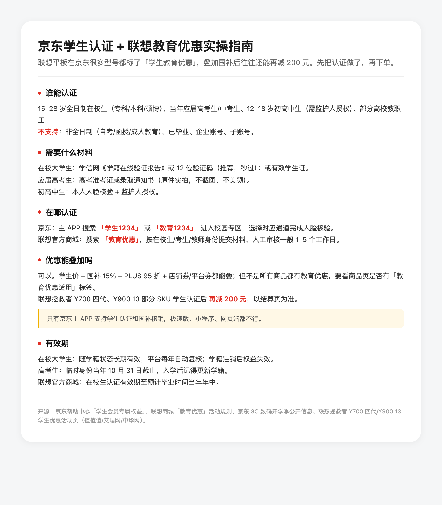

---

## 四、到手后必做的 8 项检查

平板不像衣服，有问题越早发现越好。到手 24 小时内，建议按这个顺序过一遍：

1. **屏幕坏点/亮点/色差**：纯色图（红绿蓝白黑灰）全屏各看一遍；低亮度下看有没有泛绿/泛黄。
2. **触控和断触**：用安兔兔或浏览器画线测试，看有没有断线、误触，边缘和角落重点测。
3. **性能冒烟**：装个《原神》或《王者荣耀》最高画质跑 10 分钟，看帧率稳不稳、机身烫不烫。只用来看网课的话，开 5 个网页 + 1 个视频看流不流畅。
4. **电池健康**：设置里看电池信息；系统不给看就用 AccuBattery 充放电两次估容量，全新机明显低于标称就退换。
5. **充电速度**：从 20% 充到 80% 计个时，跟官方标称对一下。18W、20W、68W 的差距一眼就能看出来。
6. **扬声器破音**：音量开到 80% 放音乐/电影，听有没有破音、电流声。
7. **网络连接**：WiFi 断不断流、蓝牙耳机延迟大不大、4G 通话和信号（插卡版）正不正常。
8. **系统更新**：设置里检查更新，看最新安全补丁日期。到手就是一年前的系统，渠道或库存可能有问题。

发现问题别犹豫，7 天内联系售后退换。过了激活期就麻烦了。

---

## 五、联想平板和小米/华为/iPad 怎么选

**1000 元内**

- 只追剧/网课：小新 Pad 11 屏幕更好，但 Redmi Pad/荣耀平板 X9 的系统稳定性可能更好。
- 插卡通话：来酷 Mini/11 是这个价位少有的 4G 通话平板，别家基本没有。
- 家人用华为/荣耀手机：华为/荣耀平板的多屏协同、文件互传比联想 ZUI 方便得多。

**1500–2000 元**

- 大屏长续航：小新 PadPro 12.7 2025 款屏幕和电池占优，但 ZUI 不如小米澎湃/华为鸿蒙顺滑。
- 性能小钢炮：PadPro GT 11.1 性能强，但小米平板 6S Pro 系统适配更好，看你偏性能还是偏系统。

**3000 元以上**

- 手游：拯救者 Y700 四代是安卓小屏游戏平板里配置最高的；影音办公为主的话，同价位 iPad Air 或小米平板 6S Pro 更均衡。
- 创作/办公：YOGA Pad Pro 14.5 的 OLED 和键笔套装不错，但 iPad Pro 的软件生态和手写笔延迟依然更成熟。
- Windows 二合一：异能者 J140/S120A 便宜，但 Surface、二手轻薄本在性能和体验上更稳。

---

## 六、按预算直接说结论

### 800–1000 元：只有两种需求值得看

这个价位别谈性能。你买联想只有两个正当理由：

- **不插卡，就想要一块 11 英寸 2.5K 屏看网课/追剧** → 小新 Pad 11。
- **必须插 SIM 卡** → 来酷 Mini（8 英寸）或来酷 11（11 英寸）。

其他型号，说实话我都不推荐。

#### 小新 Pad 11（¥949，6GB+128GB）

千元内少有的 2560×1600 + 90Hz 屏，精细度明显好过同档清一色的 1920×1200。天玑 6300 比同系列舒视版那颗骁龙 685 流畅一点，金属机身、四扬声器、支持 MicroSD 扩展，这个价算有诚意。

短板也得说清楚：6GB 内存别指望挂一堆后台；ZUI 分屏逻辑一般；2025 款砍了陀螺仪，玩《和平精英》靠陀螺仪压枪的人会很别扭。前置 500 万/后置 800 万像素，视频通话和扫码够用，拍照别想。

**我的结论**：预算卡死 1000 元内、主要上网课追剧的学生党或家庭用户，这台是稳妥解。重度手游玩家、FPS 玩家、对流畅度挑剔的人，绕行。

参数来源：处理器/屏幕尺寸/内存/存储来自联想官方商城 SKU 选择器，分辨率/电池/重量/尺寸由京东详情页/媒体实测补充。

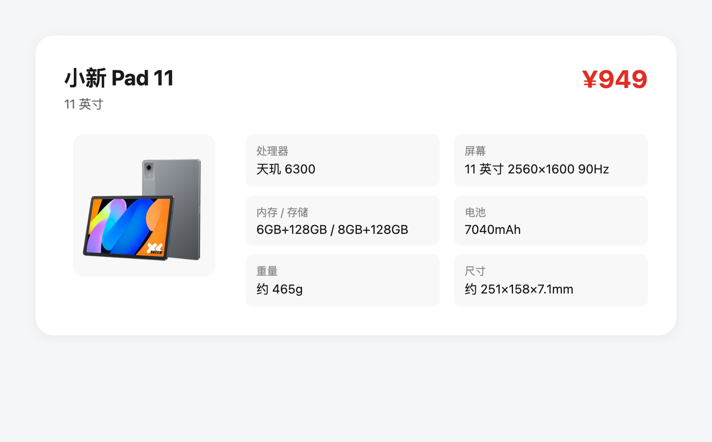

#### 来酷 Mini / 来酷 11（¥799 / ¥928）

这个价位少见的 4G 通话平板——这基本就是它们存在的全部理由。Mini 8 英寸 324g，塞包里当备用机、扔车里当导航都合适；来酷 11 屏幕大一号，256GB 存储宽裕些。

但冷水也得泼：性能只够日常；Mini 的屏幕分辨率官网都没公开；来酷 11 的真实评价少到什么程度呢，京东自营和中关村的集中评价页我翻的时候一度是 0 条。来酷是联想投资的子品牌，售后和系统维护别拿小新主线的标准期待。

**我的结论**：画像很窄——必须插卡通话、预算卡死千元内的人。主要在 WiFi 环境用、在乎屏幕素质、想玩游戏的，别碰。

参数来源：来酷 Mini 核心参数来自 IT之家报道；来酷 11 屏幕/内存/存储/电池来自联想官方商城，处理器/重量/尺寸由京东详情页补充。

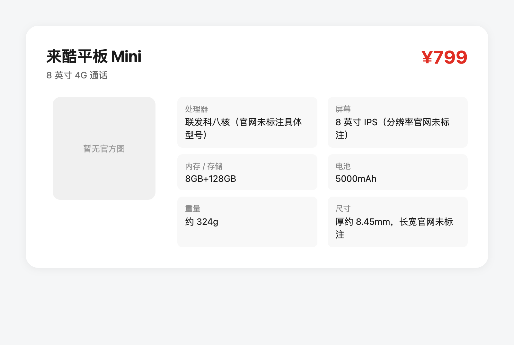

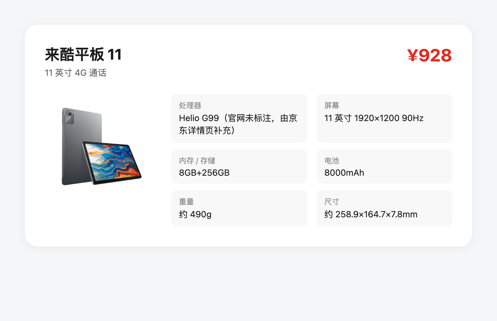

#### 这个价位我不推荐的三台

**异能者 N10B（¥748）**：1280×800 放在 10.1 英寸上颗粒感肉眼可见，处理器只是联发科入门八核。除非预算真的卡死 750 元，否则加 200 上小新 Pad 11，体验好一档。

**来酷 Pro12.7（¥999）**：看着屏幕大，但 Helio G99 带 12.7 英寸大屏是吃力的；660g 重、18W 充电慢，官方连单产品图都没有。同价位我还是那句，小新 Pad 11。

**小新 Pad 2024 舒视版（¥899）**：只推荐给一种人——长时间看网课/阅读、对护眼有硬需求的。柔光屏反光确实少，代价是画面发灰、精细度一般，ZOL 上有用户直接吐槽「打开 app 会卡，屏显一般般」。主要拿来看电影的话，别买柔光版。

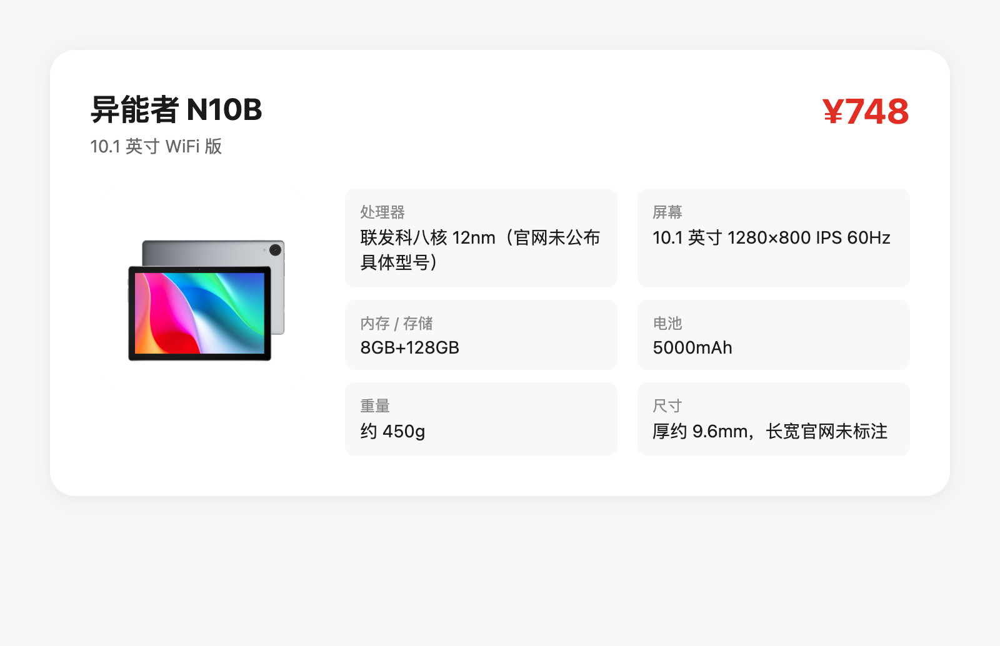

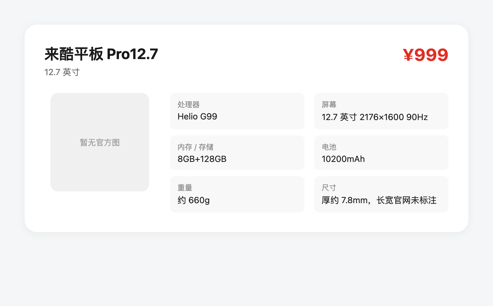

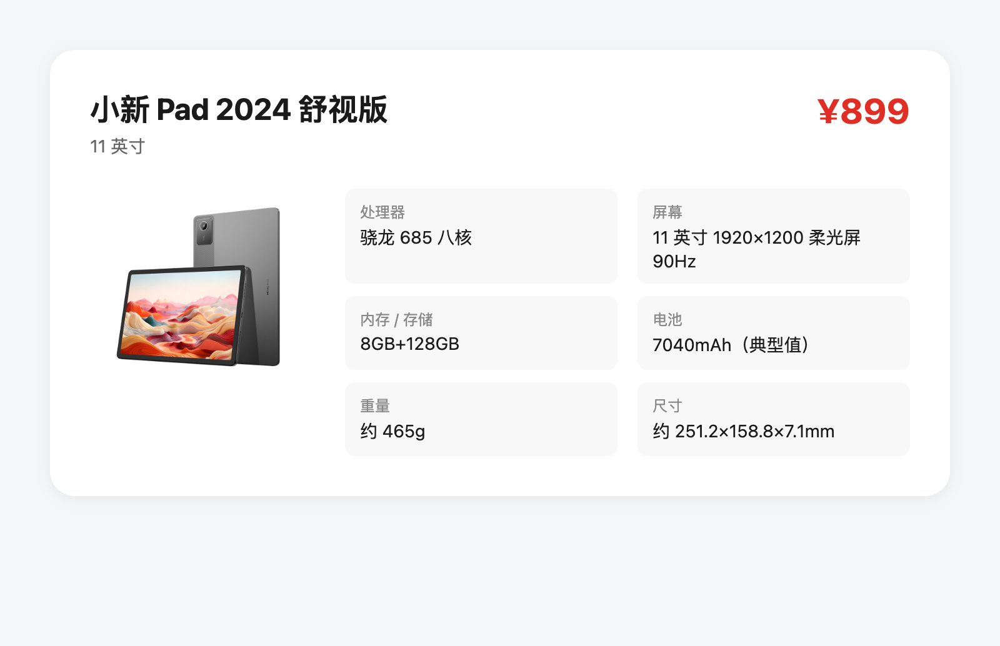

---

### 1500–2000 元：大屏长续航 vs 性能小钢炮

这个区间只重点看两台，其他可以跳过。

#### 小新 PadPro 12.7 2025 款（¥1649）

12.7 英寸 2944×1840 144Hz 屏 + 10200mAh，同价位里「大屏长续航」这个组合它算最稳的。金属机身质感在线，支持 TF 卡扩展。主要看剧、上网课、分屏学习，想一台用两三年，选它。

短板：天玑 8300 不是旗舰，《原神》高画质吃力；ZUI 细节不如华米；机身 620g 左右，单手举久了真累。

参数来源：处理器/屏幕/内存/存储/电池来自联想官方商城配置页，重量/尺寸由京东详情页/媒体实测补充。

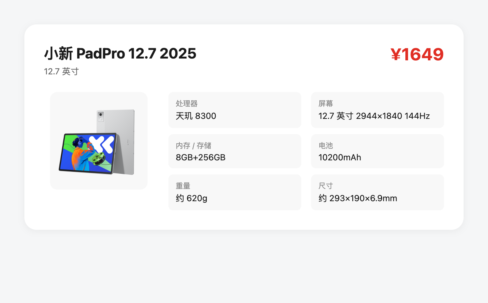

#### 小新 PadPro GT 11.1（¥1899）

骁龙 8 Gen3 + 11.1 英寸 3.2K 144Hz，2000 元内想要旗舰性能又兼顾学习，基本就它了。68W 快充，机身 5.99mm 薄。

短板也直接：ZUI 的分屏/小窗逻辑要适应。另外说句实话，只追剧不打游戏的人，没必要为它多花这几百块。

参数来源：处理器/屏幕尺寸/刷新率/内存/存储/电池来自联想官方商城配置页，分辨率/重量/尺寸由京东详情页补充。

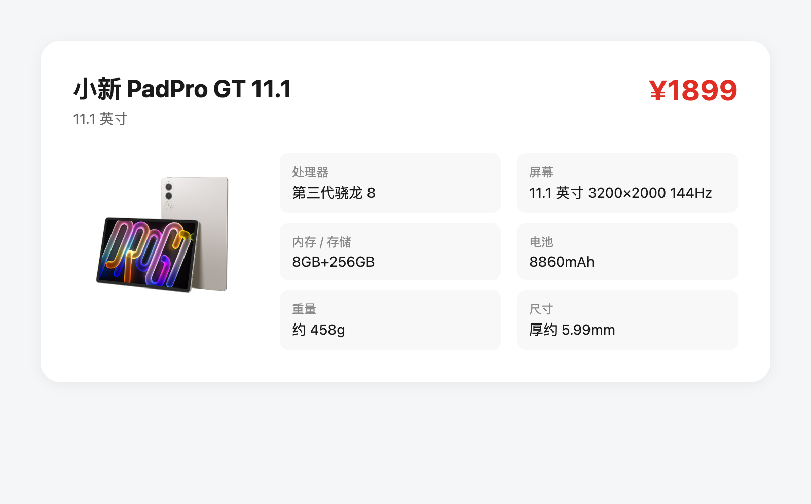

---

### 2500–3500 元：小屏游戏、大屏观影、旗舰全能

#### 拯救者 Y700 四代（¥3299）

重度手游玩家的答案，尤其 FPS 和音游党——嫌手机太小、嫌大平板太沉的那种。8.8 英寸 3K 165Hz + 骁龙 8 至尊版 + 340g，目前小尺寸安卓游戏平板里配置最高的一台。TF 卡槽回归，双 X 轴马达震感比上代强。

短板：LCD 屏的对比度和黑色表现不如 OLED。再补一句，不玩游戏别买它，浪费。

参数来源：处理器/屏幕/内存/存储/电池来自联想官方商城配置页，重量/尺寸由京东详情页/媒体实测补充。

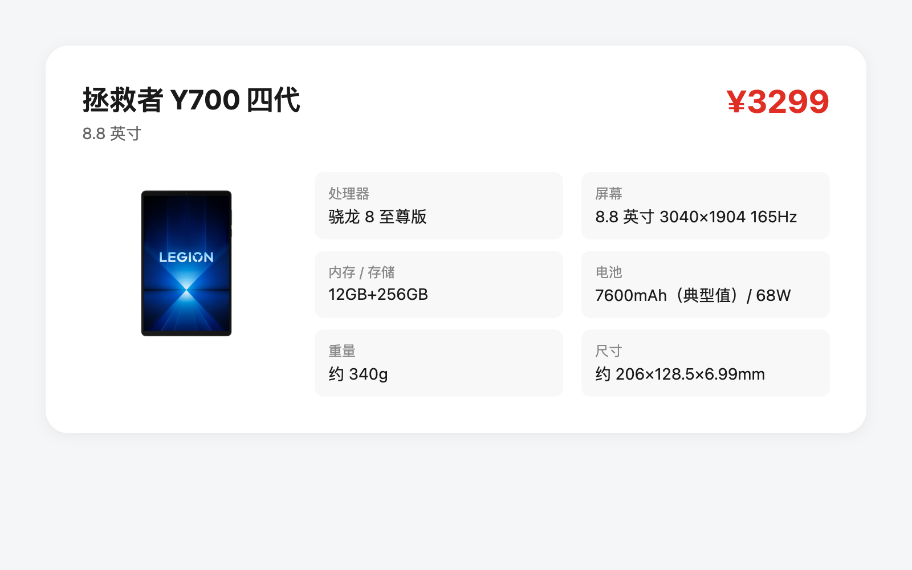

#### 拯救者 Y700 五代（¥3799 起）

五代把电池做到 9000mAh，支持旁路充电，插电长时间玩游戏更护电池；厚度压到 6.2mm。但起售价比四代贵了 500 元，性价比反而不如四代。除非你一定要最新一代，否则我建议四代。

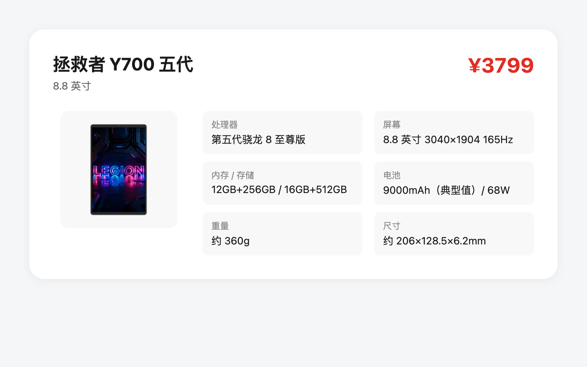

8.8 英寸 + 340g 是什么概念？看用户实拍：单手可握，竖屏刷信息流、横屏打游戏都不压手。

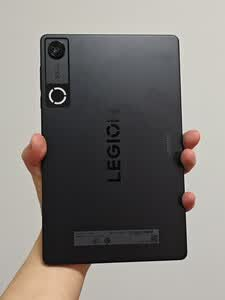

*图源：用户实拍*

#### 小新 PadPro 13（¥2499）

预算 2500、就想要 13 英寸大屏看片上网课的，看这台。13 英寸 3.5K 144Hz，581g 在同尺寸里算轻，4×JBL 扬声器影音体验不错。

短板：骁龙 8s Gen4 不是满血旗舰，重载游戏不如骁龙 8 Gen3/8 至尊版；13 英寸单手举着累，它更适合放桌上或架起来用。

参数来源：处理器/屏幕/内存/存储/电池来自联想官方商城配置页，重量由京东详情页/媒体实测补充。

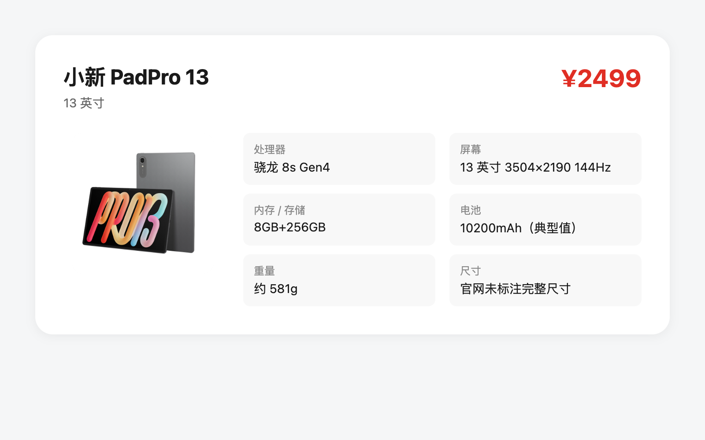

#### YOGA Pad Pro 12.7（¥2799，含键盘+笔）

这台的卖点很单纯：2799 元把键盘和手写笔一次配齐。需要记笔记/轻办公、又不想额外花钱买配件的人可以看。屏幕和小新 PadPro 12.7 同规格。

短板：机身 640g 左右，比小新同尺寸还重 20g；键盘支架在腿上角度固定不住，更适合放桌上，通勤抱着打字就别想了。

参数来源：屏幕/内存/存储/电池来自联想官方商城配置页，处理器/重量/尺寸由京东详情页/历史素材补充。

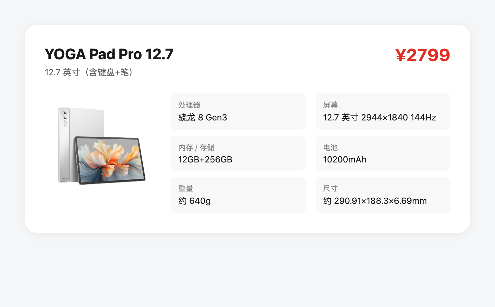

#### 小新 ProGT 13（¥3199）

硬件堆满的一台：骁龙 8 至尊版 + 13 英寸 3.5K 144Hz + 12000mAh。预算 3000+、想要大屏旗舰、办公游戏影音都沾一点，它够格。

但 3199 元这个价，绕不开一个问题——已经能买到 iPad Air 甚至上一代 iPad Pro 了，生态和软件适配是更大的考量。想清楚你要的是硬件还是生态。

参数来源：处理器/屏幕/内存/存储/电池来自联想官方商城配置页，重量由京东详情页/媒体实测补充。

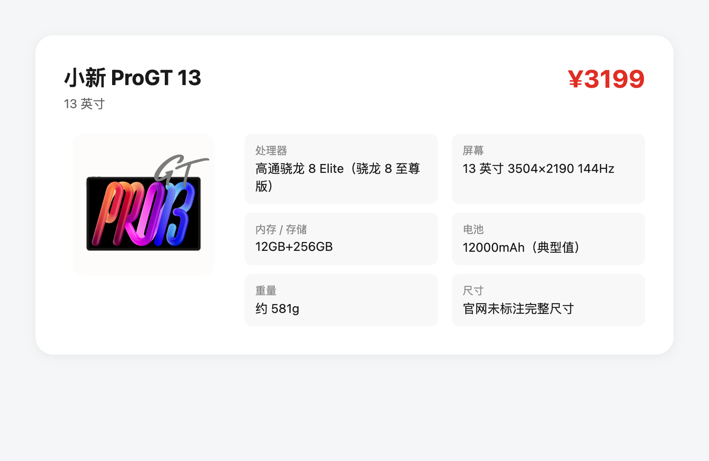

13 英寸到底多大？看用户实拍，手放上去大概就是这个比例——一张 A4 纸的量级。买之前先想好，自己是不是真需要这么大。

*图源：用户实拍*

---

### 3500 元以上：只推荐很明确的需求

#### 拯救者 Y900 13（¥3499 起）

拯救者系列里影音体验最好的一台：13 英寸 3840×2560 144Hz + 12700mAh + 哈曼卡顿 6 扬声器。预算充足、想要 13 英寸 4K 大屏加旗舰芯、主要放桌上用的，可以看。

短板：599g，别想着随身带。另外 4K 屏日常感知不强，还费电，冲着「4K」两个字下单的可以先冷静一下。

参数来源：处理器/屏幕/内存/存储/电池来自联想官方商城配置页，重量/尺寸由京东详情页补充。

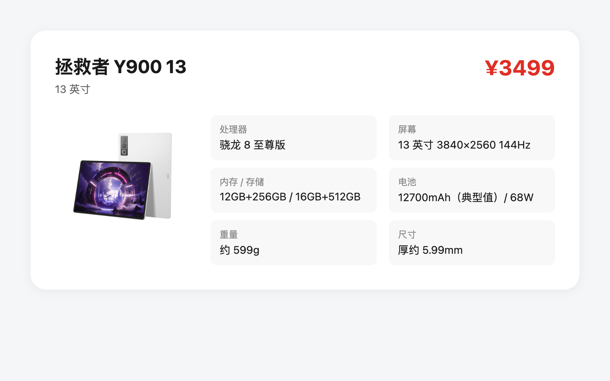

#### 拯救者 Y900 11.1（¥2899 起）

比 Y700 屏幕大、比 Y900 13 轻，想要 11 英寸游戏/影音的人可以考虑。但 4K 屏日常感知不强，单手操作基本不可能。没有明确尺寸执念的话，不如直接看 Y700 四代或 Y900 13。

#### YOGA Pad Pro 14.5（¥5999，含笔+键盘）

14.5 英寸 3K OLED、1600nits 峰值亮度、16GB+512GB、8192 级压感笔，纸面很漂亮。目标用户也很明确：需要大屏 OLED + 完整键笔套装的专业/创作用户。

但 5999 元摆在面前，iPad Pro 11 英寸也在招手，生态和手写笔体验苹果依然更成熟。还有一点要提醒：官方没完整公开处理器、重量、尺寸，下单前找客服问清楚。

参数来源：屏幕/内存/存储/电池来自联想官方商城配置页。

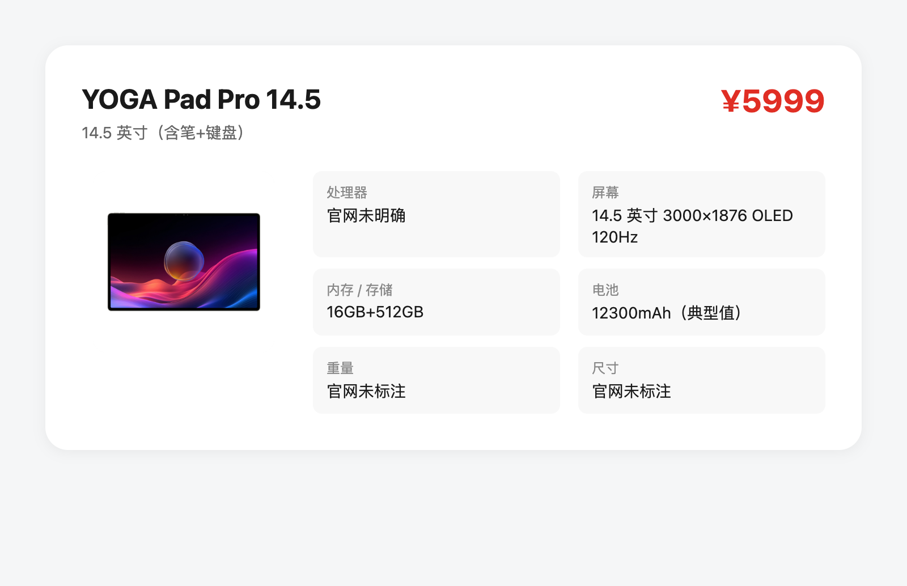

#### 异能者 J140 / S120A（¥2999 / ¥3799）

Windows 二合一，只适合一种人：必须用 Windows 软件、预算有限、轻度办公/网课。

丑话说前面：J4105/N100/N150 都是低功耗处理器，网页开多了加个 Office 就会卡，替代不了正经笔记本。官方也没有完整配置页，参数只能看京东详情页。

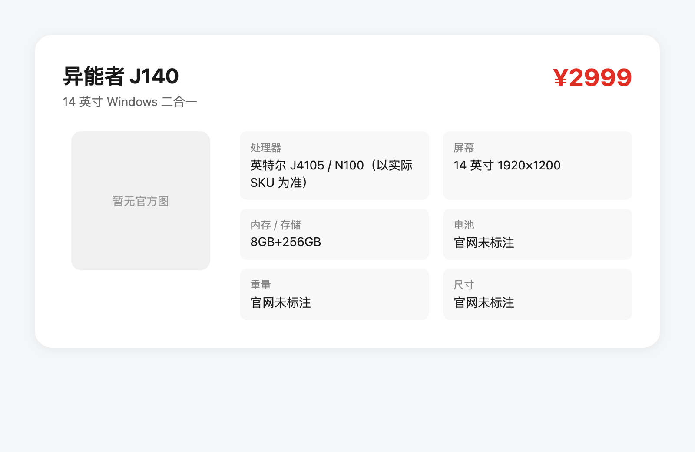

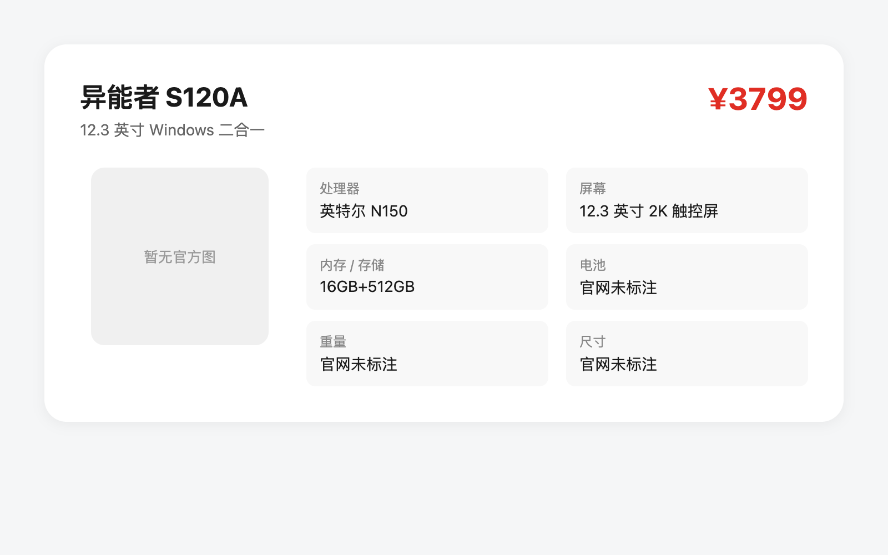

---

## 七、一句话总结

- **1000 元内**：不插卡买小新 Pad 11，必须插卡买来酷 Mini/11，其他不建议。
- **2000 元内**：大屏长续航选小新 PadPro 12.7，性能选 PadPro GT 11.1。
- **3000 元内**：手游选拯救者 Y700 四代，大屏观影选小新 PadPro 13，需要键笔套装看 YOGA Pad Pro 12.7。
- **3000 元以上**：小新 ProGT 13 是硬件旗舰，但同价位生态选择很多；Y900 13 适合放桌上影音/游戏；YOGA 14.5 只推荐给明确需要 OLED + 键笔套装的人。
- **Windows 二合一**只当备用/轻办公，别当主力机。

**利益声明**：文中部分链接为京东联盟好物推荐，下单有返佣，不影响推荐顺序，价格以实际结算页为准。
