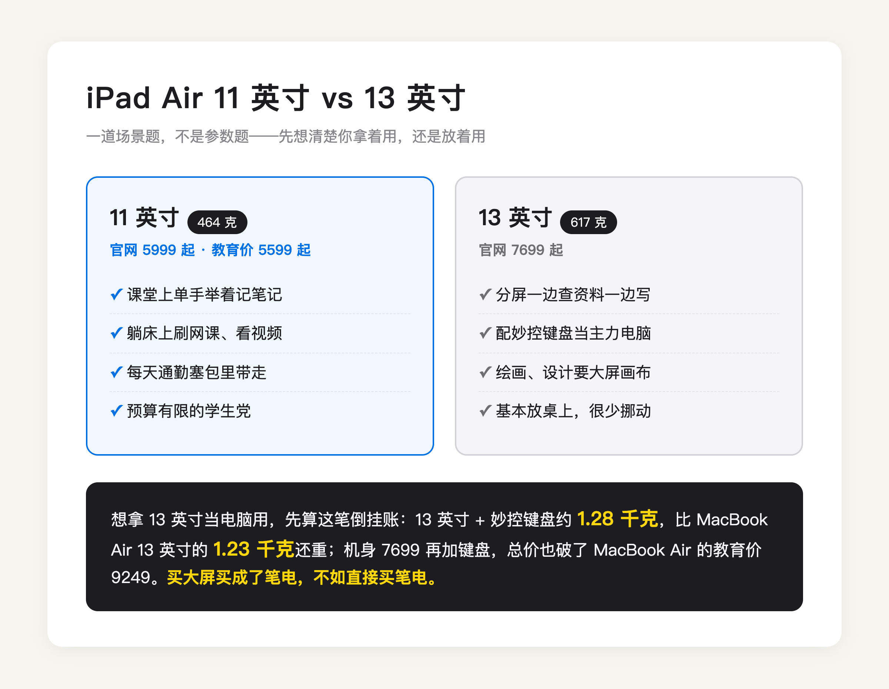

先回答标题里那个「为什么」。

大家都买 11 寸，不是 13 寸不好，是**平板这个品类，灵魂在「手持」两个字上**。

想一下你真实的使用画面。躺床上刷网课，单手举着，手酸了翻个面接着举。通勤地铁上单手抓着它看文档，另一只手还得扶栏杆。窝沙发里举着跟家里人视频，一晃就是半小时。这些场景有个共同点，设备是悬空在你手上的，没有桌子替你分担重量。

要说明白的是，上课记笔记这种正经书写场景，平板其实是躺在桌上的，这时候 13 寸不欺负你，甚至写起来更舒展。重量真正的战场，全在上面那些「举着它」的时刻。

（图源：Notebookcheck 评测实拍）

苹果官网规格页写得很清楚，11 英寸 iPad Air（M4）464 克，13 英寸 617 克。差的这 150 多克，数字上不起眼，拿起来就是轻飘飘和坠手的区别。再算一笔隐蔽的账，这两台机器你大概率都会戴壳用，11 寸戴壳后还在一斤出头，13 寸戴壳加贴膜直接奔着 800 克去了，接近一瓶半矿泉水的分量。躺着举着看一节 45 分钟的课，手腕会替你投票，脱手砸脸的时候，13 寸的物理伤害和接触面积都是加倍的。

（图源：Notebookcheck 评测实拍）

还有一个没人提但天天碰到的问题，包。11 寸能塞进绝大多数帆布包和小双肩的夹层，13 寸的机身宽度 21.5 厘米，很多小包的主仓刚刚好卡不进去，买之前最好拿尺子量一下自己常背的那个包。

那 13 寸多出来的屏幕，谁在用？说实话，真正受益的只有几种画面。

一种是分屏。上网课的同时开笔记软件，左边视频右边写，11 寸分完每个窗口只剩手机宽，看视频嫌小、写字嫌挤，坚持不了两天你就会退回全屏单开。13 寸分完两边都还有正经的可用面积，这是它最硬的刚需场景。

一种是看文献和 PDF。研究生和要读论文的人注意这条，13 寸的屏幕接近 A4 纸的实际大小，整页 PDF 不用缩放不用来回拖，11 寸看整页 PDF 字会小一圈，要么眯眼要么频繁双指放大。如果你买平板的主要目的就是啃文献，13 寸的优先级要往前排。

再一种是配妙控键盘当主力机用，以及绘画设计要大幅画布，参考图和画布能同时摊开。

顺便拆两个常见的想当然，数据直接摆出来。

|                        | 11 英寸 iPad Air（M4） | 13 英寸 iPad Air（M4） |
| ---------------------- | ---------------------- | ---------------------- |
| 像素密度               | 264 ppi                | 264 ppi                |
| 实测屏幕亮度           | 510 尼特               | 613 尼特（+20%）       |
| 电池容量（官网规格页） | 28.93 瓦时             | 36.59 瓦时（+27%）     |
| 官网标称续航           | 10 小时                | 10 小时                |
| 实测 WiFi 上网续航     | 11 小时 59 分          | 13 小时 23 分（+12%）  |
| 重量                   | 464 克                 | 617 克（+33%）         |
| 官网起售价             | 5999                   | 7699（+1700）          |

（实测数据来自 Notebookcheck 的 [11 寸评测](https://www.notebookcheck-cn.com/Apple-iPad-Air-11-2026-Apple-M4.1272372.0.html)和 [13 寸评测](https://www.notebookcheck-cn.com/iPad-Pro-Apple-iPad-Air-13-M4-2026.1280389.0.html)，电池与标称续航来自苹果官网规格页）

第一个想当然，「13 寸更大所以更清晰」。不对。像素密度一模一样，同样的字在两块屏上一样锐利，13 寸多的只是显示面积。

第二个想当然，「13 寸电池大所以续航好」。只对一点点。电池大了 27%，实测续航只多 12%，**大出来的电池，大半喂给了大出来的屏幕**。为续航加钱上 13 寸，性价比说不过去。

顺带说一个 13 寸被忽视的真实优势，亮度。实测亮出 20%，在靠窗的教室、图书馆落地窗边这种明亮环境，这个差距比尺寸本身更影响体验。所以 13 寸的正确买法是冲着「面积 + 亮度」去，不是冲清晰度和续航。

问题来了，这几种用法有个共同的隐藏前提，「放桌上用」。**13 寸的真实身份不是大号平板，是笔记本替代品。** 而它一旦进入这个身份，就得跟真正的笔记本同台比账，这笔账算出来挺尴尬的。

iPad Air 13 英寸配妙控键盘，整套重量约 1.28 千克（港媒 DCFever 评测实测），比 MacBook Air 13 英寸的 1.23 千克（苹果官网规格页）还重。价格同样倒挂，苹果官网机型比较页上 13 英寸 iPad Air 7699 起，再加两千多的妙控键盘，总价直接破了 MacBook Air 13 的教育价 9249。更别说我实际用下来的感受，macOS 的多窗口和文件管理，比 iPadOS 台前调度顺手得多。买大屏买成了笔电，不如直接买笔电。

所以这道题的正确解法不是比参数，是先问自己一个问题，这台平板，我是拿着用多，还是放着用多。

拿着用多，11 寸，没有悬念。学生党上课记笔记、躺看网课、每天背着走，464 克加 5999 的起售价（教育价 5599 起），就是甜点尺寸。打游戏的也算这笔账，11 寸双手握持拇指刚好够到屏幕中间，13 寸握着像端个托盘，技能键都按不利索。预算再紧一点，入门 iPad 11（A16）走京东国补后 3000 不到也够用，性能余量少些，看课记笔记不耽误。

放着用多，才轮到 13 寸。分屏重度用户、整天啃 PDF 的文献党、固定工位、绘画需求，617 克你根本不在乎，因为你几乎不举它。但「想拿它当电脑用」的那部分人，我劝你先把 MacBook Air 加进购物车比一遍再掏钱。

最后说句题外话。尺寸焦虑的本质，是想要一台设备通吃所有场景，而平板恰恰是最不适合通吃的品类。**11 寸赢在它是纯粹的平板，13 寸只有在你清楚知道要拿它替代什么的时候，才值得买。**

---

选购时的具体价格和渠道（教育优惠怎么认证、国补怎么叠、返校季 849 额度怎么花），我在这篇里逐台算过，9 月 24 日截止前都管用：

[2026 苹果返校季教育优惠全攻略：官网 vs 京东国补逐台实算](https://zhuanlan.zhihu.com/p/156150196)
