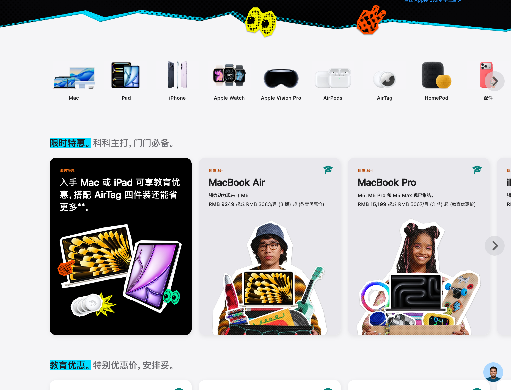
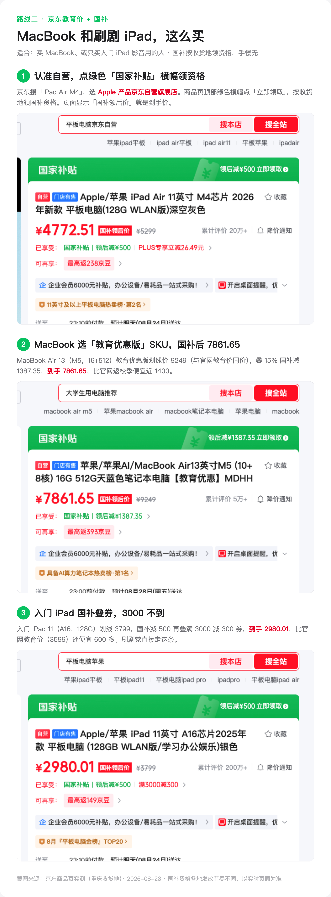
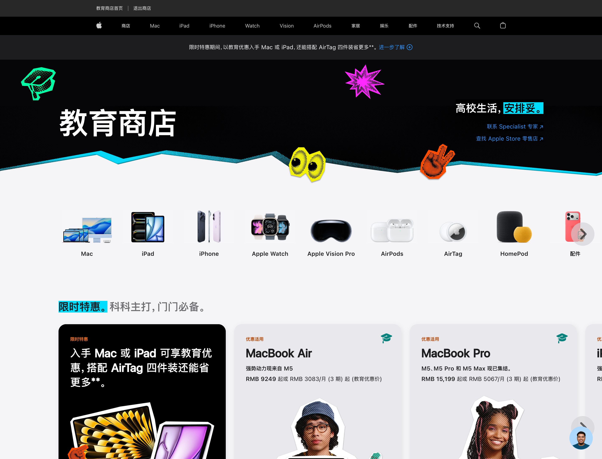

这波涨价，和往年「大促前先抬价」的套路不是一回事。先把这件事说透，再决定等不等。

**iPad 全线涨价之后，学生党还要不要等。我的判断很明确，不等。** 理由不是「早买早享受」这种空话，是下面这笔时间账。

今年 6 月 25 日，苹果官网对 iPad 全线调过一次价。入门 iPad 和 iPad mini 涨 800，iPad Air 涨 1200，iPad Pro 涨 1800。注意这不是电商大促前的临时抬价，是官网零售价的整体上移。背景是存储芯片进入涨价周期，颗粒成本全线上行，整个数码行业都在涨，苹果只是涨得最显眼的那个。指望它过几个月自己跌回去，等于赌存储周期掉头，这个赌局这两年没人赢过。

等等党手里其实就两张牌，一张张看。

第一张，等返校季结束、价格回落。想反了。返校季恰恰是当下唯一能对冲涨价的窗口，教育价加 849 元配件抵扣额度，9 月 24 日截止。等活动一结束，额度收回，教育价也没了，价格只会停在涨完的新水位上。时间不是你的朋友，是对手。

第二张，等新品。9 月 9 日的秋季发布会主角是 iPhone，不动 iPad 产品线，iPad Air 今年 3 月刚更新完。唯一有点悬念的是入门款，传闻 10 月前后有低价 iPad 更新。但等你看完下面的价格，就不会纠结了。

（图源：苹果官网教育商店截图）

上网课这个需求，性能门槛比很多人想象中低。看课件、视频会议、记笔记、刷文档，入门 iPad 11（A16）绰绰有余，别被内存焦虑带着加钱。而它恰好不参加返校季抵扣，所以你的答案根本不在官网。

在京东。入门 iPad 11（A16，128G）京东自营国补叠券后 2980 上下，比官网教育价 3599 还便宜 600 多。这个价格是我 8 月 23 日在京东亲手查的，重庆收货地，国补 15% 封顶 500，资格按收货地限量领取，下单前自己再核一遍。**网课党真正的省钱入口不是返校季，是国补。**

（图源：京东商品页实拍截图拼图，2026-08-23 价格）

如果你的需求不只是网课，还想配支笔认真记笔记，账就不一样了。iPad Air 11（M4）官网教育价 5599，返校季 849 额度里选 Apple Pencil Pro 只要补 50 块，合计 5649。京东裸机国补后 4772.51，但笔没有国补，还是 899，合计 5671.51，两条路基本打平。**50 块的原装 Apple Pencil Pro，是今年返校季全场最值的单项交易**，要笔就走官网，一站式省心。

（图源：苹果官网教育商店截图）

回到你的问题。学生党买平板上网课，「等」只在一种情况下成立，你笃定要买入门款新品，也不在乎多等一两个月，去赌 10 月的传闻更新。但 2980 这个价格，新款来了未必打得过，网课也不等人。

涨价周期里，最优解不是等价格回头，是赶在补贴窗口关门前把该拿的拿到。

---

完整的逐台精算表、官网和京东两条路的下单步骤截图，都写在这篇里了，9 月 24 日截止前都管用：

[2026 苹果返校季教育优惠全攻略：官网 vs 京东国补逐台实算](https://zhuanlan.zhihu.com/p/156150196)
