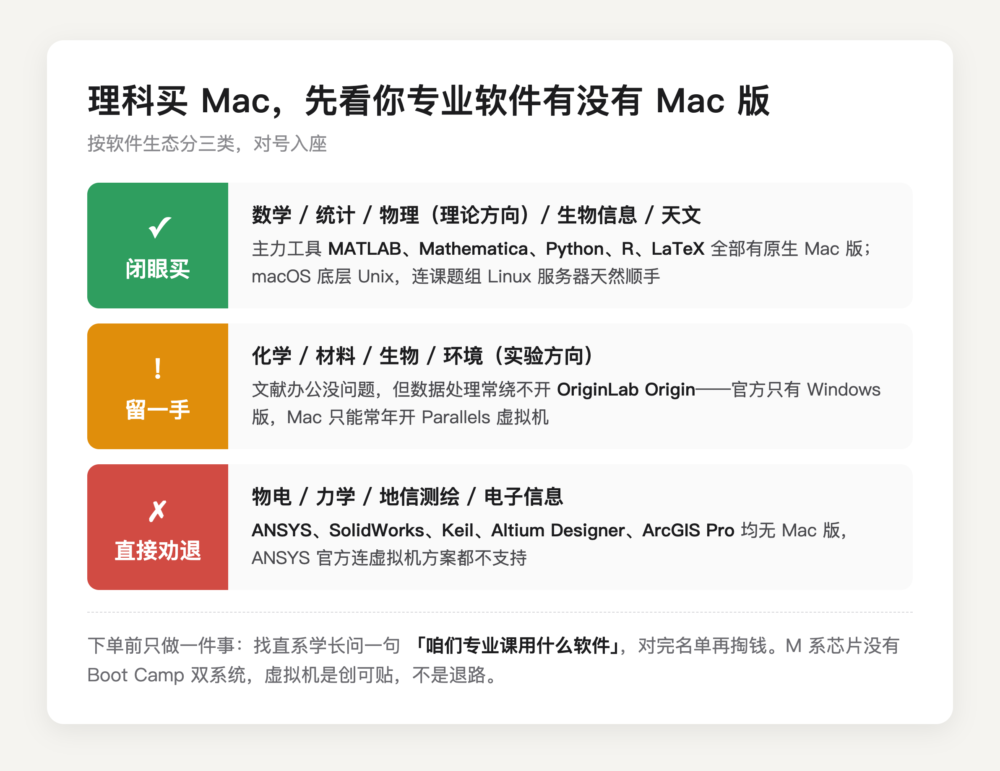
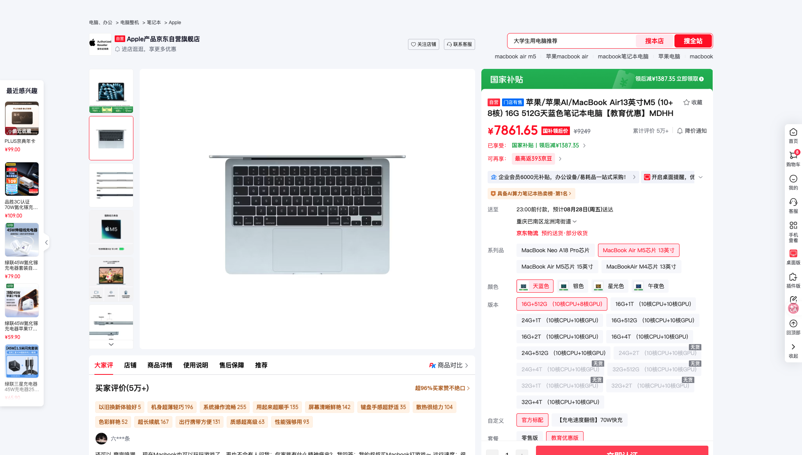

先给结论：大学生学理科、又不玩游戏，MacBook 可以买，但**推不推荐不取决于游戏，取决于你专业课要用的软件有没有 Mac 版**。「不玩游戏」这四个字一划掉，Mac 唯一的硬伤就没了，剩下的全是一道专业题。

理科不是一个东西。同一个理学院里，数学系和材料系对电脑的要求完全是两个方向。我按软件生态把理科专业分成三类，你对号入座。

第一类，闭眼买。数学、统计、物理理论方向、生物信息、天文这类专业，主力工具是 MATLAB、Mathematica、Python、R、LaTeX，全部有原生 Mac 版，在 Apple 芯片上跑得很好。而且 macOS 底层是 Unix，配科研环境、连课题组的 Linux 服务器，体验和服务器端同源，比 Windows 顺手。这类专业用 Mac 不是「能用」，**是更好用**。

第二类，能买但得留一手。化学、材料、生物、环境这类实验方向，看文献写论文都没问题，麻烦在数据处理。国内实验室画图很常用 OriginLab Origin，而 Origin 官方只有 Windows 版，[OriginLab 官方帮助文档](https://docs.originlab.com/quick-help/mac-origin/zh/)写得很直白，Mac 想用得先装虚拟机。不是不能用，是你得想清楚，愿不愿意为一个画图软件常年开着 Parallels Desktop。

第三类，直接劝退。课程表里出现 ANSYS、SolidWorks、Keil、Altium Designer、ArcGIS Pro 的，别买。ANSYS 官方支持的平台只有 Windows 和 Linux，[ANSYS 官方社区客服的回复](https://innovationspace.ansys.com/forum/forums/topic/problem-with-ansys-on-mac/)是连虚拟机方案都不在支持范围。这类课常见于物电、力学、地信、电子信息的培养方案，名字挂在理科边上，软件生态是工科的。

可能有人会说，大不了装双系统。这条路 2020 年之后就没有了。M 系列芯片是 ARM 架构，苹果早把 Boot Camp 砍了，只剩在 Parallels Desktop 虚拟机里跑 ARM 版 Windows，x86 软件再过一层翻译。应急可以，当四年主力方案不行，性能打折不说，不少专业软件的授权和加密狗在虚拟机里直接不认。**虚拟机是创可贴，不是退路。**

所以你下单前只用干一件事。找到你们专业的培养方案，或者抓一个直系学长，问一句，咱们专业课用什么软件。名单对上第一类就买，对上第三类老老实实 Windows，暂时对不上就先捂紧钱包，开学摸清楚再动手，教育优惠常年有，不差这一个月。

真对上了第一类，再聊怎么买划算。预算紧就看 MacBook Neo，A18 Pro 芯片，教育价 4799 起，苹果官方标称续航 16 小时，[Notebookcheck 的评测](https://www.notebookcheck-cn.com/Apple-MacBook-Neo-599.1250334.0.html)实测 WiFi 上网接近 13 小时，上课泡图书馆一天不插电够用。短板是 8GB 内存，MATLAB 矩阵一大就会喘，适合轻负载。另外 Neo 不参加返校季的 849 配件抵扣，价格就是裸价，不用等活动。

（图源：Notebookcheck 评测实拍）

要当四年主力机，选 MacBook Air 13 英寸 M5，16GB 内存起步，苹果官网教育价 9249，京东自营教育优惠版叠 15% 国补到手 7861.65，这个价是我 8 月 23 日在京东亲手查的，比官网教育价便宜近 1400。返校季 9 月 24 日截止，教育价和国补资格都有时效，想下手别拖过截止日。

最后总结成一句话。MacBook 对理科生从来不是好不好的问题，**是配不配你课表的问题**：软件名单全在 Mac 阵营，它是四年里你最顺手的工具；名单里有 ANSYS 这类 Windows 限定软件，同价位 Windows 本才是正确答案。

---

各机型的价格明细、教育优惠怎么认证、国补怎么领，我在这篇里逐台算过，9 月 24 日截止前都管用：

[2026 苹果返校季教育优惠全攻略：官网 vs 京东国补逐台实算](https://zhuanlan.zhihu.com/p/156150196)

---

【延迟插卡：发布 48h 后若排名进前 5 或赞数 ≥ 能力先验下沿（5 赞），编辑插入——商品：MacBook Air 13 英寸 M5（京东自营教育优惠版，链接待从京东好物库检索补齐），位置建议：Air 价格段「亲手查的价」之后】
