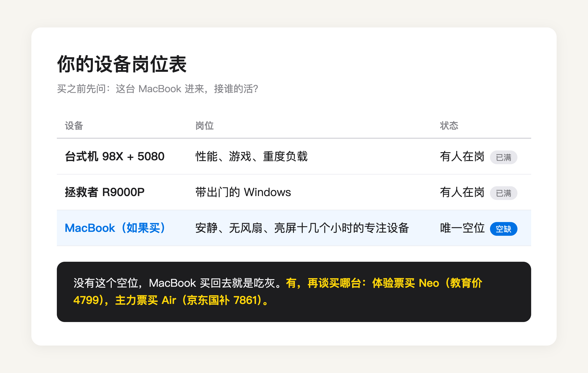
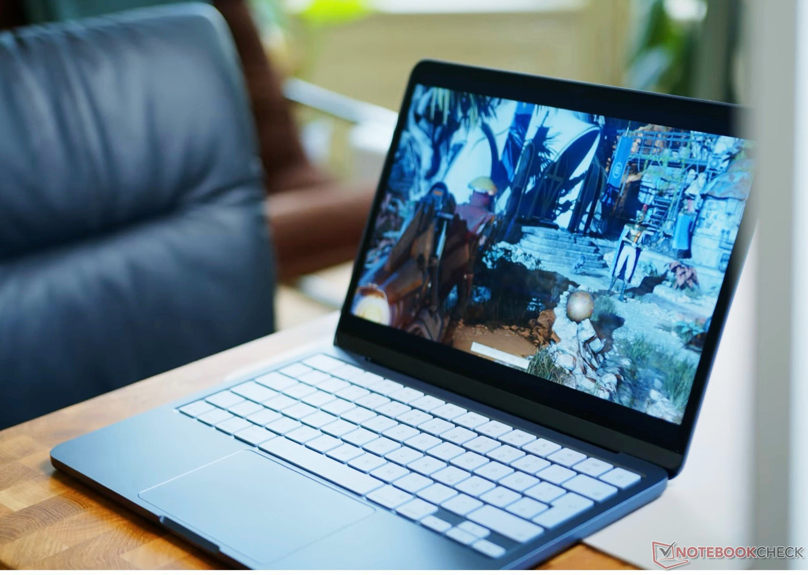

先说结论，可以买，但你下单的理由大概率是错的。

「想体验苹果生态」这个动机本身就有问题。**苹果生态不是一件可以单独购买的产品，它是你已有的设备之间每天都在发生的协同。** 你配件齐全，iPhone、iPad、Apple Watch、AirPods 之间的接力、隔空投送、耳机自动切换，你每天都在用，生态你早就体验着了。

Mac 加进来，能新增什么？数得出来，通用剪贴板（手机复制、电脑粘贴）、接力（手机上没看完的网页，电脑上接着开）、iPhone 镜像（电脑上直接操作手机）。这三样都很好用，但它们是调味品，不是主菜。为调味品买一台电脑，账不对。

真正该问的是另一个问题，你的哪个场景，需要一台 Mac？

看你的配置单。98X 加 5080 的台式机，管性能和游戏。拯救者 R9000P，管带出门的 Windows。你的重度场景被这两台机器占得满满当当，MacBook 挤进来，找不到岗位。**没有岗位的设备，下场只有一个，吃灰。**

MacBook 能抢到的唯一岗位，是这两台 Windows 给不了的东西，安静、无风扇、亮屏十几个小时不插电的专注设备。写东西、看文献、泡图书馆、窝沙发上处理琐事。如果你有这类场景，而且愿意让它从拯救者手里接过「带出门」的活，这台电脑才买得值。

（图源：Notebookcheck 评测实拍）

想通了要买，别买错档位。体验为目的，门票越便宜越好。MacBook Neo，A18 Pro 芯片，3 月发布时 4599 起，6 月底苹果全线调价它也涨了 900，现在官网 5499 起，教育价 4799 起，依然是进苹果电脑生态最便宜的入场券。[Notebookcheck 的评测](https://www.notebookcheck-cn.com/Apple-MacBook-Neo-599.1250334.0.html)里，它日常任务飞快、铝机身、全程静音无风扇，苹果官方标称续航 16 小时，Notebookcheck 实测 WiFi 上网接近 13 小时。短板是 8GB 内存和存储扩展，但你买来是体验生态和轻使用的，不是拿来剪 4K 的。

（图源：Notebookcheck 评测实拍）

提醒一句，Neo 不参加今年返校季的 849 配件抵扣，它的价格就是裸价，不用等活动。真要买主力机规格，那是另一笔账，MacBook Air 13（M5）官网教育价 9249，京东自营教育优惠版叠 15% 国补到手 7861，比官网便宜近 1400，这是我 8 月 23 日在京东亲手查的价。返校季 9 月 24 日截止，教育价和国补资格都有时效。

最后说句可能泼冷水的话。你过去几年没有 Mac，苹果配件照样玩得转，这本身就说明你的日常并不依赖 macOS。**生态的甜头你已经在吃了，Mac 是这道菜的最后一双筷子，不是最后一道菜。** 4799 的 Neo 买来玩票，不亏。想清楚岗位再买 Air，不迟。两个都想不清楚，不买，就是最聪明的答案。

---

各机型的价格明细、教育优惠怎么认证、国补怎么领，我在这篇里逐台算过，9 月 24 日截止前都管用：

[2026 苹果返校季教育优惠全攻略：官网 vs 京东国补逐台实算](https://zhuanlan.zhihu.com/p/156150196)

---

【延迟插卡：发布 48h 后若排名进前 5 或赞数 ≥ 能力先验下沿（5 赞），编辑插入——商品：MacBook Neo（京东自营，链接待从京东好物库检索补齐），位置建议：Neo 段「最便宜的入场券」之后】
