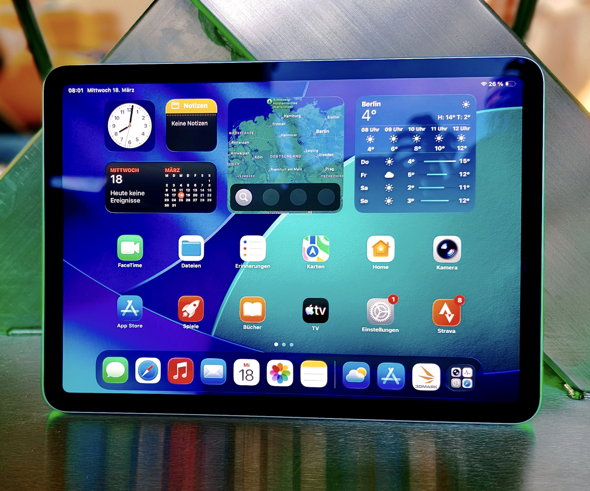
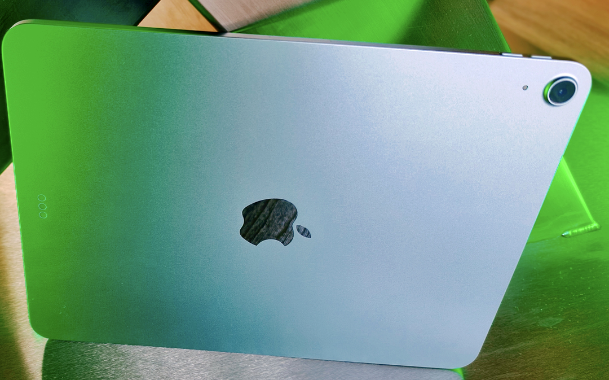
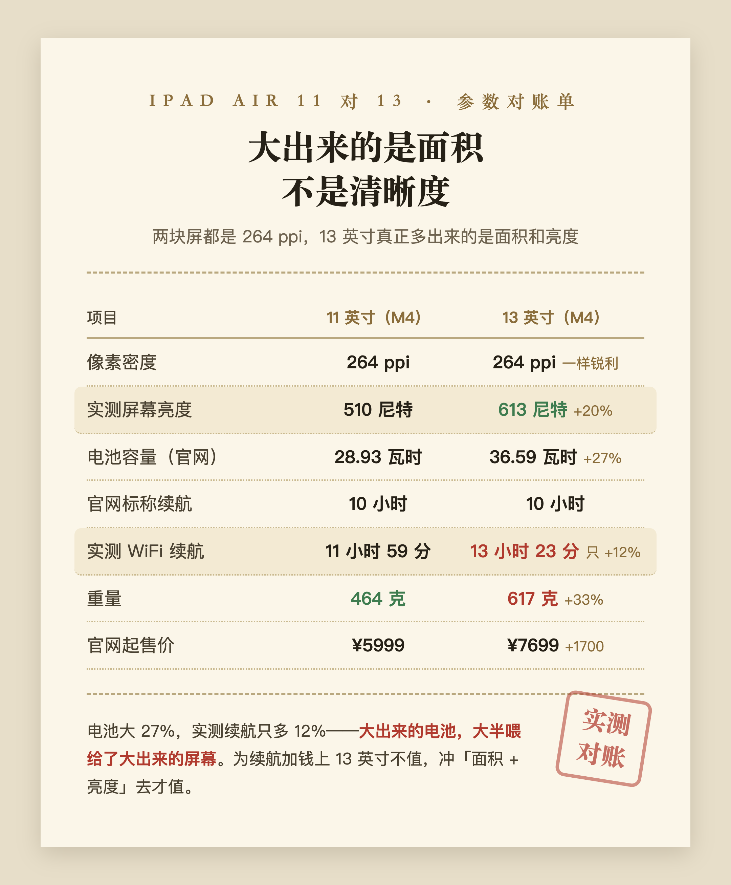
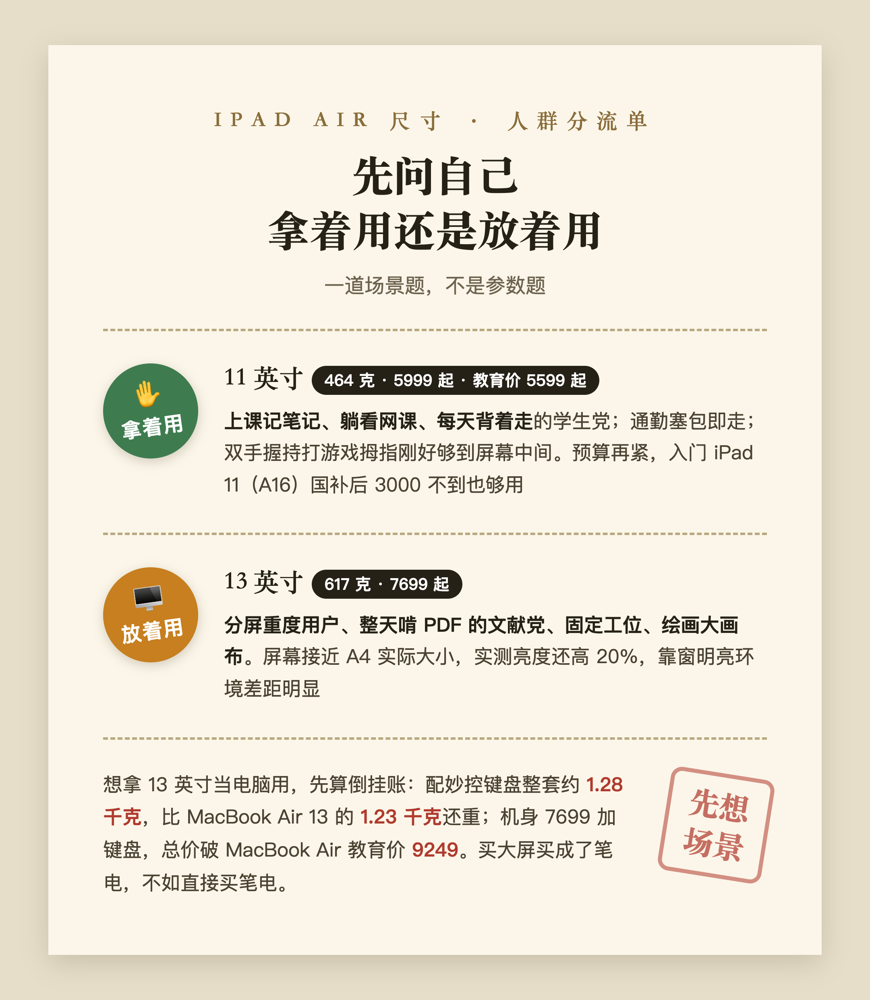

# iPad Air 买11英寸还是13英寸？464克对617克，拿着用和放着用是两种答案（2026实测）

**iPad Air 11 英寸和 13 英寸怎么选，一句话结论：拿着用多就买 11 英寸，放着用多才轮到 13 英寸。**

大家一窝蜂买 11 英寸，不是 13 英寸不好，是平板这个品类的灵魂在「手持」两个字上。这篇文章把两个尺寸的实测重量、屏幕、续航、价格数据摆开，最后给一张人群对照表，对号入座就知道自己该买哪个。价格口径为 2026 年 9 月苹果官网在售页面。

## 一、为什么买 11 英寸 iPad Air 的人更多？

先想你真实的使用画面。躺床上刷网课，单手举着，手酸了翻个面接着举。通勤地铁上单手抓着看文档，另一只手还得扶栏杆。窝沙发里举着跟家里人视频，一晃半小时。这些场景有个共同点，设备悬空在你手上，没有桌子替你分担重量。

要说明白的是，上课记笔记这种正经书写场景，平板其实躺在桌上，这时候 13 英寸不欺负你，甚至写起来更舒展。重量真正的战场，全在上面那些「举着它」的时刻。

（图源：Notebookcheck 评测实拍）

苹果官网规格页写得很清楚，11 英寸 iPad Air（M4）464 克，13 英寸 617 克。差的这 150 多克，数字上不起眼，拿起来就是轻飘飘和坠手的区别。再算一笔隐蔽的账，这两台机器你大概率都会戴壳用，11 英寸戴壳后还在一斤出头，13 英寸戴壳加贴膜直接奔着 800 克去，接近一瓶半矿泉水的分量。躺着举着看一节 45 分钟的课，手腕会替你投票；脱手砸脸的时候，13 英寸的物理伤害和接触面积都是加倍的。

（图源：Notebookcheck 评测实拍）

还有一个没人提但天天碰到的问题，包。11 英寸能塞进绝大多数帆布包和小双肩的夹层，13 英寸机身宽度 21.5 厘米，很多小包的主仓刚刚好卡不进去。买之前最好拿尺子量一下自己常背的那个包。

## 二、13 英寸多出来的屏幕，谁真正用得上？

说实话，真正受益的只有几种画面。

一种是分屏。上网课的同时开笔记软件，左边视频右边写，11 英寸分完每个窗口只剩手机宽，看视频嫌小、写字嫌挤，坚持不了两天你就退回全屏单开。13 英寸分完两边都还有正经的可用面积，这是它最硬的刚需场景。

一种是看文献和 PDF。研究生和要读论文的人注意这条，13 英寸屏幕接近 A4 纸的实际大小，整页 PDF 不用缩放不用来回拖；11 英寸看整页 PDF 字小一圈，要么眯眼要么频繁双指放大。买平板的主要目的如果是啃文献，13 英寸的优先级往前排。

再一种是配妙控键盘当主力机用，以及绘画设计要大幅画布，参考图和画布能同时摊开。

## 三、13 英寸更清晰、续航更好？两个想当然，数据拆给你看

「13 英寸更大所以更清晰」，不对。两块屏的像素密度一模一样，都是 264 ppi，同样的字在两块屏上一样锐利，13 英寸多的只是显示面积。

「13 英寸电池大所以续航好」，只对一点点。电池大了 27%，实测 WiFi 上网续航只多 12%，大出来的电池，大半喂给了大出来的屏幕。为续航加钱上 13 英寸，性价比说不过去。

顺带说一个 13 英寸被忽视的真实优势，亮度。实测 613 尼特对 510 尼特，亮出 20%，在靠窗的教室、图书馆落地窗边这种明亮环境，这个差距比尺寸本身更影响体验。所以 13 英寸的正确买法是冲着「面积 + 亮度」去，不是冲清晰度和续航。

（实测数据来自 Notebookcheck 的 11 英寸和 13 英寸评测，电池与标称续航来自苹果官网规格页）

## 四、拿 13 英寸 iPad Air 配键盘当电脑用，划算吗？

上面这几种用法有个共同的隐藏前提，放桌上用。**13 英寸的真实身份不是大号平板，是笔记本替代品。** 一旦进入这个身份，它就得跟真正的笔记本同台比账，这笔账算出来挺尴尬的。

iPad Air 13 英寸配妙控键盘，整套重量约 1.28 千克（港媒 DCFever 评测实测），比 MacBook Air 13 英寸的 1.23 千克（苹果官网规格页）还重。价格同样倒挂，苹果官网机型比较页上 13 英寸 iPad Air 7699 起，再加两千多的妙控键盘，总价直接破了 MacBook Air 13 的教育价 9249。更别说我实际用下来的感受，macOS 的多窗口和文件管理，比 iPadOS 台前调度顺手得多。

买大屏买成了笔电，不如直接买笔电。

## 五、iPad Air 11 英寸和 13 英寸，到底怎么选？

这道题的正确解法不是比参数，是先问自己一个问题：这台平板，我是拿着用多，还是放着用多。

拿着用多，11 英寸，没有悬念。学生党上课记笔记、躺看网课、每天背着走，464 克加 5999 的起售价（教育价 5599 起），就是甜点尺寸。打游戏的也算这笔账，11 英寸双手握持拇指刚好够到屏幕中间，13 英寸握着像端个托盘，技能键都按不利索。预算再紧一点，入门 iPad 11（A16）走京东国补后 3000 不到也够用，性能余量少些，看课记笔记不耽误。

放着用多，才轮到 13 英寸。分屏重度用户、整天啃 PDF 的文献党、固定工位、绘画需求，617 克你根本不在乎，因为你几乎不举它。但「想拿它当电脑用」的那部分人，先把 MacBook Air 加进购物车比一遍再掏钱。

最后说句题外话。尺寸焦虑的本质，是想要一台设备通吃所有场景，而平板恰恰是最不适合通吃的品类。**11 英寸赢在它是纯粹的平板，13 英寸只有在你清楚知道要拿它替代什么的时候，才值得买。**

选购时的具体价格和渠道（教育优惠怎么认证、国补怎么叠、返校季 849 额度怎么花），可以在知乎搜索《2026 苹果返校季教育优惠全攻略：官网 vs 京东国补逐台实算》，9 月 24 日截止前都管用。

信源：苹果官网 iPad Air 产品页与规格页、苹果官网机型比较页、Notebookcheck 11 英寸与 13 英寸 iPad Air（M4）评测、DCFever 妙控键盘套装评测。平台价格波动较快，下单前请以实时页面为准。

---

## 发布待办（百家号后台操作项，发布前删除本节）

**搜索关键词字段建议（4-20 字，选一个或组合）：**

- `iPad Air买11寸还是13寸`（15 字，首选，与知乎问题同源长尾）
- `iPad Air 11和13区别`（12 字，备选）
- `苹果教育优惠iPad怎么选`（12 字，备选）

**原创声明（注意先后手）：**

- 知乎原文（问题 https://www.zhihu.com/question/1992245097299977409 下的回答）**尚未发布**，草稿状态为「初稿待确认」。
- 按「知乎 → 公众号 D0 → 头条 D3 → 百家号 D4」节奏，本篇应排在知乎发布之后：届时选「非首发」，来源链接填知乎回答链接（发布后回填）。
- 若确需百家号先发，则选「首发」，且知乎端发布时保留本篇百家号链接与发布时间截图，防跨平台误判抄袭。
- 若该内容走了头条「首发激励」，必须等 72 小时排他期满再发百家号。

**可选插入的信源链接（正文已保留文字信源描述，百家号编辑器允许的话可补链）：**

- Notebookcheck 11 英寸 iPad Air（M4）评测：https://www.notebookcheck-cn.com/Apple-iPad-Air-11-2026-Apple-M4.1272372.0.html
- Notebookcheck 13 英寸 iPad Air（M4）评测：https://www.notebookcheck-cn.com/iPad-Pro-Apple-iPad-Air-13-M4-2026.1280389.0.html

**配图（与知乎原文 4 张逐一对齐）：**

- [x] 正面实拍 → `百家号版-iPad11寸还是13寸-正面实拍.png`（Notebookcheck 实拍重裁：换构图聚焦机身，缩放重导出）
- [x] 背面实拍 → `百家号版-iPad11寸还是13寸-背面实拍.png`（Notebookcheck 实拍重裁，同上）
- [x] 参数表 → `百家号版-iPad11寸还是13寸-参数对账.png`（暖纸小票风重制，与知乎版 Markdown 表格区隔；源 `assets/table-ipad-11vs13-bjh.html`，截图走 `capture-bjh.js`）
- [x] 决策卡 → `百家号版-iPad11寸还是13寸-人群分流卡.png`（暖纸小票风重制，与知乎版白底双栏卡区隔；源 `assets/decision-ipad-11vs13-bjh.html`）
- [x] 信息流封面 → `百家号版-iPad11寸还是13寸-封面.png`（900×600，轨道 A：苹果官网 Newsroom M4 iPad Air 新闻稿妙控键盘定妆图 + PIL 叠字「iPad买11寸 还是13寸 / 返校季实测」共 14 字；底图 `assets/raw/Apple-iPad-Air-M4-Magic-Keyboard-with-Apple-Pencil-Pro-260302_big.jpg.large_2x.jpg`，源：https://www.apple.com.cn/newsroom/2026/03/apple-introduces-the-new-ipad-air-powered-by-m4/ ，脚本 `assets/cover-bjh-ipad-11vs13.py`；发布时单独上传，不入正文）
- 重制脚本：`assets/capture-bjh.js`（tableJobs 追加两卡）、`assets/reprocess-bjh-photos.py`（第 7、8 段），幂等可重跑

**数据回收提醒：** 发布 30 天后看后台「搜索流量占比」；若为零，优先改标题和关键词布局（本篇核心长尾词：iPad Air 11英寸13英寸、iPad Air 区别、苹果教育优惠2026、返校季 iPad 怎么选），不要加量发新稿。
