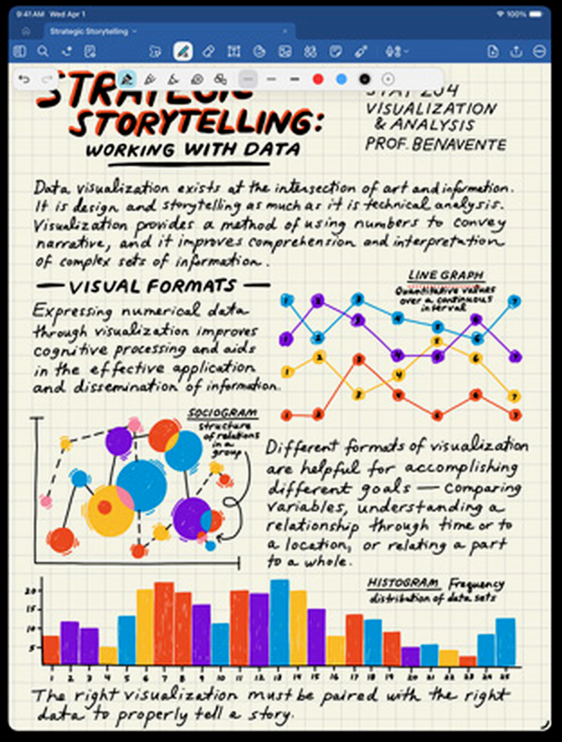
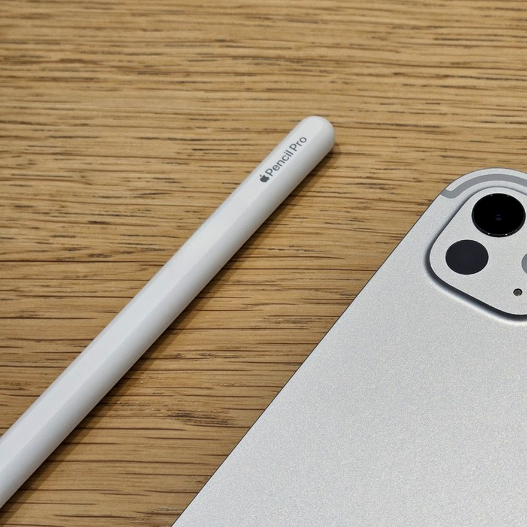
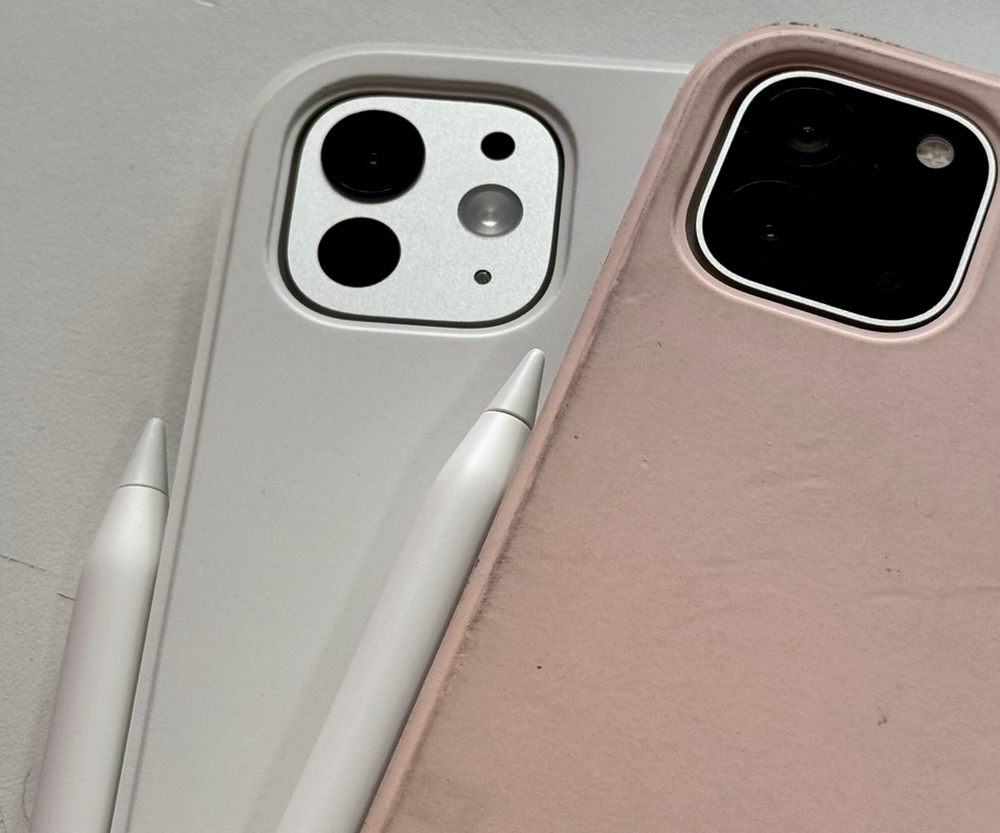

# Apple Pencil有必要买吗？不画画只学习的学生党，这三种场景才值回票价（2026返校季）

**Apple Pencil 有没有必要买，先给结论：iPad 只用来学习、不画画的学生党，大概率有必要，但前提是你真的拿它做标注 PDF、手写笔记、刷题这三件事；买 iPad 主要为了追剧刷视频的，别买，百分百吃灰。**

说个可能让你意外的事实：不画画的人，有时候比画画的人更离不开这支笔。下面把「哪些学习场景非它不可、哪款够用、2026 返校季 50 元换购怎么回事、哪些人千万别买」一次说清，价格口径为 2026 年 9 月苹果官网在售页面。

## 一、不画画的人买 Apple Pencil，到底能干什么？

很多人觉得买 iPad 就得配笔，这个想法本身就得打个问号。Pencil 不是万能的，但有三个学习场景，它确实比键盘好使。

**第一个是标注 PDF。** 老师发的课件、下载的论文、电子版教材，圈重点、写批注、画箭头。手指也能戳，但精度差一截；键盘能打字，但不能在图上直接画圈。每周要处理 5 份以上带图表的 PDF，Pencil 省下的时间非常明显。

（图源：苹果官网 GoodNotes 手写笔记截图，已重新裁剪调色）

**第二个是手写笔记。** GoodNotes、Notability 这类笔记软件，核心交互就是手写。数学公式、化学结构式、电路图推导，打字效率远不如手写。文科生记课堂纪要可以用键盘凑合，理工科面对一堆符号和图形，Pencil 是唯一自然的选择。

**第三个是做题刷题。** 考研、考公、考证的真题卷，直接在 iPad 上圈答案、写演算步骤、标记错题，一套题做完不用打印一张纸。很多考研党最后离不开 Pencil，不是因为它高级，是纸质卷子真的费纸还不好整理。

这三个场景有个共同点：都需要高自由度的手写输入。键盘擅长大量文字录入，Pencil 擅长在任意位置留下任意痕迹。两者不是替代关系，是分工不同。

## 二、无纸化学习是不是人人都适合？

不是，这一段建议你认真看完再决定。

考研阶段 90% 的笔记在纸质真题上完成更高效，这是很多上岸考生的真实反馈。无纸化学习有隐形成本：找文件、开软件、等加载、顺手切走应用分心，这些碎片时间在纸质书上根本不存在。而且纸质书的翻页感和空间记忆——记得某段话在左页右下角——对长期记忆的辅助，目前没有研究证明电子设备能完全替代。

所以如果你不是长期习惯无纸化学习的人，先别急着掏钱买笔。用手指加免费笔记 App 试两周，确认自己真的会在 iPad 上做上面那三件事，再下单不迟。

## 三、Apple Pencil Pro 和 USB-C 版有什么区别，怎么选？

Apple Pencil 现在在售两档，苹果官网价格：

- **Apple Pencil Pro，899 元**：有压感、倾斜感应、悬停预览、触觉反馈。
- **Apple Pencil USB-C 版，649 元**：没有压感和悬停，只有基础书写功能。

（图源：少数派评测实拍，已重新裁剪调色）

只学习不画画，USB-C 版就够用。压感和倾斜感应是给绘画和精细绘图用的，标注 PDF、记笔记用不上；悬停预览锦上添花，不是刚需。

## 四、2026 返校季 50 元换购 Apple Pencil Pro，是怎么回事？

但今年返校季有个特殊情况，直接改写了上面的选购逻辑：**Apple Pencil Pro 换购只要补 50 块。**

（图源：少数派评测实拍，已重新裁剪调色）

我之前写过一篇 Pencil 平替笔的测评文章，往年的结论一直是预算紧就买第三方平替。今年得亲手拆自己的台：**50 块的原装 Pencil Pro，把平替存在的理由直接打没了**——第三方平替笔自己都不止这个价。

所以结论很干脆：正好在返校季窗口期（9 月 24 日前）、且有学生认证的人，50 块的 Pencil Pro 是全场最值的单项交易，没有之一。过了这个窗口，再回头考虑 USB-C 版或平替。

## 五、哪些人没必要买 Apple Pencil？

三类人，对号入座：

主要用 iPad 看视频课、读纯文字 PDF 的，这两个场景不需要手写输入，Pencil 买了也是吃灰。已经习惯纸质笔记且效率很高的，不要为了「无纸化」这个概念强行切换，工具服务于效率，不是反过来。买 iPad 主要用来追剧和轻度浏览的，Pencil 对你来说就是一根昂贵的触控笔替代品。

## 六、总结：Apple Pencil 到底值不值得买？

Apple Pencil 不是学习的必需品，它是特定学习场景下的效率放大器。**你的学习内容决定了需不需要它，不是广告说了算。**

返校季教育优惠怎么认证、哪些机型参加、官网和京东国补两条路怎么选，可以在知乎搜索《2026 苹果返校季教育优惠全攻略：官网 vs 京东国补逐台实算》，活动 9 月 24 日截止，截止前看都管用。

信源：苹果官网 Apple Pencil 产品页与 2026 返校季活动页、少数派 Apple Pencil 评测。价格与活动规则以苹果官网实时页面为准。

---

## 发布待办（百家号后台操作项，发布前删除本节）

**搜索关键词字段建议（4-20 字，选一个或组合）：**

- `Apple Pencil有必要买吗`（17 字，首选，与原知乎问题同源长尾）
- `iPad pencil有必要买吗`（16 字，备选，原问题逐字长尾）
- `Apple Pencil Pro和USB-C区别`（19 字，备选）

**原创声明（注意先后手）：**

- 知乎原文（问题 https://www.zhihu.com/question/441912133 下的回答）**尚未发布**，草稿状态为「初稿待确认」。
- 按「知乎 → 公众号 D0 → 头条 D3 → 百家号 D4」节奏，本篇应排在知乎发布之后：届时选「非首发」，来源链接填知乎回答链接（发布后回填）。
- 若确需百家号先发，则选「首发」，且知乎端发布时保留本篇百家号链接与发布时间截图，防跨平台误判抄袭。
- 若该内容走了头条「首发激励」，必须等 72 小时排他期满再发百家号。

**配图（与知乎原文 3 张逐一对齐 + 封面）：**

- [x] 手写笔记场景 → `百家号版-iPadPencil有必要买吗-手写笔记场景.png`（苹果官网 GoodNotes 截图重裁：裁掉外圈留白，2× 缩放 + 调色改指纹；源 `知乎/cover-assets/raw/iPadPencil评测/03-Goodnotes-writing-scene.jpg`）
- [x] Pencil Pro 实拍 → `百家号版-iPadPencil有必要买吗-PencilPro实拍.png`（少数派实拍重裁：聚焦笔身刻字区方形构图；源 `.../04-sspai-pencil-1.jpg`）
- [x] 两款对比实拍 → `百家号版-iPadPencil有必要买吗-两款对比实拍.png`（少数派实拍重裁：聚焦双摄 + 双笔区域；源 `.../06-sspai-pencil-3.jpg`）
- [x] 信息流封面 → `百家号版-iPadPencil有必要买吗-封面.png`（1200×800，轨道 A：少数派 Pencil Pro 实拍裁剪 3:2 + PIL 水平垂直居中叠黄色字「Pencil有必要买吗」共 11 字，#FFD600 + 深色描边；发布时单独上传，不入正文）
- 重制脚本：`assets/reprocess-bjh-pencil.py`（须用 `.venv-md/bin/python3` 运行，幂等可重跑）

**数据回收提醒：** 发布 30 天后看后台「搜索流量占比」；若为零，优先改标题和关键词布局（本篇核心长尾词：Apple Pencil有必要买吗、Apple Pencil Pro和USB-C版区别、苹果返校季2026、iPad无纸化学习），不要加量发新稿。
