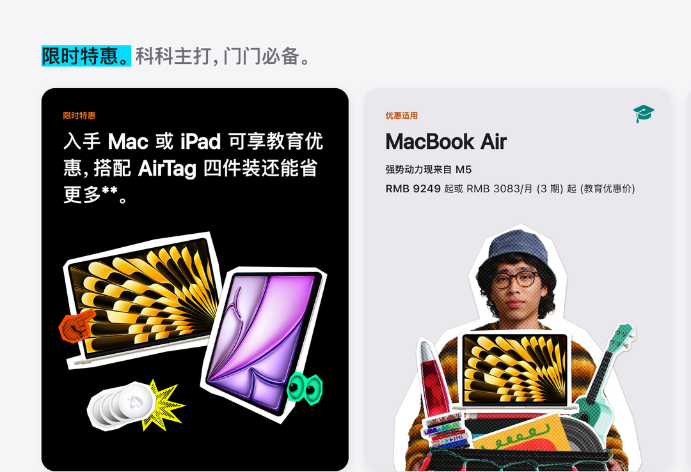
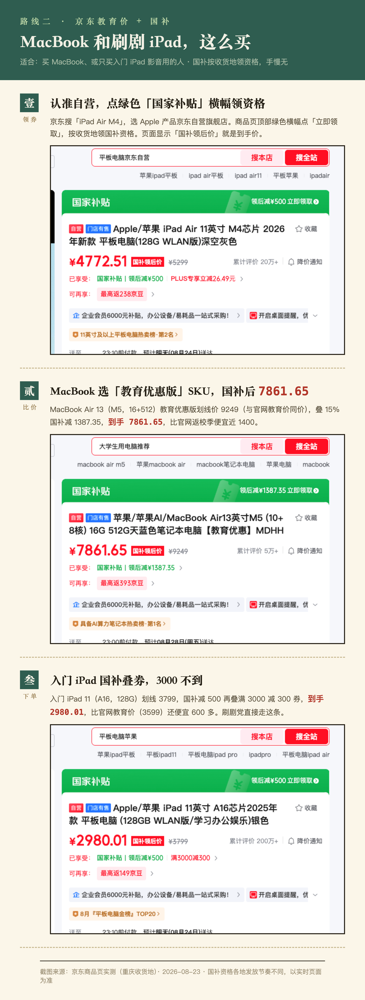
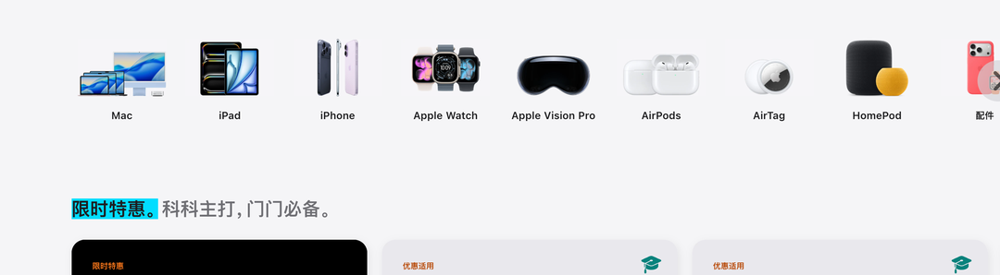

# iPad全线涨价后学生党还要等吗？2026苹果返校季实测：网课入门款2980元可入手

**iPad 全线涨了 800 到 1800 元，学生党买平板还要不要等？我的答案就俩字：不等。**

不是「早买早享受」这种空话撑腰，是后面这笔时间账。2026 苹果返校季 9 月 24 日截止，教育价加 849 元配件抵扣额度，是目前唯一能对冲涨价的窗口。只上网课的话，入门 iPad 11 走京东国补，2980 元上下到手，比官网教育价还便宜 600 多元。

口径先交代清楚：京东价格是 2026 年 8 月 23 日实测（重庆收货地，国补领后价各地不同），官网价格以苹果教育商店页面为准。

## 一、iPad 为什么突然全线涨价？还会跌回去吗？

2026 年 6 月 25 日，苹果官网对 iPad 全线调价。入门 iPad 和 iPad mini 涨 800，iPad Air 涨 1200，iPad Pro 涨 1800。

很多人觉得这是大促前「先抬价再打折」的老套路。

还真不是。这次涨的是官网零售价，背后是存储芯片进入涨价周期，颗粒成本全线上行，整个数码行业都在涨，苹果只是涨得最扎眼的那个。**指望过几个月它自己跌回去，等于赌存储周期掉头。这个赌局，这两年没人赢过。**

## 二、等返校季结束再买，是不是更便宜？

这个方向想反了。

返校季恰恰是眼下唯一能对冲涨价的窗口：教育优惠价叠 849 元配件抵扣，9 月 24 日关门。活动一结束，额度收回，教育价取消，价格只会停在涨完的新水位上。

（图源：苹果官网教育商店截图）

**涨价周期里，时间不是等等党的朋友，是对手。**

## 三、等 9 月苹果发布会的新品，行不行？

9 月 9 日秋季发布会，主角是 iPhone，不动 iPad 产品线。iPad Air 今年 3 月刚更新完 M4，下次更新最早明年春天。

唯一有悬念的是入门款，传闻 10 月前后有低价 iPad 更新。

这传闻值不值得赌？看完下面的价格再说。

## 四、学生党只上网课，买哪款 iPad 最划算？

先说个反直觉的事：网课对性能的要求，比大多数人想的低得多。看课件、视频会议、记笔记、刷文档，入门 iPad 11（A16，128G）绰绰有余。别被内存焦虑带着加钱。

更关键的是，入门 iPad 不参加返校季 849 元抵扣。所以网课党的答案压根不在官网。

在京东。**入门 iPad 11（A16，128G）京东自营国补叠券后 2980 元上下到手，比官网教育价 3599 元还便宜 600 多。** 这个价是 8 月 23 日我在京东亲手查的，重庆收货地，国补 15% 封顶 500，资格按收货地限量领取，下单前自己再核一遍。

（图源：京东商品页实拍截图拼图，2026-08-23 价格）

**网课党真正的省钱入口，不是返校季，是国补。**

## 五、要配 Apple Pencil 记笔记，怎么买最划算？

需求不止网课、还想配支笔认真记笔记的话，账就得重算了。这一轮，官网扳回一城。

iPad Air 11（M4）官网教育价 5599 元，返校季 849 元额度里选 Apple Pencil Pro，补 50 元，合计 5649 元。

京东这边呢？裸机国补后 4772.51 元，但 Apple Pencil Pro 没有国补，还是 899 元，合计 5671.51 元。两条路基本打平，官网便宜 22 块，还一站式省心。

（图源：苹果官网教育商店截图）

**50 块钱的原装 Apple Pencil Pro，是今年返校季全场最值的单项交易。** 市面上的第三方平替笔都不止这个价。要笔，走官网。

## 六、什么情况下「等」才成立？

只有一种：你笃定要买入门款新品，也不在乎多等一两个月，去赌 10 月那波传闻更新。

可 2980 元这个价，新款来了未必打得过。网课更不等人。

**涨价周期里的最优解，不是等价格回头，是赶在补贴窗口关门前，把该拿的拿到手。**

完整的 MacBook、iPad Air、入门 iPad 逐台精算表和官网、京东两条路线的下单步骤截图，可以在知乎搜索《2026 苹果返校季教育优惠全攻略：官网 vs 京东国补逐台实算》，9 月 24 日截止前都管用。

数据来源：苹果官网教育商店及返校季促销条款（apple.com.cn），京东价格为 2026 年 8 月 23 日实测（重庆收货地）。平台价格波动较快，下单前请以实时页面为准。

---

## 发布待办（百家号后台操作项，发布前删除本节）

**搜索关键词字段建议（4-20 字，选一个或组合）：**

- `iPad涨价学生党还要等吗`（11 字，首选，与知乎问题同源长尾）
- `2026苹果返校季iPad怎么买`（13 字，备选）
- `苹果教育优惠京东国补价格`（12 字，备选）

**原创声明（注意先后手）：**

- 知乎原文（问题 https://www.zhihu.com/question/2053990645707043758 下的回答）**尚未发布**，草稿状态为「初稿待确认」。
- 按「知乎 → 公众号 D0 → 头条 D3 → 百家号 D4」节奏，本篇应排在知乎发布之后：届时选「非首发」，来源链接填知乎回答链接（发布后回填）。
- 若确需百家号先发，则选「首发」，且知乎端发布时保留本篇百家号链接与发布时间截图，防跨平台误判抄袭。
- 若该内容走了头条「首发激励」，必须等 72 小时排他期满再发百家号。

**配图（与知乎原文 3 张逐一对齐）：**

- [x] 返校季促销区块 → `百家号版-iPad涨价学生党-返校季促销区块.png`（苹果官网截图重新裁剪构图 + 缩放重导出，文件指纹已改）
- [x] 京东国补喂饭图 → 复用 `百家号版-苹果返校季2026-京东国补喂饭图.png`（主稿百家号版已重制，同平台同账号复用无指纹问题）
- [x] 教育商店产品区 → `百家号版-iPad涨价学生党-教育商店产品区.png`（同上重处理）
- [x] 信息流封面 → `百家号版-iPad涨价学生党-封面.png`（900×600，轨道 A：苹果官网 Newsroom 新闻稿 hero 图裁剪 + PIL 叠字，封面文字「iPad涨价 学生党别等 / 返校季实测」共 14 字；底图 `assets/raw/Apple-iPad-Air-hero-250304_big.jpg.large_2x.jpg`，源：https://www.apple.com.cn/newsroom/2025/03/apple-introduces-ipad-air-with-powerful-m3-chip-new-magic-keyboard/ ，脚本 `assets/cover-bjh-ipad-wait.py`；发布时单独上传，不入正文）
- 重制脚本：`assets/reprocess-bjh-photos.py`（第 3、4 段，幂等可重跑）

**数据回收提醒：** 发布 30 天后看后台「搜索流量占比」；若为零，优先改标题和关键词布局（本篇核心长尾词：iPad涨价、苹果返校季2026、京东国补、学生党平板），不要加量发新稿。
