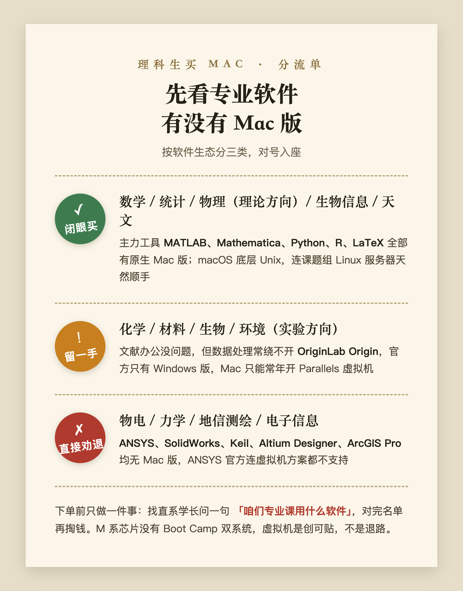
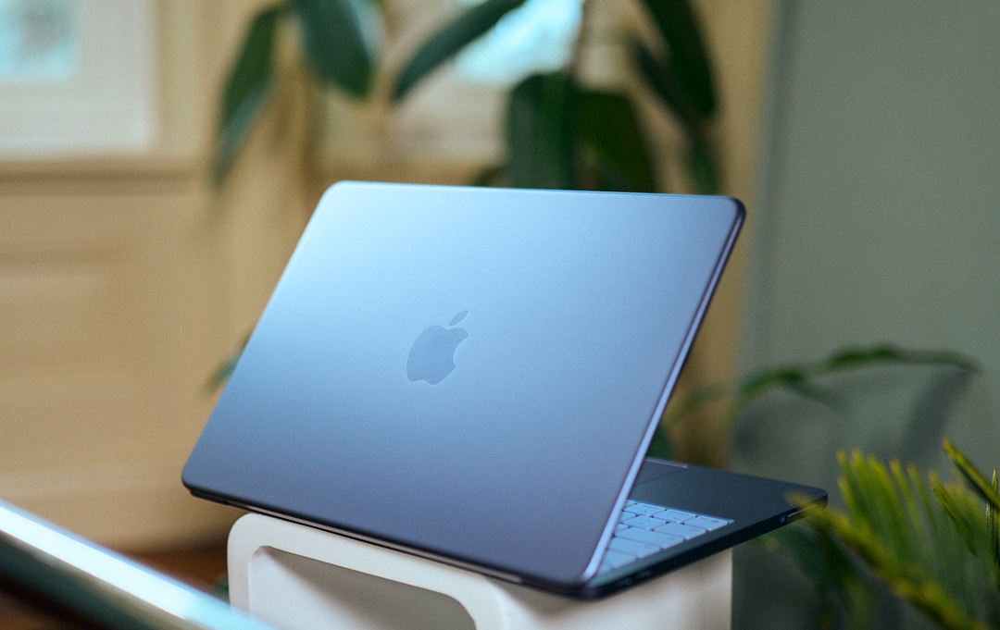
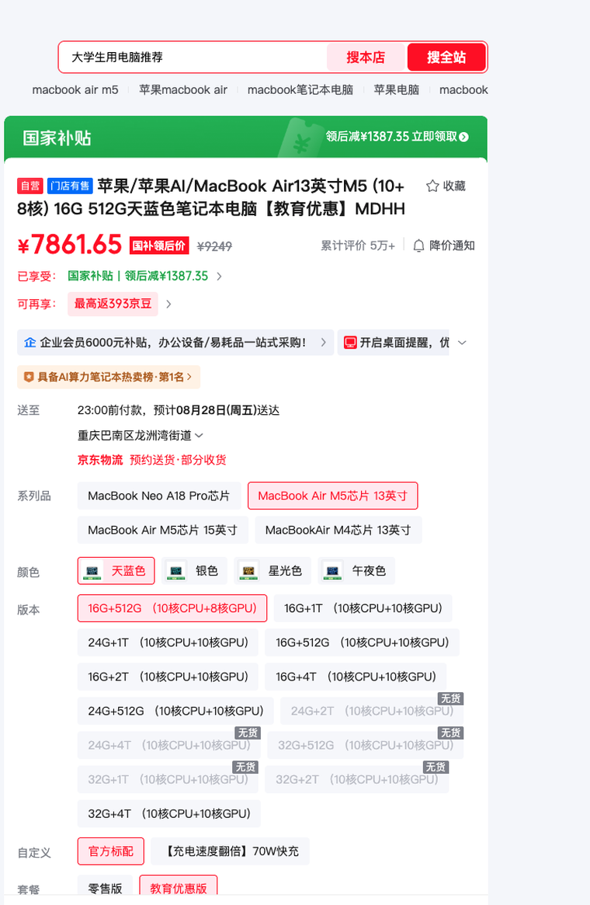

# 理科大学生不玩游戏推荐买Mac吗？关键看专业课软件有没有Mac版（2026实测）

**大学生学理科、又不玩游戏，MacBook 可以买。但推不推荐，不取决于游戏，取决于你专业课要用的软件有没有 Mac 版。**

「不玩游戏」这四个字一划掉，Mac 唯一的硬伤就没了。剩下的不是游戏题，是一道专业题。

这篇文章把理科专业按软件生态分成三类，对号入座就能得出答案；确认能买之后，再告诉你 2026 苹果返校季期间哪款最划算。价格口径：京东为 2026 年 8 月 23 日实测（重庆收货地），官网以苹果教育商店页面为准。

## 一、哪些理科专业可以闭眼买 Mac？

先说清楚一件事：理科不是一个东西。同一个理学院里，数学系和材料系对电脑的要求是两个方向。

**数学、统计、物理理论方向、生物信息、天文这类专业，闭眼买。** 主力工具是 MATLAB、Mathematica、Python、R、LaTeX，全部有原生 Mac 版，在 Apple 芯片上跑得很好。而且 macOS 底层是 Unix，配科研环境、连课题组的 Linux 服务器，体验和服务器端同源，比 Windows 顺手。

这类专业用 Mac 不是「能用」。**是更好用。**

## 二、哪些专业能买，但得留一手？

化学、材料、生物、环境这类实验方向，看文献写论文都没问题，麻烦在数据处理。

国内实验室画图很常用 OriginLab Origin，而 Origin 官方只有 Windows 版。OriginLab 官方帮助文档写得很直白，Mac 想用得先装虚拟机。不是不能用，是你得想清楚：愿不愿意为一个画图软件，常年开着 Parallels Desktop。

## 三、哪些专业直接劝退？

课程表里出现 ANSYS、SolidWorks、Keil、Altium Designer、ArcGIS Pro 的，别买。

ANSYS 官方支持的平台只有 Windows 和 Linux，官方社区客服的回复是：连虚拟机方案都不在支持范围。这类课常见于物电、力学、地信、电子信息的培养方案。名字挂在理科边上，软件生态是工科的。

## 四、装双系统或者虚拟机，行不行？

可能有人会说，大不了装双系统。

这条路 2020 年之后就没有了。M 系列芯片是 ARM 架构，苹果早把 Boot Camp 砍了，只剩在 Parallels Desktop 虚拟机里跑 ARM 版 Windows，x86 软件再过一层翻译。应急可以，当四年主力方案不行：性能打折不说，不少专业软件的授权和加密狗，在虚拟机里直接不认。

**虚拟机是创可贴，不是退路。**

## 五、确认能买之后，买哪款最划算？

预算紧，看 MacBook Neo。A18 Pro 芯片，教育价 4799 起，苹果官方标称续航 16 小时，Notebookcheck 评测实测 WiFi 上网接近 13 小时，上课泡图书馆一天不插电够用。短板是 8GB 内存，MATLAB 矩阵一大就会喘，适合轻负载。另外 Neo 不参加返校季的 849 配件抵扣，价格就是裸价，不用等活动。

（图源：Notebookcheck 评测实拍）

要当四年主力机，选 MacBook Air 13 英寸 M5，16GB 内存起步。苹果官网教育价 9249 元，京东自营教育优惠版叠 15% 国补到手 7861.65 元。这个价是 8 月 23 日我在京东亲手查的，比官网教育价便宜近 1400 元。

（图源：京东商品页实拍截图，2026-08-23 价格）

返校季 9 月 24 日截止，教育价和国补资格都有时效，想下手别拖过截止日。

## 六、下单前，先干什么？

只干一件事。找到你们专业的培养方案，或者抓一个直系学长问一句：咱们专业课用什么软件？

名单对上第一类，买。对上第三类，老老实实 Windows。暂时对不上就先捂紧钱包，开学摸清楚再动手。教育优惠常年有，不差这一个月。

最后总结成一句。MacBook 对理科生从来不是好不好的问题，**是配不配你课表的问题**：软件名单全在 Mac 阵营，它是四年里你最顺手的工具；名单里有 ANSYS 这类 Windows 限定软件，同价位 Windows 本才是正确答案。

各机型的价格明细、教育优惠怎么认证、国补怎么领，可以在知乎搜索《2026 苹果返校季教育优惠全攻略：官网 vs 京东国补逐台实算》，9 月 24 日截止前都管用。

信源：OriginLab 官方帮助文档（Mac 版说明）、ANSYS 官方社区客服回复、Notebookcheck MacBook Neo 评测、苹果官网教育商店、京东 2026 年 8 月 23 日实测价格（重庆收货地）。平台价格波动较快，下单前请以实时页面为准。

---

## 发布待办（百家号后台操作项，发布前删除本节）

**搜索关键词字段建议（4-20 字，选一个或组合）：**

- `理科大学生推荐买Mac吗`（11 字，首选，与知乎问题同源长尾）
- `大学生买MacBook怎么选`（11 字，备选）
- `苹果教育优惠MacBook价格`（12 字，备选）

**原创声明（注意先后手）：**

- 知乎原文（问题 https://www.zhihu.com/question/2052332528162414841 下的回答）**尚未发布**，草稿状态为「初稿待确认」。
- 按「知乎 → 公众号 D0 → 头条 D3 → 百家号 D4」节奏，本篇应排在知乎发布之后：届时选「非首发」，来源链接填知乎回答链接（发布后回填）。
- 若确需百家号先发，则选「首发」，且知乎端发布时保留本篇百家号链接与发布时间截图，防跨平台误判抄袭。
- 若该内容走了头条「首发激励」，必须等 72 小时排他期满再发百家号。

**可选插入的信源链接（正文已保留文字信源描述，百家号编辑器允许的话可补链）：**

- OriginLab 官方帮助文档：https://docs.originlab.com/quick-help/mac-origin/zh/
- ANSYS 官方社区客服回复：https://innovationspace.ansys.com/forum/forums/topic/problem-with-ansys-on-mac/
- Notebookcheck MacBook Neo 评测：https://www.notebookcheck-cn.com/Apple-MacBook-Neo-599.1250334.0.html

**配图（与知乎原文 3 张逐一对齐）：**

- [x] 软件分流卡 → `百家号版-理科买Mac-软件分流卡.png`（暖纸小票风 + 圆形印章标签，与知乎版白底横排色块卡区隔；源 `assets/table-science-mac-bjh.html`，截图走 `capture-bjh.js`）
- [x] Neo 实拍 → `百家号版-理科买Mac-MacBookNeo实拍.png`（Notebookcheck 实拍重裁：切掉右下角水印区，聚焦机身，缩放重导出）
- [x] 京东国补价截图 → `百家号版-理科买Mac-京东国补价.png`（聚焦右侧「国家补贴+¥7861.65」价格区重裁，760 宽竖图）
- [x] 信息流封面 → `百家号版-理科买Mac-封面.png`（900×600，轨道 A：苹果官网 Newsroom M5 MacBook Air 新闻稿双机侧视图 + PIL 叠字「理科生买Mac 先看课表 / 返校季实测」共 15 字；底图 `assets/raw/Apple-MacBook-Air-13-inch-and-15-inch-260303_big.jpg.large_2x.jpg`，源：https://www.apple.com.cn/newsroom/2026/03/apple-introduces-the-new-macbook-air-with-m5/ ，脚本 `assets/cover-bjh-science-mac.py`；发布时单独上传，不入正文）
- 重制脚本：`assets/capture-bjh.js`（tableJobs 追加分流卡）、`assets/reprocess-bjh-photos.py`（第 5、6 段），幂等可重跑

**数据回收提醒：** 发布 30 天后看后台「搜索流量占比」；若为零，优先改标题和关键词布局（本篇核心长尾词：理科买Mac、大学生MacBook、苹果教育优惠2026、MacBook Air M5 国补），不要加量发新稿。
