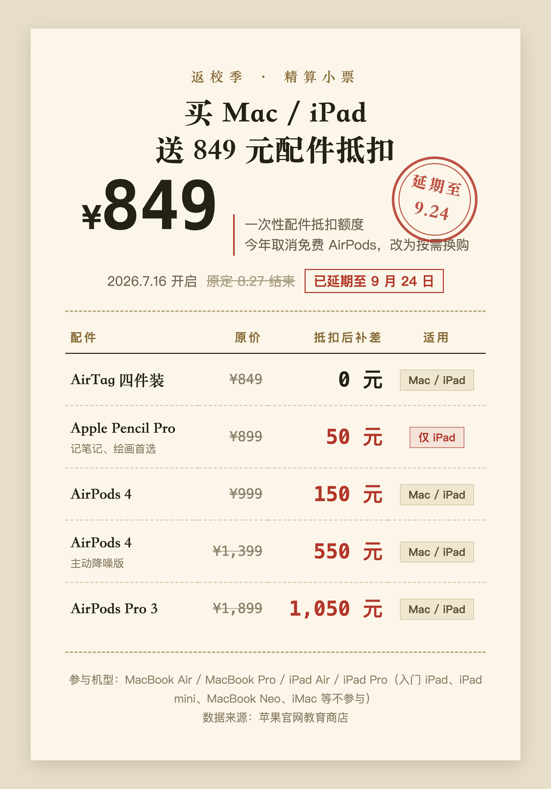
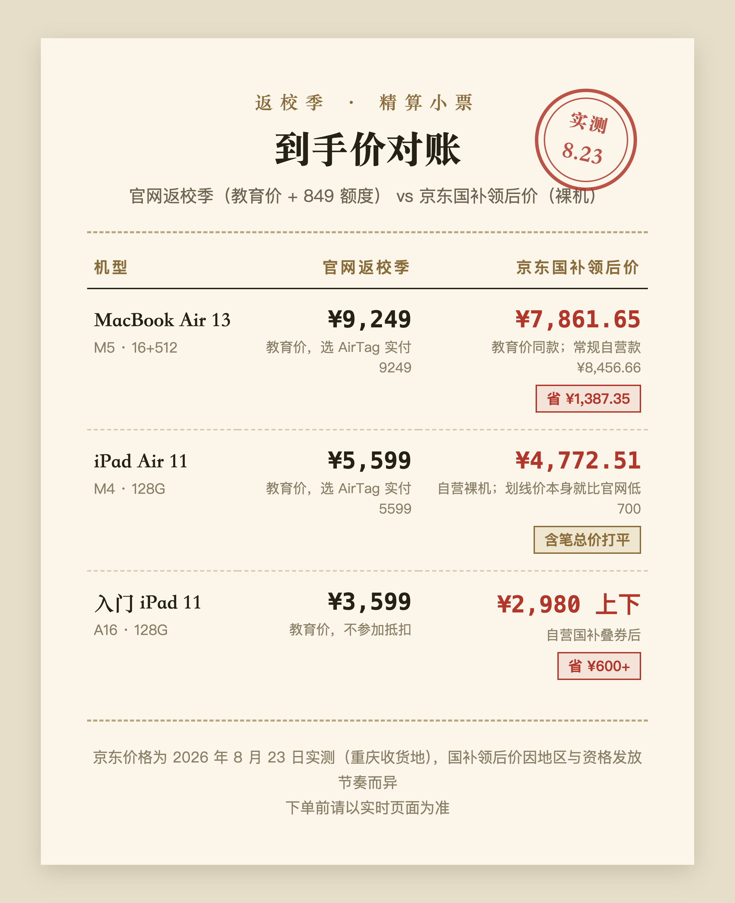
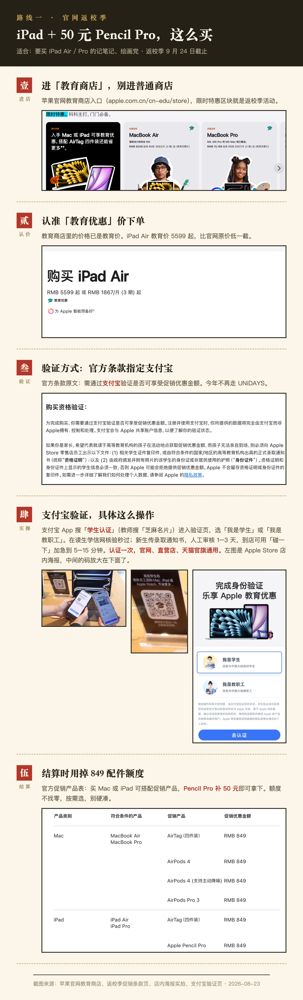
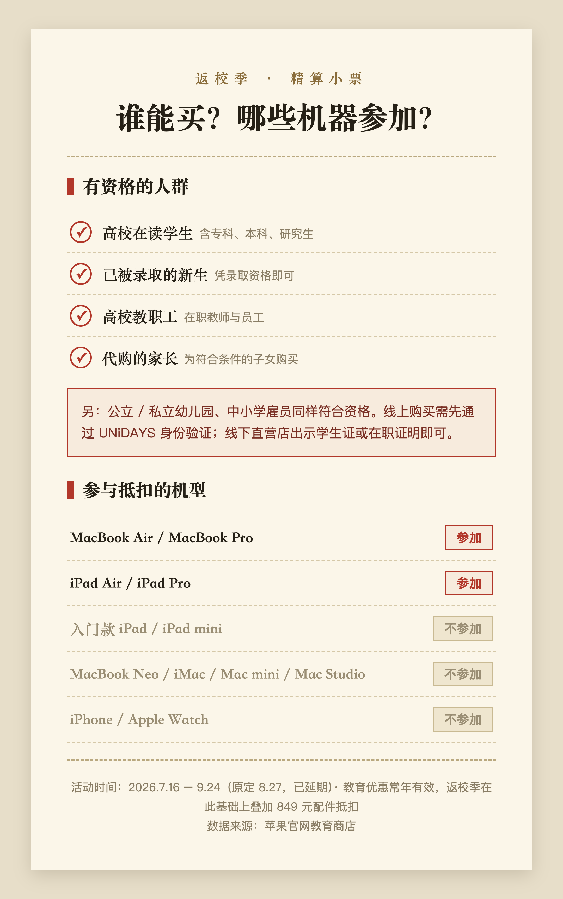
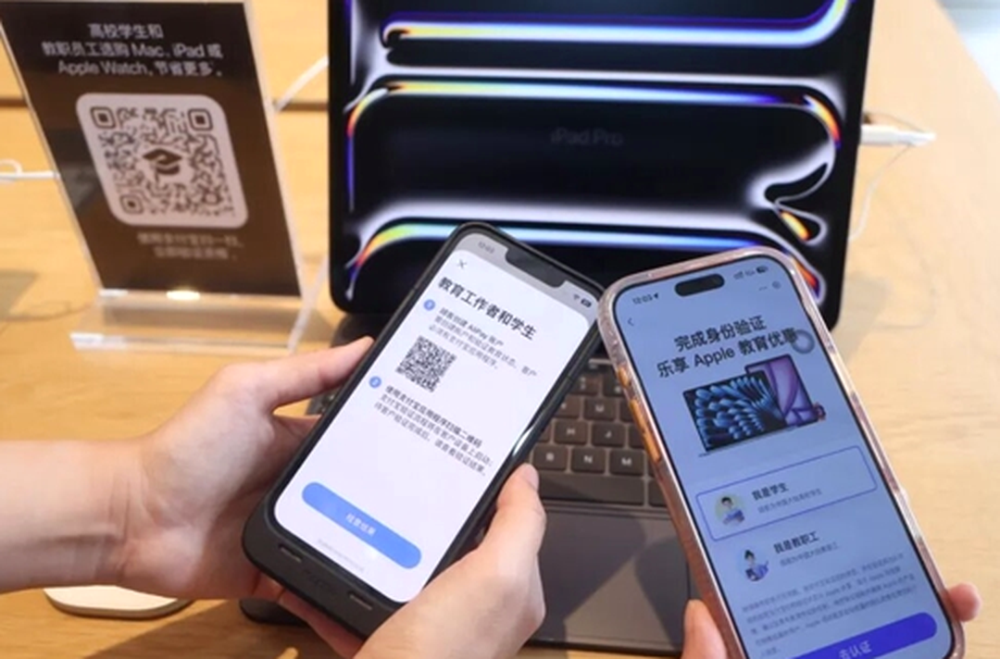

# 2026苹果返校季教育优惠怎么买最划算？官网和京东国补价格实测对比，一篇讲清

**先说结论：2026 年苹果返校季教育优惠已于 9 月 24 日截止前迎来最大变化——延续多年的「买 Mac/iPad 送 AirPods」取消，改为 849 元配件抵扣额度。经过逐台实算：买 MacBook 走京东教育价叠国补更便宜（13 英寸 MacBook Air 便宜近 1400 元）；需要 Apple Pencil Pro 的 iPad 用户走官网返校季，50 元即可换购原装笔；只买入门 iPad 刷剧的用户直接走京东国补，比官网教育价还便宜 600 多元。**

这篇文章把 2026 苹果教育优惠的规则变化、849 元额度的最优用法、官网返校季和京东国补两条路线的到手价、教育优惠的认证资格和流程，全部讲清楚。所有京东价格为 2026 年 8 月 23 日实时查询，官网规则以苹果教育商店促销条款为准。

## 一、2026 苹果返校季教育优惠有什么变化？

今年返校季有三件事必须知道，按影响大小排列。

**变化一：赠品机制取消，改成 849 元配件抵扣额度。** 往年买 MacBook 或 iPad Air/Pro 直接送一副 AirPods，很多人转手就能回血几百元。2026 年这一机制取消，取而代之的是 849 元配件抵扣额度：在指定配件中选购，额度内直接抵扣，超出部分补差价，用不完不找零。

**变化二：活动开始前全线涨价。** 6 月 25 日，苹果对 Mac、iPad 产品线调价：入门 iPad 和 iPad mini 涨 800 元，iPad Air 涨 1200 元，iPad Pro 涨 1800 元，MacBook Pro 最高涨 3000 元。先涨价、再把白送耳机改成抵扣，849 元的额度盖不住 1200 元起步的涨幅，这就是今年很多人感觉「苹果教育优惠缩水」的直接原因。

**变化三：活动时间延长。** 返校季 7 月 16 日开始，原定 8 月 27 日结束，8 月 12 日苹果宣布延期至 9 月 24 日，多出近一个月的决策窗口。

## 二、苹果 849 元配件抵扣额度怎么用最划算？

抵扣名单是固定的五样配件（iPad 用户多一样），按「回血能力」从高到低分析。

**唯一 0 元选项：AirTag 四件装，原价正好 849 元，一分不用补。** 但冷静考虑：普通人日常用得上四个防丢器吗？挂钥匙挂包顶多两个。想拿去二手平台回血也不现实，AirTag 的二手流通价格和流通速度都远不如 AirPods，849 元的面值变不成 849 元的现金。

**次优选项：AirPods 4，补差价 150 元。** 如果本来就要买耳机，这是今年最贴近「往年送耳机」体验的选项。AirPods 4 降噪版补 550 元、AirPods Pro 3 补 1050 元，按需选择，不要为了把额度「吃满」硬上高配——额度不找零，补出去的都是真金白银。

**全场最值：Apple Pencil Pro，官网售价 899 元，抵扣后只需补 50 元。** 50 元买一支原装 Pencil Pro，这个价格把第三方平替笔存在的理由直接打没了——市面上的平替笔都不止 50 元。需要手写笔的 iPad 用户，这是 2026 返校季最值得锁定的单项交易。

## 三、苹果官网返校季和京东国补哪个更便宜？到手价实测

这是本文最核心的部分。**2026 年最大的信息差不在官网规则里，而在「国补」这个变量**：手机数码国补政策仍在执行（6000 元以下补 15%、封顶 500 元；电脑类补 15%、封顶 1500 元），而苹果官方促销条款明确写着「国家补贴无法与此次优惠同时使用」。也就是说，官网返校季和国补只能二选一，想两头都占，必须去京东这类第三方平台。

以下京东价格为 2026 年 8 月 23 日实测（国补领后价按重庆收货地显示，各地额度发放节奏不同，下单前请自行核对）：

**MacBook 怎么选：京东教育价 + 国补，赢得没有悬念。** 京东上有和官网教育价同价（9249 元）的 SKU，叠完 15% 国补是 7861.65 元，比官网便宜 1387.35 元——这个差价已经超过 849 元额度本身。把配件算进去结论也不变：官网 9249 元加 150 元换 AirPods 4，实付 9399 元；京东 7861.65 元再买一副 999 元的 AirPods 4，合计 8860.65 元，京东仍便宜 538 元。不做学生认证走常规自营款，国补后 8456.66 元，照样比官网划算。

**iPad 怎么选：要笔走官网，不要笔走京东。** 官网教育价 5599 元加 50 元换笔，实付 5649 元；京东自营裸机国补后 4772.51 元，但 Apple Pencil Pro 在京东没有国补，自营仍是 899 元，合计 5671.51 元——官网只赢 22 元，基本打平。结论很清晰：需要 Pencil Pro 的用户，官网 5649 元含笔是全网唯一 50 元换购渠道，且一站式省心；不需要笔的用户，京东 4772 元的裸机价优势巨大。

**入门 iPad 怎么选：直接京东国补。** 入门款不参加 849 抵扣，官网教育价 3599 元，京东国补叠券后 2980 元上下到手，便宜 600 多元。

把 2026 返校季的真实价值说清楚：**价格上返校季已全面不占优，它剩下的价值只有三样——50 元的 Apple Pencil Pro（官网独家）、官网 14 天无理由退货的省心、不用抢国补资格的确定性。** 国补不是无条件的，需按收货地领取资格，各地发放节奏不同，手慢无。

**具体操作路径：**

- 官网路线（适合要笔的 iPad 用户）：进入苹果教育商店 → 教育价下单 → 支付宝验证身份 → 结算时将 849 元额度用在 Apple Pencil Pro 上。

- 京东路线（适合 MacBook 用户和入门 iPad 用户）：认准 Apple 产品京东自营旗舰店 → 点击商品页顶部绿色「国家补贴」横幅领取资格 → 下单自动立减。买 MacBook 记得选「教育优惠版」SKU，比常规自营款再便宜 600 元。

至于 MacBook Pro，今年涨价最狠（最高 3000 元）、教育优惠回血仅 800–1800 元，除非刚需，不是好时机。配置上提醒一句：文档、网课、轻办公场景，入门配置足够，不必为内存焦虑加钱。

## 四、苹果教育优惠哪些人能买？怎么认证？

**资格范围**（与往年一致）：高校在读学生、已录取的新生、高校教职工，公立和私立幼儿园及中小学雇员，家长可为符合条件的子女代购。

**常见问题解答：**

- 研究生可以参加苹果教育优惠吗？可以，高校在读即可，硕博不限。
- 新生只有录取通知书可以吗？可以，录取新生在资格范围内，认证时上传通知书。
- 往届生、非全日制可以吗？不行。毕业超过一年、自考、非全日制均不在范围内，学籍验证无法通过。
- 苹果教育优惠怎么验证？根据官方条款，需通过支付宝验证身份（今年线上认证已全面转为支付宝学生认证，不再是早年的 UNiDAYS）。两个入口：支付宝 App 搜索「学生认证」（教师搜「芝麻名片」）；或在 Apple Store 直营店扫描店内教育优惠海报上的入口。

- 认证流程：在读生走学信网学籍核验，即时通过；新生上传录取通知书走人工审核，1–3 个工作日。到店用户可用支付宝「碰一下」加急至 5–15 分钟。认证只需一次，官网教育商店、直营店、天猫官旗通用。线下直营店带学生证或在职证明可直接购买。

- 家长代购要求：需出示学生证件复印件或录取通知书，加学生本人带照片的有效身份证件，且两边信息必须一致，否则苹果有权拒绝订单。

**不参加返校季的机型**：入门 iPad、iPad mini、MacBook Neo、iMac、Mac mini、Mac Studio，以及 iPhone、Apple Watch，均不在抵扣名单内。返校季仅覆盖 MacBook Air/Pro 和 iPad Air/Pro 四条产品线。

## 五、现在买还是等 9 月苹果发布会？

每年返校季期间都有这个问题，2026 年的答案比较明确：**Mac 和 iPad 不用等。**

按目前的爆料，苹果秋季发布会 9 月 9 日举行，主角是 iPhone 18 Pro 系列和传闻中的折叠屏，不涉及 Mac 和 iPad 产品线——这两条线 2026 年 3 月刚更新完（M5 芯片 MacBook Air、M4 芯片 iPad Air），下次更新最早在明年春天。返校季 9 月 24 日截止，与发布会不存在时间冲突；等活动结束再买，等于白白放弃 849 元额度和教育价。

唯一例外是入门款：传闻 10 月前后有低价 iPad 和新 iMac 更新。如果需求只是影音刷剧且不着急，可以观望一个月。但入门 iPad 国补后不到三千的价格已经很有竞争力，等不等差别不大。

## 六、总结

2026 苹果返校季教育优惠的核心变化，是从「送 AirPods」变成「849 元抵扣」，叠加活动前全线涨价，优惠感确实缩水。但规则缩水不等于没有机会：

- 50 元的原装 Apple Pencil Pro，放在任何一年都是极低价格；
- 京东国补叠出的 1300 多元 MacBook 差价，是真金白银；
- 入门 iPad 不到三千的到手价，满足刷剧网课绰绰有余。

**今年教育优惠的信息差，已经从「知不知道有活动」变成「知不知道走哪条渠道」：MacBook 走京东教育价叠国补，要笔的 iPad 走官网返校季，入门 iPad 走京东国补。** 三条路各取所需，照着对号入座即可。

活动 9 月 24 日截止。数据来源：苹果官网教育商店及返校季促销条款（apple.com.cn/cn-k12/shop/back-to-school/terms-conditions），京东价格为 2026 年 8 月 23 日实测（重庆收货地，国补领后价因地区和资格发放节奏而异）。平台价格波动较快，下单前请以实时页面为准。

---

## 发布待办（百家号后台操作项，发布前删除本节）

**搜索关键词字段建议（4-20 字，选一个或组合）：**

- `2026苹果返校季教育优惠攻略`（14 字，首选）
- `苹果教育优惠京东国补对比`（12 字，备选）
- `苹果返校季怎么买最划算`（11 字，备选）

**原创声明：**

- 选「非首发」，来源链接填知乎原文链接（知乎先发）。
- 发布时序确认：本文已按「知乎 → 公众号 D0 → 头条 D3 → 百家号 D4」节奏排在最后一站；若该内容在头条走了首发激励，需确认 72 小时排他期已过再发布。

**配图（已重制完成，正文引用已就位）：**

- [x] 抵扣方案表 → `百家号版-苹果返校季2026-抵扣方案表.png`（暖纸面小票风 + 朱红印章，与知乎版冷灰蓝卡风格区隔）
- [x] 到手价对账表 → `百家号版-苹果返校季2026-到手价对账.png`（正文第三节 Markdown 表格已转图片，同款小票风）
- [x] 资格与机型信息图 → `百家号版-苹果返校季2026-资格与机型.png`
- [x] 官网路线、京东国补两张实操图 → `百家号版-苹果返校季2026-官网路线喂饭图.png` / `百家号版-苹果返校季2026-京东国补喂饭图.png`（内嵌真实截图不变，外围版式重排）
- [x] 店内海报实拍、支付宝认证页面 → 已重新裁剪缩放重导出（`百家号版-苹果返校季2026-店内海报实拍.png` / `百家号版-苹果返校季2026-支付宝认证页面.png`），文件指纹已改变
- [x] 信息流封面 → `百家号版-苹果返校季2026-封面.png`（900×600，3:2，发布时作为封面单独上传，不入正文）
- 重制源文件留存于 `assets/`（`*-bjh.html`、`cover-bjh.html`、`capture-bjh.js`、`reprocess-bjh-photos.py`），后续改数据可复跑

**数据回收提醒：** 发布 30 天后查看后台「搜索流量占比」；若搜索流量为零，优先改标题和关键词布局，不要加量发新稿。
