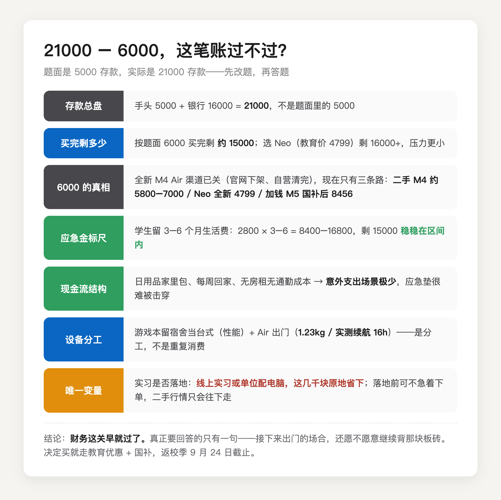

先把题面改对。你不是「5000 存款买 6000 的电脑」，你是「手头 5000、银行还有 16000、总计 21000 存款，买 6000 的电脑」。前者是咬牙硬上，后者是正常规划，这两个问题的答案完全不一样。

直接给答案：**财务上你完全买得起，而且我的建议是买。**理由分两层，一层钱，一层设备。

钱的这层。买完你剩 15000。给学生党一个简单的应急金标尺：留 3 到 6 个月生活费不动。你月生活费 2800，标尺区间是 8400 到 16800，15000 稳稳落在里面。再看你的现金流结构——日用品家里包揽、每周回家、没有房租没有通勤成本，这意味着你几乎没有「意外支出」场景，应急垫被击穿的概率本来就低。唯一要守的纪律是，买完以后把那 15000 从心里划走，它叫应急垫，不叫「剩下的钱」。

设备的这层更关键。你已经有一台游戏本，说明性能需求早就被覆盖了，这 6000 块买的不是性能，是便携。游戏本 2.3 公斤起步，还得带一块板砖适配器，离电续航两三个小时，带去实习就是每天负重训练加抢插座。MacBook Air 1.23 公斤，[Notebookcheck 实测](https://www.notebookcheck-cn.com/Apple-MacBook-Air-13-M5.1244739.0.html) WiFi 续航 16 小时往上，出门一天不用带充电器。游戏本留在宿舍当台式机，Air 负责教室、图书馆、实习通勤——**这不是重复消费，是分工。**

（图源：Notebookcheck 评测实拍）

下单之前提醒两件事。

第一件，「6000 的 Air」在新机渠道已经不存在了。M4 版 Air 官网已经下架，京东自营的全新库存也基本清完——我今天（9 月 4 日）在京东搜了几页，排在前面的全是二手和仅拆封机，行情 5800 到 7000。年初全新国补价一度低至 5439（[极客公园 1 月的报道](https://www.geekpark.net/news/358914)），那个窗口已经关了。所以你真实的选项是三个。

想省钱认 Air 的体验，走二手或仅拆封的 M4 Air，5800 到 7000。前提是会验机：激活锁、电池循环次数、保修剩余，一项都不能少，不会验就老实走带官方验机报告的渠道，别贪私人卖家的便宜。

想全新又不想超预算，看 MacBook Neo，教育价 4799，[快科技 6 月的报道](https://news.mydrivers.com/1/1129/1129206.htm)里京东叠补贴最低到过 3200 多。短板是 8GB 内存，当唯一主力机我不推荐，但当你的便携副机正合适——重活有游戏本在宿舍顶着，Neo 只负责出门。

打算一台机器用五年以上，才考虑加钱上 M5 版 Air，京东国补后 8456 起，这就不是 6000 的故事了。

我的排序是：预算卡死选 Neo，认准 Air 选二手 M4 但验机别偷懒，两个都不将就再加钱 M5。

第二件，这道题唯一的变量不是钱，是你的实习。如果最后实习是线上的，或者单位给配电脑，这几千块就原地省下了。所以实习没落地之前可以不急着下单，二手 M4 的行情只会往下走，Neo 的教育价也常年有。唯一带截止日的是返校季的 849 配件抵扣额度，9 月 24 日截止，且只覆盖 Air 和 Pro——真决定买 Air 系列了，别拖过截止日。

所以这道题从头到尾跟「该不该」关系不大。钱这关你早就过了，真正要回答的只有一句：接下来出门的那些场合，你是愿意继续背那块板砖，还是愿意让游戏本老老实实待在宿舍。

---

各机型教育价、国补怎么叠、返校季 849 配件额度怎么选，我在这篇里逐项算过，9 月 24 日截止前都管用：

[2026 苹果返校季教育优惠全攻略：官网 vs 京东国补逐台实算](https://zhuanlan.zhihu.com/p/156150196)

---

【延迟插卡：发布 48h 后若排名进前 5 或赞数 ≥ 能力先验下沿（5 赞），编辑插入——商品：MacBook Neo（京东自营教育优惠版，链接待从京东好物库检索补齐），位置建议：「想全新又不想超预算」段之后】
