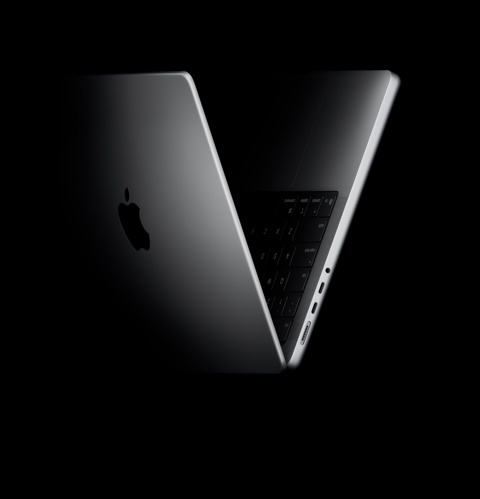
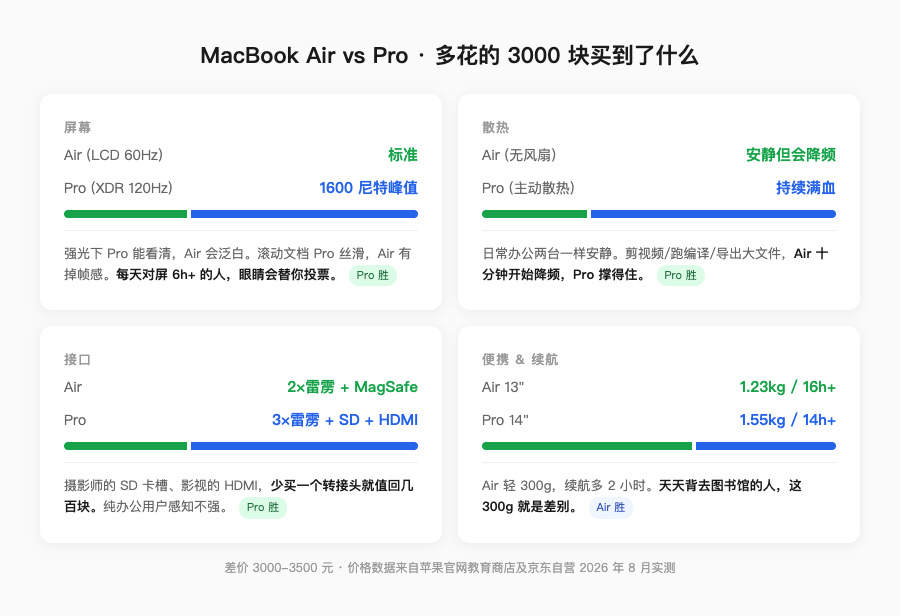
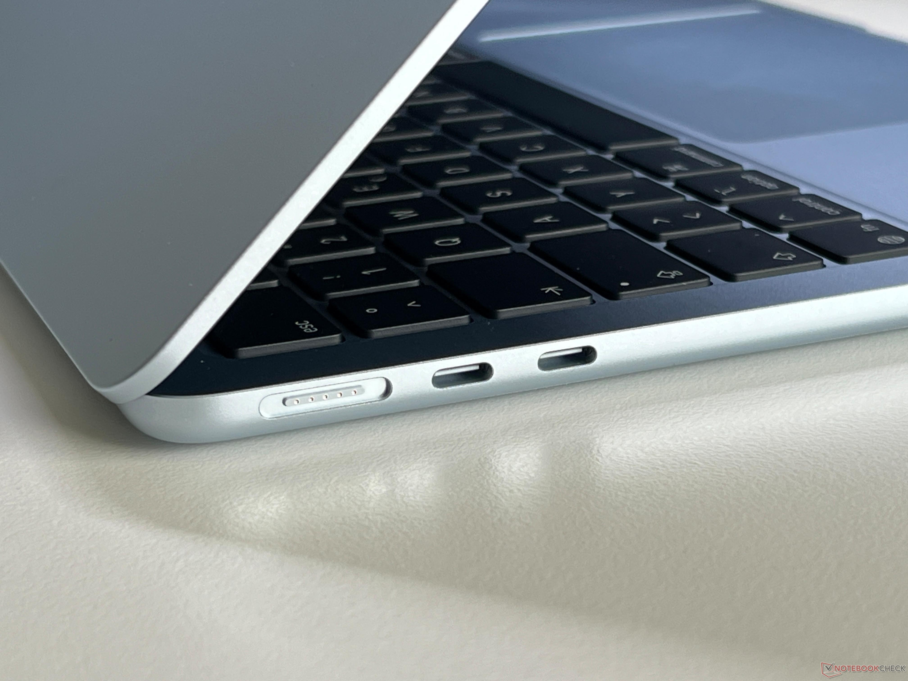
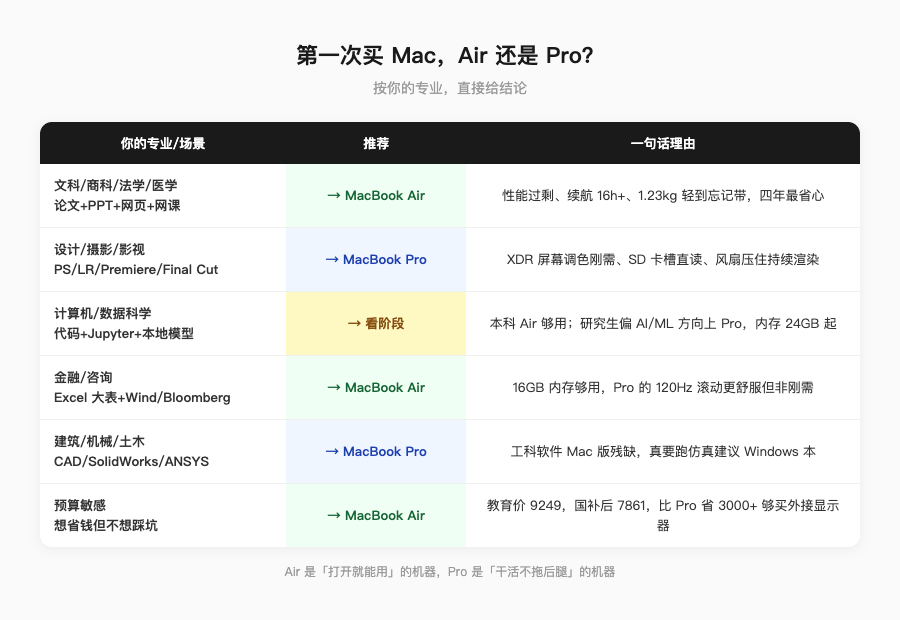

第一次买 Mac 的人，十有八九会在这两个名字之间纠结。

Air 听起来轻，Pro 听起来强。但苹果的命名在这件事上帮了你倒忙——它让你以为这是个「够不够强」的问题，其实是个「你拿它干什么」的问题。

我帮不少人选过，最后发现一个规律：**纠结 Air 还是 Pro 的人，80% 该买 Air。**

不是客气，是数据。苹果自己的用户调研里，MacBook Air 长期占 Mac 出货量的 60% 以上。买 Pro 的人里，又有一大半从来没用过 Pro 比 Air 多出来的那些能力。

但你是第一次买，我不想用概率替你做决定。把账拆开，你自己看。

---

## 多花的钱，买到了什么

先说价格。MacBook Air 13 英寸 M5，16GB+512GB，官网教育价 9249，京东自营叠 15% 国补到手 7861——这个价是我 8 月 23 日亲手查的。MacBook Pro 14 英寸 M5 基础款，教育价 12999，国补后大概 11000 上下。

**差价 3000 到 3500。** 这 3000 块你买到了四样东西：

**第一，屏幕。** Pro 是 mini-LED XDR，峰值亮度 1600 尼特，ProMotion 自适应 120Hz。Air 是普通 LCD，60Hz。数字听着抽象，说人话：你在强光下看屏幕，Pro 能看清，Air 会泛白。你滚动网页和文档，Pro 丝滑，Air 能感觉到掉帧。如果你每天对着屏幕超过 6 小时，这个差距眼睛会替你投票。

**第二，散热。** Air 没有风扇。日常办公没问题，但一旦你开始剪视频、跑编译、导出大文件，十分钟左右就开始降频。Pro 有主动散热，持续高负载下性能不衰减。不干活的时候两台机器一样安静，干活的时候 Pro 能撑住。

**第三，接口。** Air 只有两个雷雳口加 MagSafe 充电口。Pro 多一个 SD 卡槽、一个 HDMI 2.1、三个雷雳口。摄影师和剪辑师不用我解释 SD 卡槽的意义——不用额外买转接头，这件事本身就值几百块。

**第四，扬声器。** Pro 是六扬声器，低音更沉、声场更宽。Air 四扬声器，听歌够用，但一对比就知道差距。这个比较主观，不刚需。

_图源：苹果官网_

四样东西摆在这，值不值 3000 块？看你的专业。

_图源：自制 · 续航数据来自 Notebookcheck 实测_

---

## 按专业选，别按名字选

**文科 / 商科 / 法学 / 医学 → Air。**

你的工作流是 Word、PDF、网页、邮件、PPT。这些任务 M5 芯片的性能过剩到离谱，Air 的散热完全够用。你唯一需要在意的是续航和便携——Air 1.23 公斤，[Notebookcheck 实测](https://www.notebookcheck-cn.com/Apple-MacBook-Air-13-M5.1244739.0.html) WiFi 续航 16 小时往上，带去图书馆一整天不用带充电器。

Pro 的屏幕和接口对你来说是浪费。3000 块省下来，够买一台不错的 4K 外接显示器，坐着用的时候体验反而吊打 Pro 内屏。

**设计 / 摄影 / 影视 → Pro。**

这不是可选，是刚需。你的工作流里有 Photoshop 大图、Lightroom 批量导出、Premiere/Final Cut 时间线、DaVinci 调色——这些全是持续高负载。Air 没有风扇，跑十分钟就开始降频，你等不起。

SD 卡槽对摄影师是刚需，HDMI 对影视是刚需，XDR 屏幕对调色是刚需。这三样 Air 都给不了。

**计算机 / 数据科学 → 看情况。**

写代码、跑 Jupyter、做数据分析，Air 够用。但如果你要本地跑大模型、做深度学习训练、编译大型项目（比如 Android 源码），Pro 的散热和内存上限（最高 128GB vs Air 的 32GB）才是决定因素。

经验上，本科阶段 Air 够了，研究生如果方向偏 AI/ML，直接上 Pro。

**商科 / 金融（需要跑 Excel 大表、Wind、Bloomberg）→ Air 够用，但 Pro 的屏幕更舒服。**

金融终端和超大 Excel 文件对内存有要求，16GB 起步别省。屏幕方面，Pro 的 120Hz 在滚动几千行数据时体感差异明显，但不是刚需。

_图源：Notebookcheck 评测实拍_

---

## 一个容易踩的坑：内存

不管你选 Air 还是 Pro，**内存 16GB 起步，别选 8GB。**

2026 年了，Chrome 开 20 个标签页就吃掉 6GB，微信和钉钉后台挂着再吃 2GB，系统本身占 4GB。8GB 的机器你开个浏览器加微信就开始卡了。

苹果官网的内存升级价格很贵（+1500 从 16GB 到 24GB），但这是整台机器生命周期里最值得加的一笔钱。芯片决定跑多快，内存决定能不能跑。

如果你打算一台机器用四年，直接 24GB。多花 1500，摊到四年每年不到 400，比你中途换机划算。

---

## 充电器怎么选

顺带说一句，很多人买完 Mac 才发现充电器不够用。

Air 盒内附赠的是 35W 双口充电器，日常够用，但充电速度慢。如果你想快充，单独买一个 67W 或 70W 的氮化镓充电器，Air 能跑到 45W 左右的输入功率，一小时能充 50% 以上。

Pro 14 寸盒内附赠 67W，16 寸附赠 140W。如果你同时用 iPhone 和 Mac，一个多口氮化镓充电器（2C1A，65W-100W）比带两个充电头方便得多。具体怎么选，我在这篇里拆过协议和功率分配：

[多口充电器选购指南：从协议到功率分配，一篇讲透](https://zhuanlan.zhihu.com/p/156150196)

---

## 一句话总结

**Air 是「打开就能用」的机器，Pro 是「干活不拖后腿」的机器。**

你的专业决定你需要哪个。别被名字骗了，别为用不到的能力买单。

_图源：自制 · 价格数据来自苹果官网教育商店及京东自营 2026 年 8 月实测_

_信源：苹果官网 MacBook Air/Pro 规格页及教育商店定价、京东自营国补实时价格（2026-08-23 采集）、Notebookcheck MacBook Air 13 M5 评测数据。_

---

更多关于 MacBook 选购和价格实算，可以看我的这篇：[2026 苹果返校季教育优惠全攻略：官网 vs 京东国补逐台实算](https://zhuanlan.zhihu.com/p/156150196)

【延迟插卡：本题为强购买意图决策题，但首发不带卡。发布 48h 后若排名进前 5 或赞数 ≥ 2，编辑插入——商品 1：MacBook Air 13 英寸 M5 16+512（京东自营教育优惠版，链接待从京东好物库检索补齐），位置建议：「按专业选」文科段之后；商品 2：MacBook Pro 14 英寸 M5 基础款（京东自营教育优惠版），位置建议：设计/摄影段之后】
