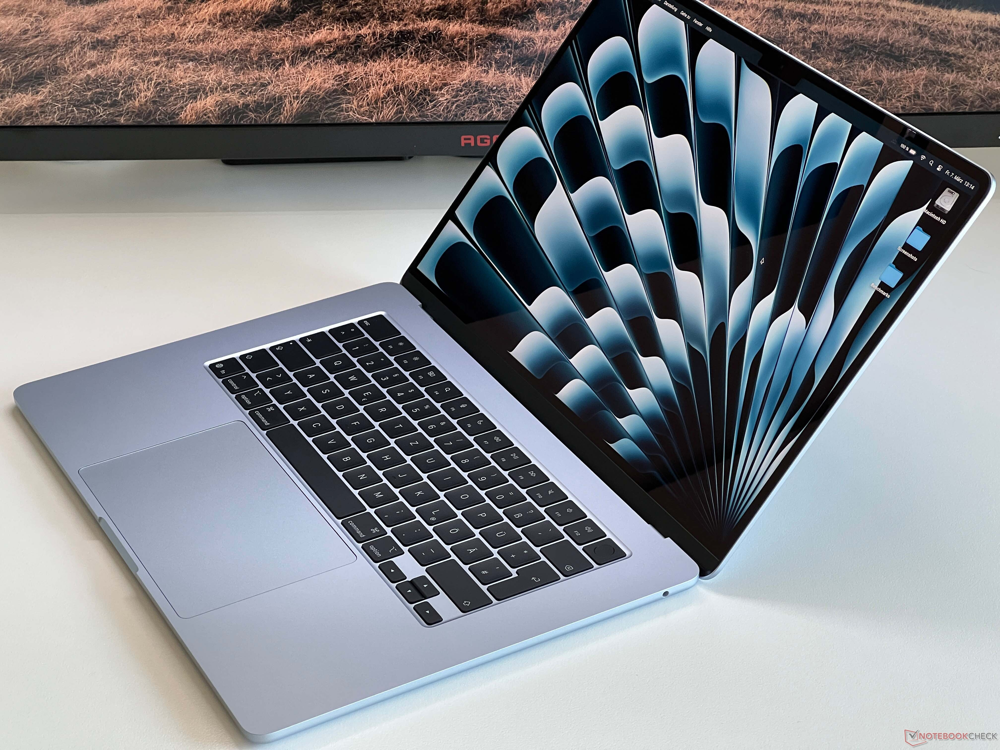
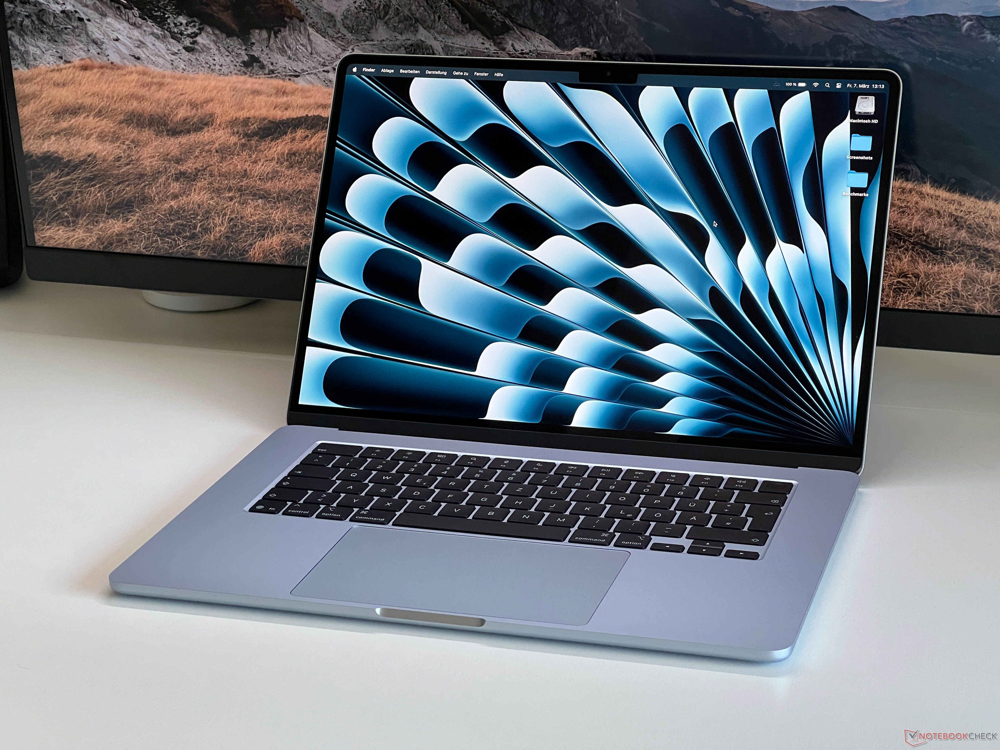
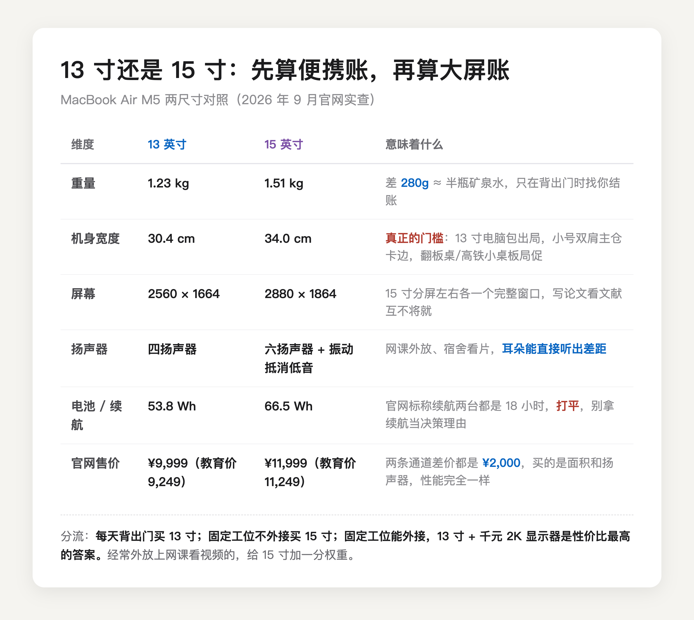

先看一个容易让人冲动下单的数字：15 寸 MacBook Air 只比 13 寸重 280 克。半瓶矿泉水换一个更大号的屏幕，听起来像白送。但 15 寸真正的门槛不在秤上，在你的包上、你常坐的那张桌子上。

笔记本和平板的尺寸逻辑是反的。平板是拿着用的设备，尺寸决定姿势；笔记本九成时间放在桌上，重量的账只在一个时刻找你结算——背出门的那一刻。**所以这道题的真正问法是：你一周有几天把它背出门？**

先把便携账算清楚。13 寸 1.23 公斤、机身宽 30.4 厘米；15 寸 1.51 公斤、宽 34 厘米（[苹果官网规格页](https://www.apple.com.cn/macbook-air/specs/)）。重量差 280 克确实不致命，宽度差 3.6 厘米才是硬伤：标准 13 寸电脑包直接出局，不少小号双肩包的主仓刚好卡在 33 厘米上下。还有两个真实场景建议提前代入——阶梯教室的翻板桌和高铁小桌板，13 寸放上去刚好，15 寸支棱着两条边，打字都晃。天天背包出门的人，下单前拿尺子量一下常背的包，比看任何评测都有用。

（图源：Notebookcheck 评测实拍）

再算大屏账。15 寸买到三样东西：2880×1864 的屏幕，分屏时左右各一个完整窗口，写论文左边文献右边正文互不将就；六扬声器配振动抵消低音单元，13 寸是四扬声器，网课外放和宿舍看片的差距是耳朵能直接听出来的；还有一块明显更大的触控板。

（图源：Notebookcheck 评测实拍）

注意这三样全是「坐着用」的收益，跟便携没有半点关系。续航不用纠结，两台官网标称都是 18 小时，打平。

其实这道题还有第三个解，很多人没想到：**13 寸 Air 加一台外接显示器。**一台千元出头的 27 寸 2K 显示器，坐下时的屏幕体验吊打 15.3 寸内屏，出门时 1.23 公斤全身轻松，两样加起来的总价跟 15 寸单机差不多。15 寸真正的目标用户，是「天天坐着用、又不想外接任何东西」的人——宿舍桌面小、家里没固定工位、嫌外接麻烦，那 15 寸的大屏每天都在兑现价值。

分流结论。每天背出门的——通勤、泡图书馆、带课——选 13 寸，它出现的每个场景都不碍事。固定工位且不打算外接的，选 15 寸，你付的每一分差价都变成每天的视野。固定工位但桌面允许外接的，回 13 寸加显示器，这是这道题里性价比最高的答案。经常外放上网课看视频的，给 15 寸加一分权重，六扬声器是它被低估的优势。

最后报价格，分两条路报，因为教育优惠不是人人都有。苹果官网今天（9 月 3 日）实查：13 寸常规价 9999，15 寸 11999；有高校师生资格的，教育价 9249 和 11249。看出来了吗，**不管你走哪条路，两台的差价都是 2000 整**，这道题的决策其实跟价格通道无关，只跟你怎么用有关。到手价还能再压：京东自营叠 15% 国补，13 寸常规款到手 8456.66，这是我 8 月 23 日在京东亲手查的，15 寸按同样逻辑大约一万出头，下单前以页面为准。有教育资格的再多一步，13 寸教育优惠版叠国补能到 7861.65，返校季 9 月 24 日截止。

13 寸的代价在屏幕上，每天坐下时付；15 寸的代价在背上，每天出门时付。**这道题没有标准答案，只有你愿意天天付哪一笔。**

---

教育优惠怎么认证、国补怎么叠、849 配件额度怎么选，我在这篇里逐项算过，9 月 24 日截止前都管用：

[2026 苹果返校季教育优惠全攻略：官网 vs 京东国补逐台实算](https://zhuanlan.zhihu.com/p/156150196)

---

【延迟插卡：发布 48h 后若排名进前 5 或赞数 ≥ 能力先验下沿（5 赞），编辑插入——商品：MacBook Air 13 英寸 M5 16+512（京东自营教育优惠版，链接待从京东好物库检索补齐），位置建议：分流结论「13 寸加显示器」段之后】
