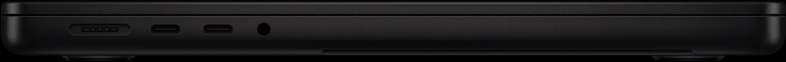
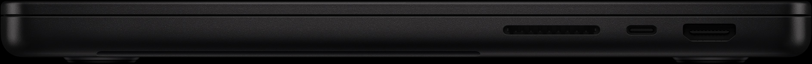
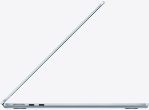
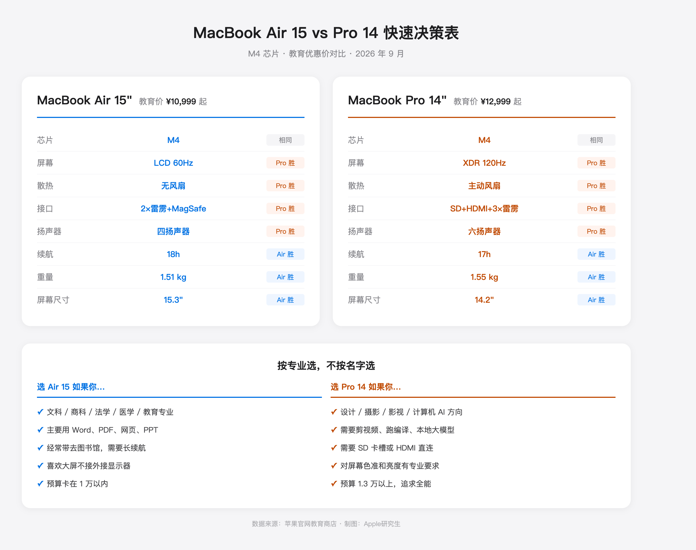

这个问题下面肯定有人给你列参数表。我不列。

参数表看完你还是不会选，因为 Air 15 和 Pro 14 的纠结，根本不是参数问题。**你纠结的不是哪台更强，是你怕选错了后悔。**

我换个方式帮你。不讲机器，讲你。

---

回答之前先问你三个问题，你在心里答：

**第一，你一天里有几个小时是盯着屏幕的？** 不是「用电脑」，是「盯着屏幕」。写论文、做表格、剪片子、写代码都算。刷手机不算。

**第二，你电脑放在桌上的时间多，还是装在包里带走的时间多？**

**第三，你上一次因为电脑卡而烦躁，是什么时候？** 想不起来，还是上周？

三个问题的答案，基本就能替你选了。我下面解释为什么。

---

## 先说一个反常识的事实

**Air 15 的屏幕比 Pro 14 大，但 Pro 14 的屏幕比 Air 15 好太多。** 这两件事同时成立，而且大多数人只注意到了第一件。

Air 15 是 15.3 寸 LCD，60Hz。Pro 14 是 14.2 寸 mini-LED，120Hz，峰值亮度 1600 尼特。数字你看过一百遍了，我说个场景你就懂了：

下午三点，你坐在咖啡厅靠窗的位置，阳光斜射进来。打开同一个网页——Air 15 的屏幕开始泛白，你得把亮度拉到最高才能看清。Pro 14 呢？跟你在室内看没什么区别。

这不是「好一点」的差距，是「能用」和「没法用」的差距。

但话说回来，如果你 90% 的时间都在室内用电脑，这个优势对你就是零。

_图源：苹果官网_

---

## 回到你的三个答案

**如果你每天盯屏幕超过 6 小时，而且经常在强光环境下用——选 Pro 14。**

不是因为它「强」，是因为你的眼睛会替你受罪。60Hz 的屏幕滚动几千行 Excel 或者长 PDF 的时候，那种微妙的拖影和闪烁，短时间感觉不到，用半年你的眼睛会告诉你。

120Hz + XDR 不是参数党的高潮，是长时间使用者的刚需。

**如果你电脑大部分时间放在桌上，偶尔带走——选 Air 15。**

15.3 寸的屏幕，不接外接显示器的情况下，分屏写论文+查资料、Excel 并排对比、剪视频时时间线和预览同时看，都比 14 寸舒服一大截。这个舒服是每天都感受得到的，比 XDR 屏幕实在。

而且 Air 15 比 Pro 14 还轻 40 克（1.51kg vs 1.55kg）。别笑，40 克不多，但 Air 更薄，塞包里感觉更明显。

**如果你上周刚因为电脑卡而烦躁过——先别选，先加内存。**

不管你选 Air 还是 Pro，**16GB 起步，能上 24GB 直接上。** 2026 年了，Chrome 20 个标签页吃掉 6GB，微信钉钉后台挂 2GB，系统本身占 4GB，8GB 的机器开个浏览器就开始转圈了。

内存是焊接的，后期加不了。多花 1500 从 16GB 升到 24GB，摊到四年每年不到 400 块。这是整台机器生命周期里最值得的一笔投入。

---

## 两个你可能没想到的点

**第一，接口这件事，比你想象的更重要。**

Air 15 只有两个雷雳口加 MagSafe。听起来够用对吧？你插上充电器，就只剩一个口了。这时候你想接个 U 盘传文件，或者接个 HDMI 投屏做 presentation——你得买转接头。

Pro 14 有 SD 卡槽、HDMI 2.1、三个雷雳口。摄影师不用我解释 SD 卡槽的意义。做汇报的人不用我解释 HDMI 直连的意义。

**如果你经常需要接外设，Pro 14 省下的不只是转接头的钱，还有每次找不到转接头时的烦躁。**

_图源：苹果官网_

_图源：苹果官网_

_图源：苹果官网_

**第二，散热不是「性能」问题，是「安静」问题。**

很多人以为 Air 没风扇 = 性能差。不对。日常使用（文档、网页、邮件、轻度修图）Air 的 M4 芯片性能完全过剩，根本不会降频。

风扇只在持续高负载时才启动——剪 4K 视频、跑编译、导出大文件、本地跑模型。如果你不做这些事，Air 的无风扇设计反而是优势：永远安静，图书馆随便用。

但如果你做这些事，Air 跑十分钟就开始降频，你会等得想砸电脑。这时候 Pro 的主动散热就是刚需。

---

## 价格呢？

M4 这一代，Air 15 英寸 16GB+512GB 教育价大概 10999 起，Pro 14 M4 基础款教育价 12999 起。差价 2000 左右，叠京东国补 15% 能缩到 1700 上下。

2000 块买什么？买 XDR 屏幕、买主动散热、买 SD 卡槽和 HDMI、买六扬声器。

**这四样东西，哪样对你的日常是刚需，哪样就是这 2000 块的价值。** 如果四样都用不上，省下来买台 4K 外接显示器，坐着用的时候体验反而吊打 Pro 内屏。

---

## 最后的决策逻辑

别想「哪台更好」。想「哪台更适合我明天的生活」。

明天你要带去图书馆写一天论文？Air 15，大屏 + 长续航 + 永远安静。

明天你要剪一个婚礼视频交活？Pro 14，XDR 调色 + 主动散热 + SD 卡直读。

明天你要背着电脑跑三个地方开会？Pro 14，HDMI 直连投影 + 接口够用不找转接头。

明天你就是在宿舍追剧写作业？Air 15，省 2000 块吃顿好的。

**机器没有对错，只有匹配。**

_图源：自制 · 价格数据来自苹果官网教育商店及京东自营 2026 年 9 月实测_

_信源：苹果官网 MacBook Air/Pro 规格页及教育商店定价、京东自营国补实时价格（2026-09 采集）、Notebookcheck MacBook Air 15 M4 评测数据。_

---

更多关于 MacBook 选购和价格实算，可以看我的这篇：[2026 苹果返校季教育优惠全攻略：官网 vs 京东国补逐台实算](https://zhuanlan.zhihu.com/p/156150196)

【延迟插卡：本题为强购买意图决策题，但首发不带卡。发布 48h 后若排名进前 5 或赞数 ≥ 2，编辑插入——商品 1：MacBook Air 15 英寸 M4（京东自营教育优惠版，链接待从京东好物库检索补齐），位置建议：「如果你电脑大部分时间放在桌上」段之后；商品 2：MacBook Pro 14 英寸 M4 基础款（京东自营教育优惠版），位置建议：「如果你每天盯屏幕超过 6 小时」段之后】
