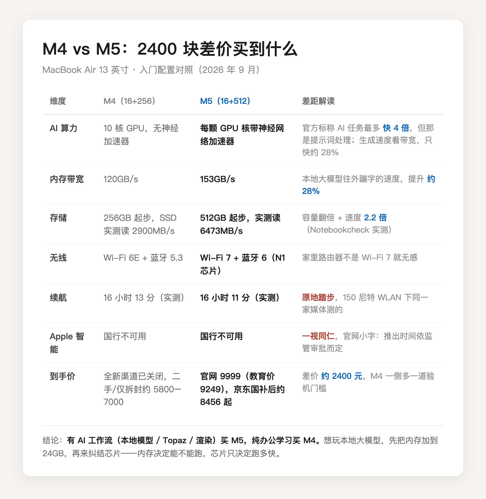
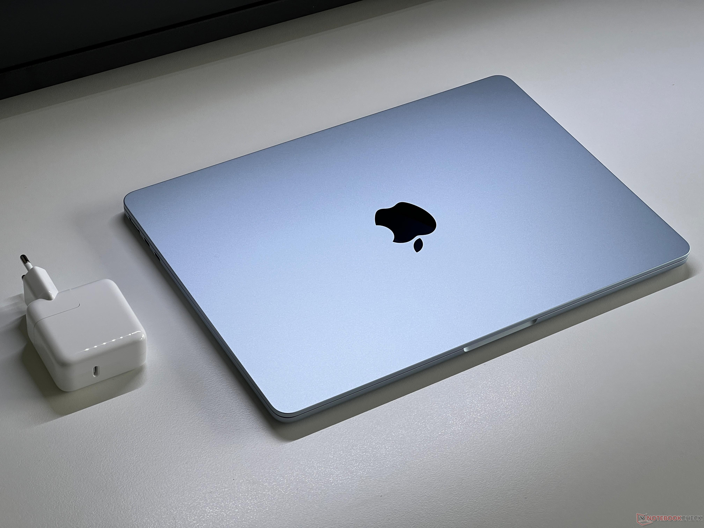

这道题放在半年前是不成立的。M5 版 MacBook Air 今年 3 月 11 日才开卖，在那之前 Air 只有 M4 一个答案。现在两台都能买到，只是渠道不一样了——M5 走全新，M4 只剩二手和拆封机——价差 2400 上下，问题才真正变成了：这 2400 块到底买到什么。

答案先押在这：**纯办公学习买 M4，工作流里真有 AI 才买 M5。**理由得从这 2400 块拆开讲。


（图源：Notebookcheck 评测实拍，M5 与 M4 机身模具完全相同）

先把账面摊开。M5 比 M4 多四样东西——GPU 每个核心都塞了神经网络加速器，[苹果官方新闻稿](https://www.apple.com.cn/newsroom/2026/03/apple-introduces-the-new-macbook-air-with-m5/)标称 AI 任务最多快 4 倍；内存带宽从 120GB/s 提到 153GB/s；存储从 256G 起步翻倍到 512G，而且 SSD 提速惊人，[Notebookcheck 实测](https://www.notebookcheck-cn.com/Apple-MacBook-Air-13-M5.1244739.0.html)读取从 M4 的 2900MB/s 干到 6473MB/s；外加 Wi-Fi 7 和蓝牙 6。没涨的是续航，同一家媒体实测 150 尼特亮度下 M5 撑了 16 小时 11 分，M4 是 16 小时 13 分——原地踏步。



重点拆一下那个「快 4 倍」，因为它一半是真相一半是话术。

AI 任务分两段。第一段是提示词处理，你把几千字材料丢给模型、等它开口的那段时间，这是纯计算，神经加速器全速发力，快 4 倍主要快在这里。第二段是生成，模型一个字一个字往外蹦的过程，这个环节吃内存带宽，M5 只比 M4 快 28% 左右。**两个数字都是真的，区别只在于你等的是哪一段。**日常聊天问答，你的体感更接近 28% 那一档。

接着说个更扫兴的。上面聊的如果是苹果自家的 Apple 智能，那国行用户目前一点都用不到——[苹果官网规格页](https://www.apple.com.cn/macbook-air/specs/)的小字写得很清楚，「Apple 智能推出时间依监管部门审批情况而定」。我今天（9 月 2 日）刚在自己的国行 Mac 上跑了一遍苹果官方的模型可用性接口，返回结果仍然是：

```
⏳ unavailable
reason: deviceNotEligible（设备不符合条件）
```

机器是国行身份，门就关着，M4 和 M5 一视同仁。**所以「为了苹果的 AI 买 M5」这个理由，在国行目前不成立。**

但本地大模型是另一回事，它不挑地区。Ollama、LM Studio 装上就跑，7B、14B 的开源模型随便玩。真走到这一步，优先级会反转：**内存容量比芯片代际重要。**经验上，7B、8B 的量化模型本体 4 到 5 个 G，16GB 内存的 Mac 扣掉系统和浏览器刚好够跑；14B 开始吃紧；想玩 32B，请从 24GB 内存起步。预算卡死又想玩本地模型的话，正确姿势是先把内存怼到 24GB，再来纠结 M4 还是 M5——芯片只决定跑多快，内存决定能不能跑。

拆完了，分流就清楚了。

日常 Office、网页、网课、看视频，买 M4。这部分需求 M4 的性能本来就过剩，M5 快出来的那截你一辈子用不到，2400 块省下来干点啥不好。但有个前提：全新 M4 已经买不到了，只能走二手或仅拆封渠道，得会验机，具体在下面的价格段说。

工作流里真有 AI 的，买 M5。比如用 Topaz 做视频画质增强（官方实测比 M4 快 1.9 倍）、Blender 渲染（快 1.5 倍）、本地跑模型写东西，这些场景神经加速器和带宽每天都替你把 2400 块赚一点回来。打算一台机器用五年以上的也建议 M5，存储 512G 起步和 Wi-Fi 7 是给未来留的余量。


（图源：Notebookcheck 评测实拍）

最后报价格账，这里有个 9 月才成立的新情况：全新 M4 的渠道已经关了。官网下架，京东自营全新库存清完，我今天（9 月 4 日）在京东搜了几页，能买到的 M4 基本是二手和仅拆封机，行情 5800 到 7000。年初全新国补低至 5439（[极客公园 1 月的报道](https://www.geekpark.net/news/358914)）的窗口已经过去了。所以现在两边的真实对比是：M4 二手 6000 上下，对 M5 全新国补后 8456——差价还是 2400 左右，但 M4 这边多一道验机门槛，激活锁、电池循环次数、保修剩余都要查，不会验就走带官方验机报告的渠道。M5 那边官网常规价 9999、教育价 9249；京东自营叠 15% 国补，常规款到手 8456.66，教育优惠版 7861.65，两个价都是我 8 月 23 日在京东亲手查的。国补不需要任何身份，教育优惠是高校师生的加分项，返校季 9 月 24 日截止。


所以这道题的表面是芯片二选一，里子其实只有一个问题：你有没有 AI 工作流。有，M5 多收的每一分钱都落在实处；没有，M4 的性能本来就过剩，为跑分多掏 2400 只是心理按摩。

---

各渠道怎么叠教育优惠和国补、15 寸和 Neo 的账怎么算，我在这篇里逐台实算过，9 月 24 日截止前都管用：

[2026 苹果返校季教育优惠全攻略：官网 vs 京东国补逐台实算](https://zhuanlan.zhihu.com/p/156150196)

---

【延迟插卡：发布 48h 后若排名进前 5 或赞数 ≥ 能力先验下沿（5 赞），编辑插入——商品：MacBook Air 13 英寸 M5 16+512（京东自营教育优惠版，链接待从京东好物库检索补齐），位置建议：价格账段落「亲手查的价」之后】
