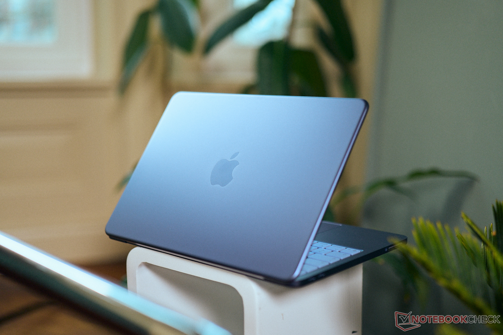
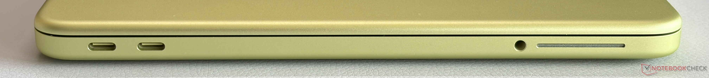

先说结论：**看你怎么定义「值得」**。

如果你想要的是一台「能进苹果生态、价格最低的 Mac」，那 Neo 依然是唯一答案。4799 的教育价，比 Air M5 便宜 4500 块，这个差价不是加内存、加存储能填平的。

但如果你是冲着「4599 的 Mac」这个心理价位来的，那 6 月底涨完价，5499 的起售价确实让人犹豫了一下。

把账拆开。

---

## 涨价涨了多少

3 月发布时 4599 起，6 月 25 日苹果全线调价，Neo 涨了 900，现在官网 5499 起。教育价 4799 起。

900 块是什么概念？Neo 本身就便宜，900 块占原价的 20%。Air M5 涨了 1200，但 Air 原价 9249，涨幅 13%。**Neo 是这次涨价里比例最狠的。**

但话说回来，涨完价它还是最便宜的 Mac。这个事实没变。

_图源：Notebookcheck 评测实拍_

---

## 4799 你买到了什么

**第一，铝合金机身。** 不是塑料，不是镁合金，是跟 Air、Pro 同款的铝合金铣削外壳。Notebookcheck 的评测里说「手感和质感与更昂贵的 MacBook 几乎无异」。这个价位给铝合金机身，苹果是下了本的。

**第二，A18 Pro 芯片。** 就是 iPhone 16 Pro 里那颗。单核性能极强，日常打开 App、浏览网页、写文档，响应速度跟 Air M5 差距不大。[Notebookcheck 实测](https://www.notebookcheck-cn.com/Apple-MacBook-Neo-599.1250334.0.html)里，它跑 CrossMark 和浏览器基准测试成绩优异，日常任务飞快。

**第三，屏幕不差。** 13 英寸 Liquid 视网膜，500 尼特亮度，支持 sRGB 色域，无 PWM 闪烁。不是 Pro 的 XDR，但比同价位 Windows 本的屏幕素质高。

**第四，静音。** 无风扇设计，永远听不到风扇声。图书馆、教室、宿舍，随便用。

**第五，好修。** 内部组件用螺丝固定，没有胶水，电池、扬声器都能拆。这在 2026 年的笔记本里是稀有属性。

_图源：Notebookcheck 评测实拍_

---

## 4799 你妥协了什么

**第一，8GB 内存。** 这是最大的坎。2026 年了，Chrome 开 20 个标签页就吃掉 6GB，微信和钉钉后台挂着再吃 2GB，系统本身占 4GB。8GB 的机器你开个浏览器加微信就开始卡了。而且内存是焊接的，后期加不了。

**第二，无键盘背光。** 这个在 2026 年真的不应该。晚上在宿舍或图书馆用，看不清键帽。苹果在 Neo 上砍了这个，大概率是为了跟 Air 拉开差距。

**第三，USB 2.0 接口。** 两个 USB-C 口，一个是 USB 3，一个是 USB 2。USB 2 的传输速度只有 480Mbps，传个大文件能急死人。虽然能充电，但这个年代给 USB 2，确实是刀法精准。

**第四，基础款无 Touch ID。** 512GB 版本才有指纹识别。256GB 版本每次登录都要输密码。

**第五，续航有坑。** 苹果官方标称 16 小时视频播放、11 小时 WiFi 上网。但 Notebookcheck 实测发现，**高亮度下续航会明显缩短**。如果你习惯把亮度拉到 80% 以上，实际续航可能只有 7-8 小时。

_图源：Notebookcheck 评测实拍_

---

## 那到底值不值

**值，如果你是这些人：**

- 预算卡死在 5000 以内，但又想进苹果生态
- 主要用途是文档、网课、网页、邮件、轻度剪辑
- 能接受 8GB 内存，不跑大型软件
- 对键盘背光和 Touch ID 不敏感

**不值，如果你是这些人：**

- 需要跑 Xcode、Android Studio、虚拟机、本地大模型
- 习惯同时开几十个 Chrome 标签页
- 晚上经常用电脑，需要键盘背光
- 对续航有硬性要求（比如全天不带充电器）

这些人直接加钱上 Air M5。教育价 9249，16GB 内存，M5 芯片，ProMotion 屏幕，MagSafe 充电，键盘背光，Touch ID——每一项都是 Neo 的短板。

---

## 一句话

**Neo 不是「性价比最高的 Mac」，是「唯一能买得起的 Mac」。**

涨价 900 确实心疼，但涨完价它还是最便宜的入场券。你的预算够不够 Air，决定了 Neo 值不值。

_信源：苹果官网 MacBook Neo 规格页及教育商店定价、Notebookcheck MacBook Neo 评测（2026 年 7 月）。_

---

更多关于 MacBook 选购和价格实算，可以看我的这篇：[2026 苹果返校季教育优惠全攻略：官网 vs 京东国补逐台实算](https://zhuanlan.zhihu.com/p/156150196)

【延迟插卡：本题为决策类，有购买意图，但 Neo 无好物卡（苹果官网商品不挂京东卡）。发布 48h 后若排名进前 5 或赞数 ≥ 2，编辑插入 MacBook Air M5 好物卡作为对比升级选项】
