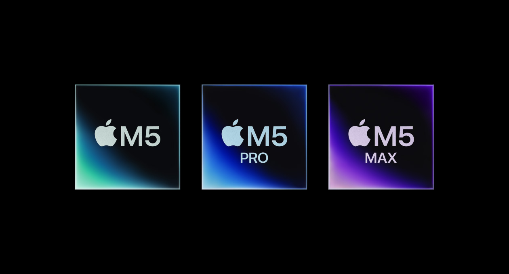
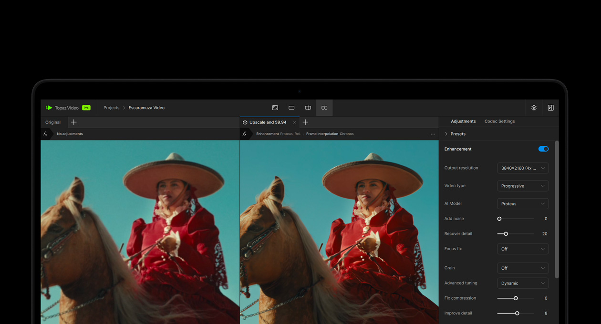

这个问题得看你在跟谁比。

跟 M1 时代的 16 寸比，现在买简直是降维打击。跟 MacBook Air 比，16 寸 Pro 贵出来的钱花在哪，你得心里有数。跟同价位的 Windows 本比，那又是另一套算法。

先说最硬核的那个对比。

**2026 年的 M5 系列，比 M1 强了多少？**

这不是挤牙膏式的升级，是跨了好几代的跳跃。看 Geekbench 6 跑分就明白了（数据来自 [TechEngage](https://techengage.com/macbook-pro-review)）：

| 芯片 | 单核 | 多核 | 对比 M1 Max |
|------|------|------|-------------|
| M1 Max（2021） | 2,553 | 12,738 | 基准 |
| M4 Max（2024） | 3,899 | 25,390 | 单核 +53%，多核 +99% |
| M5 Max（2026） | 4,268 | 29,233 | 单核 +67%，多核 +129% |

*图源：苹果官网*

什么概念呢？你 2021 年买的 M1 Max 16 寸，跑同一个任务要 3 秒，现在的 M5 Max 不到 2 秒。多核场景更夸张——视频导出、代码编译、本地跑大模型这种吃多线程的活，M5 Max 的速度是 M1 Max 的两倍出头。

如果你现在还在用 M1 系列的 16 寸，升级的体感会非常明显。如果你用的是 M3 或 M4，升级动力就没那么大了，可能也就快个 10%-15%。

**那多出来的钱，到底买到了什么？**

16 寸 MacBook Pro 的起售价比 14 寸贵三四千，比 MacBook Air 15 寸贵了快一倍。拆开看——

屏幕是最值的部分。mini-LED XDR 显示屏，峰值亮度 1600 尼特，ProMotion 自适应 120Hz。Air 那块是普通 LCD、60Hz。你如果每天对着屏幕 8 小时以上，这个差距眼睛会替你投票。

*图源：苹果官网*

散热是第二个。Air 没有风扇，跑个十分钟渲染就降频。16 寸 Pro 的散热模组比 14 寸还大一圈，持续负载下性能释放更稳。做视频、跑 3D 的人懂这个有多重要。

接口是第三个。SD 卡槽、HDMI 2.1、三个雷雳口。Air 只有两个雷雳口加 MagSafe。摄影师和剪辑师不用我解释 SD 卡槽的意义。

还有个比较主观的：六扬声器。16 寸的外放低音更沉、声场更宽，Air 的四扬声器日常听歌够用，但一对比就知道差距在哪。

**谁该买，谁不该买？**

先说不该买的吧，这个比较好判断。

你主要就是 Office、网页、看视频、写论文——MacBook Air 15 寸完全够用。省下来的五六千块，够买一台不错的 4K 外接显示器，坐着用的时候屏幕体验反而吊打 16 寸内屏。

你是学生，预算有限。教育优惠买 Air M5 大概 8000 出头，16 寸 Pro 起步 18000。这个差价够你把大学四年的咖啡钱都覆盖了。

该买的呢？

你靠电脑吃饭。剪视频、做 3D、跑本地大模型、写大型项目代码。M5 Max 多核 29233 分，据 [TechEngage 实测](https://techengage.com/macbook-pro-review)可以跑 700 亿参数的本地模型——这个能力两年前只有桌面工作站才有。

你的眼睛是你最重要的生产工具。每天对着屏幕 8 小时以上，mini-LED 的色彩准确度和 120Hz 的流畅感，用过就回不去。

*图源：苹果官网*

**但有一个事很多人买之前没想。**

16 寸重 2.14 公斤，加上充电器接近 2.5 公斤。你如果每天背着它通勤、去图书馆、去教室，一个月下来你的肩膀会替你投反对票。

16 寸的正确打开方式是大部分时间放桌上，偶尔带出门。如果你需要一台天天背的机器，14 寸 Pro 或者 15 寸 Air 是更理性的选择。

所以「还值得买吗」——

需要它的能力，2026 年的 M5 16 寸 Pro 是有史以来最强的一代，比任何一代都值得买。不需要它的能力，它从来就不值得你多花那一万块。

---

想了解教育优惠怎么买最划算，可以看这篇：[2026 苹果返校季教育优惠全攻略：官网 vs 京东国补逐台实算](https://zhuanlan.zhihu.com/p/156150196)
