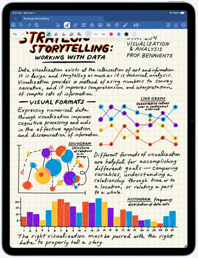
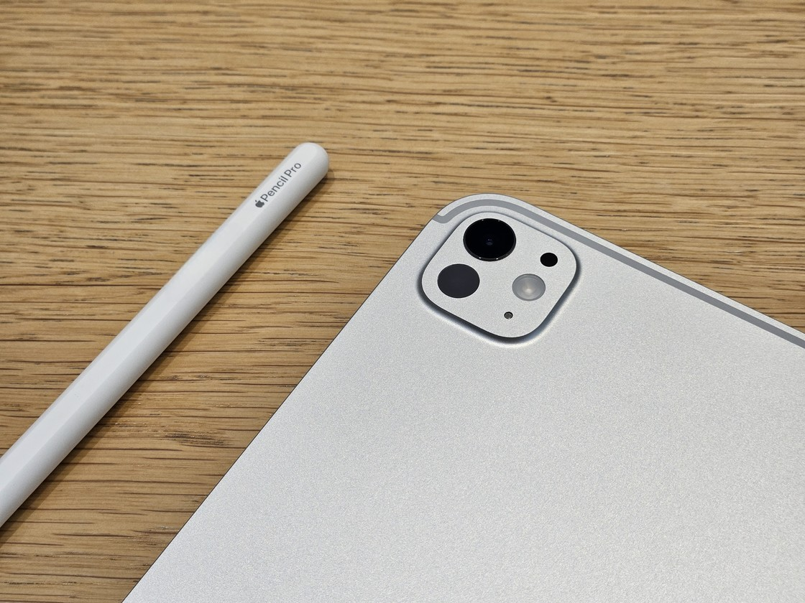
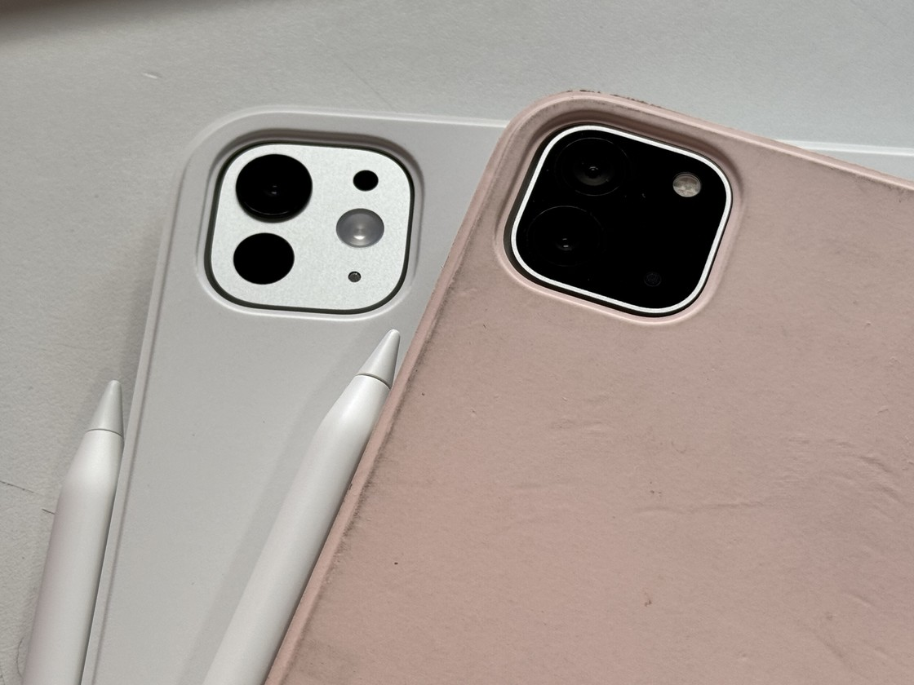

说个可能让你意外的结论。

不画画的人，有时候比画画的人更离不开 Pencil。

当然前提是，你真的拿它来学习。买来主要用来追剧的话，那确实没必要。

---

很多人觉得买 iPad 就得配笔。这个想法本身就得想想。

Pencil 不是万能的。但有几个场景，它确实比键盘好使。

标注 PDF 算一个。老师发的课件、下载的论文、电子版教材，圈重点、写批注、画箭头。手指也能戳，但精度差一截。键盘能打字，但不能在图上直接画圈。**每周要处理 5 份以上带图表的 PDF 的话，Pencil 省下的时间很明显。**

*图源：苹果官网（Goodnotes 手写笔记截图）*

手写笔记也是。GoodNotes、Notability 这类软件，核心交互就是手写。数学公式、化学结构式、电路图推导，打字效率远不如手写。文科生记课堂纪要可以用键盘，但理工科面对一堆符号和图形，Pencil 是唯一自然的选择。

做题刷题同理。考研、考公、考证的真题卷，直接在 iPad 上圈答案、写演算步骤、标记错题。一套题做完不用打印一张纸。很多考研党最后离不开 Pencil，不是因为它高级，是纸质卷子真的费纸还不好整理。

这三个场景有个共同点，都需要自由度的手写输入。键盘擅长大量文字录入，Pencil 擅长在任意位置留下任意痕迹。不是替代关系，是分工不同。

---

我在别处写过，考研阶段 90% 的笔记在纸质真题上完成更高效。这不是我编的，是很多上岸的人真实反馈。

无纸化学习有隐形成本。找文件、开软件、等加载、分心切应用，这些碎片时间纸质书上不存在。而且纸质书的翻页感和空间记忆，记得某段话在左页右下角，对长期记忆的辅助，目前还没有研究证明电子设备能完全替代。

不是长期习惯无纸化学习的话，先别急着买笔。用手指或免费 App 试两周，确认自己真的会在 iPad 上做上面那三件事，再掏钱。

---

Apple Pencil 现在有两档。

Pencil Pro 有压感、倾斜感应、悬停预览、触觉反馈，官网 899 元。

Pencil USB-C 版没有压感和悬停，基础书写功能，官网 649 元。

*图源：少数派*

只学习不画画，USB-C 版够用。压感和倾斜感应是给绘画和精细绘图用的，标注 PDF 和记笔记用不上。悬停预览锦上添花，但不是刚需。

但今年返校季有个特殊情况。

Apple Pencil Pro 换购只要补 50 块。

*图源：少数派*

我是知乎上那篇 Pencil 平替文章的作者。往年我的结论一直是预算紧就买平替。今年我得亲手拆自己的台。**50 块的原装 Pencil Pro，把平替存在的理由直接打没了。**第三方平替笔都不止这个价。

正好在返校季窗口期，9 月 24 日前，且有学生认证，50 块的 Pencil Pro 是全场最值的单项交易。过了这个窗口，再考虑 USB-C 版或平替。

---

主要用 iPad 看视频课、读纯文字 PDF，这两个场景不需要手写输入，Pencil 买了也是吃灰。

已经习惯纸质笔记且效率很高，不要为了无纸化这个概念强行切换。工具服务于效率，不是反过来。

买 iPad 主要用来追剧和轻度浏览，Pencil 对你来说就是个昂贵的触控笔替代品。

---

Pencil 不是学习的必需品。

它是特定学习场景下的效率放大器。

你的学习内容决定了需不需要它，不是广告说了算。

---

想了解教育优惠怎么买最划算，可以看这篇：[2026 苹果返校季教育优惠全攻略：官网 vs 京东国补逐台实算](https://zhuanlan.zhihu.com/p/156150196)
