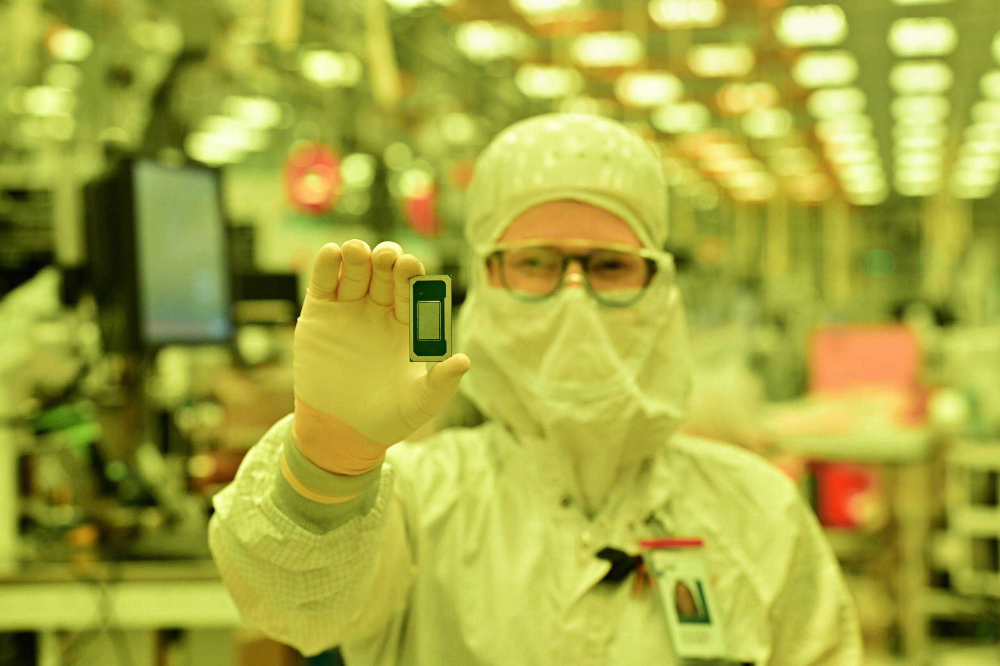
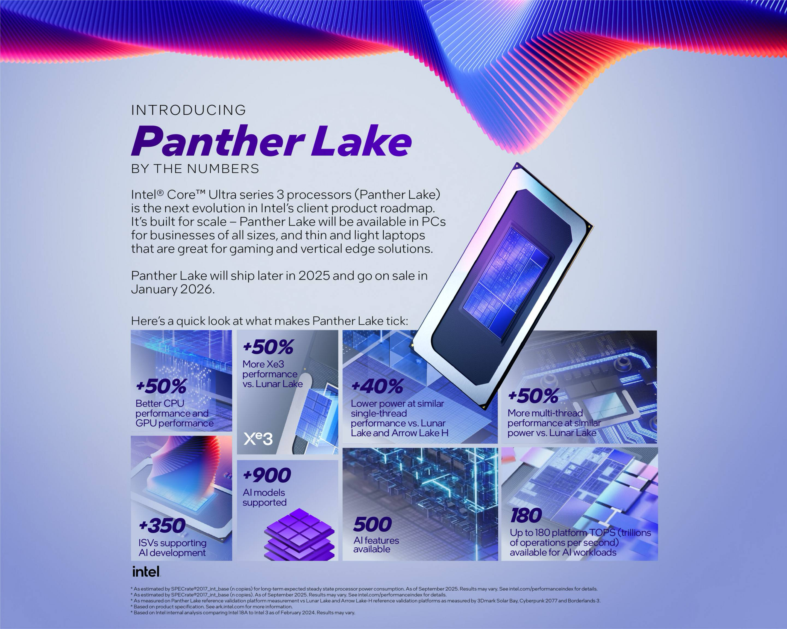
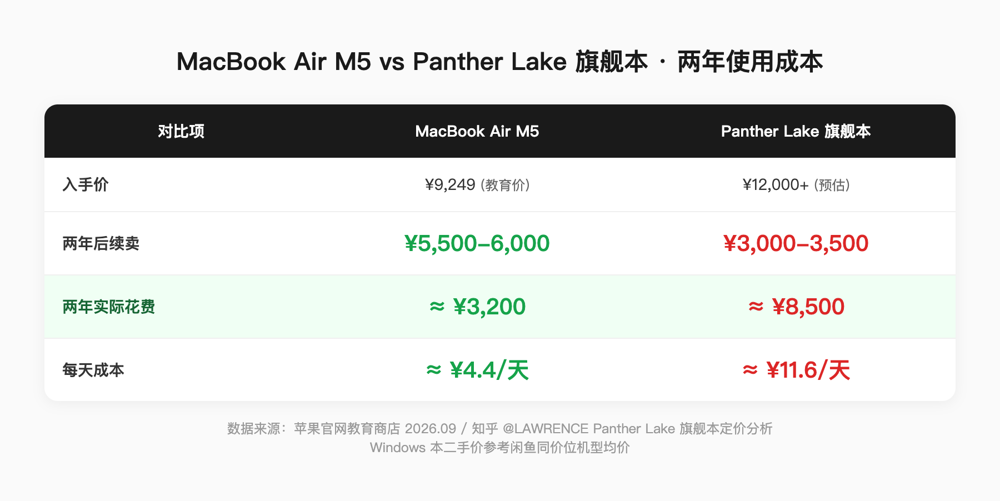
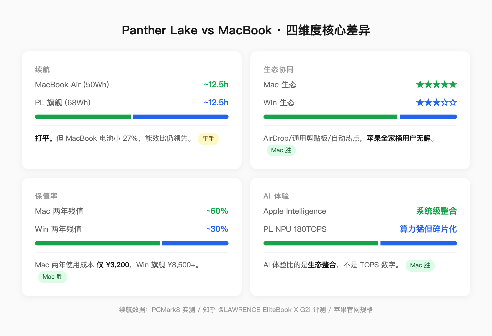
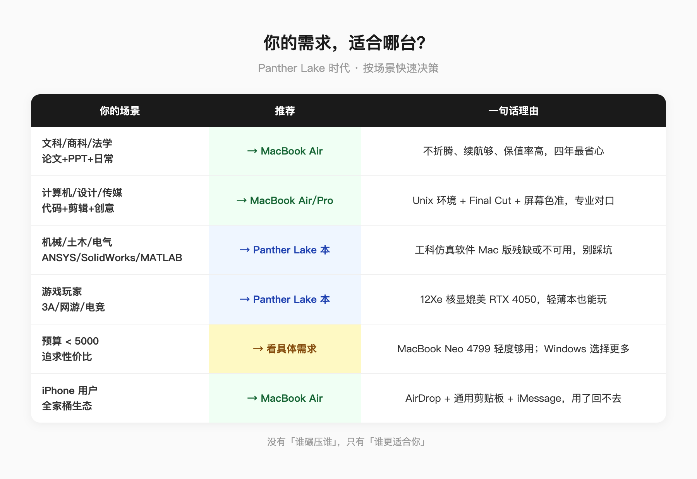

Panther Lake 的续航确实猛。

Intel 18A 工艺，2 纳米制程，同等性能下功耗比上代降 40%。Intel 官方宣称轻薄本续航最长 27 小时。

*图源：Intel 官方*

*图源：Intel 官方 · Introducing Panther Lake: By the Numbers*

如果你纠结的唯一理由是电池，那我现在就可以告诉你——续航不再是 MacBook 的独家优势。

但问题是，买电脑从来不是只看电池。

**MacBook 真正的护城河，是「不用你操心」**

我见过太多人买电脑只看参数表。续航多少、跑分多少、屏幕多大。但真正决定一台电脑用 3 年还是 5 年的，是那些参数表上不写的东西。

第一，macOS 的「不折腾」属性。

你打开 MacBook 盖子就能用，合上盖子就走。不用管驱动、不用管更新后会不会炸、不用管杀毒软件。

这不是「懒」，这是省下来的时间。大学四年，你的时间应该花在专业课上，不是花在修电脑上。

Windows 本在 Panther Lake 时代续航追上来了，但 Windows 生态的碎片化没变。用过 Windows 笔记本的人都知道：合盖休眠拿出来是温的，后台时不时跑索引，风扇说转就转。

这不是处理器能解决的问题。

第二，保值率。

一台 MacBook Air M5 教育价 9249 元入手，用两年卖掉，二手市场大概还能卖 5500-6000。两年使用成本 3000 出头。

同价位的 Windows 轻薄本，两年后二手大概 3000-3500。使用成本 5000-6000。

**MacBook 不是贵，是贵得有理。** 你多花的钱，在卖掉的时候能拿回来一部分。

*图源：自制 · 数据来自苹果官网教育商店及知乎 @LAWRENCE Panther Lake 定价分析*

第三，生态协同。

如果你用 iPhone，MacBook 的隔空投送、通用剪贴板、自动热点这些功能，用过就回不去了。手机上复制一段文字，电脑上直接粘贴。手机拍的照片，电脑上秒同步。

Panther Lake 笔记本再强，也给不了你这些。

**还有一件事，AI 时代让 macOS 的优势更大了**

2026 年了，AI 已经不是「未来趋势」，是你每天打开电脑就在用的东西。

写论文用 AI 辅助润色，写代码用 AI 补全，做 PPT 用 AI 生成大纲。这些工具在 Mac 和 Windows 上都能跑，但体验不一样。

macOS 上，AI 工具跟系统的整合更深。Siri 能直接操作文件、邮件、日历，Spotlight 搜索能理解自然语言，整个系统的响应逻辑是围绕「你只需要说一句话就能搞定」来设计的。

再加上 Apple Intelligence 虽然在国行还没完全开放，但框架已经搭好了——等开放那天，Mac 用户是第一批吃到的。而 Windows 这边，Copilot 的整合还停留在「浏览器里的聊天框」阶段。

**Panther Lake 的 NPU 算力到了 180 TOPS，数字很猛。但 AI 体验不是比 TOPS，是比生态。** 苹果从芯片到系统到应用是一条龙，Intel 只能管芯片这一环，剩下的要靠微软和 OEM 厂商去拼——这个拼法，过去十年已经证明效率不高。

*图源：Intel 官方 · CES 2026*

所以回到那个问题：Panther Lake 时代 MacBook 还有没有竞争力？

有。而且竞争力在 AI 时代不是变小了，是变大了。

因为 AI 越普及，你越需要一个「打开就能用、不用折腾」的工具。你不是要花时间配环境、调驱动、解决兼容性问题——你是要打开它，直接干活。

**买电脑不是买参数，是买未来三年的使用体验。**

如果你的需求是「上课记笔记、写论文、写代码、剪视频、偶尔修图」，MacBook Air 依然是这个价位最省心的选择。

如果你的需求是「跑仿真、打游戏、折腾硬件、预算有限追求极致性价比」，Panther Lake 笔记本才是你的菜。

没有谁碾压谁，只有谁更适合你。

*图源：自制 · 续航数据来自 Intel 官方发布及苹果官网规格页*

*图源：自制*

*信源：Intel CES 2026 Panther Lake 官方发布数据（2nm 制程、单核功耗降 40%、续航最长 27h、NPU 180 TOPS）、苹果官网 MacBook Air M5 规格页及教育商店定价。*

---

更多关于 MacBook 选购的详细分析，可以看我的这篇：[2026 苹果返校季教育优惠全攻略：官网 vs 京东国补逐台实算](https://zhuanlan.zhihu.com/p/156150196)

【延迟插卡：本题非强购买意图，首发不带卡。发布 48h 后若排名进前 5 或赞数 ≥ 2，编辑插入 MacBook Air 充电器/配件好物卡】
